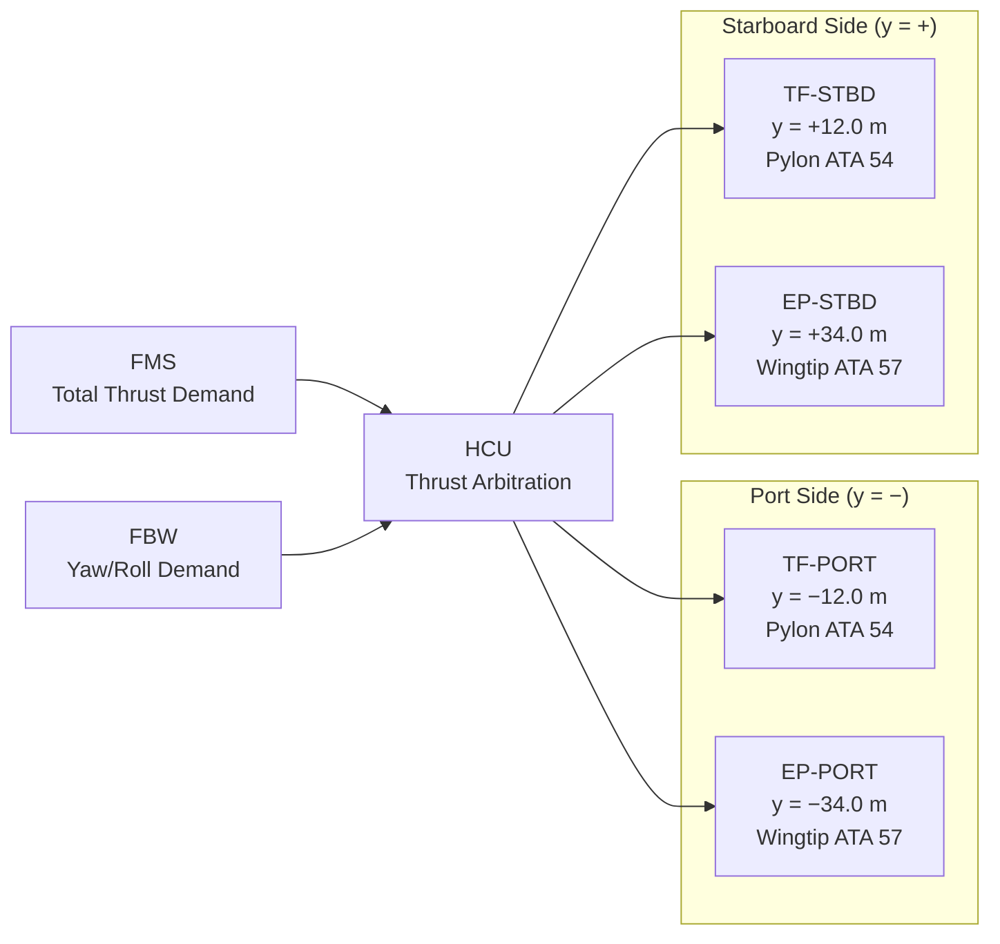
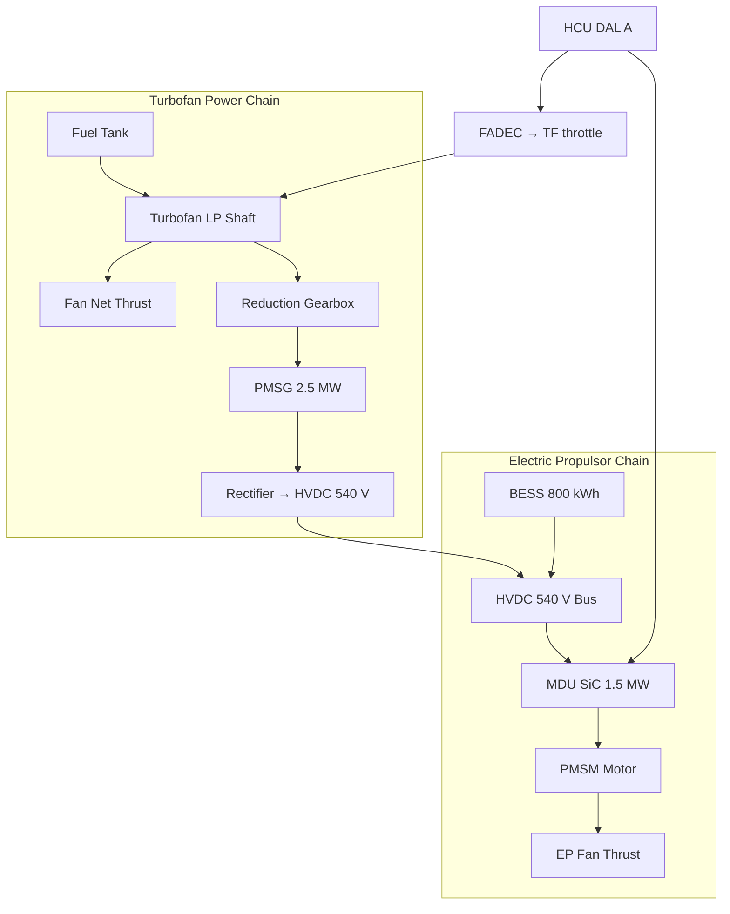

<!-- ──────────────────────────────────────────────────────────────────────────
     QATL-ATLAS-1000-ATLAS-070-079-070-010-PROPULSION-SYSTEM-TOPOLOGY
     ATA 70 · Propulsion System Topology
     AMPEL360E eWTW — ATLAS Register 1000
────────────────────────────────────────────────────────────────────────────── -->

# Propulsion System Topology

---

## §0 Hyperlink Policy

> All hyperlinks in this document are **relative** (five directory levels: `../../../../../`).
> Absolute URLs are forbidden. Every linked document must exist in the Q+ATLANTIDE repository
> before the link is activated. Broken links are treated as open issues and must be resolved
> before the document is promoted from `DRAFT` to `APPROVED`.

---

## §1 Purpose

This document defines the physical and functional topology of the AMPEL360E eWTW propulsion system: the spatial arrangement of thrust-generating nodes, thrust-vector distribution, and the mapping of mechanical and electrical power flows between propulsion components.

The topology establishes how four thrust nodes — two turbofan (TF) engines and two Electric Propulsors (EP) — are distributed across the airframe, and how the HCU dynamically arbitrates net thrust between the thermal and electric subsystems to achieve the commanded total thrust vector.

---

## §2 Applicability

| Parameter | Value |
|---|---|
| Aircraft Program | AMPEL360E eWTW |
| ATA reference | ATA 70-010 — Propulsion System Topology |
| Certification basis | EASA CS-25 Amdt 27 + SC-Hybrid-Electric |
| S1000D SNS | 070-010-00 |

---

## §3 Functional Description ![DRAFT]

**Turbofan Thrust Nodes (TF-PORT, TF-STBD)**
Located at wing-pylon stations y = +12.0 m (stbd) and y = −12.0 m (port), measured from aircraft centreline. Each turbofan is a LEAP-1A-class engine producing up to ~120 kN net thrust at sea-level take-off (SLTO). The engines are under-wing podded, with standard pylons (ATA 54) and nacelles (ATA 71). Each LP shaft drives a PMSG via a reduction gearbox integrated in the nacelle aft section.

**Electric Propulsor Thrust Nodes (EP-PORT, EP-STBD)**
Located at extended wingtip stations y = +34.0 m (stbd) and y = −34.0 m (port). Each EP consists of a ducted-fan assembly with a 1.5 MW PMSM motor driven by a SiC Motor Drive Unit (MDU). The EPs are integrated into the extended winglet/tip structure (ATA 57 Winglet subsubject 057-030). EP thrust vector is aligned with the aircraft X-axis (forward), making EP differential thrust effective for yaw torque generation and roll augmentation (reducing aileron demand at high speed).

**Thrust Centre of Gravity Considerations**
The four thrust nodes span a lateral distance of ~68 m (port EP to stbd EP). HCU must maintain thrust symmetry to within ±2 % per side to keep net yaw moment within FBW authority. Asymmetric thrust is intentionally commanded by HCU for yaw augmentation (reducing rudder demand), within limits set by the Loads and Dynamics team.

**PMSG Electrical Topology**
Each PMSG is co-located with its parent TF engine. PMSG output is rectified to HVDC 540 V and fed through the wing D-box cable trunking to the HVDC PDCU in the belly fairing. BESS packs are connected in parallel to the same HVDC bus via HV contactors.

---

## §4 Functional Breakdown

| ID | Name | Description | Lead Division |
|---|---|---|---|
| F-001 | TF Thrust Node — PORT | Turbofan engine at y = −12.0 m; net thrust + PMSG generation | Q-GREENTECH |
| F-002 | TF Thrust Node — STBD | Turbofan engine at y = +12.0 m; net thrust + PMSG generation | Q-GREENTECH |
| F-003 | EP Thrust Node — PORT Wingtip | EP at y = −34.0 m; electric boost/trim thrust; yaw/roll contribution | Q-GREENTECH |
| F-004 | EP Thrust Node — STBD Wingtip | EP at y = +34.0 m; electric boost/trim thrust; yaw/roll contribution | Q-GREENTECH |
| F-005 | HCU Thrust Arbitration | Real-time split of commanded thrust between TF nodes and EP nodes | Q-HPC |

---

## §5 System Context — Mermaid Diagram

---

## §6 Internal Architecture — Mermaid Diagram

---

## §7 Components and LRUs

| Component | Part Number | Qty | Location | Maintenance Interval | Notes |
|---|---|---|---|---|---|
| TF Engine (port/stbd) | LEAP-1A-PN-TBD | 2 | Wing pylons y ± 12 m | Per engine OEM MPD | LEAP-1A class |
| Engine Pylon | PYLON-PN-TBD | 2 | ATA 54 wing primary structure | Inspection at C-check | Standard composite pylon |
| PMSG Reduction Gearbox + PMSG | PMSG-GBX-PN-TBD | 2 | Aft nacelle section, port/stbd | On condition; gear inspection C-check | Integrated PMSG unit |
| EP Wingtip Nacelle Assembly | EP-NAC-PN-TBD | 2 | ATA 57 extended winglet ±34 m | Fan blade inspection A-check | Ducted fan + PMSM |
| MDU (Motor Drive Unit) | MDU-PN-TBD | 2 | Inside EP wingtip nacelle | Functional test C-check | SiC power electronics |
| HCU (Hybrid Controller Unit) | HCU-PN-TBD | 1 | EE bay centre section | Software update per SB cycle | Dual-channel DAL A |

---

## §8 Interfaces

| Interface Type | Connected System | Protocol / Medium | Data / Function |
|---|---|---|---|
| ATA 54 Nacelles / Pylons | Engine pylon structural interface | Structural (bolted joints) | Carries TF thrust load path to wing |
| ATA 57 Wings / Winglet | EP nacelle structural interface | Structural (winglet spar integration) | Carries EP thrust and moment loads |
| ATA 27 Flight Controls | FBW computer | AFDX | Differential EP thrust for yaw/roll augmentation |
| ATA 67 FADEC | Engine throttle | AFDX | HCU → FADEC throttle command |
| ATA 79 EMS | Energy Management System | AFDX | Topology-aware energy routing per phase |
| ATA 31 ECAM | Cockpit displays | AFDX | Thrust topology synoptic; node health |

---

## §9 Operating Modes

| Mode | Thrust Topology | TF Contribution | EP Contribution |
|---|---|---|---|
| AET — Ground Taxi | EP only (TF off) | 0 kN | ~15–30 kW shaft per EP |
| BTO — Take-Off | TF + EP max | ~120 kN per TF | ~1.5 MW per EP |
| Climb | TF primary | ~100 kN per TF | EP off or low trim |
| Cruise FL350 | TF primary + EP trim | ~85 % N1 per TF | ~15 % total thrust via EP |
| OEI (one TF failed) | Remaining TF + both EPs | ~120 kN (one TF) | EP compensates; asymmetric management |
| RGD — Descent | TF at idle; EP regenerative | Idle | EP windmilling; BESS charging |

---

## §10 Performance and Budgets ![DRAFT]

| Parameter | Requirement | Target / Design Value | Status |
|---|---|---|---|
| TF net thrust (SLTO, each) | ≥ 115 kN | ~120 kN | ![TBD] |
| EP max thrust (each) | ≥ 8 kN at SLTO | ~10 kN | ![TBD] |
| Total thrust asymmetry limit | ≤ 2 % per side | 2 % | ![TBD] |
| EP differential yaw torque | Per FBW authority budget | ≥ 30 kNm differential | ![TBD] |
| Thrust response time (HCU command to EP) | ≤ 200 ms | 150 ms | ![TBD] |

---

## §11 Safety, Redundancy and Fault Tolerance

- Loss of one TF: remaining TF + both EPs ensure OEI take-off performance per CS-25 §25.121.
- Loss of one EP: remaining EP + both TFs; HCU applies asymmetric compensation up to FBW authority limit.
- Loss of all EP: turbofan-only mode; BESS isolated; aircraft certified for this mode under main CS-25 basis.
- EP nacelle fire: fire zone isolation; EP MDU de-energised; HVDC zone D isolated within 200 ms.
- Topology change (mode transition) is managed by HCU with maximum thrust step-change limited to 10 % per second to avoid structural overload.

---

## §12 Maintenance and Diagnostics

| Task | Interval | Access | Special Tools |
|---|---|---|---|
| EP wingtip fan blade visual inspection | A-check | Nacelle cowl access | Borescope |
| PMSG gearbox oil (if wet-lubricated) / dry bearing check | C-check | Nacelle aft section | Torque tools; vibration analyser |
| HCU topology map verification (4 thrust node IDs) | A-check | CMS terminal | ACARS download |
| MDU thermal imaging for hotspot check | C-check | EP nacelle panel | Infrared camera |

---

## §13 Footprint — Physical, Electrical, Maintenance, Data ![TBD]

| Footprint Type | Parameter | Value | Notes |
|---|---|---|---|
| Physical | TF station (port/stbd) | y = ±12.0 m | ATA 54 pylon station |
| Physical | EP station (port/stbd) | y = ±34.0 m | ATA 57 winglet station |
| Physical | Total propulsion span | ~68 m (EP tip to EP tip) | Drives yaw moment arm |
| Electrical | PMSG cable run (nacelle to PDCU) | ~12 m each side | D-box conduit |
| Maintenance | EP access category | Wingtip — requires elevated work platform or cherry-picker | Base maintenance |

---

## §14 Safety and Certification References ![DRAFT]

| Standard / Document | Title | Issuing Body | Applicability |
|---|---|---|---|
| EASA CS-25 §25.121 | Climb — one-engine-inoperative | EASA | OEI gradient with TF + EP topology |
| EASA CS-25 §25.143 | Controllability and manoeuvrability | EASA | Asymmetric EP thrust within FBW authority |
| SAE AS5780 | HV Wiring and Interconnect for Hybrid-Electric | SAE | HVDC cable routing through wing topology |
| DO-178C | Software — HCU topology management | RTCA | DAL A — topology mode switching logic |

---

## §15 V&V Approach ![TBD]

| Phase | Method | Acceptance Criterion | Status |
|---|---|---|---|
| Design | Thrust-topology simulation (6-DOF model) | OEI performance met; yaw within FBW authority | ![TBD] |
| Integration | Iron-bird HIL test (HCU + FADEC + MDU) | Thrust node commands reach targets within 200 ms | ![TBD] |
| Certification | EASA CS-25 §25.121 flight test | OEI climb gradient demonstrated | ![TBD] |

---

## §16 Glossary

| Term | Definition |
|---|---|
| **Topology** | The spatial and functional arrangement of propulsion thrust nodes across the airframe. |
| **Thrust node** | A propulsion unit contributing to total aircraft thrust (TF engine or EP). |
| **y-station** | Lateral coordinate measured from aircraft centreline (positive = starboard). |
| **LP shaft** | Low-Pressure compressor/turbine shaft; drives both the fan and the PMSG gearbox. |
| **PMSG** | Permanent-Magnet Synchronous Generator — LP-shaft-driven HVDC 540 V generator. |
| **EP** | Electric Propulsor — wingtip ducted-fan unit providing electric thrust. |
| **OEI** | One Engine Inoperative — certification performance case with one TF failed. |
| **HCU** | Hybrid Controller Unit — arbitrates thrust between TF and EP nodes. |

---

## §17 Open Issues

| ID | Description | Owner | Target |
|---|---|---|---|
| OI-070-010-001 | Confirm EP nacelle y-station with structures (±34.0 m vs ±33.5 m depending on winglet variant) | Q-MECHANICS | 2026-Q3 |
| OI-070-010-002 | Define maximum allowable EP differential thrust for yaw augmentation (FBW authority limit) | Q-AIR / Flight Dynamics | 2026-Q4 |

---

## §18 Status Legend

| Badge | Meaning |
|---|---|
| `![DRAFT]` | Section is drafted but not yet reviewed |
| `![TBD]` | Content not yet started — to be defined |
| `![To Be Completed]` | Partially complete — needs additional content |
| `![APPROVED]` | Reviewed and formally approved |

---

## §19 Related Documents (Siblings in this Subsection)

- [070-000](./070-000-Hybrid-Electric-Architecture-Overview-General.md)
- [070-020](./070-020-Electric-and-Thermal-Propulsion-Allocation.md)
- [070-030](./070-030-Hybrid-Electric-Operating-Modes.md)
- [070-040](./070-040-Propulsion-Redundancy-and-Degraded-Modes.md)
- [070-050](./070-050-Propulsion-Energy-Flow-Architecture.md)
- [070-060](./070-060-Propulsion-Safety-and-Isolation-Zones.md)
- [070-070](./070-070-Propulsion-Integration-and-Airframe-Interfaces.md)
- [070-080](./070-080-Hybrid-Electric-Monitoring-Diagnostics-and-Control-Interfaces.md)
- [070-090](./070-090-S1000D-CSDB-Mapping-and-Traceability.md)

---

## §20 Change Log

| Rev | Date | Author | Description |
|---|---|---|---|
| 0.1 | 2026-05-11 | @copilot | Initial DRAFT — contextualized content per AMPEL360E eWTW architecture |
