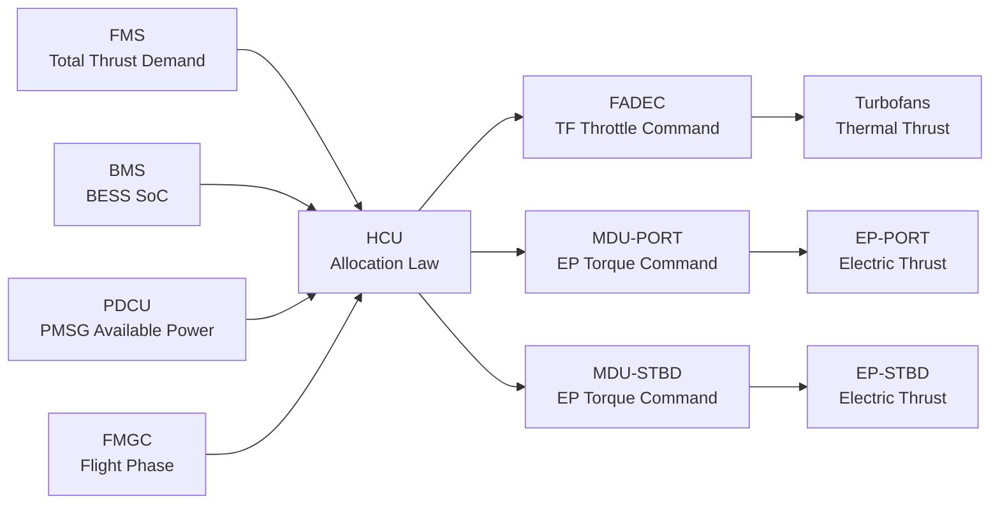
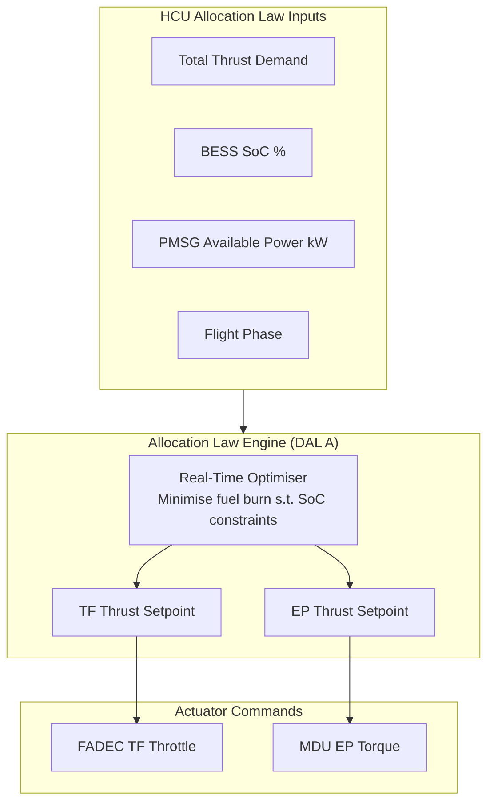

<!-- ──────────────────────────────────────────────────────────────────────────
     QATL-ATLAS-1000-ATLAS-070-079-070-020-ELECTRIC-AND-THERMAL-PROPULSION-ALLOCATION
     ATA 70 · Electric and Thermal Propulsion Allocation
     AMPEL360E eWTW — ATLAS Register 1000
────────────────────────────────────────────────────────────────────────────── -->

# Electric and Thermal Propulsion Allocation

---

## §0 Hyperlink Policy

> All hyperlinks in this document are **relative** (five directory levels: `../../../../../`).
> Absolute URLs are forbidden. Every linked document must exist in the Q+ATLANTIDE repository
> before the link is activated. Broken links are treated as open issues and must be resolved
> before the document is promoted from `DRAFT` to `APPROVED`.

---

## §1 Purpose

This document defines the allocation law and power-split strategy governing how thrust and power are divided between the electric propulsion subsystem (EP array driven by BESS and PMSG) and the thermal propulsion subsystem (turbofan combustion engines), as executed by the Hybrid Controller Unit (HCU).

The allocation strategy determines fuel consumption, BESS state-of-charge (SoC) trajectory, and emission profile across all flight phases. The HCU's allocation law is the central algorithm underpinning the AMPEL360E eWTW's hybrid-electric performance guarantee.

---

## §2 Applicability

| Parameter | Value |
|---|---|
| Aircraft Program | AMPEL360E eWTW |
| ATA reference | ATA 70-020 — Electric and Thermal Propulsion Allocation |
| Certification basis | EASA CS-25 Amdt 27 + SC-Hybrid-Electric |
| S1000D SNS | 070-020-00 |

---

## §3 Functional Description ![DRAFT]

**Allocation Law Overview**
The HCU executes a real-time allocation law that receives total thrust demand (from FMS and pilot inputs), current BESS SoC (from BMS), PMSG available power (from PDCU), and flight phase data (from FMGC). The law minimises total fuel burn subject to:
- BESS SoC operating window: 20 % ≤ SoC ≤ 85 %
- EP maximum shaft power: 1.5 MW per unit
- PMSG maximum continuous output: 2.5 MW per engine
- Minimum EP contribution at cruise: 10 % total thrust (for fuel benefit)
- Maximum EP contribution at cruise: 20 % total thrust (BESS SoC preservation)

**Phase-Specific Allocation**

*Take-Off (BTO mode):*
Turbofan engines at maximum N1 (~120 kN each) plus EP at maximum 1.5 MW each for up to 5 min. Combined thrust ~110 % of nominal total. PMSG and BESS both supply the EP. BESS SoC draw during BTO: up to −15 % SoC (e.g. 75 % → 60 %).

*Climb:*
TF primary thrust; EP throttled back to 5 % trim to preserve BESS SoC for cruise. TF throttle slightly reduced (≈ 3 % N1) compared to non-hybrid, improving SFC.

*Cruise FL350:*
HCU optimisation yields EP allocation of 12–18 % of total thrust, with TF covering 82–88 %. Fuel burn reduction versus TF-only baseline: ≈ 8 % total mission fuel, contingent on BESS energy recovered during descent.

*Descent (RGD mode):*
EP fans in regenerative mode; BESS SoC recovered up to +50 kWh per descent. TF at idle.

*Landing and Go-Around:*
TF primary; EP available at 50 % for go-around supplement. BESS SoC maintained ≥ 30 % at gate for AET taxi-in.

---

## §4 Functional Breakdown

| ID | Name | Description | Lead Division |
|---|---|---|---|
| F-001 | Thermal allocation (turbofan) | TF thrust fraction; governed by HCU → FADEC throttle command | Q-GREENTECH |
| F-002 | Electric allocation (EP array) | EP thrust fraction; governed by HCU → MDU torque command | Q-GREENTECH |
| F-003 | BESS SoC management | SoC trajectory planning; charge/discharge allocation per phase | Q-HPC |
| F-004 | HCU allocation law engine | Real-time optimisation algorithm; DAL A software | Q-HPC |
| F-005 | Regenerative allocation | Descent energy recovery; BESS charge rate via MDU regen mode | Q-GREENTECH |

---

## §5 System Context — Mermaid Diagram

---

## §6 Internal Architecture — Mermaid Diagram

---

## §7 Components and LRUs

| Component | Part Number | Qty | Location | Maintenance Interval | Notes |
|---|---|---|---|---|---|
| HCU — Allocation Law Software | SW-HCU-ALLOC-vTBD | 1 (SW) | HCU hardware (EE bay) | Update per SB; SW DAL A | Core allocation algorithm; FADEC/BMS/MDU interfaces |
| BMS — SoC Sensor Interface | BMS-SOC-PN-TBD | 2 | BESS Pack A/B | Calibration check 2 000 FH | SoC accuracy ≤ ±2 % at operating temperature |
| PDCU — PMSG Power Measurement | PDCU-PM-PN-TBD | 1 | EE bay | Calibration check C-check | PMSG available power signal to HCU |
| FMGC Interface Module | FMGC-IF-PN-TBD | 1 | HCU (internal) | SW update | Provides flight phase to allocation law |

---

## §8 Interfaces

| Interface Type | Connected System | Protocol / Medium | Data / Function |
|---|---|---|---|
| ATA 67 FADEC | Engine throttle | AFDX ARINC 664 P7 | HCU sends TF throttle setpoint; FADEC returns N1/EGT |
| BESS BMS | Battery SoC, SoH, temperature | AFDX | HCU reads SoC every 100 ms for allocation update |
| PDCU | PMSG available power | AFDX | HCU reads PMSG output limit |
| ATA 22 FMGC | Flight phase, total thrust demand | AFDX | Phase-specific allocation law selection |
| ATA 79 EMS | Energy Management System | AFDX | Long-horizon energy budget targets for allocation law |
| ATA 31 ECAM | Cockpit display | AFDX | EP allocation % and TF throttle reduction displayed |

---

## §9 Operating Modes

| Mode | TF Allocation | EP Allocation | BESS SoC Impact |
|---|---|---|---|
| AET — Taxi | 0 % | 100 % EP (~30 kW total) | −2 % SoC per 10 min taxi |
| BTO — Take-Off | ~85 % of total thrust | ~15 % of total thrust (max EP) | −15 % SoC per BTO event |
| Climb | ~95 % | ~5 % trim | Neutral to slight discharge |
| Cruise FL350 | ~83 % | ~17 % | Near-neutral; EMS targets hold |
| RGD — Descent | 0 % idle | Regen mode (charging) | +10–15 % SoC per descent |
| Emergency Electric | 0 % (both TF failed) | 100 % EP from BESS | Full BESS discharge permitted |

---

## §10 Performance and Budgets ![DRAFT]

| Parameter | Requirement | Target / Design Value | Status |
|---|---|---|---|
| Cruise EP allocation | 10 – 20 % of total thrust | 12 – 18 % | ![TBD] |
| Mission fuel burn reduction vs TF-only | ≥ 7 % | 8 % | ![TBD] |
| BESS SoC operating window | 20 – 85 % | 20 – 85 % | ![TBD] |
| BTO BESS SoC draw | ≤ 20 % per event | 15 % per event | ![TBD] |
| RGD energy recovery per descent | ≥ 30 kWh | 50 kWh | ![TBD] |
| HCU allocation update cycle | ≤ 100 ms | 50 ms | ![TBD] |

---

## §11 Safety, Redundancy and Fault Tolerance

- HCU allocation law is DAL A; dual-channel with automatic standby switchover within 50 ms.
- If BMS SoC signal is lost, HCU defaults to conservative EP allocation (≤ 10 %) until BMS signal restored.
- If FADEC link is lost, HCU suspends EP allocation changes; TF maintains last commanded throttle.
- BESS hard SoC limits (15 % minimum, 90 % maximum) are enforced by BMS hardware independent of HCU.
- Allocation law cannot command EP thrust exceeding MDU maximum rated torque; MDU applies hardware torque limiting.

---

## §12 Maintenance and Diagnostics

| Task | Interval | Access | Special Tools |
|---|---|---|---|
| HCU allocation law parameter verification (gain settings, SoC limits) | A-check | CMS terminal | ACARS download; HCU GSE |
| BMS SoC accuracy calibration | 2 000 FH | Belly fairing access hatch | BMS GSE terminal |
| Mission fuel burn analysis (allocation efficiency audit) | Post-flight analysis | ACARS / QAR data | Flight data analysis tool |

---

## §13 Footprint — Physical, Electrical, Maintenance, Data ![TBD]

| Footprint Type | Parameter | Value | Notes |
|---|---|---|---|
| Data | HCU allocation update rate | 20 Hz (50 ms cycle) | Real-time demand |
| Data | AFDX BMS → HCU bandwidth | ![TBD] | Per AFDX bus load study |
| Electrical | EP power at cruise allocation (both EPs) | ~500 kW | 17 % of total thrust ≈ 500 kW shaft |
| Data | EMS energy budget interface rate | 1 Hz | Long-horizon planning |

---

## §14 Safety and Certification References ![DRAFT]

| Standard / Document | Title | Issuing Body | Applicability |
|---|---|---|---|
| EASA SC-Hybrid-Electric | Specific Conditions for Hybrid-Electric Propulsion | EASA | Allocation law and SoC management certification |
| DO-178C | Software — HCU allocation law | RTCA | DAL A software requirements |
| DO-254 | Design Assurance for Airborne Electronic Hardware | RTCA | HCU hardware DAL A |
| SAE ARP4754A | Guidelines for Development of Civil Aircraft and Systems | SAE | System-level allocation requirements traceability |

---

## §15 V&V Approach ![TBD]

| Phase | Method | Acceptance Criterion | Status |
|---|---|---|---|
| Design | Mission simulation (MATLAB/Simulink) | ≥ 8 % fuel burn reduction; SoC within 20–85 % at all phases | ![TBD] |
| Integration | HIL test (HCU + FADEC + BMS) | Allocation transitions ≤ 100 ms; no SoC violation | ![TBD] |
| Certification | Flight test + EASA SC review | Fuel burn reduction demonstrated; BESS SoC within spec | ![TBD] |

---

## §16 Glossary

| Term | Definition |
|---|---|
| **Allocation law** | The HCU algorithm that determines the real-time split of thrust demand between TF and EP. |
| **SoC** | State of Charge — BESS energy expressed as a percentage of usable capacity. |
| **Thermal propulsion** | Thrust generated by turbofan combustion; primary propulsion system. |
| **Electric propulsion** | Thrust generated by EP fan driven by PMSM motor; secondary/trim system. |
| **Trim thrust** | Small EP thrust addition that allows TF throttle reduction, improving SFC. |
| **PMSG available power** | Maximum HVDC power the PMSG can supply at the current N1 setting. |
| **Regen mode** | MDU operating as a generator; EP fans windmill to charge BESS during descent. |

---

## §17 Open Issues

| ID | Description | Owner | Target |
|---|---|---|---|
| OI-070-020-001 | Validate 8 % fuel burn reduction target via full-mission simulation with certified engine model | Q-GREENTECH / Q-HPC | 2026-Q4 |
| OI-070-020-002 | Define BESS SoC hard-limit enforcement split between BMS hardware and HCU software | Q-HPC / Q-GREENTECH | 2026-Q3 |

---

## §18 Status Legend

| Badge | Meaning |
|---|---|
| `![DRAFT]` | Section is drafted but not yet reviewed |
| `![TBD]` | Content not yet started — to be defined |
| `![To Be Completed]` | Partially complete — needs additional content |
| `![APPROVED]` | Reviewed and formally approved |

---

## §19 Related Documents (Siblings in this Subsection)

- [070-000](./070-000-Hybrid-Electric-Architecture-Overview-General.md)
- [070-010](./070-010-Propulsion-System-Topology.md)
- [070-030](./070-030-Hybrid-Electric-Operating-Modes.md)
- [070-040](./070-040-Propulsion-Redundancy-and-Degraded-Modes.md)
- [070-050](./070-050-Propulsion-Energy-Flow-Architecture.md)
- [070-060](./070-060-Propulsion-Safety-and-Isolation-Zones.md)
- [070-070](./070-070-Propulsion-Integration-and-Airframe-Interfaces.md)
- [070-080](./070-080-Hybrid-Electric-Monitoring-Diagnostics-and-Control-Interfaces.md)
- [070-090](./070-090-S1000D-CSDB-Mapping-and-Traceability.md)

---

## §20 Change Log

| Rev | Date | Author | Description |
|---|---|---|---|
| 0.1 | 2026-05-11 | @copilot | Initial DRAFT — contextualized content per AMPEL360E eWTW architecture |
