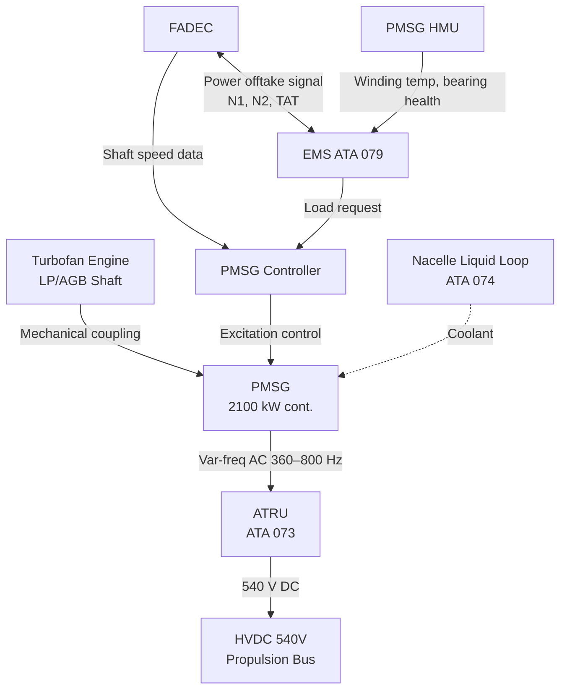
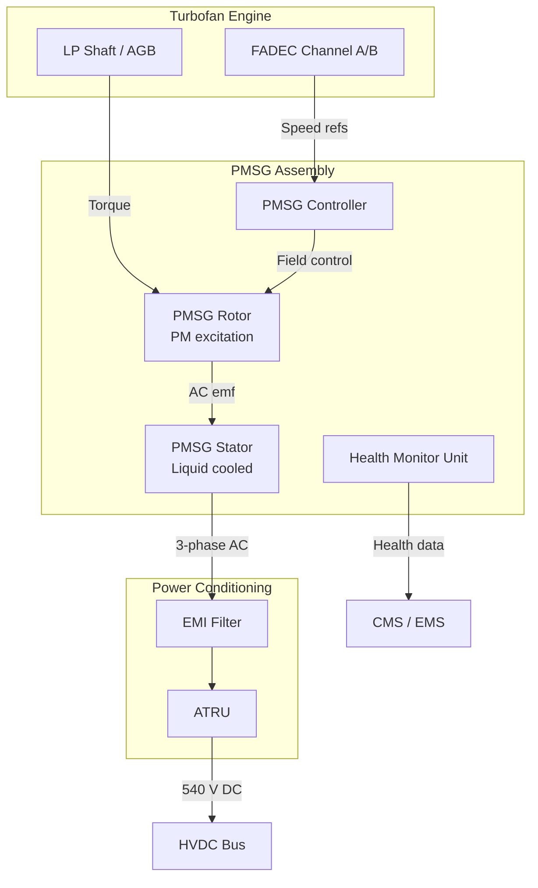

# Turbofan-Electric Integration

---

## §0 Hyperlink Policy
All hyperlinks in this document are **relative**. Absolute URLs are forbidden.

---

## §1 Purpose
This document describes the mechanical and electrical integration of the two underwing turbofan engines with their co-shaft Permanent Magnet Synchronous Generators (PMSGs), defining how shaft power is extracted, conditioned, and delivered to the HVDC 540 V propulsion bus. It covers the PMSG mechanical interface, excitation and control, thermal loading, and the interaction with FADEC for coordinated thrust and electrical power management.

## §2 Applicability
| Aircraft | Variant | MSN Range | Effectivity |
|---|---|---|---|
| AMPEL360E | eWTW | All | From EIS |

## §3 Functional Description 

Each underwing turbofan is coupled to a dedicated high-speed Permanent Magnet Synchronous Generator (PMSG) mounted on the accessory gearbox (AGB) low-speed shaft or, in the direct-drive configuration under evaluation, integrated coaxially on the turbine low-pressure (LP) shaft. The PMSG produces variable-frequency AC (nominally 360–800 Hz depending on engine N2) at voltages up to 540 V AC, which is then rectified by the Auto-Transformer Rectifier Unit (ATRU) to 540 V DC for the HVDC propulsion bus. Rated continuous output per PMSG is 2 100 kW, with a 5-minute peak of 2 400 kW for boost-assist top-up.

The integration with FADEC is critical: the PMSG electrical load request is communicated by the EMS to the FADEC as a power offtake signal, allowing FADEC to account for this extraction in its fuel-flow and thrust-setting calculations. This prevents unintended thrust reduction when electrical demand spikes. A closed-loop shaft-power governor within the PMSG controller limits extraction to a maximum fraction of available shaft power, protecting against compressor surge or turbine over-temperature during high-extraction transients. The governor references N1, N2, Total Air Temperature (TAT), and altitude from the FADEC data bus.

The PMSG winding temperature and bearing health are monitored continuously by a dedicated PMSG Health Monitor Unit (HMU), which transmits data to the EMS and to the CMS. An over-temperature trip (> 180 °C winding) de-excites the PMSG within 50 ms, transferring the electrical load to the battery and cross-tie bus topology. The liquid cooling jacket integrated around the PMSG stator is supplied from the engine nacelle loop within ATA 074, maintaining winding temperature below 160 °C at rated continuous load and ISA+15 conditions.

## §4 Functional Breakdown
| ID | Function | Description | Owner | DAL |
|---|---|---|---|---|
| F-070-020-01 | Shaft Power Extraction | Extract mechanical power from turbofan LP or AGB shaft via PMSG | Q-MECHANICS | DAL-B |
| F-070-020-02 | AC Generation & Rectification | Convert variable-frequency PMSG AC to 540 V DC via ATRU | Q-INDUSTRY | DAL-B |
| F-070-020-03 | FADEC Power-Offtake Coordination | Communicate extraction demand to FADEC; prevent thrust/surge interaction | Q-MECHANICS | DAL-A |
| F-070-020-04 | PMSG Thermal Management | Maintain PMSG winding and bearing within temperature limits via liquid cooling | Q-GREENTECH | DAL-B |
| F-070-020-05 | PMSG Health Monitoring | Monitor winding temperature, insulation resistance, and bearing vibration | Q-HPC | DAL-B |

## §5 System Context — Architecture

## §6 Internal Architecture

## §7 Components and LRUs
| LRU ID | Name | P/N | Qty | Location |
|---|---|---|---|---|
| LRU-070-020-01 | PMSG Assembly (Left) | TBD | 1 | Left underwing nacelle |
| LRU-070-020-02 | PMSG Assembly (Right) | TBD | 1 | Right underwing nacelle |
| LRU-070-020-03 | PMSG Controller Unit | TBD | 2 | Nacelle accessory bay |
| LRU-070-020-04 | PMSG Health Monitor Unit | TBD | 2 | Nacelle accessory bay |
| LRU-070-020-05 | ATRU (Left / Right) | TBD | 2 | Wing root equipment bay |

## §8 Interfaces
| Interface | Source | Destination | Protocol | Notes |
|---|---|---|---|---|
| IF-070-020-01 | FADEC | PMSG Controller | ARINC 429 (high-speed) | N1, N2, TAT, shaft power margin |
| IF-070-020-02 | EMS | PMSG Controller | CAN FD | Load request, de-excitation command |
| IF-070-020-03 | PMSG HMU | EMS / CMS | AFDX | Temperature, vibration, insulation resistance |
| IF-070-020-04 | ATRU | HVDC 540 V Bus | HVDC 540 V DC | Rectified power feed |
| IF-070-020-05 | Nacelle Liquid Cooling | PMSG Stator Jacket | Fluid coupling (quick-disconnect) | 50/50 glycol-water, 6 bar max |

## §9 Operating Modes
| Mode | Trigger | Description | Power State | Notes |
|---|---|---|---|---|
| Generation — Cruise | Engine at cruise N2 | PMSG at 70–85 % rated power; excess to battery | ~1 500 kW per PMSG | Primary mode |
| Generation — Max | Electric Boost request | PMSG at 100–115 % rated for ≤ 5 min | ~2 400 kW per PMSG | Thermal limit gated |
| Idle-Gen | Engine at ground idle | PMSG produces minimum 50 kW for bus keepalive | ~50 kW per PMSG | Ground operation |
| De-excited | Over-temp or fault | PMSG field removed; no AC output | 0 kW | Load transfers to battery |
| Motoring (start assist) | Engine start | PMSG operated as motor for assisted start | ~ -150 kW | Optional/TBD |

## §10 Performance and Budgets 
| Parameter | Requirement | Current Estimate | Unit | Status |
|---|---|---|---|---|
| PMSG continuous rated power | 2 100 | 2 100 | kW |  |
| PMSG 5-min peak power | 2 400 | 2 400 | kW |  |
| PMSG gravimetric power density | ≥ 5 | 5.2 | kW/kg |  |
| ATRU conversion efficiency | ≥ 97 | 97.5 | % |  |
| Max winding temperature (continuous) | ≤ 160 | 155 | °C |  |

## §11 Safety, Redundancy and Fault Tolerance
- Each PMSG channel is fully isolated from the other; loss of one PMSG is a single-point failure managed by bus cross-tie with the remaining channel.
- The PMSG de-excitation function is implemented in hardware (over-temperature relay) independent of the PMSG controller software.
- FADEC receives continuous feedback of PMSG load; a sudden load step > 200 kW/s triggers FADEC fuel-flow anticipation to prevent thrust dip.
- The ATRU includes arc-flash protection (current-limiting fuses + DC-side SSCB) rated for maximum prospective fault current of 15 kA.
- PMSG bearing vibration monitoring provides ≥ 500 FH advance warning of bearing degradation before functional loss.

## §12 Maintenance and Diagnostics
| Task | Interval | Tool | Reference |
|---|---|---|---|
| PMSG winding insulation resistance test | 600 FH | Megohmmeter ≥ 1 kV | AMM 070-020-031 |
| ATRU diode and transformer inspection | 1 200 FH | ATRU test bench ATB-2 | AMM 070-020-032 |
| PMSG bearing vibration baseline | 300 FH | HMU data download via CMS | MPD 070-020-A1 |
| PMSG coolant quick-disconnect leak check | Pre-flight | Visual / pressure gauge | FCOM 070-020-01 |

## §13 Footprint
| Metric | Physical | Electrical | Maintenance | Data |
|---|---|---|---|---|
| PMSG mass (each) |  kg | 3-phase AC 360–800 Hz | Nacelle access panel | ARINC 429 / CAN FD |
| ATRU mass (each) |  kg | In: 3-phase AC; Out: 540 V DC | Wing root panel | Discrete signals |
| Coolant flow rate per PMSG |  L/min | — | Nacelle coolant QD | — |

## §14 Safety and Certification References
| Standard | Requirement | Applicability | Status | Notes |
|---|---|---|---|---|
| DO-178C | PMSG controller software DAL-B | PMSG Controller Unit | Planned | Level B required for generation function |
| DO-254 | ATRU protection FPGA DAL-B | ATRU fault logic | Planned | Complex electronic hardware assessment |
| ARP4754A | PMSG-FADEC integration development assurance | PMSG-FADEC IF | Planned | Function hazard assessment required |
| CS-25 | §25.1309 PMSG failure probability | PMSG assembly | Planned | Hazardous = < 1×10⁻⁷/FH per engine |
| FAR Part 25 | §25.903(d) propulsive loss prevention | FADEC-PMSG power offtake | Planned | No turbofan surge from PMSG transient |

## §15 V&V Approach
| Phase | Method | Tool/Facility | Status |
|---|---|---|---|
| PMSG performance characterisation | Motor/generator test at rated speed | PMSG test cell TC-070 |  |
| FADEC-EMS-PMSG closed-loop simulation | HIL with FADEC emulator | HPS-070 HIL Rig |  |
| Nacelle integration and thermal test | Full nacelle on engine test stand | Engine Test Cell ETC-1 |  |
| Flight test power-extraction campaign | Engine/electrical extraction flight test | AMPEL360E FTB-001 |  |

## §16 Glossary
| Term | Definition |
|---|---|
| PMSG | Permanent Magnet Synchronous Generator — shaft-driven AC electrical machine |
| ATRU | Auto-Transformer Rectifier Unit — converts variable-frequency AC to 540 V DC |
| AGB | Accessory Gearbox — turbofan accessory drive for hydraulic and electrical equipment |
| FADEC | Full Authority Digital Engine Control — manages fuel, thrust, and offtake |
| N1 | Fan shaft rotational speed (% of rated) |
| N2 | Core/HP shaft rotational speed (% of rated) |
| TAT | Total Air Temperature — ram-recovered inlet air temperature |
| HMU | Health Monitor Unit — embedded diagnostics for PMSG condition monitoring |
| LP Shaft | Low-Pressure turbine shaft — source of PMSG drive in direct-drive configurations |
| SSCB | Solid-State Circuit Breaker — electronic fault isolation device for HVDC protection |

## §17 Open Issues
| ID | Description | Owner | Priority | Status |
|---|---|---|---|---|
| OI-070-020-001 | Confirm PMSG mounting topology: AGB vs. direct LP shaft coaxial drive | @copilot | High | Open |
| OI-070-020-002 | Assess PMSG start-assist (motoring) function inclusion in baseline design | @copilot | Medium | Open |

## §18 Status Legend
| Badge | Meaning |
|---|---|
|  | Content under active development |
|  | Value or content to be determined |
|  | Approved and baselined |
|  | Placeholder, not yet populated |

## §19 Related Documents
| Code | Title | Link |
|---|---|---|
| 070-000 | Hybrid-Electric Architecture Overview — General | [070-000-Hybrid-Electric-Architecture-Overview-General.md](070-000-Hybrid-Electric-Architecture-Overview-General.md) |
| 070-010 | Architecture Modes and Power Flow | [070-010-Architecture-Modes-and-Power-Flow.md](070-010-Architecture-Modes-and-Power-Flow.md) |
| 070-030 | Electric Propulsion Integration | [070-030-Electric-Propulsion-Integration.md](070-030-Electric-Propulsion-Integration.md) |
| 070-040 | Energy Storage Integration | [070-040-Energy-Storage-Integration.md](070-040-Energy-Storage-Integration.md) |
| 070-050 | Power Electronics and Conversion | [070-050-Power-Electronics-and-Conversion.md](070-050-Power-Electronics-and-Conversion.md) |
| 070-060 | Hybrid Control Architecture | [070-060-Hybrid-Control-Architecture.md](070-060-Hybrid-Control-Architecture.md) |
| 070-070 | Safety, Redundancy and Fault Tolerance Architecture | [070-070-Safety-Redundancy-and-Fault-Tolerance-Architecture.md](070-070-Safety-Redundancy-and-Fault-Tolerance-Architecture.md) |
| 070-080 | Hybrid System Monitoring, Diagnostics and Control Interfaces | [070-080-Hybrid-System-Monitoring-Diagnostics-and-Control-Interfaces.md](070-080-Hybrid-System-Monitoring-Diagnostics-and-Control-Interfaces.md) |
| 070-090 | S1000D CSDB Mapping and Traceability | [070-090-S1000D-CSDB-Mapping-and-Traceability.md](070-090-S1000D-CSDB-Mapping-and-Traceability.md) |

## §20 Change Log
| Rev | Date | Author | Summary |
|---|---|---|---|
| 0.1 | 2026-05-11 | @copilot | Initial creation |
