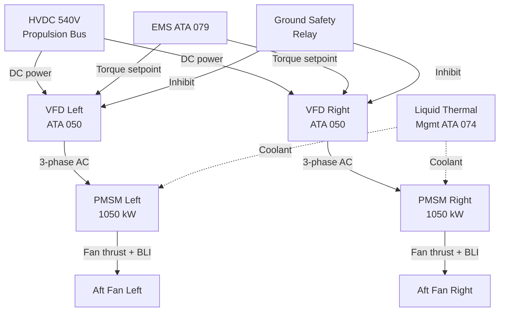
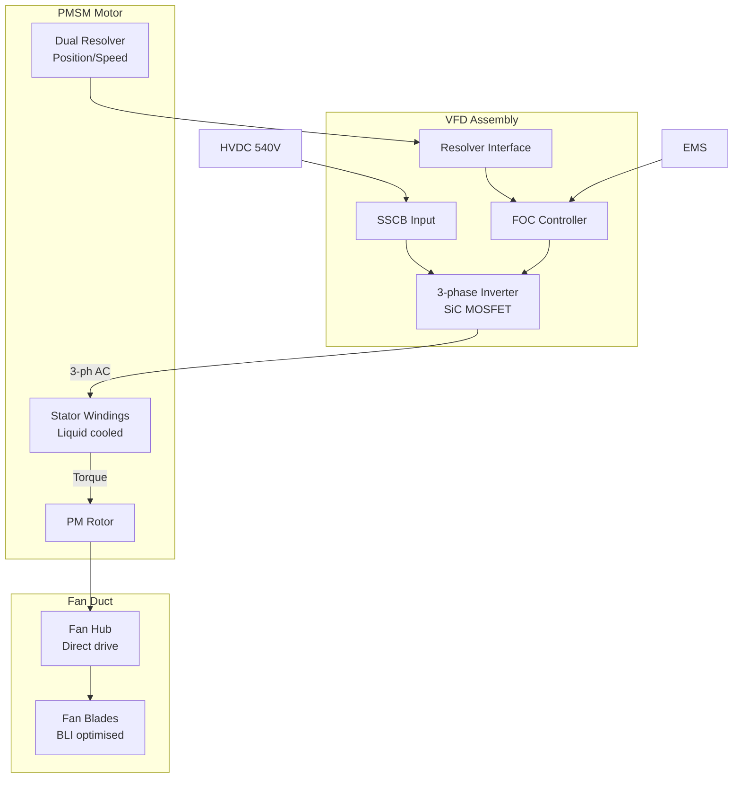

# Electric Propulsion Integration

---

## §0 Hyperlink Policy
All hyperlinks in this document are **relative**. Absolute URLs are forbidden.

---

## §1 Purpose
This document describes the integration of the two aft-fuselage Permanent Magnet Synchronous Motor (PMSM) electric propulsion units within the AMPEL360E eWTW hybrid-electric architecture. It covers thrust augmentation, Boundary Layer Ingestion (BLI) design rationale, motor drive interfaces, structural installation, and the control interaction with the EMS for torque and speed management across all flight phases.

## §2 Applicability
| Aircraft | Variant | MSN Range | Effectivity |
|---|---|---|---|
| AMPEL360E | eWTW | All | From EIS |

## §3 Functional Description 

The AMPEL360E eWTW mounts two PMSM electric motor assemblies in the aft fuselage, each coupled to a ducted fan designed for Boundary Layer Ingestion of the fuselage wake. BLI recovers kinetic energy from the retarded boundary-layer airflow, reducing the effective drag that the turbofans must overcome, thereby improving overall propulsive efficiency by an estimated 4–6 % in cruise relative to a conventional turbofan-only configuration. Each PMSM is rated at 1 050 kW continuous and 1 200 kW for 5-minute peak operation, fed by a dedicated Variable Frequency Drive (VFD) connected to the HVDC 540 V propulsion bus.

The PMSM motors are direct-drive (no reduction gearbox), with the rotor shaft integrated directly into the fan hub. This eliminates gearbox mass and maintenance complexity at the cost of requiring a high pole-count, low-speed motor design. Rotor position and speed are sensed by dual resolver encoders, with a digital signal processor in the VFD performing field-oriented control (FOC) to maintain commanded torque within ±1 % of setpoint. The EMS commands torque setpoints to each VFD independently, enabling asymmetric thrust for yaw augmentation in the event of asymmetric turbofan failure.

Regenerative braking is available in descent and approach phases, where the EMS commands negative torque, causing the PMSM to act as a generator, returning power to the HVDC bus and subsequently to the battery through the bidirectional DC-DC converter. The total regen recovery capability is up to 900 kW across both aft units at typical approach speeds. A mechanical parking brake disengages fan rotation during ground maintenance, and a run-up inhibit prevents motor start while ground personnel are within the aft fan safety zone, enforced by a dedicated ground safety relay.

## §4 Functional Breakdown
| ID | Function | Description | Owner | DAL |
|---|---|---|---|---|
| F-070-030-01 | Electric Thrust Production | Convert HVDC electrical power to aft fan thrust via PMSM + VFD | Q-MECHANICS | DAL-B |
| F-070-030-02 | Boundary Layer Ingestion | Ingest fuselage wake to improve propulsive efficiency | Q-AIR | DAL-C |
| F-070-030-03 | Regenerative Energy Recovery | Command PMSM as generator during descent to recharge battery | Q-GREENTECH | DAL-B |
| F-070-030-04 | Asymmetric Thrust for Yaw | EMS-commanded differential PMSM torque for yaw augmentation | Q-MECHANICS | DAL-B |
| F-070-030-05 | Ground Safety Inhibit | Prevent PMSM energisation while personnel near aft fans | Q-AIR | DAL-A |

## §5 System Context — Architecture

## §6 Internal Architecture

## §7 Components and LRUs
| LRU ID | Name | P/N | Qty | Location |
|---|---|---|---|---|
| LRU-070-030-01 | PMSM Motor Assembly (Left) | TBD | 1 | Aft fuselage, port side |
| LRU-070-030-02 | PMSM Motor Assembly (Right) | TBD | 1 | Aft fuselage, starboard side |
| LRU-070-030-03 | Variable Frequency Drive Unit | TBD | 2 | Aft equipment bay |
| LRU-070-030-04 | Aft Fan Blade Set | TBD | 2 sets | Aft fan ducts |
| LRU-070-030-05 | Ground Safety Relay Unit | TBD | 1 | Aft maintenance panel |

## §8 Interfaces
| Interface | Source | Destination | Protocol | Notes |
|---|---|---|---|---|
| IF-070-030-01 | EMS | VFD (Left/Right) | CAN FD | Torque command, mode (motor/gen), inhibit |
| IF-070-030-02 | HVDC 540 V Bus | VFD Input | HVDC 540 V DC | Main power feed; SSCB protected |
| IF-070-030-03 | VFD (Left/Right) | EMS | CAN FD | Torque actual, speed, fault status |
| IF-070-030-04 | Liquid Cooling Loop | PMSM Stator Jacket | Fluid (50/50 glycol-water) | ≤ 70 °C coolant inlet |
| IF-070-030-05 | Ground Safety Panel | Ground Safety Relay | Discrete 28 V DC | Proximity sensor + manual arm/disarm |

## §9 Operating Modes
| Mode | Trigger | Description | Power State | Notes |
|---|---|---|---|---|
| Motor — Boost | EMS boost command | Full torque to both fans; battery discharge | ~2 100 kW draw | Take-off / go-around |
| Motor — Cruise Assist | EMS cruise split | Partial torque (BLI cruise assist) | ~600–900 kW draw | Efficiency optimised |
| Regenerative | EMS regen command + descent | Both fans as generators; power to bus | ~900 kW return | SoC < 95 % gated |
| Idle / Freewheel | EMS idle | Fans rotate freely; VFD on standby | ~0 kW | Drag contribution assessed |
| Ground Inhibit | Weight-on-wheels + safety relay | Motor start inhibited; fans locked | 0 kW | Safety-critical function |

## §10 Performance and Budgets 
| Parameter | Requirement | Current Estimate | Unit | Status |
|---|---|---|---|---|
| PMSM continuous rated power (each) | 1 050 | 1 050 | kW |  |
| BLI propulsive efficiency improvement | ≥ 4 | 5 | % |  |
| PMSM gravimetric power density | ≥ 5 | 5.4 | kW/kg |  |
| VFD conversion efficiency | ≥ 97 | 97.8 | % |  |
| Max regenerative recovery power (combined) | ≥ 800 | 900 | kW |  |

## §11 Safety, Redundancy and Fault Tolerance
- Each PMSM-VFD channel is independently isolated; single-channel loss is a Major failure (DAL-B) with automatic cross-bus power transfer.
- Ground safety relay is a two-stage arm/disarm with independent weight-on-wheels discrete to prevent inadvertent fan start during maintenance.
- VFD over-current, over-voltage, and IGBT/SiC junction-temperature trips are hardware-implemented in < 2 ms, independent of FOC controller software.
- Asymmetric thrust authority is limited to ±150 kW differential between left and right to stay within rudder authority limits per CS-25.147.
- Resolver encoder failure reverts to sensorless back-EMF speed estimation; a secondary fault in sensorless mode triggers PMSM shutdown.

## §12 Maintenance and Diagnostics
| Task | Interval | Tool | Reference |
|---|---|---|---|
| PMSM winding insulation test | 600 FH | Megohmmeter ≥ 1 kV | AMM 070-030-031 |
| Fan blade visual inspection and FOD check | 200 FH / A-Check | Borescope BRS-AFT | AMM 070-030-032 |
| VFD IGBT/SiC health report download | 300 FH | CMS ACMS terminal | MPD 070-030-A1 |
| Ground safety relay functional test | 600 FH | Safety relay tester SRT-070 | AMM 070-030-033 |

## §13 Footprint
| Metric | Physical | Electrical | Maintenance | Data |
|---|---|---|---|---|
| PMSM motor mass (each) |  kg | 3-phase AC from VFD | Aft fuselage access door | CAN FD resolver data |
| VFD mass (each) |  kg | 540 V DC in / 3-phase AC out | Aft equipment bay | CAN FD |
| Aft fan diameter |  m | — | Fan duct access panel | — |

## §14 Safety and Certification References
| Standard | Requirement | Applicability | Status | Notes |
|---|---|---|---|---|
| DO-178C | VFD FOC controller software DAL-B | VFD software | Planned | Level B for thrust function |
| DO-254 | VFD protection FPGA DAL-A | Ground safety relay drive | Planned | DAL-A for safety inhibit |
| ARP4754A | PMSM-VFD integration development assurance | Electric propulsion system | Planned | Function hazard assessment |
| CS-25 | §25.147 directional control with asymmetric thrust | Differential PMSM thrust | Planned | Rudder authority margin check |
| FAR Part 25 | §25.1309 PMSM failure probability | PMSM assembly | Planned | Hazardous < 1×10⁻⁷/FH |

## §15 V&V Approach
| Phase | Method | Tool/Facility | Status |
|---|---|---|---|
| PMSM/VFD bench characterisation | Motor drive test at rated torque/speed | Motortest TC-030 |  |
| BLI aerodynamic validation | Wind tunnel test with scaled fuselage model | Wind Tunnel WT-070 |  |
| Ground safety relay integration test | Safety function test on ground rig | Iron Bird Facility |  |
| Flight test BLI efficiency measurement | Drag polar comparison in flight test | AMPEL360E FTB-001 |  |

## §16 Glossary
| Term | Definition |
|---|---|
| PMSM | Permanent Magnet Synchronous Motor — aft-mounted electric propulsion machine |
| BLI | Boundary Layer Ingestion — technique of ingesting slow fuselage wake to recover kinetic energy |
| VFD | Variable Frequency Drive — power electronics unit converting HVDC to variable-freq 3-phase AC |
| FOC | Field-Oriented Control — PMSM torque control algorithm using rotor position feedback |
| SiC | Silicon Carbide — wide-bandgap semiconductor for high-efficiency VFD switching |
| Resolver | Electromagnetic position sensor providing absolute rotor angle to FOC controller |
| Regenerative Braking | PMSM-as-generator mode for energy recovery during descent |
| SSCB | Solid-State Circuit Breaker — fast electronic protection at VFD HVDC input |
| WoW | Weight-on-Wheels — discrete sensor indicating aircraft is on ground |
| FOD | Foreign Object Debris — inspection category for fan duct contamination |

## §17 Open Issues
| ID | Description | Owner | Priority | Status |
|---|---|---|---|---|
| OI-070-030-001 | Confirm aft fan diameter and BLI intake area with aerodynamics team (Q-AIR) | @copilot | High | Open |
| OI-070-030-002 | Define maximum asymmetric torque delta for yaw augmentation per rudder authority analysis | @copilot | Medium | Open |

## §18 Status Legend
| Badge | Meaning |
|---|---|
|  | Content under active development |
|  | Value or content to be determined |
|  | Approved and baselined |
|  | Placeholder, not yet populated |

## §19 Related Documents
| Code | Title | Link |
|---|---|---|
| 070-000 | Hybrid-Electric Architecture Overview — General | [070-000-Hybrid-Electric-Architecture-Overview-General.md](070-000-Hybrid-Electric-Architecture-Overview-General.md) |
| 070-010 | Architecture Modes and Power Flow | [070-010-Architecture-Modes-and-Power-Flow.md](070-010-Architecture-Modes-and-Power-Flow.md) |
| 070-020 | Turbofan-Electric Integration | [070-020-Turbofan-Electric-Integration.md](070-020-Turbofan-Electric-Integration.md) |
| 070-040 | Energy Storage Integration | [070-040-Energy-Storage-Integration.md](070-040-Energy-Storage-Integration.md) |
| 070-050 | Power Electronics and Conversion | [070-050-Power-Electronics-and-Conversion.md](070-050-Power-Electronics-and-Conversion.md) |
| 070-060 | Hybrid Control Architecture | [070-060-Hybrid-Control-Architecture.md](070-060-Hybrid-Control-Architecture.md) |
| 070-070 | Safety, Redundancy and Fault Tolerance Architecture | [070-070-Safety-Redundancy-and-Fault-Tolerance-Architecture.md](070-070-Safety-Redundancy-and-Fault-Tolerance-Architecture.md) |
| 070-080 | Hybrid System Monitoring, Diagnostics and Control Interfaces | [070-080-Hybrid-System-Monitoring-Diagnostics-and-Control-Interfaces.md](070-080-Hybrid-System-Monitoring-Diagnostics-and-Control-Interfaces.md) |
| 070-090 | S1000D CSDB Mapping and Traceability | [070-090-S1000D-CSDB-Mapping-and-Traceability.md](070-090-S1000D-CSDB-Mapping-and-Traceability.md) |

## §20 Change Log
| Rev | Date | Author | Summary |
|---|---|---|---|
| 0.1 | 2026-05-11 | @copilot | Initial creation |
