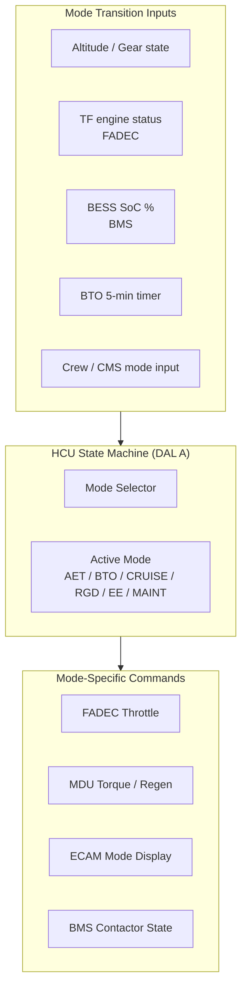

<!-- ──────────────────────────────────────────────────────────────────────────
     QATL-ATLAS-1000-ATLAS-070-079-070-030-HYBRID-ELECTRIC-OPERATING-MODES
     ATA 70 · Hybrid-Electric Operating Modes
     AMPEL360E eWTW — ATLAS Register 1000
────────────────────────────────────────────────────────────────────────────── -->

# Hybrid-Electric Operating Modes

---

## §0 Hyperlink Policy

> All hyperlinks in this document are **relative** (five directory levels: `../../../../../`).
> Absolute URLs are forbidden. Every linked document must exist in the Q+ATLANTIDE repository
> before the link is activated. Broken links are treated as open issues and must be resolved
> before the document is promoted from `DRAFT` to `APPROVED`.

---

## §1 Purpose

This document defines the six discrete operating modes of the AMPEL360E eWTW hybrid-electric propulsion system, the trigger conditions for transitions between modes, and the consequences of each mode on thrust output, BESS state, and aircraft systems configuration. The mode state machine is implemented in the HCU (DAL A software).

---

## §2 Applicability

| Parameter | Value |
|---|---|
| Aircraft Program | AMPEL360E eWTW |
| ATA reference | ATA 70-030 — Hybrid-Electric Operating Modes |
| Certification basis | EASA CS-25 Amdt 27 + SC-Hybrid-Electric |
| S1000D SNS | 070-030-00 |

---

## §3 Functional Description ![DRAFT]

The hybrid-electric propulsion system operates in one of six modes at any point in the flight envelope. The HCU continuously monitors transition conditions and manages mode changes within defined rate limits to avoid structural and electrical transients.

**Mode 1 — AET (All-Electric Taxi)**
Active on ground when TF engines are off. EP-PORT and EP-STBD receive torque commands from HCU at 15–30 kW each, providing net taxi thrust at up to 15 kt groundspeed. Power source: BESS (both packs). PMSG offline. BESS SoC draw: approximately −2 % per 10 min taxi. Cockpit indication: ECAM hybrid synoptic shows "AET" mode in green.

**Mode 2 — BTO (Boosted Take-Off)**
Active from take-off roll to 1 500 ft altitude or 5 min elapsed (whichever first). Both TF at maximum N1; both EP at maximum 1.5 MW shaft power. Power source: PMSG + BESS parallel. Combined system thrust ≈ 110 % of turbofan-only MTOW thrust. BTO mode protects against inadvertent over-use by a 5-minute timer and SoC floor (min 45 % SoC at BTO initiation). ECAM: "BTO" mode amber during active boost.

**Mode 3 — CRUISE**
Primary mission mode above FL100. HCU allocation law (see 070-020) trims EP thrust at 12–18 % of total while TF covers 82–88 %. PMSG supplies EP power; BESS at near-neutral SoC. HCU updates allocation every 50 ms based on BESS SoC and PMSG available power. ECAM: "CRUISE" mode white.

**Mode 4 — RGD (Regenerative Descent)**
Active during descent when TF at idle and aircraft in descent attitude. MDU switches to regenerative braking mode; EP fan windmilling drives PMSM as generator; BESS charged at up to 200 kW per EP (400 kW total). HCU limits regen charge rate to remain within BESS maximum charge current. Energy recovery: 30–50 kWh per descent. ECAM: "REGEN" mode green.

**Mode 5 — EE (Emergency Electric)**
Activated automatically by HCU if both TF engines are determined failed (FADEC dual-engine failure report). BESS feeds both EPs at maximum sustainable power for emergency thrust. EE mode endurance: approximately 12 min at EP 800 kW total (limited by BESS SoC draw from 85 % to 20 %). Crew alerted by Master Warning + ECAM "ELEC PROPULSION ONLY" message. Priority: altitude and heading control; ATC squawk 7700.

**Mode 6 — MAINT (Ground Maintenance)**
Selected by maintenance crew via CMS terminal with aircraft on ground, all buses isolated, and LOTO applied. HCU in isolated mode; all torque commands inhibited; HVDC bus de-energised. ECAM: "MAINT" mode displayed on hybrid synoptic.

---

## §4 Functional Breakdown

| ID | Name | Description | Lead Division |
|---|---|---|---|
| F-001 | Mode selector logic (HCU) | State machine evaluating transition conditions; mode command outputs | Q-HPC |
| F-002 | AET mode control | EP ground-taxi torque management; BESS discharge management at low power | Q-GREENTECH |
| F-003 | BTO mode control | Maximum-thrust boost; 5-min timer; SoC floor protection | Q-GREENTECH |
| F-004 | Cruise optimisation | Continuous HCU allocation law; EP trim and PMSG load regulation | Q-HPC |
| F-005 | RGD energy capture | MDU regen switching; BESS charge rate regulation; HCU monitoring | Q-GREENTECH |

---

## §5 System Context — Mermaid Diagram

```mermaid
stateDiagram-v2
    [*] --> MAINT : Aircraft powered up on ground
    MAINT --> AET : LOTO removed; TF engines off; BESS ≥ 30%
    AET --> BTO : TF engines started; cleared for T/O; SoC ≥ 45%
    BTO --> CRUISE : Alt ≥ 1500 ft OR 5 min elapsed
    CRUISE --> RGD : Descent initiated; TF at idle
    RGD --> CRUISE : Level-off; TF throttle increased
    CRUISE --> EE : Dual TF failure detected by HCU
    EE --> [*] : Emergency landing (SoC depleted or aircraft on ground)
    AET --> MAINT : Maintenance selected via CMS
    BTO --> EE : Dual TF failure during take-off (rare)
```

---

## §6 Internal Architecture — Mermaid Diagram

---

## §7 Components and LRUs

| Component | Part Number | Qty | Location | Maintenance Interval | Notes |
|---|---|---|---|---|---|
| HCU Mode State Machine (SW) | SW-HCU-MODE-vTBD | 1 (SW) | HCU hardware, EE bay | Update per SB cycle | DAL A; mode transitions certified per DO-178C |
| BESS SoC Interlock (HW) | BMS-SOC-HW-TBD | 2 | BMS Pack A/B | Check C-check | Hardware enforces BTO initiation floor (45 % SoC) |
| BTO Timer Module | HCU-TIMER-PN-TBD | 1 (internal) | HCU | SW integrated | 5-min BTO timer; cannot be reset mid-BTO |
| ECAM Mode Display Logic | ECAM-SW-070-TBD | 1 (SW) | ECAM (ATA 31) | SW update | Displays AET/BTO/CRUISE/REGEN/EE/MAINT |

---

## §8 Interfaces

| Interface Type | Connected System | Protocol / Medium | Data / Function |
|---|---|---|---|
| ATA 67 FADEC | TF engine status | AFDX | HCU reads N1, EGT; sends throttle; mode-dependent |
| BESS BMS | SoC, pack status | AFDX | Determines AET/BTO viability; RGD charge rate |
| ATA 31 ECAM | Mode display | AFDX | Mode name and colour displayed on hybrid synoptic |
| ATA 45 CMS | MAINT mode selection | AFDX / discrete | Crew/maintenance mode selection and inhibit |
| ATA 22 FMGC | Flight phase (altitude, descent) | AFDX | Triggers RGD/CRUISE transitions |
| ATA 79 EMS | Long-horizon mode planning | AFDX | EMS advises HCU on optimal mode sequence for mission |

---

## §9 Operating Modes

| Mode | Trigger | System State | Actions / Consequences |
|---|---|---|---|
| AET | Ground, TF off, BESS ≥ 30 % | EP only; ~30–60 kW total | Taxi thrust; BESS discharging |
| BTO | T/O clearance; SoC ≥ 45 %; TF running | TF max + EP max (5 min limit) | Combined thrust ≈ 110 %; BESS + PMSG supply EP |
| CRUISE | FL100+; TF running; SoC stable | TF 82–88 % + EP 12–18 % trim | Fuel burn optimised; PMSG supplies EP |
| RGD | Descent; TF idle | EP regen mode; BESS charging | 30–50 kWh per descent recovered |
| EE | Dual TF failure | BESS + EP only | ~12 min emergency thrust endurance |
| MAINT | Ground; CMS selection; LOTO | All propulsion isolated | No thrust possible; HVDC de-energised |

---

## §10 Performance and Budgets ![DRAFT]

| Parameter | Requirement | Target / Design Value | Status |
|---|---|---|---|
| AET max taxi speed | ≥ 10 kt | 15 kt | ![TBD] |
| BTO duration limit | 5 min | 5 min (hardware enforced) | ![TBD] |
| BTO SoC draw per event | ≤ 20 % | 15 % | ![TBD] |
| RGD energy recovery per descent | ≥ 30 kWh | 50 kWh | ![TBD] |
| EE endurance (SoC 85 % → 20 %) | ≥ 10 min | 12 min | ![TBD] |
| Mode transition time (HCU state change) | ≤ 500 ms | 300 ms | ![TBD] |

---

## §11 Safety, Redundancy and Fault Tolerance

- BTO mode has two independent protection layers: (1) 5-min hardware timer in HCU, and (2) BMS hard SoC floor at 45 % for BTO initiation.
- EE mode activation is automatic and requires no crew action; crew alerted by Master Warning.
- MAINT mode can only be selected on ground with all propulsion buses de-energised; LOTO interlock prevents accidental activation.
- If HCU fails mid-mode, the standby HCU channel assumes the current mode within 50 ms; no mode change until channel crossover complete.
- Mode transitions apply rate limiting to EP torque change (max 10 % per second) to prevent HVDC bus voltage transients.

---

## §12 Maintenance and Diagnostics

| Task | Interval | Access | Special Tools |
|---|---|---|---|
| HCU mode state log review | A-check | CMS terminal | ACARS download |
| BTO timer verification (5-min accuracy) | C-check | HCU GSE terminal | GSE timer test |
| ECAM mode display calibration check | C-check | ECAM maintenance menu | Standard ECAM test |
| EE mode endurance estimate update (BESS SoH-adjusted) | 2 000 FH | BMS GSE terminal | Capacity test tool |

---

## §13 Footprint — Physical, Electrical, Maintenance, Data ![TBD]

| Footprint Type | Parameter | Value | Notes |
|---|---|---|---|
| Data | HCU mode state update rate | 20 Hz | Real-time state machine |
| Data | ECAM hybrid synoptic refresh rate | ≥ 2 Hz | Crew awareness |
| Electrical | BTO peak power (BESS + PMSG to EPs) | ~3.0 MW | Both EPs at max 1.5 MW |
| Electrical | RGD peak charge power | ~400 kW | 2 × 200 kW per EP in regen |

---

## §14 Safety and Certification References ![DRAFT]

| Standard / Document | Title | Issuing Body | Applicability |
|---|---|---|---|
| EASA SC-Hybrid-Electric | Specific Conditions for Hybrid-Electric Propulsion | EASA | EE mode endurance; BTO limits |
| EASA CS-25 §25.1309 | Equipment, Systems and Installations | EASA | EE mode failure probability — extremely improbable |
| DO-178C | Software — HCU mode state machine | RTCA | DAL A state machine certification |
| RTCA DO-311A | Rechargeable Lithium Battery — MOPS | RTCA | BESS discharge in EE mode |

---

## §15 V&V Approach ![TBD]

| Phase | Method | Acceptance Criterion | Status |
|---|---|---|---|
| Design | State machine formal verification | All transitions reachable; no deadlock states | ![TBD] |
| Integration | HIL test (HCU + FADEC + BMS + MDU) | All 6 modes activated; transitions within spec | ![TBD] |
| Qualification | DO-160G environmental test during mode transitions | No mode errors under temp/vibration | ![TBD] |
| Certification | Flight test per SC-Hybrid-Electric | EE mode demonstrated; BTO demonstrated | ![TBD] |

---

## §16 Glossary

| Term | Definition |
|---|---|
| **AET** | All-Electric Taxi — ground taxi using EP thrust only, TF engines off. |
| **BTO** | Boosted Take-Off — combined TF max + EP max thrust for up to 5 minutes. |
| **CRUISE** | Normal flight mode with TF primary and EP trim thrust. |
| **RGD** | Regenerative Descent — EP in generator mode, charging BESS during descent. |
| **EE** | Emergency Electric — BESS + EP only, used if both TF engines fail. |
| **MAINT** | Ground maintenance mode — all propulsion isolated, LOTO applied. |
| **SoC floor** | Minimum BESS state-of-charge required to enter a given mode (e.g. 45 % for BTO). |
| **Mode transition** | HCU state change from one operating mode to another, subject to rate limits. |

---

## §17 Open Issues

| ID | Description | Owner | Target |
|---|---|---|---|
| OI-070-030-001 | Define AET → BTO transition criteria precisely (TF N2 stabilisation threshold) | Q-GREENTECH / Q-HPC | 2026-Q3 |
| OI-070-030-002 | Confirm EE mode endurance of ≥ 10 min with final BESS SoH model (cell ageing) | Q-GREENTECH | 2027-Q1 |

---

## §18 Status Legend

| Badge | Meaning |
|---|---|
| `![DRAFT]` | Section is drafted but not yet reviewed |
| `![TBD]` | Content not yet started — to be defined |
| `![To Be Completed]` | Partially complete — needs additional content |
| `![APPROVED]` | Reviewed and formally approved |

---

## §19 Related Documents (Siblings in this Subsection)

- [070-000](./070-000-Hybrid-Electric-Architecture-Overview-General.md)
- [070-010](./070-010-Propulsion-System-Topology.md)
- [070-020](./070-020-Electric-and-Thermal-Propulsion-Allocation.md)
- [070-040](./070-040-Propulsion-Redundancy-and-Degraded-Modes.md)
- [070-050](./070-050-Propulsion-Energy-Flow-Architecture.md)
- [070-060](./070-060-Propulsion-Safety-and-Isolation-Zones.md)
- [070-070](./070-070-Propulsion-Integration-and-Airframe-Interfaces.md)
- [070-080](./070-080-Hybrid-Electric-Monitoring-Diagnostics-and-Control-Interfaces.md)
- [070-090](./070-090-S1000D-CSDB-Mapping-and-Traceability.md)

---

## §20 Change Log

| Rev | Date | Author | Description |
|---|---|---|---|
| 0.1 | 2026-05-11 | @copilot | Initial DRAFT — contextualized content per AMPEL360E eWTW architecture |
