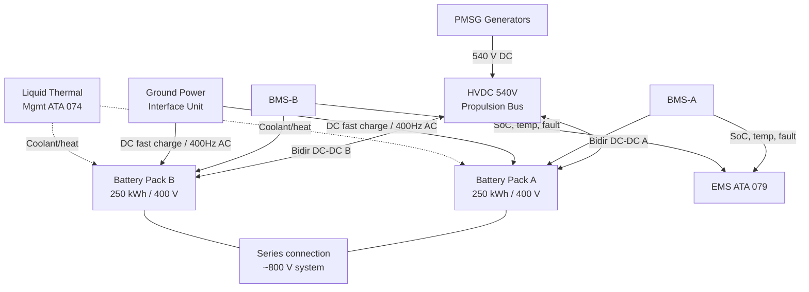
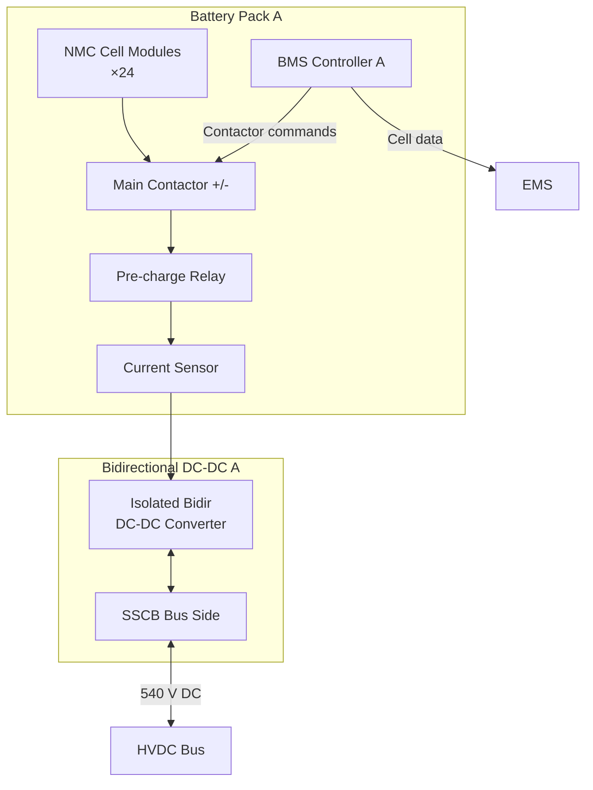

# Energy Storage Integration

---

## §0 Hyperlink Policy
All hyperlinks in this document are **relative**. Absolute URLs are forbidden.

---

## §1 Purpose
This document defines the integration of the AMPEL360E eWTW 500 kWh, ~800 V lithium-ion battery energy storage system with the HVDC 540 V propulsion bus, including pack architecture, SoC management, thermal considerations, contactor topology, and the BMS-to-EMS interface. It is the primary reference for all battery-to-bus integration design decisions and the certification basis for the energy storage portion of the hybrid architecture.

## §2 Applicability
| Aircraft | Variant | MSN Range | Effectivity |
|---|---|---|---|
| AMPEL360E | eWTW | All | From EIS |

## §3 Functional Description 

The energy storage system comprises two independent battery packs (Pack A and Pack B), each rated at 250 kWh and 400 V nominal, connected in series to form an ~800 V high-voltage battery system with a total usable capacity of approximately 480 kWh after accounting for top-of-charge and depth-of-discharge reserves. The packs are housed in temperature-controlled bays in the lower aft fuselage, accessible via dedicated maintenance panels. Each pack consists of a stack of lithium-ion nickel-manganese-cobalt (NMC) modules with an integrated cell-level Battery Management System (BMS) monitoring individual cell voltages, temperatures, and balancing states.

Connection to the HVDC 540 V propulsion bus is made through a pair of bidirectional DC-DC converters (one per pack), which perform voltage step-down/step-up between the ~800 V battery bus and the 540 V propulsion bus. This voltage isolation eliminates the need for direct bus-voltage matching and provides inherent current-limiting during fault conditions. The bidirectional converters report their power command status and efficiency to the EMS, which computes the optimal charge/discharge rate every 100 ms based on SoC, available PMSG power, PMSM demand, and thermal headroom reported by the BMS.

SoC management is a critical safety function: the EMS enforces a usable SoC operating window of 20 %–95 % in normal operation, with a further hardware-protected emergency reserve of 15 % below which the BMS disconnects the battery contactors regardless of EMS command. Battery health monitoring includes cycle counting, impedance spectroscopy (executed at every ground turn-around), and in-flight capacity estimation using a dual Kalman filter algorithm implemented in the BMS controller. On-ground charging is supported via a Ground Power Interface Unit (GPIU) connected to either a 400 Hz airfield AC supply or a DC fast-charge source.

## §4 Functional Breakdown
| ID | Function | Description | Owner | DAL |
|---|---|---|---|---|
| F-070-040-01 | Battery Discharge to HVDC Bus | Provide controlled power from battery to 540 V bus via DC-DC converter | Q-GREENTECH | DAL-B |
| F-070-040-02 | Battery Regenerative Charging | Accept power from HVDC bus (PMSG or regen) via bidirectional DC-DC converter | Q-GREENTECH | DAL-B |
| F-070-040-03 | SoC Management | EMS/BMS enforce SoC window; protect against over-charge and deep-discharge | Q-HPC | DAL-A |
| F-070-040-04 | Battery Thermal Management | Maintain cell temperature within operating range via liquid cooling/heating | Q-GREENTECH | DAL-B |
| F-070-040-05 | Ground Charging | Accept energy from airfield supply via GPIU for pre-flight pack replenishment | Q-INDUSTRY | DAL-C |

## §5 System Context — Architecture

## §6 Internal Architecture

## §7 Components and LRUs
| LRU ID | Name | P/N | Qty | Location |
|---|---|---|---|---|
| LRU-070-040-01 | Battery Pack A (NMC) | TBD | 1 | Lower aft fuselage, port bay |
| LRU-070-040-02 | Battery Pack B (NMC) | TBD | 1 | Lower aft fuselage, stbd bay |
| LRU-070-040-03 | Bidirectional DC-DC Converter | TBD | 2 | Aft equipment bay |
| LRU-070-040-04 | BMS Controller Unit | TBD | 2 | Integrated in battery bay |
| LRU-070-040-05 | Ground Power Interface Unit (GPIU) | TBD | 1 | Aft service panel |

## §8 Interfaces
| Interface | Source | Destination | Protocol | Notes |
|---|---|---|---|---|
| IF-070-040-01 | BMS-A/B | EMS | CAN FD | SoC, SoH, cell temps, fault status, capacity estimate |
| IF-070-040-02 | EMS | Bidir DC-DC A/B | CAN FD | Charge/discharge power setpoint |
| IF-070-040-03 | Bidir DC-DC A/B | HVDC 540 V Bus | HVDC 540 V DC | Power exchange; SSCB protected |
| IF-070-040-04 | Liquid Cooling Loop | Battery Pack thermal jacket | Fluid coupling | 50/50 glycol-water, ≤ 40 °C inlet |
| IF-070-040-05 | GPIU | Battery Pack A/B (via BMS) | CAN FD + Power | Ground charging authority and monitoring |

## §9 Operating Modes
| Mode | Trigger | Description | Power State | Notes |
|---|---|---|---|---|
| Discharge — Boost | EMS boost command | Max discharge rate (C/2) to HVDC bus | ~500 kW discharge | Duration limited; SoC ≥ 30 % |
| Discharge — Taxi | Electric taxi command | Low-rate discharge for PMSM taxi thrust | ~200 kW discharge | SoC ≥ 20 % |
| Charge — Regen | Regen descent EMS command | Accept regen power from PMSM-gen mode | ~450 kW charge | SoC ≤ 95 % |
| Charge — Ground | GPIU connected | Ground fast-charge up to 1 C rate | ~500 kW charge | Pre-flight; BMS governs rate |
| Standby | EMS idle or cruise (balanced) | Battery at float; minimal current flow | ± 0 kW net | SoC maintained by EMS |

## §10 Performance and Budgets 
| Parameter | Requirement | Current Estimate | Unit | Status |
|---|---|---|---|---|
| Total usable energy | ≥ 450 | 480 | kWh |  |
| Peak discharge rate | ≥ C/2 | C/2 | C-rate |  |
| Round-trip efficiency | ≥ 93 | 94.5 | % |  |
| Cycle life at 80 % DoD | ≥ 2 000 | 2 200 | cycles |  |
| Cell temperature operating range | −20 to +55 | −20 to +55 | °C |  |

## §11 Safety, Redundancy and Fault Tolerance
- Packs A and B are electrically isolated by main contactors and independent BMS controllers; a fault in one pack does not affect the other.
- Hardware SoC floor of 15 % is enforced by BMS contactor trip independent of EMS software commands (DAL-A function).
- Each pack includes a cell-level fuse array; a single-cell short circuit is isolated within 5 ms without propagating to adjacent modules.
- The battery bay is equipped with smoke/gas detection and a gaseous suppression system per CS-25.851 for battery fire containment.
- Thermal runaway mitigation includes inter-cell ventilation, pressure-relief venting to dedicated overboard ducts, and BMS temperature-based current de-rating.

## §12 Maintenance and Diagnostics
| Task | Interval | Tool | Reference |
|---|---|---|---|
| BMS capacity check (impedance spectroscopy) | Every turn-around / A-Check | BMS diagnostic port via CMS | MPD 070-040-A1 |
| Cell voltage balance inspection | 300 FH | BMS data download | AMM 070-040-031 |
| Battery bay smoke/gas detector test | 600 FH | Test gas injector TGI-070 | AMM 070-040-032 |
| Ground charging functional test | C-Check | GPIU test set GPIU-TS | AMM 070-040-033 |

## §13 Footprint
| Metric | Physical | Electrical | Maintenance | Data |
|---|---|---|---|---|
| Battery pack mass (each) |  kg | 400 V DC (pack) / 800 V (series) | Aft fuselage access door + HVDC PPE | CAN FD BMS data |
| Bidir DC-DC mass (each) |  kg | 800 V in / 540 V out | Aft equipment bay panel | CAN FD |
| Battery bay volume (each) |  m³ | — | Class-1 HVDC tool set | — |

## §14 Safety and Certification References
| Standard | Requirement | Applicability | Status | Notes |
|---|---|---|---|---|
| DO-178C | BMS controller software DAL-A (SoC floor) | BMS controller | Planned | DAL-A for contactor trip function |
| DO-254 | BMS hardware protection DAL-A | BMS FPGA/ASIC | Planned | Cell-level trip circuitry |
| ARP4754A | Battery storage system development assurance | Battery system | Planned | Function hazard / safety assessment |
| CS-25 | §25.1353 battery installation requirements | Battery bay | Planned | Fire containment, venting |
| FAR Part 25 | §25.1353 equivalent | Battery bay | Planned | Parallel to CS-25 |

## §15 V&V Approach
| Phase | Method | Tool/Facility | Status |
|---|---|---|---|
| Cell characterisation | Electrochemical testing at cell level | Cell test lab CL-070 |  |
| Pack-level abuse test (thermal runaway) | Nail penetration, overcharge, short circuit | Battery safety lab BSL-1 |  |
| BMS integration test | HIL BMS-EMS interaction | HPS-070 HIL Rig |  |
| Flight test SoC accuracy campaign | In-flight SoC comparison vs. ground reference | AMPEL360E FTB-001 |  |

## §16 Glossary
| Term | Definition |
|---|---|
| BMS | Battery Management System — monitors cells and controls contactor and balancing |
| SoC | State of Charge — ratio of remaining charge to rated capacity |
| SoH | State of Health — ratio of current capacity to original rated capacity |
| NMC | Nickel-Manganese-Cobalt — lithium-ion cathode chemistry used in aircraft packs |
| DoD | Depth of Discharge — fraction of rated capacity extracted per cycle |
| C-rate | Charge/discharge rate relative to capacity (e.g., C/2 = half-capacity in 2 hours) |
| GPIU | Ground Power Interface Unit — airside connection for ground charging |
| Impedance Spectroscopy | BMS diagnostic technique measuring internal cell resistance to estimate SoH |
| Kalman Filter | Recursive estimator used for in-flight SoC and capacity estimation |
| Thermal Runaway | Uncontrolled exothermic reaction in a battery cell requiring immediate isolation |

## §17 Open Issues
| ID | Description | Owner | Priority | Status |
|---|---|---|---|---|
| OI-070-040-001 | Confirm NMC chemistry selection vs. LFP for improved thermal runaway margin | @copilot | High | Open |
| OI-070-040-002 | Validate DC fast-charge current limits against GPIU and airfield infrastructure specs | @copilot | Medium | Open |

## §18 Status Legend
| Badge | Meaning |
|---|---|
|  | Content under active development |
|  | Value or content to be determined |
|  | Approved and baselined |
|  | Placeholder, not yet populated |

## §19 Related Documents
| Code | Title | Link |
|---|---|---|
| 070-000 | Hybrid-Electric Architecture Overview — General | [070-000-Hybrid-Electric-Architecture-Overview-General.md](070-000-Hybrid-Electric-Architecture-Overview-General.md) |
| 070-010 | Architecture Modes and Power Flow | [070-010-Architecture-Modes-and-Power-Flow.md](070-010-Architecture-Modes-and-Power-Flow.md) |
| 070-020 | Turbofan-Electric Integration | [070-020-Turbofan-Electric-Integration.md](070-020-Turbofan-Electric-Integration.md) |
| 070-030 | Electric Propulsion Integration | [070-030-Electric-Propulsion-Integration.md](070-030-Electric-Propulsion-Integration.md) |
| 070-050 | Power Electronics and Conversion | [070-050-Power-Electronics-and-Conversion.md](070-050-Power-Electronics-and-Conversion.md) |
| 070-060 | Hybrid Control Architecture | [070-060-Hybrid-Control-Architecture.md](070-060-Hybrid-Control-Architecture.md) |
| 070-070 | Safety, Redundancy and Fault Tolerance Architecture | [070-070-Safety-Redundancy-and-Fault-Tolerance-Architecture.md](070-070-Safety-Redundancy-and-Fault-Tolerance-Architecture.md) |
| 070-080 | Hybrid System Monitoring, Diagnostics and Control Interfaces | [070-080-Hybrid-System-Monitoring-Diagnostics-and-Control-Interfaces.md](070-080-Hybrid-System-Monitoring-Diagnostics-and-Control-Interfaces.md) |
| 070-090 | S1000D CSDB Mapping and Traceability | [070-090-S1000D-CSDB-Mapping-and-Traceability.md](070-090-S1000D-CSDB-Mapping-and-Traceability.md) |

## §20 Change Log
| Rev | Date | Author | Summary |
|---|---|---|---|
| 0.1 | 2026-05-11 | @copilot | Initial creation |
