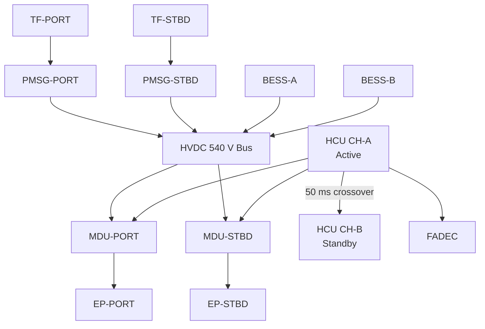
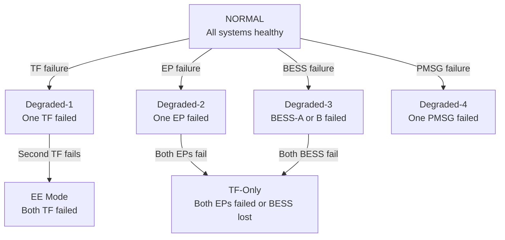

<!-- ──────────────────────────────────────────────────────────────────────────
     QATL-ATLAS-1000-ATLAS-070-079-070-040-PROPULSION-REDUNDANCY-AND-DEGRADED-MODES
     ATA 70 · Propulsion Redundancy and Degraded Modes
     AMPEL360E eWTW — ATLAS Register 1000
────────────────────────────────────────────────────────────────────────────── -->

# Propulsion Redundancy and Degraded Modes

---

## §0 Hyperlink Policy

> All hyperlinks in this document are **relative** (five directory levels: `../../../../../`).
> Absolute URLs are forbidden. Every linked document must exist in the Q+ATLANTIDE repository
> before the link is activated. Broken links are treated as open issues and must be resolved
> before the document is promoted from `DRAFT` to `APPROVED`.

---

## §1 Purpose

This document defines the redundancy architecture of the AMPEL360E eWTW hybrid-electric propulsion system and the degraded operational modes that apply when one or more propulsion components fail. The document also identifies the safety classification of each failure scenario per the Functional Hazard Assessment (FHA) hierarchy.

---

## §2 Applicability

| Parameter | Value |
|---|---|
| Aircraft Program | AMPEL360E eWTW |
| ATA reference | ATA 70-040 — Propulsion Redundancy and Degraded Modes |
| Certification basis | EASA CS-25 Amdt 27 + SC-Hybrid-Electric |
| S1000D SNS | 070-040-00 |

---

## §3 Functional Description ![DRAFT]

**Redundancy Layers**

*Layer 1 — Turbofan Redundancy:*
Two independent TF engines, each on separate pylons, fuel systems, and FADEC channels. Loss of one TF leaves full OEI capability per CS-25 §25.121. The remaining TF + both EPs provide adequate thrust margin for continued flight and landing.

*Layer 2 — Electric Propulsor (EP) Redundancy:*
Two independent EPs, each with their own MDU, PMSM motor, and HVDC zone (Zone D port/stbd). Loss of one EP → remaining EP + both TFs operational. HCU applies asymmetric compensation via differential TF throttle and remaining EP thrust to stay within FBW yaw authority. Dispatch under MEL with one EP inoperative is subject to airline MEL item (EP dispatch under MEL requires BESS ≥ 50 % at dispatch).

*Layer 3 — BESS Redundancy:*
BESS-A and BESS-B are fully independent packs in separate structural bays with separate BMS channels and contactor circuits. Loss of BESS-A → BESS-B alone supplies EP and AET capability (400 kWh available). Loss of both BESS packs → turbofan-only flight; EP offline; no AET; BTO unavailable. This is the baseline certified mode of flight.

*Layer 4 — PMSG Redundancy:*
Each engine has its own PMSG; both feed the same HVDC 540 V bus via independent contactors. Loss of one PMSG → remaining PMSG + both BESS packs supply EP. At cruise, one PMSG (~2.5 MW) is sufficient to supply both EPs at reduced trim power (max ~1.2 MW total EP).

*Layer 5 — HCU Channel Redundancy:*
Dual-channel (Active CH-A / Standby CH-B). Loss of active channel → standby channel assumes control within 50 ms; no perceptible thrust change. Total HCU loss → FADEC autonomous mode (TF only); EP shutdown; BESS isolated.

---

## §4 Functional Breakdown

| ID | Name | Description | Lead Division |
|---|---|---|---|
| F-001 | TF redundancy | Dual independent TF; OEI performance certified per CS-25 §25.121 | Q-GREENTECH |
| F-002 | EP redundancy | Dual EP; asymmetric compensation by HCU on single EP failure | Q-GREENTECH |
| F-003 | BESS redundancy | Dual independent packs; 400 kWh available on single-pack failure | Q-GREENTECH |
| F-004 | PMSG redundancy | Dual PMSG; single PMSG supplies EP at reduced power | Q-MECHANICS |
| F-005 | HCU channel redundancy | Active/standby DAL A channels; crossover within 50 ms | Q-HPC |

---

## §5 System Context — Mermaid Diagram

---

## §6 Internal Architecture — Mermaid Diagram (Failure Cascade)

---

## §7 Components and LRUs

| Component | Part Number | Qty | Location | Maintenance Interval | Notes |
|---|---|---|---|---|---|
| TF Engine (each) | LEAP-1A-PN-TBD | 2 | Wing pylons | Per engine MPD | Independent — no common-cause TF failure path |
| BESS Pack (A and B) | BESS-PN-TBD | 2 | Aft belly bays (separate) | Cap check 2 000 FH | Separate bays, separate BMS, separate contactors |
| HCU (CH-A / CH-B) | HCU-PN-TBD | 1 (dual-channel) | EE bay | SW update per SB | Active/standby; 50 ms crossover |
| MDU (port / stbd) | MDU-PN-TBD | 2 | EP nacelle | Functional test C-check | Each MDU controls one EP independently |
| HVDC Bus-Tie Contactor | HVDC-BTC-PN-TBD | 1 | PDCU in belly fairing | Functional test C-check | Normally closed; opens to isolate one HVDC segment |

---

## §8 Interfaces

| Interface Type | Connected System | Protocol / Medium | Data / Function |
|---|---|---|---|
| ATA 67 FADEC | TF engine; OEI detection | AFDX | FADEC reports TF health; HCU triggers degraded mode |
| BESS BMS | Pack health, fault | AFDX | BMS reports pack failure; HCU reconfigures HVDC |
| ATA 31 ECAM | Degraded mode display | AFDX | ECAM amber/red alerts for propulsion degraded states |
| ATA 27 FBW | Asymmetric thrust compensation | AFDX | HCU informs FBW of asymmetric EP loss; FBW adjusts control law |
| ATA 45 CMS | Fault log and MEL | AFDX | Fault stored; MEL applicability assessed |
| ATA 26 Fire Protection | Nacelle and BESS bay fire | Discrete | Fire detection triggers HCU HVDC isolation |

---

## §9 Operating Modes

| Degraded Mode | Trigger | System State | Actions / Consequences |
|---|---|---|---|
| D1 — OEI (one TF) | TF failure detected by FADEC | Remaining TF + both EPs; HCU full allocation | ECAM engine failure; OEI climb thrust maintained |
| D2 — One EP failed | EP/MDU fault; HVDC zone D isolated | Both TFs + remaining EP; asymmetric compensation | ECAM amber; HCU differential thrust; reduced EP benefit |
| D3 — One BESS failed | BMS pack fault; contactor opened | 400 kWh available from remaining pack | ECAM amber; BTO available if SoC ≥ 45 %; AET reduced endurance |
| D4 — One PMSG failed | PMSG fault; zone B isolated | Remaining PMSG + BESS supply EP | ECAM amber; EP trim limited to ~1.2 MW total |
| D5 — TF-Only | Both EPs failed or BESS totally lost | Both TFs only; certified baseline | ECAM amber; no AET; no BTO; standard CS-25 OEI applies |
| EE — Dual TF | Both TF failed | BESS + both EPs only | Master Warning; ~12 min endurance; squawk 7700 |

---

## §10 Performance and Budgets ![DRAFT]

| Parameter | Requirement | Target / Design Value | Status |
|---|---|---|---|
| OEI take-off climb gradient (one TF failed + EPs) | ≥ 2.4 % per CS-25 §25.121 | 2.7 % | ![TBD] |
| OEI take-off climb gradient (one TF failed + no EP) | ≥ 2.4 % per CS-25 §25.121 | 2.5 % | ![TBD] |
| HCU channel crossover time | ≤ 100 ms | 50 ms | ![TBD] |
| Dispatch availability (all systems required) | ≥ 99.7 % | 99.8 % | ![TBD] |
| BESS single-pack EE endurance | ≥ 8 min (400 kWh) | ~6 min at full EP power | ![TBD] |

---

## §11 Safety, Redundancy and Fault Tolerance

- Loss of all propulsion (both TF + both EP + BESS): classified as Catastrophic per CS-25 §25.1309; must be Extremely Improbable (< 10⁻⁹ per flight hour).
- Loss of all electric propulsion (both EP + BESS) with TFs healthy: classified as Major; aircraft continues on TF-only (certified baseline).
- Common-cause failure analysis: TF engines separated by ~24 m lateral span, independent fuel systems, independent FADEC channels; no single structural failure can disable both.
- BESS packs in separate structural bays; separate fire zones; independent BMS; no common-cause electrical path.
- HCU channels: physically separate processor boards; separate power supplies; no shared software partition.

---

## §12 Maintenance and Diagnostics

| Task | Interval | Access | Special Tools |
|---|---|---|---|
| HCU channel crossover test | C-check | HCU GSE terminal | GSE crossover command |
| BESS contactor isolation test (each pack) | C-check | Belly fairing hatch | BMS GSE terminal |
| EP OEI performance verification (simulation) | Annual | Simulator | Flight simulator |
| FADEC dual-channel independence check | Per engine OEM MPD | Nacelle | FADEC GSE |

---

## §13 Footprint — Physical, Electrical, Maintenance, Data ![TBD]

| Footprint Type | Parameter | Value | Notes |
|---|---|---|---|
| Physical | BESS bay separation (A vs B) | Bays F-25 and F-27 (separate bays) | Fire zone separation |
| Electrical | Single PMSG bus supply (degraded) | ≤ 2.5 MW | Limits EP to 1.2 MW total |
| Data | HCU crossover AFDX notification latency | ≤ 50 ms | Crew and CMS notification |

---

## §14 Safety and Certification References ![DRAFT]

| Standard / Document | Title | Issuing Body | Applicability |
|---|---|---|---|
| EASA CS-25 §25.121 | Climb — OEI | EASA | OEI performance requirement |
| EASA CS-25 §25.1309 | Equipment, Systems and Installations | EASA | FHA probability targets per failure condition |
| SAE ARP4761 | Guidelines and Methods for Safety Assessment | SAE | FHA, FMEA, FTA for propulsion redundancy |
| DO-178C | Software — HCU redundancy management | RTCA | DAL A crossover logic |

---

## §15 V&V Approach ![TBD]

| Phase | Method | Acceptance Criterion | Status |
|---|---|---|---|
| Design | FHA + FTA (top-level propulsion failure tree) | Catastrophic failure < 10⁻⁹/FH | ![TBD] |
| Integration | HIL fault injection (TF, EP, BESS failures) | Correct degraded mode entered within 500 ms | ![TBD] |
| Certification | OEI flight test | Climb gradient ≥ 2.4 % demonstrated | ![TBD] |

---

## §16 Glossary

| Term | Definition |
|---|---|
| **Degraded mode** | Operational state where one or more propulsion components are failed or isolated. |
| **Redundancy** | Presence of duplicate systems ensuring continued function after single failure. |
| **Fail-safe** | Design principle ensuring failures result in a safe (rather than catastrophic) system state. |
| **OEI** | One Engine Inoperative — certified performance case with one TF engine failed. |
| **FHA** | Functional Hazard Assessment — systematic analysis of failure conditions and their effects. |
| **MTBF** | Mean Time Between Failures — reliability metric for individual LRUs. |
| **DAL** | Design Assurance Level — software/hardware criticality level per DO-178C / DO-254. |

---

## §17 Open Issues

| ID | Description | Owner | Target |
|---|---|---|---|
| OI-070-040-001 | Complete Fault Tree Analysis (FTA) for dual TF + dual EP + BESS total loss (Catastrophic) | Q-GREENTECH / Safety | 2027-Q1 |
| OI-070-040-002 | Define MEL item for single EP dispatch (dispatch SoC floor and range restrictions) | Q-AIR / Flight Ops | 2026-Q4 |

---

## §18 Status Legend

| Badge | Meaning |
|---|---|
| `![DRAFT]` | Section is drafted but not yet reviewed |
| `![TBD]` | Content not yet started — to be defined |
| `![To Be Completed]` | Partially complete — needs additional content |
| `![APPROVED]` | Reviewed and formally approved |

---

## §19 Related Documents (Siblings in this Subsection)

- [070-000](./070-000-Hybrid-Electric-Architecture-Overview-General.md)
- [070-010](./070-010-Propulsion-System-Topology.md)
- [070-020](./070-020-Electric-and-Thermal-Propulsion-Allocation.md)
- [070-030](./070-030-Hybrid-Electric-Operating-Modes.md)
- [070-050](./070-050-Propulsion-Energy-Flow-Architecture.md)
- [070-060](./070-060-Propulsion-Safety-and-Isolation-Zones.md)
- [070-070](./070-070-Propulsion-Integration-and-Airframe-Interfaces.md)
- [070-080](./070-080-Hybrid-Electric-Monitoring-Diagnostics-and-Control-Interfaces.md)
- [070-090](./070-090-S1000D-CSDB-Mapping-and-Traceability.md)

---

## §20 Change Log

| Rev | Date | Author | Description |
|---|---|---|---|
| 0.1 | 2026-05-11 | @copilot | Initial DRAFT — contextualized content per AMPEL360E eWTW architecture |
