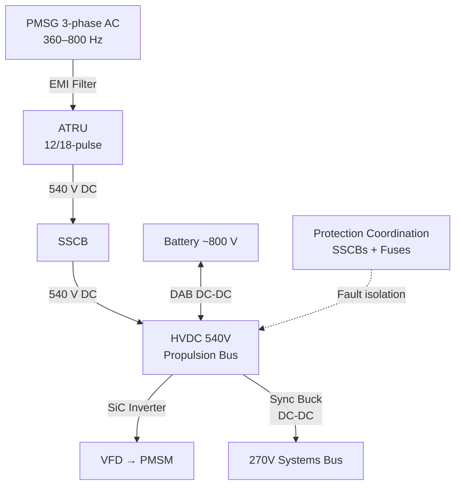
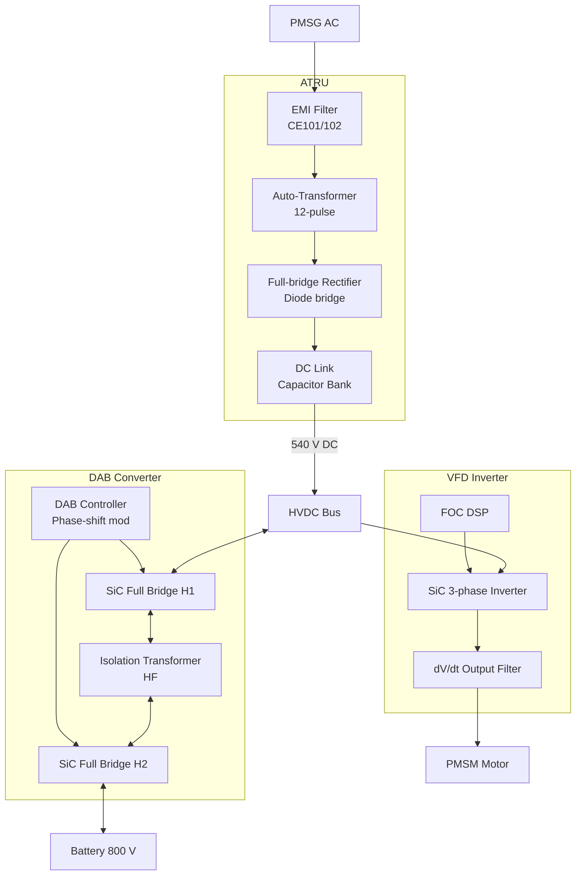

# Power Electronics and Conversion

---

## §0 Hyperlink Policy
All hyperlinks in this document are **relative**. Absolute URLs are forbidden.

---

## §1 Purpose
This document describes the power electronics and energy conversion equipment within the AMPEL360E eWTW hybrid-electric architecture, including Auto-Transformer Rectifier Units (ATRUs), bidirectional DC-DC converters, PMSM inverters (VFDs), and the 540-to-270 V DC-DC step-down converters. It defines conversion efficiency targets, thermal design constraints, EMI management, and the protection coordination scheme across the HVDC power network.

## §2 Applicability
| Aircraft | Variant | MSN Range | Effectivity |
|---|---|---|---|
| AMPEL360E | eWTW | All | From EIS |

## §3 Functional Description 

The power electronics chain of the AMPEL360E eWTW begins at the PMSG output: variable-frequency three-phase AC (360–800 Hz, up to 540 V AC line-to-line) is fed into an Auto-Transformer Rectifier Unit (ATRU) employing a 12-pulse or 18-pulse topology to minimise AC-side harmonic injection back into the PMSG winding. The ATRU produces a 540 V DC rail with less than 2 % peak-to-peak ripple. An EMI filter assembly upstream of the ATRU limits conducted emissions to MIL-STD-461G CE101/CE102 limits. The 540 V DC output of each ATRU feeds through a Solid-State Circuit Breaker (SSCB) into the HVDC propulsion bus.

The bidirectional DC-DC converters connecting the ~800 V battery bus to the 540 V propulsion bus employ a dual-active-bridge (DAB) topology with Silicon Carbide (SiC) MOSFETs, achieving conversion efficiencies of ≥ 97.5 % at rated power. The DAB topology provides inherent galvanic isolation, eliminating the need for separate isolation monitors at the battery interface. Phase-shift modulation allows seamless transition between charge and discharge modes without relay switching. The converters are rated at 500 kW each (one per battery pack) and include a pre-charge circuit to limit inrush current during bus connection.

The PMSM VFD inverter stages use three-phase SiC MOSFET full bridges operating at 20 kHz switching frequency to produce near-sinusoidal output for FOC torque control. Output dV/dt filters are included to protect PMSM winding insulation against high switching transients. The 540-to-270 V DC-DC step-down converters supply the aircraft-systems bus and use a synchronous buck topology with active current sharing between redundant converter lanes.

## §4 Functional Breakdown
| ID | Function | Description | Owner | DAL |
|---|---|---|---|---|
| F-070-050-01 | AC-to-DC Rectification | Convert PMSG variable-frequency AC to stable 540 V DC via ATRU | Q-INDUSTRY | DAL-B |
| F-070-050-02 | Bidirectional Battery Bus Conversion | Transfer power between 800 V battery and 540 V propulsion bus via DAB DC-DC | Q-GREENTECH | DAL-B |
| F-070-050-03 | PMSM Motor Inversion | Convert 540 V DC to variable-frequency 3-phase AC for PMSM torque control | Q-MECHANICS | DAL-B |
| F-070-050-04 | Systems Bus Step-Down | Step 540 V DC down to regulated 270 V DC for aircraft systems bus | Q-INDUSTRY | DAL-A |
| F-070-050-05 | EMI Filtering and Protection | Limit conducted/radiated emissions; protect HVDC bus from fault propagation | Q-INDUSTRY | DAL-B |

## §5 System Context — Architecture

## §6 Internal Architecture

## §7 Components and LRUs
| LRU ID | Name | P/N | Qty | Location |
|---|---|---|---|---|
| LRU-070-050-01 | ATRU (Left / Right) | TBD | 2 | Wing root equipment bay |
| LRU-070-050-02 | Bidirectional DAB DC-DC Converter | TBD | 2 | Aft equipment bay |
| LRU-070-050-03 | PMSM VFD Inverter Unit | TBD | 2 | Aft equipment bay |
| LRU-070-050-04 | 540-to-270 V Synchronous Buck Converter | TBD | 2 (redundant) | Forward equipment bay |
| LRU-070-050-05 | SSCB Assembly (HVDC bus) | TBD | 6 | HVDC bus bars |

## §8 Interfaces
| Interface | Source | Destination | Protocol | Notes |
|---|---|---|---|---|
| IF-070-050-01 | ATRU | HVDC 540 V Bus | HVDC 540 V DC | Diode-isolated 12-pulse output |
| IF-070-050-02 | DAB Converter | HVDC 540 V Bus | HVDC 540 V DC | Bidirectional; SSCB protected |
| IF-070-050-03 | VFD Inverter | PMSM Motor | 3-phase AC variable freq | With dV/dt output filter |
| IF-070-050-04 | 540→270 V Converter | 270 V Systems Bus | 270 V DC regulated | Active current sharing dual lane |
| IF-070-050-05 | EMS | DAB / VFD Controllers | CAN FD | Power setpoint, mode, fault status |

## §9 Operating Modes
| Mode | Trigger | Description | Power State | Notes |
|---|---|---|---|---|
| Normal Generation | PMSG active | ATRU rectifying PMSG AC to 540 V DC | 0–4 200 kW input | Continuous operational mode |
| Battery Discharge | EMS boost/taxi command | DAB converts 800 V bat to 540 V bus | 0–500 kW per converter | C/2 rate |
| Battery Charge | EMS regen/ground command | DAB converts 540 V bus to 800 V bat | 0–500 kW per converter | Phase-shift reversal |
| Motor Drive | VFD active | SiC inverter outputs 3-phase AC to PMSM | 0–1 200 kW per VFD | FOC torque controlled |
| Systems Bus Supply | Normal flight | Buck converter sustains 270 V systems bus | 0–150 kW per converter | Dual-lane active sharing |

## §10 Performance and Budgets 
| Parameter | Requirement | Current Estimate | Unit | Status |
|---|---|---|---|---|
| ATRU conversion efficiency | ≥ 97 | 97.5 | % |  |
| DAB converter efficiency | ≥ 97.5 | 97.8 | % |  |
| VFD inverter efficiency | ≥ 97 | 97.6 | % |  |
| 540→270 V converter efficiency | ≥ 95 | 96 | % |  |
| Total power electronics heat rejection |  | — | kW |  |

## §11 Safety, Redundancy and Fault Tolerance
- Each HVDC power electronics unit is protected by a dedicated SSCB; fault clearing time is < 2 ms for a prospective fault current of 15 kA.
- The DAB isolation transformer provides galvanic isolation between the 800 V battery bus and the 540 V propulsion bus, preventing battery voltage from propagating onto the propulsion bus during a converter failure.
- The 270 V systems bus is supplied by two independent synchronous buck converters operating in active current-share; loss of one converter is automatically absorbed by the other.
- All SiC junction temperatures are monitored in real time; a thermal derating curve reduces power setpoints linearly above 150 °C to prevent overstress.
- EMI filter design is verified against MIL-STD-461G to prevent HVDC switching noise from coupling into avionics equipment on the 270 V systems bus.

## §12 Maintenance and Diagnostics
| Task | Interval | Tool | Reference |
|---|---|---|---|
| SSCB trip current calibration | 1 200 FH | SSCB calibration kit SCK-540 | AMM 070-050-031 |
| DAB converter insulation and isolation test | 600 FH | HV isolation tester HVT-800 | AMM 070-050-032 |
| VFD SiC health report (thermal cycling count) | 300 FH | CMS terminal | MPD 070-050-A1 |
| EMI filter capacitor ESR measurement | C-Check | LCR meter | AMM 070-050-033 |

## §13 Footprint
| Metric | Physical | Electrical | Maintenance | Data |
|---|---|---|---|---|
| ATRU mass (each) |  kg | 3-ph AC in / 540 V DC out | Wing root panel | Discrete health signals |
| DAB converter mass (each) |  kg | 800 V ↔ 540 V | Aft bay panel | CAN FD |
| VFD mass (each) |  kg | 540 V DC in / 3-ph AC out | Aft bay panel | CAN FD |

## §14 Safety and Certification References
| Standard | Requirement | Applicability | Status | Notes |
|---|---|---|---|---|
| DO-178C | VFD and DAB controller software DAL-B | Power electronics controllers | Planned | Level B for thrust/safety functions |
| DO-254 | SSCB and protection hardware DAL-A | SSCB protection logic | Planned | Hardware assurance required |
| ARP4754A | Power electronics integration development assurance | Full conversion chain | Planned | Function hazard assessment |
| CS-25 | §25.1353 protection against electrical faults | HVDC protection scheme | Planned | SSCB coordination per CS-25 AM28 |
| FAR Part 25 | §25.1353 equivalent | HVDC protection scheme | Planned | Parallel CS-25 certification path |

## §15 V&V Approach
| Phase | Method | Tool/Facility | Status |
|---|---|---|---|
| Component efficiency characterisation | Calorimetric loss measurement | Power electronics lab PEL-070 |  |
| EMI compliance testing | MIL-STD-461G conducted emissions scan | EMC lab EMC-070 |  |
| SSCB fault clearing test | Fault injection at rated prospective current | HVDC test facility HTF-1 |  |
| System integration efficiency measurement | Iron bird full-power conversion chain test | Iron Bird Facility |  |

## §16 Glossary
| Term | Definition |
|---|---|
| ATRU | Auto-Transformer Rectifier Unit — converts variable-frequency AC to 540 V DC |
| DAB | Dual-Active-Bridge — isolated bidirectional DC-DC converter topology |
| SiC | Silicon Carbide — wide-bandgap semiconductor enabling high-frequency, high-efficiency switching |
| VFD | Variable Frequency Drive — inverter converting HVDC to motor drive AC |
| SSCB | Solid-State Circuit Breaker — fast electronic fault isolation device |
| FOC | Field-Oriented Control — high-performance motor torque control algorithm |
| 12-pulse | ATRU rectifier topology using two 6-pulse bridges offset 30° to cancel 5th/7th harmonics |
| DAB Isolation | Transformer-based galvanic separation between battery and propulsion bus |
| dV/dt Filter | Output filter limiting voltage rise rate to protect motor winding insulation |
| ESR | Equivalent Series Resistance — indicator of capacitor health and ageing |

## §17 Open Issues
| ID | Description | Owner | Priority | Status |
|---|---|---|---|---|
| OI-070-050-001 | Confirm 12-pulse vs. 18-pulse ATRU harmonic profile against PMSG winding voltage specification | @copilot | High | Open |
| OI-070-050-002 | Define total HVDC power electronics heat rejection budget and thermal loop sizing | @copilot | Medium | Open |

## §18 Status Legend
| Badge | Meaning |
|---|---|
|  | Content under active development |
|  | Value or content to be determined |
|  | Approved and baselined |
|  | Placeholder, not yet populated |

## §19 Related Documents
| Code | Title | Link |
|---|---|---|
| 070-000 | Hybrid-Electric Architecture Overview — General | [070-000-Hybrid-Electric-Architecture-Overview-General.md](070-000-Hybrid-Electric-Architecture-Overview-General.md) |
| 070-010 | Architecture Modes and Power Flow | [070-010-Architecture-Modes-and-Power-Flow.md](070-010-Architecture-Modes-and-Power-Flow.md) |
| 070-020 | Turbofan-Electric Integration | [070-020-Turbofan-Electric-Integration.md](070-020-Turbofan-Electric-Integration.md) |
| 070-030 | Electric Propulsion Integration | [070-030-Electric-Propulsion-Integration.md](070-030-Electric-Propulsion-Integration.md) |
| 070-040 | Energy Storage Integration | [070-040-Energy-Storage-Integration.md](070-040-Energy-Storage-Integration.md) |
| 070-060 | Hybrid Control Architecture | [070-060-Hybrid-Control-Architecture.md](070-060-Hybrid-Control-Architecture.md) |
| 070-070 | Safety, Redundancy and Fault Tolerance Architecture | [070-070-Safety-Redundancy-and-Fault-Tolerance-Architecture.md](070-070-Safety-Redundancy-and-Fault-Tolerance-Architecture.md) |
| 070-080 | Hybrid System Monitoring, Diagnostics and Control Interfaces | [070-080-Hybrid-System-Monitoring-Diagnostics-and-Control-Interfaces.md](070-080-Hybrid-System-Monitoring-Diagnostics-and-Control-Interfaces.md) |
| 070-090 | S1000D CSDB Mapping and Traceability | [070-090-S1000D-CSDB-Mapping-and-Traceability.md](070-090-S1000D-CSDB-Mapping-and-Traceability.md) |

## §20 Change Log
| Rev | Date | Author | Summary |
|---|---|---|---|
| 0.1 | 2026-05-11 | @copilot | Initial creation |
