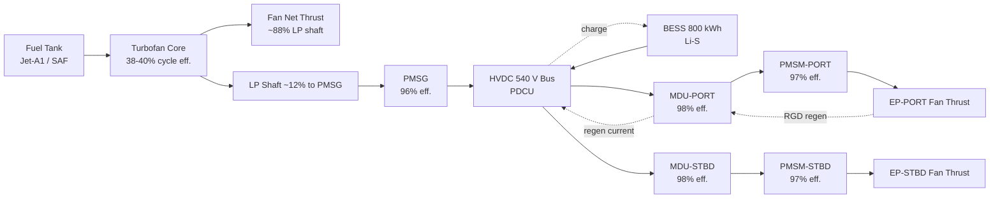
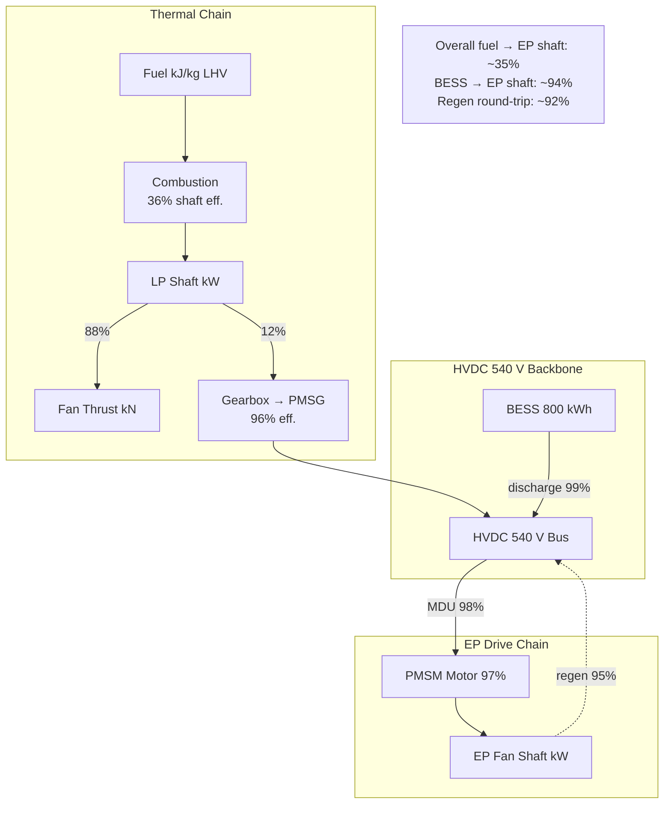

<!-- ──────────────────────────────────────────────────────────────────────────
     QATL-ATLAS-1000-ATLAS-070-079-070-050-PROPULSION-ENERGY-FLOW-ARCHITECTURE
     ATA 70 · Propulsion Energy Flow Architecture
     AMPEL360E eWTW — ATLAS Register 1000
────────────────────────────────────────────────────────────────────────────── -->

# Propulsion Energy Flow Architecture

---

## §0 Hyperlink Policy

> All hyperlinks in this document are **relative** (five directory levels: `../../../../../`).
> Absolute URLs are forbidden. Every linked document must exist in the Q+ATLANTIDE repository
> before the link is activated. Broken links are treated as open issues and must be resolved
> before the document is promoted from `DRAFT` to `APPROVED`.

---

## §1 Purpose

This document defines the energy flow paths across all propulsion-related components of the AMPEL360E eWTW — from fuel combustion through shaft power to electrical generation, HVDC distribution, battery storage, and electric propulsor drive — and quantifies the power and energy budgets for each path.

---

## §2 Applicability

| Parameter | Value |
|---|---|
| Aircraft Program | AMPEL360E eWTW |
| ATA reference | ATA 70-050 — Propulsion Energy Flow Architecture |
| Certification basis | EASA CS-25 Amdt 27 + SC-Hybrid-Electric |
| S1000D SNS | 070-050-00 |

---

## §3 Functional Description ![DRAFT]

**Primary Energy Flow — Combustion to Shaft Thrust**
Jet-A1/SAF fuel combustion in the turbofan core produces hot-gas energy. Approximately 36 % converts to useful shaft power (LP + HP turbines); the remainder is expelled as exhaust thrust and heat. LP shaft power drives the fan (primary thrust ~88 %) and through the reduction gearbox the PMSG (electrical energy ~12 %). Net turbofan cycle efficiency at cruise: ~38–40 %.

**Secondary Energy Flow — PMSG to EP Shaft**
PMSG converts LP shaft mechanical power to HVDC 540 V DC at ~96 % efficiency. HVDC bus carries the power through wing D-box cable trunking to the PDCU and onwards to each MDU. Each MDU (SiC inverter) converts HVDC DC to three-phase variable-frequency AC for the PMSM motor at ~98 % efficiency. PMSM motor converts electrical to mechanical shaft power at ~97 % efficiency. Combined PMSG→MDU→PMSM chain efficiency: ~91 %. Overall fuel→EP shaft efficiency: ~35 % (includes turbofan core losses).

**BESS Energy Flow — Storage to EP Shaft**
BESS DC stored energy → HV contactor → HVDC 540 V bus → MDU → PMSM. BESS discharge efficiency (contactor + bus losses): ~99 %. BESS charge efficiency (regen via MDU): ~98 %. Round-trip efficiency (BESS discharge + charge cycle): ~92 %.

**Regenerative Flow — EP Fan to BESS**
During RGD descent: EP fan windmills → mechanical torque → PMSM (acting as generator) → MDU (regenerative mode) → HVDC bus → BESS charging. Regen conversion efficiency (PMSM gen → BESS): ~95 %. Recoverable energy per descent: 30–50 kWh.

---

## §4 Functional Breakdown

| ID | Name | Description | Lead Division |
|---|---|---|---|
| F-001 | Combustion energy chain | Fuel → LP shaft → fan thrust + PMSG | Q-GREENTECH |
| F-002 | PMSG generation chain | LP shaft → PMSG → HVDC 540 V | Q-MECHANICS |
| F-003 | BESS discharge chain | BESS stored energy → HVDC bus → EP drive | Q-GREENTECH |
| F-004 | EP drive chain | HVDC bus → MDU → PMSM → fan thrust | Q-GREENTECH |
| F-005 | Regenerative capture chain | EP fan windmill → PMSM gen → MDU regen → BESS | Q-GREENTECH |

---

## §5 System Context — Mermaid Diagram

---

## §6 Internal Architecture — Mermaid Diagram

---

## §7 Components and LRUs

| Component | Part Number | Qty | Location | Maintenance Interval | Notes |
|---|---|---|---|---|---|
| PMSG (port/stbd) | PMSG-PN-TBD | 2 | Nacelle aft — LP shaft | On condition | 2.5 MW; 96 % efficiency |
| PDCU (Power Distribution & Control Unit) | PDCU-PN-TBD | 1 | EE bay / belly fairing | Functional test C-check | HVDC bus management |
| MDU (Motor Drive Unit, port/stbd) | MDU-PN-TBD | 2 | EP nacelle wingtip | Functional test C-check | SiC; 1.5 MW; 98 % efficiency |
| BESS Pack (A/B) | BESS-PN-TBD | 2 | Aft belly bays F-25/F-27 | Cap check 2 000 FH | 400 kWh each; 92 % round-trip |
| HVDC Cable Bundle (wing) | HVDC-CABLE-PN-TBD | 4 runs | Wing D-box conduit | Visual inspection A-check | 540 V; shielded; fire-rated |

---

## §8 Interfaces

| Interface Type | Connected System | Protocol / Medium | Data / Function |
|---|---|---|---|
| ATA 24 Electrical Power | HVDC bus, LVDC converters | HVDC cable | Energy flow backbone; non-propulsion loads shed in EE mode |
| ATA 28 Fuel System | Fuel tank quantity and feed | Discrete / AFDX | Fuel flow rate to TF → PMSG power calculation |
| ATA 79 EMS | Energy management targets | AFDX | EMS provides energy budget; energy flow monitored |
| ATA 45 CMS | Energy flow health monitoring | AFDX | PDCU and PMSG power anomalies logged |
| ATA 31 ECAM | Power flow synoptic | AFDX | HVDC bus voltage, PMSG output, BESS SoC, EP power |

---

## §9 Operating Modes

| Mode | Primary Energy Path | Secondary Path | Direction |
|---|---|---|---|
| AET | BESS → HVDC → MDU → EP | — | Discharge |
| BTO | PMSG → HVDC → MDU → EP + BESS → HVDC → MDU → EP | — | Discharge |
| Cruise | PMSG → HVDC → MDU → EP | — | Balanced / slight discharge |
| RGD | EP fan → PMSM gen → MDU regen → HVDC → BESS | — | Charge |
| EE | BESS → HVDC → MDU → EP | — | Full discharge |
| TF-Only | Fuel → TF → fan thrust | No electric EP | No HVDC propulsion flow |

---

## §10 Performance and Budgets ![DRAFT]

| Parameter | Requirement | Target / Design Value | Status |
|---|---|---|---|
| PMSG efficiency | ≥ 95 % | 96 % | ![TBD] |
| MDU (SiC inverter) efficiency | ≥ 97 % | 98 % | ![TBD] |
| PMSM motor efficiency | ≥ 96 % | 97 % | ![TBD] |
| PMSG→EP shaft chain efficiency | ≥ 88 % | 91 % | ![TBD] |
| BESS round-trip efficiency | ≥ 90 % | 92 % | ![TBD] |
| BESS→EP shaft efficiency | ≥ 92 % | 94 % | ![TBD] |
| Regen capture efficiency (EP→BESS) | ≥ 90 % | 95 % | ![TBD] |

---

## §11 Safety, Redundancy and Fault Tolerance

- HVDC bus over-voltage protection in PDCU: trips bus within 5 ms if > 600 V (HVDC rated limit 560 V).
- PMSG over-speed (LP shaft runaway) protection: PMSG disconnected via contactor within 50 ms of over-speed signal.
- BESS thermal runaway: energy flow path isolated by BMS contactors within 100 ms; HVDC rerouted to remaining pack.
- Regenerative over-charge: MDU regen mode limited by BMS maximum charge current; MDU inhibits regen if BESS at 90 % SoC.
- Fuel flow anomaly: FADEC handles independently; PMSG output drops are absorbed by BESS with PDCU prioritisation.

---

## §12 Maintenance and Diagnostics

| Task | Interval | Access | Special Tools |
|---|---|---|---|
| HVDC cable insulation resistance test (wing D-box) | C-check | Wing access panels | HVDC IR tester (1 kV) |
| PMSG power output calibration (kW vs N1 curve) | C-check | Nacelle; PMSG GSE | PMSG GSE terminal |
| MDU efficiency measurement (kW in vs kW out) | C-check | EP nacelle | MDU GSE terminal + power analyser |
| BESS round-trip efficiency test | 2 000 FH | Belly fairing | BMS GSE terminal |

---

## §13 Footprint — Physical, Electrical, Maintenance, Data ![TBD]

| Footprint Type | Parameter | Value | Notes |
|---|---|---|---|
| Electrical | Peak HVDC bus current (BTO) | ~5 600 A (3 MW / 540 V) | Both EPs + PMSG + BESS parallel |
| Electrical | HVDC cable cross-section | ![TBD] | Per current density and voltage drop spec |
| Data | PDCU power monitoring rate | 100 Hz | HVDC voltage / current telemetry |
| Physical | Wing D-box cable conduit length | ~22 m each side | PMSG nacelle to PDCU |

---

## §14 Safety and Certification References ![DRAFT]

| Standard / Document | Title | Issuing Body | Applicability |
|---|---|---|---|
| SAE AS6019 | HVDC Arc-Fault Detection | SAE | HVDC bus arc protection |
| SAE AS5780 | HV Interconnect for Hybrid-Electric | SAE | HVDC cable sizing and routing |
| RTCA DO-311A | MOPS — Rechargeable Lithium Battery | RTCA | BESS energy flow safety |
| EASA AMC 25.1353 | Electrical Equipment and Installations | EASA | HVDC bus protection requirements |

---

## §15 V&V Approach ![TBD]

| Phase | Method | Acceptance Criterion | Status |
|---|---|---|---|
| Design | Power flow simulation (Modelica / MATLAB) | All efficiency targets met; HVDC voltage within ±5 % at bus | ![TBD] |
| Integration | Ground power-on test (PMSG → HVDC → MDU → EP) | Energy flow correct; no bus voltage exceedances | ![TBD] |
| Qualification | DO-160G EMI test on HVDC cable runs | No interference with avionics | ![TBD] |
| Certification | Flight test power flow measurement | PMSG output, BESS SoC, EP input within spec | ![TBD] |

---

## §16 Glossary

| Term | Definition |
|---|---|
| **Energy flow** | The path and conversion chain of energy from fuel to final propulsive thrust. |
| **HVDC PDU** | HVDC Power Distribution Unit — manages bus sources, loads, and protection. |
| **Bus bar** | Conductor connecting multiple sources and loads at a common voltage point. |
| **Round-trip efficiency** | Ratio of energy recovered from BESS (discharge) to energy stored (charge), typically 90–95 %. |
| **Thermal efficiency** | Ratio of shaft power output to fuel chemical energy input; 36–40 % for turbofan at cruise. |
| **Regen mode** | MDU operation as a generator-rectifier, converting EP fan windmill energy to HVDC DC. |
| **SiC inverter** | Silicon Carbide power electronic device enabling high-frequency, high-efficiency DC/AC conversion. |

---

## §17 Open Issues

| ID | Description | Owner | Target |
|---|---|---|---|
| OI-070-050-001 | Finalise HVDC cable cross-section sizing (peak 5 600 A at BTO vs weight budget) | Q-MECHANICS | 2026-Q4 |
| OI-070-050-002 | Validate PMSG→EP chain efficiency 91 % with component-level test data from OEMs | Q-GREENTECH | 2027-Q1 |

---

## §18 Status Legend

| Badge | Meaning |
|---|---|
| `![DRAFT]` | Section is drafted but not yet reviewed |
| `![TBD]` | Content not yet started — to be defined |
| `![To Be Completed]` | Partially complete — needs additional content |
| `![APPROVED]` | Reviewed and formally approved |

---

## §19 Related Documents (Siblings in this Subsection)

- [070-000](./070-000-Hybrid-Electric-Architecture-Overview-General.md)
- [070-010](./070-010-Propulsion-System-Topology.md)
- [070-020](./070-020-Electric-and-Thermal-Propulsion-Allocation.md)
- [070-030](./070-030-Hybrid-Electric-Operating-Modes.md)
- [070-040](./070-040-Propulsion-Redundancy-and-Degraded-Modes.md)
- [070-060](./070-060-Propulsion-Safety-and-Isolation-Zones.md)
- [070-070](./070-070-Propulsion-Integration-and-Airframe-Interfaces.md)
- [070-080](./070-080-Hybrid-Electric-Monitoring-Diagnostics-and-Control-Interfaces.md)
- [070-090](./070-090-S1000D-CSDB-Mapping-and-Traceability.md)

---

## §20 Change Log

| Rev | Date | Author | Description |
|---|---|---|---|
| 0.1 | 2026-05-11 | @copilot | Initial DRAFT — contextualized content per AMPEL360E eWTW architecture |
