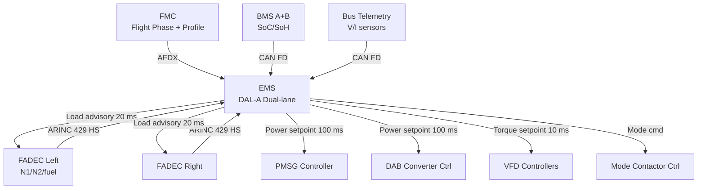
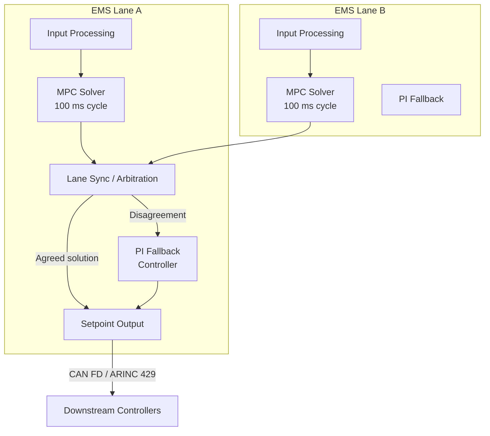

# Hybrid Control Architecture

---

## §0 Hyperlink Policy
All hyperlinks in this document are **relative**. Absolute URLs are forbidden.

---

## §1 Purpose
This document specifies the hybrid control architecture of the AMPEL360E eWTW, including the EMS control laws, power-split optimisation algorithm, real-time supervisory loop structure, and the FADEC interface protocol. It defines the software partitioning, control cycle timing, and authority handoff rules between the EMS, FADEC, BMS, and VFD controllers. This document is the primary reference for EMS software requirements and the software architecture description (SAD).

## §2 Applicability
| Aircraft | Variant | MSN Range | Effectivity |
|---|---|---|---|
| AMPEL360E | eWTW | All | From EIS |

## §3 Functional Description 

The Hybrid Energy Management System (EMS) is the top-level supervisory controller of the AMPEL360E eWTW electric powertrain. It operates as a DAL-A real-time embedded application on a dual-redundant avionics processing platform (Lane A and Lane B) with deterministic 10 ms control cycle time. The EMS receives flight-phase and mission-profile data from the FMC via AFDX, engine state data from each FADEC via ARINC 429 (high-speed, 100 kbps), battery SoC/SoH from each BMS via CAN FD, and bus voltage/current telemetry from the power distribution units.

The core EMS control law is a Model Predictive Control (MPC) algorithm that solves a receding-horizon optimisation problem every 100 ms over a prediction horizon of 60 seconds. The cost function minimises a weighted sum of fuel burn, battery SoC deviation from a target trajectory, and NOx proxy (combustor temperature proxy from FADEC). Constraints include PMSG power limits, battery C-rate limits, PMSM torque limits, and SoC operating window boundaries. The MPC solution is downsampled and filtered to produce smooth power setpoints for the inner control loops.

The inner control architecture is hierarchical: the EMS issues power setpoints to the PMSG controller, the DAB converters, and the VFD torque controllers, each of which runs its own dedicated closed-loop at 1 kHz or higher. The FADEC interface is managed by an advisory channel: the EMS sends an "electrical load request" to FADEC every 20 ms, and FADEC incorporates this into its N1/fuel-flow schedule. The EMS does not command FADEC throttle directly — this preserves FADEC authority integrity per ARP4754A. A fallback Proportional-Integral (PI) controller is activated on MPC convergence failure, maintaining basic power delivery using fixed power-split tables indexed by flight phase and SoC.

## §4 Functional Breakdown
| ID | Function | Description | Owner | DAL |
|---|---|---|---|---|
| F-070-060-01 | MPC Power-Split Optimisation | Solve receding-horizon optimisation every 100 ms for minimal fuel/SoC cost | Q-HPC | DAL-A |
| F-070-060-02 | FADEC Electrical Load Advisory | Issue electrical extraction request to FADEC every 20 ms | Q-MECHANICS | DAL-A |
| F-070-060-03 | EMS Lane Synchronisation | Cross-check Lane A and Lane B computations; arbitrate on disagreement | Q-HPC | DAL-A |
| F-070-060-04 | Fallback PI Control | Activate fixed-table PI power split on MPC failure | Q-GREENTECH | DAL-A |
| F-070-060-05 | Setpoint Distribution | Issue power setpoints to PMSG, DAB, and VFD controllers each cycle | Q-INDUSTRY | DAL-A |

## §5 System Context — Architecture

## §6 Internal Architecture

## §7 Components and LRUs
| LRU ID | Name | P/N | Qty | Location |
|---|---|---|---|---|
| LRU-070-060-01 | EMS Processing Unit (Lane A) | TBD | 1 | Avionics Bay |
| LRU-070-060-02 | EMS Processing Unit (Lane B) | TBD | 1 | Avionics Bay |
| LRU-070-060-03 | EMS Lane Cross-Link Module | TBD | 1 | Avionics Bay |
| LRU-070-060-04 | EMS I/O Concentrator Unit | TBD | 2 | Forward Equipment Bay |
| LRU-070-060-05 | EMS Software Load Device (SLD) | TBD | 1 | Maintenance Panel |

## §8 Interfaces
| Interface | Source | Destination | Protocol | Notes |
|---|---|---|---|---|
| IF-070-060-01 | FMC | EMS | AFDX (ARINC 664 p7) | Mission profile, waypoints, flight phase |
| IF-070-060-02 | FADEC (L/R) | EMS | ARINC 429 HS 100 kbps | N1, N2, TAT, shaft power margin, fault status |
| IF-070-060-03 | EMS | FADEC (L/R) | ARINC 429 HS | Electrical load request advisory |
| IF-070-060-04 | BMS A/B | EMS | CAN FD 5 Mbps | SoC, SoH, cell temp, charge/discharge limits |
| IF-070-060-05 | EMS | VFD / DAB / PMSG controllers | CAN FD 5 Mbps | Power setpoints, mode commands, health queries |

## §9 Operating Modes
| Mode | Trigger | Description | Power State | Notes |
|---|---|---|---|---|
| MPC Active | Normal; MPC convergence < 50 ms | Full optimisation; fuel and SoC co-optimised | Optimised split | Primary control mode |
| PI Fallback | MPC timeout > 50 ms or divergence | Fixed-table PI power split by flight phase | Table-based split | Degraded but safe |
| Maintenance Override | Ground; maintenance pin installed | Manual setpoints from CMS terminal | Test power levels | Safety interlock active |
| Dual-Lane Disagreement | Lane A ≠ Lane B > threshold | Lane arbitration; PI fallback; ECAM advisory | PI fallback | Crew notified |
| Shutdown | EMS fault + crew action | All setpoints zeroed; contactors open | Zero generation | Emergency only |

## §10 Performance and Budgets 
| Parameter | Requirement | Current Estimate | Unit | Status |
|---|---|---|---|---|
| EMS control cycle time | ≤ 10 | 10 | ms |  |
| MPC horizon | ≥ 60 | 60 | s |  |
| FADEC advisory latency | ≤ 20 | 18 | ms |  |
| Fuel burn reduction vs. fixed split | ≥ 3 | 3.5 | % |  |
| EMS failover time (Lane A → B) | ≤ 50 | 40 | ms |  |

## §11 Safety, Redundancy and Fault Tolerance
- Dual EMS lanes operate in hot standby; Lane B mirrors Lane A computations and detects divergence within one control cycle.
- The FADEC advisory interface is one-way advisory only; FADEC retains full authority over fuel flow and N1/N2, ensuring no EMS software failure can cause uncontrolled thrust.
- PI fallback provides guaranteed power delivery to all consumers even on complete MPC failure, with degraded efficiency but no loss of aircraft control.
- EMS software is partitioned per ARINC 653 APEX on a time-and-space partitioned RTOS, preventing runaway MPC computation from starving safety-critical output partitions.
- All EMS outputs are range-checked against absolute hardware limits before forwarding to downstream controllers; out-of-range setpoints are clamped and an ECAM advisory is raised.

## §12 Maintenance and Diagnostics
| Task | Interval | Tool | Reference |
|---|---|---|---|
| EMS software version and integrity check | Pre-flight | CMCS terminal | FCOM 070-060-01 |
| MPC model parameter validation | 300 FH or B-Check | EMS diagnostic tool EDT-060 | MPD 070-060-B1 |
| EMS lane failover test | 600 FH | Maintenance mode; CMS | AMM 070-060-031 |
| EMS I/O calibration (sensor offsets) | C-Check | EDT-060 with AGSE | AMM 070-060-032 |

## §13 Footprint
| Metric | Physical | Electrical | Maintenance | Data |
|---|---|---|---|---|
| EMS Processing Unit size | 2 × 3 ATR | 28 V DC, 35 W each | Standard avionics bay | AFDX / CAN FD / ARINC 429 |
| EMS I/O Concentrator size | 1 × 2 ATR each | 28 V DC, 10 W | Forward equipment bay | CAN FD |
| EMS software size |  SLOC | — | Software load device | DO-178C qualified |

## §14 Safety and Certification References
| Standard | Requirement | Applicability | Status | Notes |
|---|---|---|---|---|
| DO-178C | EMS application software DAL-A | EMS software | Planned | Full MC1–MC6 including MPC algorithm |
| DO-254 | EMS processing hardware DAL-A | EMS processor / FPGA | Planned | Complex electronic hardware |
| ARP4754A | EMS system development assurance | EMS as system item | Planned | System safety assessment including FADEC IF |
| CS-25 | §25.1309 probability for EMS total loss | EMS system | Planned | Catastrophic = < 1×10⁻⁹/FH; dual-lane mitigates |
| FAR Part 25 | §25.1309 equivalent | EMS system | Planned | Joint FAA/EASA certification programme |

## §15 V&V Approach
| Phase | Method | Tool/Facility | Status |
|---|---|---|---|
| MPC algorithm verification | Model-in-the-loop (MiL) simulation | MATLAB/Simulink MiL bench |  |
| EMS software integration test | Software-in-the-loop (SiL) on target HW | SiL-070 test rack |  |
| HIL closed-loop EMS-FADEC-BMS | Hardware-in-the-loop with FADEC emulator | HPS-070 HIL Rig |  |
| Flight test optimisation validation | In-flight fuel-burn measurement campaign | AMPEL360E FTB-001 |  |

## §16 Glossary
| Term | Definition |
|---|---|
| EMS | Energy Management System — top-level supervisory controller of the electric powertrain |
| MPC | Model Predictive Control — optimisation-based control law with receding prediction horizon |
| PI | Proportional-Integral — classical fallback control law for EMS power split |
| ARINC 653 | Avionics software partitioning standard (APEX API) for time-and-space isolation |
| RTOS | Real-Time Operating System — deterministic OS for embedded avionics control |
| SAD | Software Architecture Description — document describing EMS software structure |
| Hot Standby | Redundancy mode where backup lane is fully computed and ready to assume control instantly |
| Cost Function | MPC objective: weighted sum of fuel burn, SoC deviation, and NOx proxy |
| SLOC | Source Lines of Code — measure of software size for DO-178C planning |
| Advisory Channel | One-way EMS-to-FADEC message; FADEC is not obligated to follow but uses it for feed-forward |

## §17 Open Issues
| ID | Description | Owner | Priority | Status |
|---|---|---|---|---|
| OI-070-060-001 | Define MPC cost-function weighting factors for fuel vs. SoC trade-off during extended range | @copilot | High | Open |
| OI-070-060-002 | Confirm ARINC 653 RTOS selection and partition configuration with avionics supplier | @copilot | Medium | Open |

## §18 Status Legend
| Badge | Meaning |
|---|---|
|  | Content under active development |
|  | Value or content to be determined |
|  | Approved and baselined |
|  | Placeholder, not yet populated |

## §19 Related Documents
| Code | Title | Link |
|---|---|---|
| 070-000 | Hybrid-Electric Architecture Overview — General | [070-000-Hybrid-Electric-Architecture-Overview-General.md](070-000-Hybrid-Electric-Architecture-Overview-General.md) |
| 070-010 | Architecture Modes and Power Flow | [070-010-Architecture-Modes-and-Power-Flow.md](070-010-Architecture-Modes-and-Power-Flow.md) |
| 070-020 | Turbofan-Electric Integration | [070-020-Turbofan-Electric-Integration.md](070-020-Turbofan-Electric-Integration.md) |
| 070-030 | Electric Propulsion Integration | [070-030-Electric-Propulsion-Integration.md](070-030-Electric-Propulsion-Integration.md) |
| 070-040 | Energy Storage Integration | [070-040-Energy-Storage-Integration.md](070-040-Energy-Storage-Integration.md) |
| 070-050 | Power Electronics and Conversion | [070-050-Power-Electronics-and-Conversion.md](070-050-Power-Electronics-and-Conversion.md) |
| 070-070 | Safety, Redundancy and Fault Tolerance Architecture | [070-070-Safety-Redundancy-and-Fault-Tolerance-Architecture.md](070-070-Safety-Redundancy-and-Fault-Tolerance-Architecture.md) |
| 070-080 | Hybrid System Monitoring, Diagnostics and Control Interfaces | [070-080-Hybrid-System-Monitoring-Diagnostics-and-Control-Interfaces.md](070-080-Hybrid-System-Monitoring-Diagnostics-and-Control-Interfaces.md) |
| 070-090 | S1000D CSDB Mapping and Traceability | [070-090-S1000D-CSDB-Mapping-and-Traceability.md](070-090-S1000D-CSDB-Mapping-and-Traceability.md) |

## §20 Change Log
| Rev | Date | Author | Summary |
|---|---|---|---|
| 0.1 | 2026-05-11 | @copilot | Initial creation |
