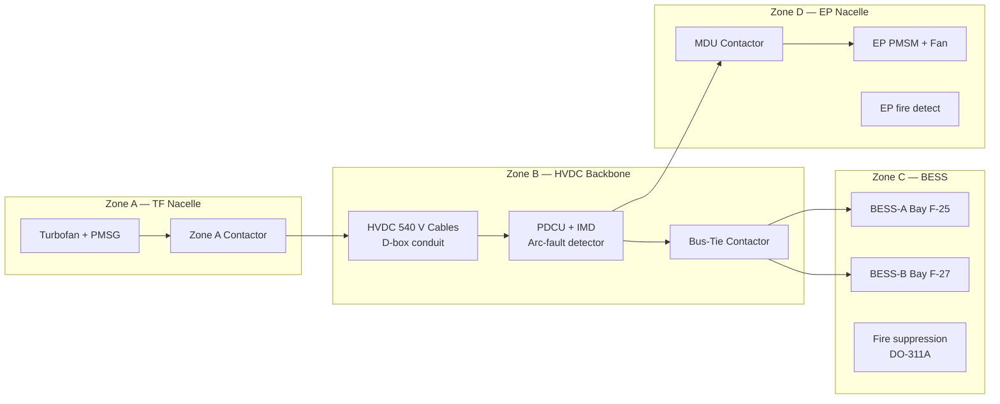
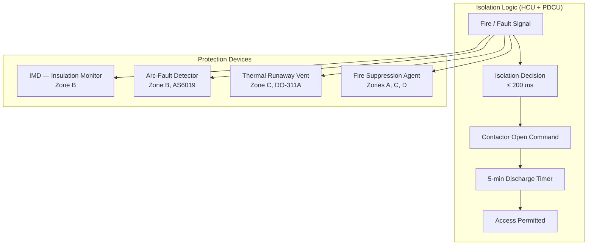

<!-- ──────────────────────────────────────────────────────────────────────────
     QATL-ATLAS-1000-ATLAS-070-079-070-060-PROPULSION-SAFETY-AND-ISOLATION-ZONES
     ATA 70 · Propulsion Safety and Isolation Zones
     AMPEL360E eWTW — ATLAS Register 1000
────────────────────────────────────────────────────────────────────────────── -->

# Propulsion Safety and Isolation Zones

---

## §0 Hyperlink Policy

> All hyperlinks in this document are **relative** (five directory levels: `../../../../../`).
> Absolute URLs are forbidden. Every linked document must exist in the Q+ATLANTIDE repository
> before the link is activated. Broken links are treated as open issues and must be resolved
> before the document is promoted from `DRAFT` to `APPROVED`.

---

## §1 Purpose

This document defines the safety zones and electrical/mechanical isolation architecture for the AMPEL360E eWTW hybrid-electric propulsion system. The zone-based safety design ensures that failures, faults, and fires are contained within defined boundaries and that maintenance personnel can safely access components under LOTO procedures.

---

## §2 Applicability

| Parameter | Value |
|---|---|
| Aircraft Program | AMPEL360E eWTW |
| ATA reference | ATA 70-060 — Propulsion Safety and Isolation Zones |
| Certification basis | EASA CS-25 Amdt 27 + SC-Hybrid-Electric; CS-25 §25.1353; RTCA DO-311A |
| S1000D SNS | 070-060-00 |

---

## §3 Functional Description ![DRAFT]

The propulsion safety architecture defines four isolation zones, each with independent isolation switches, fire protection, and thermal containment where applicable.

**Zone A — Turbofan Nacelle Zone (TF-PORT and TF-STBD)**
Boundaries: engine intake to aft nacelle firewall; pylon attachment interface. Covers combustion zone, LP/HP compressors/turbines, and PMSG gearbox. Fire protection per ATA 26 (fire detection + suppression). PMSG HVDC output cable exits Zone A through a fire-rated bulkhead feedthrough. PMSG zone-A contactor (part of PDCU) isolates HVDC from Zone A on fire signal within 200 ms.

**Zone B — HVDC Backbone Zone**
Boundaries: PMSG nacelle output feedthroughs, wing D-box cable conduits, belly fairing PDCU, and bus-tie contactor. Carries HVDC 540 V at up to 5 600 A (peak BTO). Arc-fault detection (per SAE AS6019) with 200 ms trip time. Ground fault isolation: insulation monitoring device (IMD) monitors Zone B continuously; alert threshold 50 kΩ. Zone B isolation removes all HVDC cable power; 5-minute residual charge dissipation mandatory before maintenance access.

**Zone C — BESS Compartment Zone**
Boundaries: aft belly fairing structural bays F-25 (BESS-A) and F-27 (BESS-B); separated by fire bulkhead (bay F-26). Each BESS pack sub-zone has independent BMS contactors, thermal runaway venting, and fire suppression (Halon-free agent per DO-311A). Zone C is accessible only through dedicated belly access hatches. BESS zone contactor opens within 100 ms of BMS thermal runaway detection. 5-minute waiting period after contactor open before hatch access (residual cell discharge).

**Zone D — Electric Propulsor Nacelle Zone (EP-PORT and EP-STBD)**
Boundaries: wingtip EP nacelle structure; MDU enclosure; EP PMSM motor housing; EP fan assembly. Each Zone D has its own HVDC zone isolation switch (MDU contactor) operated by HCU within 200 ms of fault. EP nacelle fire detection (ATA 26 equivalent loop). After HVDC isolation, residual MDU capacitor discharge completed within 5 minutes. Zone D access requires elevated platform (cherry-picker) or specialised wingtip maintenance stand.

---

## §4 Functional Breakdown

| ID | Name | Description | Lead Division |
|---|---|---|---|
| F-001 | Zone A isolation (TF nacelle) | PMSG contactor; fire detection; HVDC feedthrough protection | Q-GREENTECH |
| F-002 | Zone B isolation (HVDC backbone) | IMD monitoring; arc-fault trip; bus-tie contactor control | Q-MECHANICS |
| F-003 | Zone C isolation (BESS) | BMS contactors; thermal runaway venting; fire suppression | Q-GREENTECH |
| F-004 | Zone D isolation (EP nacelle) | MDU zone contactor; EP fire detection; residual discharge | Q-GREENTECH |
| F-005 | Arc-fault and thermal protection | Zone B arc-fault detector; Zone C thermal runaway monitor | Q-MECHANICS |

---

## §5 System Context — Mermaid Diagram

---

## §6 Internal Architecture — Mermaid Diagram

---

## §7 Components and LRUs

| Component | Part Number | Qty | Location | Maintenance Interval | Notes |
|---|---|---|---|---|---|
| Zone A PMSG Contactor | CONT-A-PN-TBD | 2 (one per engine) | Nacelle firewall feedthrough | Functional test C-check | 200 ms fault response |
| IMD — Insulation Monitoring Device | IMD-PN-TBD | 1 | PDCU, belly fairing | Calibration check C-check | Zone B; alert at 50 kΩ |
| Arc-Fault Detector (Zone B) | AFD-PN-TBD | 1 | PDCU | Functional test C-check | SAE AS6019 compliant |
| BMS Contactor (Zone C, each pack) | BMS-CONT-PN-TBD | 2 | BESS packs A and B | Check per cap-test cycle | 100 ms thermal runaway response |
| Zone C Fire Suppression Agent | FIRE-C-PN-TBD | 2 (one per BESS bay) | Belly fairing bays | Replace after use; inspect C-check | Halon-free; DO-311A rated |
| MDU Zone D Contactor | MDU-CONT-PN-TBD | 2 (one per EP) | MDU inside EP nacelle | Functional test C-check | 200 ms fault response |

---

## §8 Interfaces

| Interface Type | Connected System | Protocol / Medium | Data / Function |
|---|---|---|---|
| ATA 26 Fire Protection | Fire detection loops (Zones A, C, D) | Discrete | Fire signal triggers zone isolation within 200 ms |
| ATA 45 CMS | Fault and isolation log | AFDX | Zone isolation events stored; MEL applicability |
| ATA 31 ECAM | Zone isolation status display | AFDX | ECAM advisory for zone isolated |
| PDCU | Arc-fault and IMD monitoring | AFDX | Continuous insulation monitoring; fault reporting |
| BMS | Zone C thermal runaway | CAN / discrete | BMS contactor open command; vent actuation |
| ATA 24 Electrical Power | HVDC bus isolation | HVDC contactor | Zone isolation removes HVDC from affected zone |

---

## §9 Operating Modes

| Zone State | Trigger | Consequence |
|---|---|---|
| Normal — all zones live | All systems healthy | Full propulsion available |
| Zone A isolated (one nacelle) | TF/PMSG fire or PMSG fault | Remaining TF + PMSG + BESS supply EPs |
| Zone B isolated (HVDC backbone) | Arc-fault or IMD fault | All EP offline; TF-only mode |
| Zone C isolated (one BESS pack) | BMS thermal runaway or fault | 400 kWh remaining pack available |
| Zone C fully isolated (both BESS) | Both packs failed | No BESS; TF-only with PMSG supply to EP |
| Zone D isolated (one EP) | MDU fault or EP fire | Remaining EP + both TFs; asymmetric mode |
| All HVDC isolated (emergency) | Master isolation command | TF-only mode; no EP; BESS de-energised |

---

## §10 Performance and Budgets ![DRAFT]

| Parameter | Requirement | Target / Design Value | Status |
|---|---|---|---|
| Zone isolation response time (contactor open) | ≤ 500 ms | 200 ms | ![TBD] |
| HVDC residual discharge time (post-isolation) | ≤ 5 min | 5 min (capacitor bleed resistor) | ![TBD] |
| IMD alert threshold (Zone B) | ≤ 100 kΩ | 50 kΩ | ![TBD] |
| BESS thermal runaway containment (Zone C) | No external fire propagation | Halon-free suppression agent; venting to exterior | ![TBD] |
| Zone D MDU capacitor residual energy (post-isolation) | ≤ 50 J after 5 min | < 10 J | ![TBD] |

---

## §11 Safety, Redundancy and Fault Tolerance

- Each zone has independent isolation; failure of one zone isolation does not affect others.
- Zone B arc-fault protection (AS6019) operates independently of HCU — hardware-only detection to meet 200 ms response.
- Zone C fire suppression is passively actuated; no HCU command required for DO-311A vent operation.
- LOTO procedure mandates all four zones isolated before any maintenance access to live HVDC components.
- Maintenance personnel must verify HVDC voltage ≤ 50 V with calibrated meter before touching any HVDC terminal, regardless of isolation timer.
- Zone isolation cannot be reset in flight without crew/HCU authority; prevents inadvertent re-energisation.

---

## §12 Maintenance and Diagnostics

| Task | Interval | Access | Special Tools |
|---|---|---|---|
| Zone A contactor open/close test | C-check | Nacelle access | PMSG GSE + HVDC voltmeter |
| IMD calibration and alert test (Zone B) | C-check | PDCU, belly fairing | IMD calibration kit |
| Arc-fault detector functional test (Zone B) | C-check | PDCU | AFD test adaptor |
| Zone C fire suppression agent weight check | A-check | Belly hatch | Scale |
| Zone D MDU contactor open/close test | C-check | EP nacelle (elevated access) | MDU GSE terminal |
| HVDC residual voltage measurement (post-isolation) | Before any HVDC access | All zones | Calibrated HVDC voltmeter (> 600 V range) |

---

## §13 Footprint — Physical, Electrical, Maintenance, Data ![TBD]

| Footprint Type | Parameter | Value | Notes |
|---|---|---|---|
| Physical | BESS bay fire wall separation | Bay F-26 (between A and B) | Structural fire barrier |
| Electrical | IMD monitoring range | 10 kΩ – 10 MΩ | Zone B insulation degradation detection |
| Maintenance | Residual charge bleed time | 5 min mandatory | All HVDC zones |
| Physical | Zone D access requirement | Elevated platform ≥ 8 m | EP at wingtip ±34 m height |

---

## §14 Safety and Certification References ![DRAFT]

| Standard / Document | Title | Issuing Body | Applicability |
|---|---|---|---|
| EASA CS-25 §25.1353 | Electrical Equipment and Installations | EASA | HVDC zone isolation and battery requirements |
| EASA SC-Hybrid-Electric | HVDC isolation specific conditions | EASA | Arc-fault, insulation monitoring, zone design |
| SAE AS6019 | Arc-Fault Circuit Protection | SAE | Zone B arc-fault detection |
| RTCA DO-311A | MOPS — Rechargeable Lithium Battery | RTCA | Zone C thermal runaway containment |
| MIL-STD-704F | Aircraft Electric Power Characteristics | DoD | HVDC 540 V bus characteristics reference |

---

## §15 V&V Approach ![TBD]

| Phase | Method | Acceptance Criterion | Status |
|---|---|---|---|
| Design | FTA for each zone failure mode | Zone failure cannot propagate to adjacent zone | ![TBD] |
| Integration | Zone isolation functional test (all 4 zones) | Isolation within 200 ms; residual < 50 V after 5 min | ![TBD] |
| Qualification | DO-160G fire and thermal test on Zone C | No external fire propagation | ![TBD] |
| Certification | EASA SC inspection and ground test | All zones isolated correctly; LOTO procedure validated | ![TBD] |

---

## §16 Glossary

| Term | Definition |
|---|---|
| **Isolation zone** | Defined boundary within which electrical and fire hazards are contained and independently manageable. |
| **Arc-fault** | Unintended electrical discharge between conductors; detected by AS6019 detector in Zone B. |
| **Thermal runaway** | Self-sustaining exothermic reaction in a battery cell; managed by DO-311A containment in Zone C. |
| **LOTO** | Lockout/Tagout — maintenance safety procedure ensuring all energy sources are isolated and locked before access. |
| **Residual charge** | Electrical energy remaining in HVDC bus capacitors after contactor isolation; dissipates within 5 minutes. |
| **IMD** | Insulation Monitoring Device — continuously checks HVDC bus insulation resistance; alerts at 50 kΩ. |
| **HVDC isolation switch** | Contactor that opens to remove HVDC 540 V from a defined zone within 200 ms. |

---

## §17 Open Issues

| ID | Description | Owner | Target |
|---|---|---|---|
| OI-070-060-001 | Confirm Zone C DO-311A venting design (vent area and routing to aircraft exterior) with BESS OEM | Q-GREENTECH / Structures | 2026-Q4 |
| OI-070-060-002 | Confirm LOTO procedure steps and tool list for Zone D wingtip access (elevated platform requirement) | Q-MECHANICS / Safety | 2026-Q3 |

---

## §18 Status Legend

| Badge | Meaning |
|---|---|
| `![DRAFT]` | Section is drafted but not yet reviewed |
| `![TBD]` | Content not yet started — to be defined |
| `![To Be Completed]` | Partially complete — needs additional content |
| `![APPROVED]` | Reviewed and formally approved |

---

## §19 Related Documents (Siblings in this Subsection)

- [070-000](./070-000-Hybrid-Electric-Architecture-Overview-General.md)
- [070-010](./070-010-Propulsion-System-Topology.md)
- [070-020](./070-020-Electric-and-Thermal-Propulsion-Allocation.md)
- [070-030](./070-030-Hybrid-Electric-Operating-Modes.md)
- [070-040](./070-040-Propulsion-Redundancy-and-Degraded-Modes.md)
- [070-050](./070-050-Propulsion-Energy-Flow-Architecture.md)
- [070-070](./070-070-Propulsion-Integration-and-Airframe-Interfaces.md)
- [070-080](./070-080-Hybrid-Electric-Monitoring-Diagnostics-and-Control-Interfaces.md)
- [070-090](./070-090-S1000D-CSDB-Mapping-and-Traceability.md)

---

## §20 Change Log

| Rev | Date | Author | Description |
|---|---|---|---|
| 0.1 | 2026-05-11 | @copilot | Initial DRAFT — contextualized content per AMPEL360E eWTW architecture |
