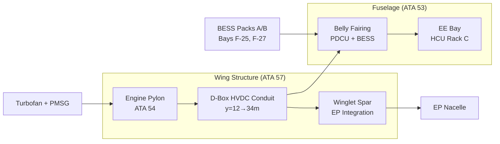
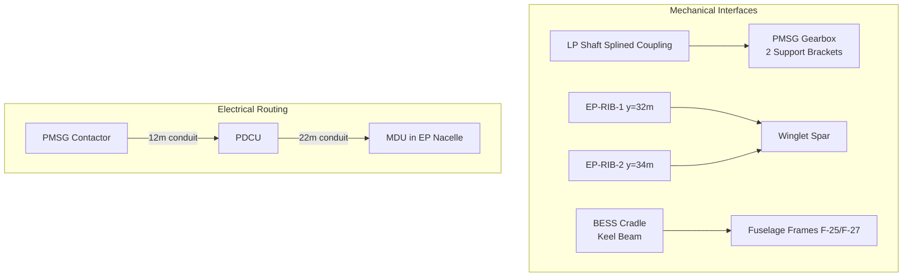

<!-- ──────────────────────────────────────────────────────────────────────────
     QATL-ATLAS-1000-ATLAS-070-079-070-070-PROPULSION-INTEGRATION-AND-AIRFRAME-INTERFACES
     ATA 70 · Propulsion Integration and Airframe Interfaces
     AMPEL360E eWTW — ATLAS Register 1000
────────────────────────────────────────────────────────────────────────────── -->

# Propulsion Integration and Airframe Interfaces

---

## §0 Hyperlink Policy

> All hyperlinks in this document are **relative** (five directory levels: `../../../../../`).
> Absolute URLs are forbidden. Every linked document must exist in the Q+ATLANTIDE repository
> before the link is activated. Broken links are treated as open issues and must be resolved
> before the document is promoted from `DRAFT` to `APPROVED`.

---

## §1 Purpose

This document defines the structural, mechanical, and systems integration interfaces between the AMPEL360E eWTW hybrid-electric propulsion system and the airframe. It covers TF nacelle-pylon interfaces, PMSG gearbox mechanical integration, HVDC cable routing through the airframe, EP wingtip structural integration, BESS bay structural provisions, and HCU avionics bay location.

---

## §2 Applicability

| Parameter | Value |
|---|---|
| Aircraft Program | AMPEL360E eWTW |
| ATA reference | ATA 70-070 — Propulsion Integration and Airframe Interfaces |
| Certification basis | EASA CS-25 Amdt 27 + SC-Hybrid-Electric |
| S1000D SNS | 070-070-00 |

---

## §3 Functional Description ![DRAFT]

**TF Nacelle / Pylon Interface (ATA 54)**
Turbofan engines are mounted to wing primary structure via ATA 54 engine pylons at y = ±12.0 m. The pylon forward and aft attachment fittings transfer all TF thrust loads, side loads, and moments into the wing spar box. The PMSG gearbox is integrated at the aft nacelle section, aft of the LP compressor outlet casing. PMSG HVDC output cables exit through a fire-rated bulkhead feedthrough in the pylon lower surface and enter the wing D-box HVDC conduit.

**PMSG Gearbox Mechanical Interface**
The PMSG reduction gearbox is an integral unit attached to the LP shaft by a splined coupling, rated for the LP shaft torque at maximum N1 (~200 Nm at 3 500 rpm reduction gearbox output). The gearbox is supported by two structural brackets mounted to the LP turbine casing. PMSG cooling: liquid cooling loop (water-glycol) connected to the nacelle thermal management circuit (ATA 74).

**HVDC Cable Routing — Wing D-Box Conduit**
HVDC 540 V cables run from the PMSG contactor in the nacelle (Zone A exit) through the pylon lower skin, enter the wing lower D-box cable conduit at wing root, and route spanwise to the PDCU in the belly fairing centre section. From the PDCU, separate cable runs route via the outboard wing lower skin to the EP nacelles at ±34 m. Cable trunking is aluminium conduit, fire-rated, with EMI shield grounded at both ends. Cable runs: approximately 12 m per side (nacelle to PDCU) + 22 m per side (PDCU to EP nacelle).

**EP Wingtip Structural Interface (ATA 57)**
Electric Propulsors are integrated into the extended winglet/tip structure per ATA 57-030 (Winglet/Tip subsubject). The EP nacelle shell is CFRP, attached to the winglet spar at two structural frames (EP-RIB-1 at y = 32.0 m and EP-RIB-2 at y = 34.0 m). Thrust loads from the EP fan (~10 kN max) are transferred via the EP nacelle frames into the winglet spar and outboard wing box. The winglet-spar interface carries combined EP thrust, EP nacelle aerodynamic loads, and wingtip fuel tank pressure (if applicable).

**BESS Bay Structural Interface**
BESS Pack A is installed in belly fairing structural bay F-25; BESS Pack B in bay F-27. Each bay is framed by fuselage frames F-25A/B (port) and matching stbd frames. BESS packs sit on aluminium cradle structures bolted to the fuselage keel beam. Access is via dedicated belly access hatches (2 per pack, 600 × 400 mm). BESS mass (~600 kg per pack) drives design of the keel beam local reinforcement.

**HCU Avionics Bay Location**
The HCU is installed in the central EE (Electrical/Electronics) bay, Rack C (mid-section), adjacent to the FADEC concentrator and BMS interface units. AFDX connections to FADEC, BMS, PDCU, ECAM, and CMS are routed through the EE bay cable trays per ATA 24.

---

## §4 Functional Breakdown

| ID | Name | Description | Lead Division |
|---|---|---|---|
| F-001 | TF nacelle / pylon airframe interface | Thrust load path; PMSG cable exit; fire zone interface | Q-GREENTECH |
| F-002 | PMSG gearbox mechanical interface | LP shaft splined coupling; gearbox support brackets; cooling | Q-MECHANICS |
| F-003 | HVDC cable routing (wing D-box) | Cable conduit; routing; EMI shield; thermal management | Q-MECHANICS |
| F-004 | EP wingtip structural interface | EP nacelle attachment frames; thrust load path into winglet spar | Q-GREENTECH |
| F-005 | BESS bay structural interface | Keel beam reinforcement; pack cradle; access hatches | Q-MECHANICS |

---

## §5 System Context — Mermaid Diagram

---

## §6 Internal Architecture — Mermaid Diagram

---

## §7 Components and LRUs

| Component | Part Number | Qty | Location | Maintenance Interval | Notes |
|---|---|---|---|---|---|
| Engine Pylon (port/stbd) | PYLON-PN-TBD | 2 | Wing lower surface y ± 12 m | Structural inspection C-check | Transfers TF + PMSG loads |
| PMSG Reduction Gearbox | PMSG-GBX-PN-TBD | 2 | Nacelle aft, LP shaft | On condition; gear inspection C-check | Splined coupling to LP shaft |
| HVDC Cable Conduit (wing segment) | COND-WING-PN-TBD | 4 runs | Wing D-box lower skin | Visual A-check; pressure test C-check | Al conduit; fire-rated; EMI shield |
| EP Nacelle Attachment Frames (RIB-1, RIB-2) | EP-RIB-PN-TBD | 4 (2 per EP) | Winglet ±32 m and ±34 m | Structural inspection C-check | CFRP; bonded and bolted to winglet spar |
| BESS Pack Cradle (A/B) | BESS-CRADLE-PN-TBD | 2 | Belly bays F-25 and F-27 | Inspect C-check | Al; keel beam mounting |
| Belly Access Hatch (BESS) | HATCH-BESS-PN-TBD | 4 (2 per pack) | Belly fairing lower skin | Seal inspection A-check | 600 × 400 mm; fire-rated |

---

## §8 Interfaces

| Interface Type | Connected System | Protocol / Medium | Data / Function |
|---|---|---|---|
| ATA 54 Nacelles and Pylons | Engine pylon structural interface | Structural (bolted fittings) | TF + PMSG thrust and moment loads |
| ATA 57 Wings — Winglet | EP nacelle structural integration | Structural (CFRP frames + bonding) | EP thrust and nacelle aerodynamic loads |
| ATA 53 Fuselage | BESS bay structural reinforcement | Structural (keel beam) | BESS pack static and dynamic loads |
| ATA 27 Flight Controls | EP roll/yaw trim usage | AFDX | EP differential thrust interacts with FBW authority |
| ATA 24 Electrical Power | HVDC cable routing | HVDC cable; conduit | PMSG → PDCU → EP power flow path |
| ATA 26 Fire Protection | Nacelle fire zone; BESS bay | Discrete + fire agent | Fire zone interfaces; HVDC bulkhead feedthrough |

---

## §9 Operating Modes

| Interface Condition | State | Notes |
|---|---|---|
| Normal flight | All structural interfaces loaded per FEM | BESS cradle at full mass; EP at max 10 kN thrust |
| BESS pack replacement | Aircraft on ground, LOTO applied | BESS pack lifted from cradle via belly hatch; requires 2.5 t hoist |
| EP nacelle replacement | Aircraft on ground, elevated platform | EP nacelle removed at RIB-1 / RIB-2 attachment; 8 h task |
| PMSG gearbox inspection | Aircraft on ground, nacelle access panel | Gear chip detector; bearing vibration check |
| HVDC conduit inspection | A-check, visual through wing inspection panels | Check for chafing, corrosion, shield continuity |

---

## §10 Performance and Budgets ![DRAFT]

| Parameter | Requirement | Target / Design Value | Status |
|---|---|---|---|
| BESS pack cradle static load (per pack) | ≥ 600 kg at 9g limit load | 600 kg at 9g | ![TBD] |
| EP RIB-1 / RIB-2 bearing load (max EP thrust) | ≥ 10 kN forward + 5 kN vertical | Sized for 15 kN with margin | ![TBD] |
| HVDC conduit voltage drop (nacelle to PDCU) | ≤ 5 V at peak current | ≤ 3 V | ![TBD] |
| PMSG gearbox integration mass | ≤ 120 kg | ![TBD] | ![TBD] |

---

## §11 Safety, Redundancy and Fault Tolerance

- EP nacelle structural frames sized for ultimate load = 1.5 × limit load per CS-25 §25.303.
- BESS cradle structural assessment includes fail-safe load path: if one cradle bracket fails, remaining brackets carry limit load.
- HVDC cable conduit includes fire-rated bulkhead feedthroughs at each zone boundary (Zone A/B, Zone B/D transitions).
- Engine pylon fire zone (ATA 26): PMSG cable feedthrough is sealed with fire-rated compound; no combustible material within 150 mm.
- All propulsion structural interfaces include inspection access provisions for NDT inspection at C-check.

---

## §12 Maintenance and Diagnostics

| Task | Interval | Access | Special Tools |
|---|---|---|---|
| BESS pack R&R (full replacement) | On SoH threshold or damage | Belly fairing hatch (2.5 t hoist) | Lifting jig; HVDC LOTO kit |
| EP nacelle R&R | On condition or MDU fault | Elevated platform (cherry-picker, 8 m) | EP nacelle sling; torque wrench set |
| PMSG gearbox chip detector check | A-check | Nacelle lower access panel | Chip detector reader |
| HVDC conduit visual and continuity check | A-check | Wing lower inspection panels | Shield continuity tester |
| EP RIB structure NDT (eddy current) | C-check | Winglet skin removal | Eddy current probe |

---

## §13 Footprint — Physical, Electrical, Maintenance, Data ![TBD]

| Footprint Type | Parameter | Value | Notes |
|---|---|---|---|
| Physical | BESS pack dimensions (each) | ![TBD] | Target ≤ 600 × 800 × 400 mm |
| Physical | EP nacelle frontal area | ![TBD] | Drives wingtip drag penalty |
| Physical | HVDC cable mass (total 4 runs) | ![TBD] | Per kg/m conductor sizing |
| Maintenance | BESS hatch opening clear height | ≥ 600 mm | Clearance for pack extraction |

---

## §14 Safety and Certification References ![DRAFT]

| Standard / Document | Title | Issuing Body | Applicability |
|---|---|---|---|
| EASA CS-25 §25.303 | Factor of safety | EASA | Structural ultimate load factor 1.5 |
| EASA CS-25 §25.571 | Damage tolerance and fatigue | EASA | EP RIB and BESS cradle fatigue analysis |
| SAE AS5780 | HV Interconnect for Hybrid-Electric | SAE | HVDC conduit routing requirements |
| DO-160G §20 | Electromagnetic emission and susceptibility | RTCA | HVDC cable EMI shield requirement |

---

## §15 V&V Approach ![TBD]

| Phase | Method | Acceptance Criterion | Status |
|---|---|---|---|
| Design | FEM — EP RIB structural analysis | Ultimate load without failure; no yielding at limit load | ![TBD] |
| Integration | BESS pack R&R task time trial | ≤ 4 h per pack replacement | ![TBD] |
| Qualification | HVDC cable EMI test (DO-160G §20) | No avionics interference within CS-25 limits | ![TBD] |
| Certification | Structural compliance report (CS-25 §25.303/571) | All structural margins positive | ![TBD] |

---

## §16 Glossary

| Term | Definition |
|---|---|
| **Pylon** | Structural member connecting engine nacelle to wing primary structure; transfers all thrust and side loads. |
| **D-box conduit** | Cable routing channel within the wing torsion box (D-section), used for HVDC cable runs. |
| **Structural bay** | Defined bay in the fuselage or wing structure bounded by frames, ribs, and skin panels. |
| **LP shaft splined coupling** | Mechanical spline connecting LP shaft to PMSG gearbox input; transmits torque. |
| **EP wingtip mount** | Structural frame system (RIB-1, RIB-2) attaching EP nacelle to winglet spar. |
| **HVDC cable tray** | Conduit or tray structure carrying HVDC 540 V cables with fire and EMI protection. |
| **Keel beam** | Longitudinal structural member in the fuselage belly; primary load path for BESS pack mass. |

---

## §17 Open Issues

| ID | Description | Owner | Target |
|---|---|---|---|
| OI-070-070-001 | Confirm EP nacelle attachment frame loads with EP OEM final thrust/moment envelope | Q-MECHANICS | 2026-Q4 |
| OI-070-070-002 | Finalise HVDC cable conduit cross-section and routing with Electrical team (peak 5 600 A vs conduit thermal rating) | Q-MECHANICS | 2026-Q3 |

---

## §18 Status Legend

| Badge | Meaning |
|---|---|
| `![DRAFT]` | Section is drafted but not yet reviewed |
| `![TBD]` | Content not yet started — to be defined |
| `![To Be Completed]` | Partially complete — needs additional content |
| `![APPROVED]` | Reviewed and formally approved |

---

## §19 Related Documents (Siblings in this Subsection)

- [070-000](./070-000-Hybrid-Electric-Architecture-Overview-General.md)
- [070-010](./070-010-Propulsion-System-Topology.md)
- [070-020](./070-020-Electric-and-Thermal-Propulsion-Allocation.md)
- [070-030](./070-030-Hybrid-Electric-Operating-Modes.md)
- [070-040](./070-040-Propulsion-Redundancy-and-Degraded-Modes.md)
- [070-050](./070-050-Propulsion-Energy-Flow-Architecture.md)
- [070-060](./070-060-Propulsion-Safety-and-Isolation-Zones.md)
- [070-080](./070-080-Hybrid-Electric-Monitoring-Diagnostics-and-Control-Interfaces.md)
- [070-090](./070-090-S1000D-CSDB-Mapping-and-Traceability.md)

---

## §20 Change Log

| Rev | Date | Author | Description |
|---|---|---|---|
| 0.1 | 2026-05-11 | @copilot | Initial DRAFT — contextualized content per AMPEL360E eWTW architecture |
