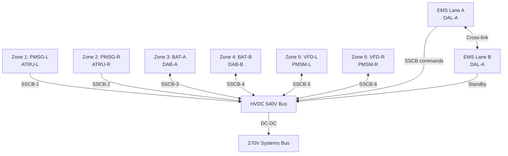
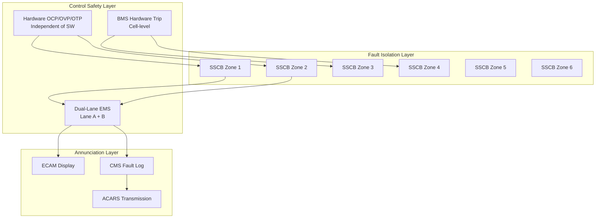

# Safety, Redundancy and Fault Tolerance Architecture

---

## §0 Hyperlink Policy
All hyperlinks in this document are **relative**. Absolute URLs are forbidden.

---

## §1 Purpose
This document defines the safety architecture, Design Assurance Level (DAL) classification, dual-lane control principles, fault isolation strategy, and failure containment boundaries for the AMPEL360E eWTW hybrid-electric propulsion system. It is the primary reference for the System Safety Assessment (SSA), the Failure Mode and Effects Analysis (FMEA), and the Common Cause Analysis (CCA) required under ARP4761 and ARP4754A.

## §2 Applicability
| Aircraft | Variant | MSN Range | Effectivity |
|---|---|---|---|
| AMPEL360E | eWTW | All | From EIS |

## §3 Functional Description 

The AMPEL360E eWTW hybrid-electric architecture is subject to the failure classification framework of CS-25.1309 and ARP4754A, which requires that catastrophic failure conditions (loss of all propulsion + all electric power) have a combined probability of less than 1×10⁻⁹ per flight hour. The architecture achieves this through a multi-layer defence-in-depth approach: physical isolation between generation channels, independent dual-lane control computing, hardware-enforced protection devices independent of software, and a carefully defined fault propagation boundary (firewall) at the HVDC bus cross-tie point.

The DAL classification assigns DAL-A to all functions whose failure could contribute to a catastrophic condition: EMS mode transition logic, EMS dual-lane arbitration, SSCB protection coordination, BMS cell-level contactor trip, and ground safety relay. DAL-B is assigned to functions that are hazardous in isolation: PMSG generation, PMSM thrust, battery discharge/charge, and DAB converter control. The allocation of DAL-A to the dual-lane EMS and the SSCBs ensures that two independent failures of different hardware items are required before propulsion is lost entirely.

Fault containment zones are defined by the HVDC bus architecture: Zone 1 (left PMSG and ATRU), Zone 2 (right PMSG and ATRU), Zone 3 (Battery Pack A and DAB-A), Zone 4 (Battery Pack B and DAB-B), and Zone 5 (aft PMSM Left and VFD-L), Zone 6 (aft PMSM Right and VFD-R). Each zone is bounded by an SSCB and an isolation contactor. A fault within any single zone is automatically isolated within 2 ms by the zone SSCB, preventing propagation to the main HVDC bus. The remaining zones continue to supply the bus, ensuring continued propulsive capability and aircraft power supply.

## §4 Functional Breakdown
| ID | Function | Description | Owner | DAL |
|---|---|---|---|---|
| F-070-070-01 | Fault Zone Isolation | SSCB trips to contain faults within defined bus zones in < 2 ms | Q-INDUSTRY | DAL-A |
| F-070-070-02 | Dual-Lane EMS Arbitration | Detect EMS lane disagreement and switch to surviving lane within 40 ms | Q-HPC | DAL-A |
| F-070-070-03 | Hardware-Enforced Protection | Over-current, over-voltage, over-temperature trips independent of software | Q-INDUSTRY | DAL-A |
| F-070-070-04 | Emergency Power Reserve | Maintain ≥ 15 % SoC hardware floor for emergency power regardless of EMS | Q-GREENTECH | DAL-A |
| F-070-070-05 | Fault Annunciation | Transmit fault isolation evidence to ECAM and CMS within one control cycle | Q-HPC | DAL-B |

## §5 System Context — Architecture

## §6 Internal Architecture

## §7 Components and LRUs
| LRU ID | Name | P/N | Qty | Location |
|---|---|---|---|---|
| LRU-070-070-01 | HVDC SSCB (per zone) | TBD | 6 | HVDC bus panel |
| LRU-070-070-02 | Hardware Protection Unit (OCP/OVP/OTP) | TBD | 6 | Co-located with zone LRUs |
| LRU-070-070-03 | EMS Safety Monitor Module | TBD | 2 | Avionics bay (one per lane) |
| LRU-070-070-04 | Fault Annunciation Gateway | TBD | 1 | Avionics bay |
| LRU-070-070-05 | Emergency Power Reserve Monitor | TBD | 1 | BMS integrated |

## §8 Interfaces
| Interface | Source | Destination | Protocol | Notes |
|---|---|---|---|---|
| IF-070-070-01 | SSCB Protection Logic | HVDC Bus Zone | Hardware discrete | < 2 ms fault clearing |
| IF-070-070-02 | BMS Hardware Trip | Main Battery Contactor | Hardware discrete | Independent of BMS software |
| IF-070-070-03 | EMS Safety Monitor | ECAM | AFDX | Fault state, severity, affected zone |
| IF-070-070-04 | Fault Annunciation Gateway | CMS | AFDX | Fault log timestamping and recording |
| IF-070-070-05 | EMS Lane A | EMS Lane B | High-speed serial cross-link | 10 ms heartbeat and data comparison |

## §9 Operating Modes
| Mode | Trigger | Description | Power State | Notes |
|---|---|---|---|---|
| Normal — Full Redundancy | All zones healthy | All 6 zones active; dual EMS lanes in sync | Full power | No fault active |
| Single-Zone Fault | SSCB trip — zone isolated | 5 of 6 zones active; EMS re-optimises split | Reduced by zone load | MEL dispatch permissive possible |
| Dual-Generation Fault | Both PMSG zones tripped | Battery sustains bus; PMSM off or minimum | Emergency reserve | Crew alert; divert required |
| EMS Lane Fault | One EMS lane failed | Surviving lane takes full authority; ECAM advisory | Normal power | Reduced redundancy |
| Emergency Power Mode | All primary sources failed | Battery 15 % reserve sustains critical 270V loads | Emergency only | 45 min endurance minimum |

## §10 Performance and Budgets 
| Parameter | Requirement | Current Estimate | Unit | Status |
|---|---|---|---|---|
| Zone fault clearing time | ≤ 2 | 1.8 | ms |  |
| EMS lane failover time | ≤ 50 | 40 | ms |  |
| Emergency reserve endurance | ≥ 45 | 50 | min |  |
| Probability of total propulsion loss | < 1×10⁻⁹ | — | /FH |  |
| Probability of single-zone loss | < 1×10⁻⁵ | — | /FH |  |

## §11 Safety, Redundancy and Fault Tolerance
- Physical separation of Zone 1–6 wiring and components follows CS-25.1353(b) segregation requirements; no shared routing in a single zone.
- Common Cause Analysis (CCA) confirms no single lightning strike, bird strike, or structural failure simultaneously disables two or more zones.
- The 15 % SoC emergency reserve is enforced by a dedicated hardware comparator in the BMS; no software path can override it.
- All DAL-A protection hardware is subject to production acceptance testing and periodic in-service proof tests to confirm trip thresholds remain within tolerance.
- Zonal SSCB design is validated by let-through-energy tests; arc-flash energy is contained within the zone with no external damage.

## §12 Maintenance and Diagnostics
| Task | Interval | Tool | Reference |
|---|---|---|---|
| SSCB trip threshold calibration test | 1 200 FH | SSCB calibration kit SCK-540 | AMM 070-070-031 |
| EMS safety monitor cross-check | 300 FH | EMS diagnostic tool EDT-060 | AMM 070-070-032 |
| Hardware OCP/OVP trip test | 600 FH | Fault injection rig FIR-070 | AMM 070-070-033 |
| Emergency reserve monitor functional test | A-Check | BMS diagnostic port + CMS | MPD 070-070-A1 |

## §13 Footprint
| Metric | Physical | Electrical | Maintenance | Data |
|---|---|---|---|---|
| SSCB set mass (6 units total) |  kg | 540 V / 15 kA rated | HVDC bus panel; HVDC PPE | Discrete trip signal |
| EMS Safety Monitor mass (2 units) |  kg | 28 V DC, 10 W each | Standard avionics bay | AFDX / cross-link |
| HW Protection Unit (6 units) |  kg | Zone power level | Co-located with zone LRU | Discrete hardware |

## §14 Safety and Certification References
| Standard | Requirement | Applicability | Status | Notes |
|---|---|---|---|---|
| DO-178C | EMS safety function software DAL-A | EMS Safety Monitor Module | Planned | Full DO-178C with MC1–MC6 |
| DO-254 | SSCB protection hardware DAL-A | SSCB fault logic FPGA | Planned | Hardware assurance plan required |
| ARP4754A | System safety assessment with FHA and SSA | Entire hybrid architecture | Planned | ARP4761 methods: FMEA, FTA, CCA |
| CS-25 | §25.1309 safety objective allocation | Hybrid architecture functions | Planned | Special conditions for HVDC required |
| FAR Part 25 | §25.1309 / §25.1353 equivalent | Hybrid architecture functions | Planned | Joint FAA/EASA basis |

## §15 V&V Approach
| Phase | Method | Tool/Facility | Status |
|---|---|---|---|
| FMEA and FTA | Formal failure mode analysis and fault tree | ISOGRAPH / ReliaSoft tools |  |
| SSCB fault injection test | Live fault injection at each HVDC zone | HVDC test facility HTF-1 |  |
| EMS safety monitor HIL test | Dual-lane disagreement injection | HPS-070 HIL Rig |  |
| Iron bird emergency mode test | Loss of both PMSGs; battery reserve endurance | Iron Bird Facility |  |

## §16 Glossary
| Term | Definition |
|---|---|
| DAL | Design Assurance Level — severity classification per ARP4754A (A = most critical) |
| SSA | System Safety Assessment — comprehensive analysis of system-level failure conditions |
| FMEA | Failure Mode and Effects Analysis — systematic identification of failure modes and effects |
| FTA | Fault Tree Analysis — top-down deductive analysis of failure causation paths |
| CCA | Common Cause Analysis — assessment of shared failure causes across independent systems |
| SSCB | Solid-State Circuit Breaker — fast electronic fault isolation for HVDC zones |
| Zone | Fault containment boundary defined by SSCBs and isolation contactors |
| Containment | Principle that a fault stays within its zone and does not propagate |
| Let-Through Energy | Joule-seconds of fault energy passing the SSCB before clearing |
| OCP/OVP/OTP | Over-Current / Over-Voltage / Over-Temperature — hardware trip thresholds |

## §17 Open Issues
| ID | Description | Owner | Priority | Status |
|---|---|---|---|---|
| OI-070-070-001 | Complete preliminary FTA to verify 1×10⁻⁹ catastrophic probability budget allocation per zone | @copilot | High | Open |
| OI-070-070-002 | Confirm CS-25 special conditions text for HVDC 540V zone isolation with EASA/FAA | @copilot | High | Open |

## §18 Status Legend
| Badge | Meaning |
|---|---|
|  | Content under active development |
|  | Value or content to be determined |
|  | Approved and baselined |
|  | Placeholder, not yet populated |

## §19 Related Documents
| Code | Title | Link |
|---|---|---|
| 070-000 | Hybrid-Electric Architecture Overview — General | [070-000-Hybrid-Electric-Architecture-Overview-General.md](070-000-Hybrid-Electric-Architecture-Overview-General.md) |
| 070-010 | Architecture Modes and Power Flow | [070-010-Architecture-Modes-and-Power-Flow.md](070-010-Architecture-Modes-and-Power-Flow.md) |
| 070-020 | Turbofan-Electric Integration | [070-020-Turbofan-Electric-Integration.md](070-020-Turbofan-Electric-Integration.md) |
| 070-030 | Electric Propulsion Integration | [070-030-Electric-Propulsion-Integration.md](070-030-Electric-Propulsion-Integration.md) |
| 070-040 | Energy Storage Integration | [070-040-Energy-Storage-Integration.md](070-040-Energy-Storage-Integration.md) |
| 070-050 | Power Electronics and Conversion | [070-050-Power-Electronics-and-Conversion.md](070-050-Power-Electronics-and-Conversion.md) |
| 070-060 | Hybrid Control Architecture | [070-060-Hybrid-Control-Architecture.md](070-060-Hybrid-Control-Architecture.md) |
| 070-080 | Hybrid System Monitoring, Diagnostics and Control Interfaces | [070-080-Hybrid-System-Monitoring-Diagnostics-and-Control-Interfaces.md](070-080-Hybrid-System-Monitoring-Diagnostics-and-Control-Interfaces.md) |
| 070-090 | S1000D CSDB Mapping and Traceability | [070-090-S1000D-CSDB-Mapping-and-Traceability.md](070-090-S1000D-CSDB-Mapping-and-Traceability.md) |

## §20 Change Log
| Rev | Date | Author | Summary |
|---|---|---|---|
| 0.1 | 2026-05-11 | @copilot | Initial creation |
