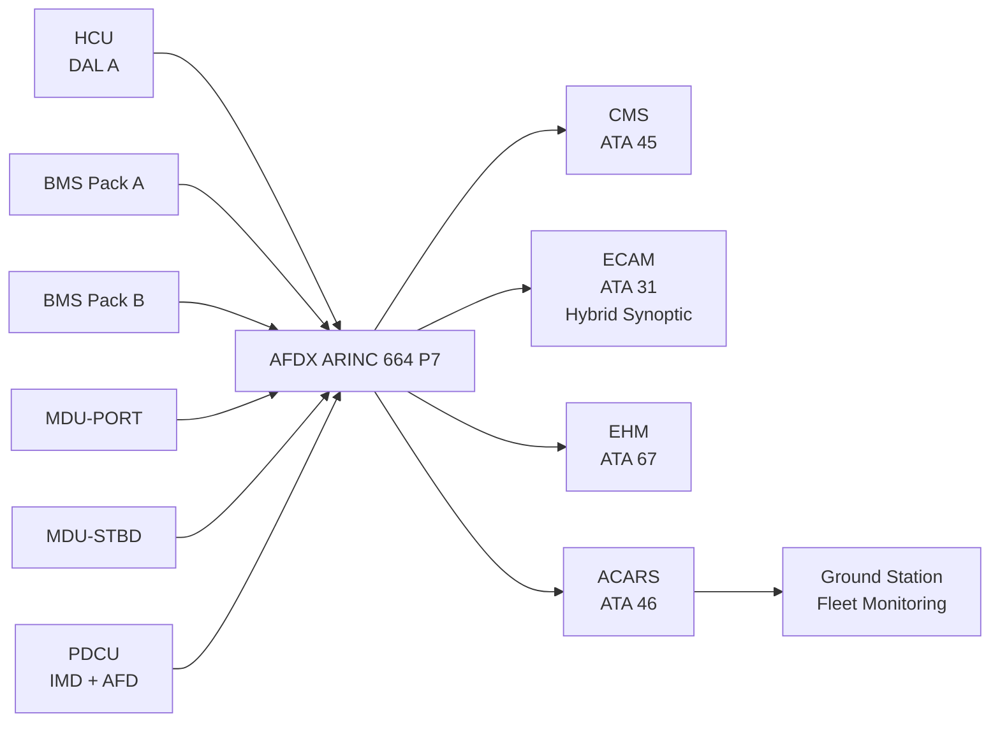
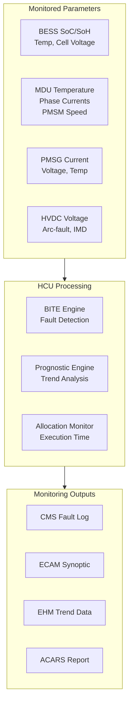

<!-- ──────────────────────────────────────────────────────────────────────────
     QATL-ATLAS-1000-ATLAS-070-079-070-080-HYBRID-ELECTRIC-MONITORING-DIAGNOSTICS-AND-CONTROL-INTERFACES
     ATA 70 · Hybrid-Electric Monitoring, Diagnostics and Control Interfaces
     AMPEL360E eWTW — ATLAS Register 1000
────────────────────────────────────────────────────────────────────────────── -->

# Hybrid-Electric Monitoring, Diagnostics and Control Interfaces

---

## §0 Hyperlink Policy

> All hyperlinks in this document are **relative** (five directory levels: `../../../../../`).
> Absolute URLs are forbidden. Every linked document must exist in the Q+ATLANTIDE repository
> before the link is activated. Broken links are treated as open issues and must be resolved
> before the document is promoted from `DRAFT` to `APPROVED`.

---

## §1 Purpose

This document defines the monitoring, diagnostics, and control interface architecture for the AMPEL360E eWTW hybrid-electric propulsion system. It covers HCU health reporting, BESS state monitoring, EP inverter diagnostics, ECAM hybrid synoptic display, prognostic functions, and the data flow to the Central Maintenance System (CMS) and Engine Health Monitoring (EHM).

---

## §2 Applicability

| Parameter | Value |
|---|---|
| Aircraft Program | AMPEL360E eWTW |
| ATA reference | ATA 70-080 — Hybrid-Electric Monitoring, Diagnostics and Control Interfaces |
| Certification basis | EASA CS-25 Amdt 27 + SC-Hybrid-Electric |
| S1000D SNS | 070-080-00 |

---

## §3 Functional Description ![DRAFT]

**HCU Health Monitoring**
The HCU dual-channel continuously monitors its own health (channel A/B status, crossover events, allocation law execution time, AFDX link status) and the health of all connected subsystems. Monitored parameters include: BESS SoC (both packs, each cell group), BESS voltage, current, and temperature per module; PMSG output current, voltage, speed, and winding temperature; EP PMSM motor and MDU temperature, inverter switching frequency health, MDU current ripple; HVDC bus voltage and current (PDCU); arc-fault detector and IMD status. All parameters are sampled at ≥ 10 Hz.

**BESS BMS Interface**
BMS Pack A and B each report state data to the HCU and to the CMS independently. BMS reports: SoC (%), SoH (%), voltage (cell-group and pack-level), current, temperature (min/max/average), contactor status, fault codes, and cell balance delta. BMS BITE identifies cell over-temperature, under-voltage, over-current, and cell-balance anomaly faults; each fault results in a discrete message to ECAM and a detailed record in CMS.

**EP Inverter (MDU) Diagnostics**
Each MDU reports: DC bus voltage and current, AC output phase currents and voltages, inverter temperature, switching frequency, fault status, and EP PMSM shaft speed (from resolver). MDU BITE detects IGBT/SiC device failures, overcurrent, under-voltage, and fan feedback loss. MDU BITE coverage target: ≥ 95 % of critical fault modes.

**ECAM Hybrid Synoptic**
The ECAM (ATA 31) hybrid propulsion synoptic page displays: operating mode (AET/BTO/CRUISE/REGEN/EE/MAINT) with colour (green/amber/red); EP-PORT and EP-STBD thrust % (each); BESS SoC bar graph (both packs); HVDC bus status (voltage, green/amber); PMSG output power (kW, each engine); HCU channel status (A/B active). Synoptic refresh rate: ≥ 2 Hz. Page automatically called on any HCU BITE fault.

**Prognostic Functions**
HCU computes three prognostic estimates: (1) BESS remaining capacity trend (linear regression over last 100 cycles → SoH projection to 80 % threshold); (2) EP PMSM bearing vibration FFT (from MDU resolver signal sampling) → bearing wear trend; (3) PMSG winding insulation resistance trend (from IMD data). Prognostic outputs stored in HCU non-volatile memory and reported to EHM (ATA 67) via AFDX for fleet-wide trend monitoring.

---

## §4 Functional Breakdown

| ID | Name | Description | Lead Division |
|---|---|---|---|
| F-001 | HCU health monitoring | Self-monitoring and subsystem monitoring; 10 Hz sampling; BITE generation | Q-HPC |
| F-002 | BESS BMS interface | SoC/SoH/temperature reporting to HCU and CMS; BITE fault codes | Q-GREENTECH |
| F-003 | EP MDU diagnostics | Inverter health, overcurrent, PMSM shaft speed; BITE ≥ 95 % coverage | Q-GREENTECH |
| F-004 | ECAM hybrid synoptic | 2 Hz display of mode, SoC, EP%, HVDC status, HCU channel | Q-HPC |
| F-005 | CMS/EHM AFDX reporting | Fault log, health trends, prognostic data reporting | Q-INDUSTRY |

---

## §5 System Context — Mermaid Diagram

---

## §6 Internal Architecture — Mermaid Diagram

---

## §7 Components and LRUs

| Component | Part Number | Qty | Location | Maintenance Interval | Notes |
|---|---|---|---|---|---|
| HCU BITE and monitoring SW | SW-HCU-BITE-vTBD | 1 (SW) | HCU hardware, EE bay | Update per SB cycle | DAL A; DO-178C; 10 Hz sampling |
| BMS Monitoring Interface | BMS-MON-PN-TBD | 2 (one per pack) | BESS bays F-25/F-27 | Calibration check 2 000 FH | Cell-level telemetry |
| MDU Diagnostics Module | MDU-DIAG-PN-TBD | 2 (one per MDU) | EP nacelle wingtip | Check C-check | Resolver-based shaft speed; BITE |
| ECAM Hybrid Synoptic SW | ECAM-SW-070-TBD | 1 (SW) | ECAM system (ATA 31) | SW update | 2 Hz refresh; colour-coded |
| EHM Interface Module | EHM-IF-PN-TBD | 1 | HCU (internal) | SW update | Prognostic data packaging for EHM |

---

## §8 Interfaces

| Interface Type | Connected System | Protocol / Medium | Data / Function |
|---|---|---|---|
| ATA 31 ECAM | Cockpit display system | AFDX ARINC 664 P7 | Hybrid synoptic page; fault annunciation |
| ATA 45 CMS | Central Maintenance System | AFDX | Fault log, BITE codes, health parameters |
| ATA 67 EHM | Engine Health Monitoring (extended) | AFDX | PMSG / EP bearing prognostic trends |
| ATA 46 Information Systems (ACARS) | Airline operations | ACARS VHF / SATCOM | In-flight fault reports; prognostic data |
| ATA 79 EMS | Energy Management System | AFDX | EMS reads monitoring data for energy budget decisions |
| ATA 24 PDCU | HVDC bus monitoring | AFDX | HVDC voltage, arc-fault, IMD parameters |

---

## §9 Operating Modes

| Monitoring Mode | Trigger | State | Outputs |
|---|---|---|---|
| Normal monitoring | All systems healthy | 10 Hz parameter sampling | ECAM green; no BITE faults; CMS log |
| BITE fault detected | Threshold exceeded | BITE fault code generated | ECAM amber/red; CMS fault entry; ACARS report |
| Prognostic warning | Trend threshold crossed | Advisory generated | ECAM advisory; EHM trend update; maintenance recommendation |
| Channel crossover event | HCU CH-A fault | CH-B assumes control | CMS crossover log entry; ECAM "HCU CH-B ACTIVE" advisory |
| Zone isolation event | Fire/fault in zone | Isolation actuation logged | ECAM zone-isolated advisory; CMS isolation record |

---

## §10 Performance and Budgets ![DRAFT]

| Parameter | Requirement | Target / Design Value | Status |
|---|---|---|---|
| HCU BITE fault detection coverage (critical) | ≥ 90 % | ≥ 95 % | ![TBD] |
| ECAM synoptic refresh rate | ≥ 1 Hz | 2 Hz | ![TBD] |
| HCU → CMS AFDX latency | ≤ 500 ms | 100 ms | ![TBD] |
| EHM prognostic prediction horizon (bearing wear) | ≥ 100 FH warning before failure | ≥ 200 FH | ![TBD] |
| BMS SoC reporting accuracy | ≤ ±3 % | ≤ ±2 % | ![TBD] |

---

## §11 Safety, Redundancy and Fault Tolerance

- HCU dual-channel ensures monitoring continuity on active-channel failure: standby channel continues sampling and reporting.
- BMS Pack A and Pack B report independently to CMS; failure of one BMS does not silence the other.
- ECAM display is driven by AFDX; HCU BITE faults are classified per ECAM message priority (Advisory / Caution / Warning).
- CMS stores non-volatile fault log (minimum 3 000 fault entries); surviving any HVDC isolation or power interruption.
- ACARS reporting of BITE faults enables ground-based predictive maintenance before next flight.

---

## §12 Maintenance and Diagnostics

| Task | Interval | Access | Special Tools |
|---|---|---|---|
| HCU BITE log download and review | A-check | CMS terminal | ACARS download or GSE |
| ECAM hybrid synoptic functional test | C-check | ECAM test menu | Standard ECAM test |
| MDU BITE test (overcurrent injection) | C-check | MDU GSE terminal | MDU GSE |
| BMS SoC/SoH report review | 2 000 FH | BMS GSE terminal | BMS GSE |
| EHM prognostic trend review | A-check | ACARS / QAR analysis | Flight data analysis tool |

---

## §13 Footprint — Physical, Electrical, Maintenance, Data ![TBD]

| Footprint Type | Parameter | Value | Notes |
|---|---|---|---|
| Data | HCU monitoring parameters (total) | ~200 parameters | Per parameter list (HCU IDD) |
| Data | AFDX bandwidth (monitoring to CMS) | ![TBD] | Per AFDX bus load analysis |
| Data | CMS fault log capacity | ≥ 3 000 entries | Non-volatile storage |
| Data | ECAM synoptic data rate | ~50 parameters at 2 Hz | Per ECAM page definition |

---

## §14 Safety and Certification References ![DRAFT]

| Standard / Document | Title | Issuing Body | Applicability |
|---|---|---|---|
| EASA SC-Hybrid-Electric | Monitoring requirements for hybrid propulsion | EASA | ECAM synoptic and BITE requirements |
| DO-178C | Software — HCU BITE and monitoring | RTCA | DAL A monitoring software |
| ARINC 664 P7 | AFDX Network | ARINC | Data communication for monitoring interfaces |
| ATA MSG-3 | Maintenance Steering Group Logic | ATA | BITE-driven maintenance task intervals |

---

## §15 V&V Approach ![TBD]

| Phase | Method | Acceptance Criterion | Status |
|---|---|---|---|
| Design | BITE coverage analysis (FMEA correlation) | ≥ 95 % critical fault detection | ![TBD] |
| Integration | CMS fault injection test (all BITE codes) | All faults correctly logged and displayed on ECAM | ![TBD] |
| Qualification | ACARS end-to-end test (in-flight simulation) | BITE report received at ground station within 2 min | ![TBD] |
| Certification | EASA SC review of monitoring architecture | ECAM synoptic satisfies crew awareness requirements | ![TBD] |

---

## §16 Glossary

| Term | Definition |
|---|---|
| **HCU** | Hybrid Controller Unit — DAL A controller providing monitoring, diagnostics, and propulsion control. |
| **BMS** | Battery Management System — DAL B controller managing BESS state, protection, and reporting. |
| **BITE** | Built-In Test Equipment — self-diagnostic function within an LRU detecting faults automatically. |
| **AFDX** | Avionics Full-DupleX Switched Ethernet — ARINC 664 P7 data network for avionics communication. |
| **EHM** | Engine Health Monitoring — extended to cover PMSG, EP bearing, and MDU trends. |
| **Prognostics** | Prediction of remaining useful life based on parameter trend analysis. |
| **ECAM synoptic** | Electronic Centralised Aircraft Monitor page displaying system schematic with live parameter overlays. |
| **MDU resolver** | Resolver sensor on EP PMSM shaft; provides absolute angle and speed to MDU diagnostics. |

---

## §17 Open Issues

| ID | Description | Owner | Target |
|---|---|---|---|
| OI-070-080-001 | Define complete parameter list for HCU monitoring (~200 parameters); agree with BMS and MDU OEMs | Q-HPC / Q-GREENTECH | 2026-Q3 |
| OI-070-080-002 | Confirm ACARS bandwidth for in-flight BITE reporting (SATCOM vs VHF capacity for ~50 kB/fault report) | Q-INDUSTRY / Q-AIR | 2026-Q4 |

---

## §18 Status Legend

| Badge | Meaning |
|---|---|
| `![DRAFT]` | Section is drafted but not yet reviewed |
| `![TBD]` | Content not yet started — to be defined |
| `![To Be Completed]` | Partially complete — needs additional content |
| `![APPROVED]` | Reviewed and formally approved |

---

## §19 Related Documents (Siblings in this Subsection)

- [070-000](./070-000-Hybrid-Electric-Architecture-Overview-General.md)
- [070-010](./070-010-Propulsion-System-Topology.md)
- [070-020](./070-020-Electric-and-Thermal-Propulsion-Allocation.md)
- [070-030](./070-030-Hybrid-Electric-Operating-Modes.md)
- [070-040](./070-040-Propulsion-Redundancy-and-Degraded-Modes.md)
- [070-050](./070-050-Propulsion-Energy-Flow-Architecture.md)
- [070-060](./070-060-Propulsion-Safety-and-Isolation-Zones.md)
- [070-070](./070-070-Propulsion-Integration-and-Airframe-Interfaces.md)
- [070-090](./070-090-S1000D-CSDB-Mapping-and-Traceability.md)

---

## §20 Change Log

| Rev | Date | Author | Description |
|---|---|---|---|
| 0.1 | 2026-05-11 | @copilot | Initial DRAFT — contextualized content per AMPEL360E eWTW architecture |
