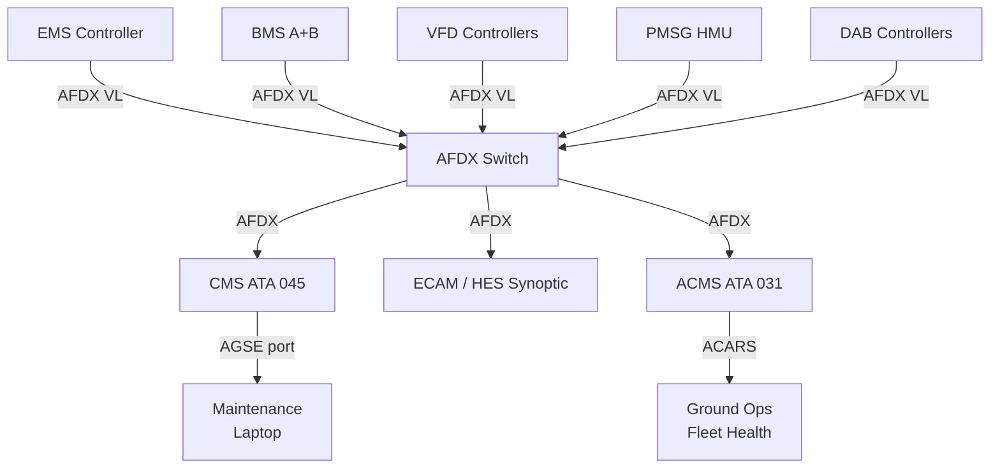
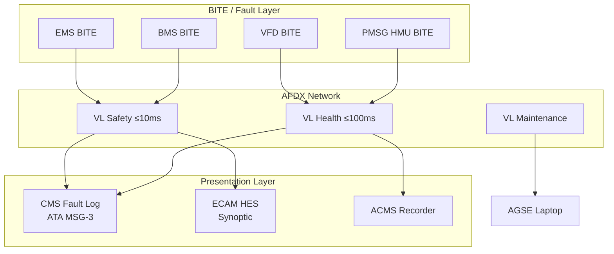

# Hybrid System Monitoring, Diagnostics and Control Interfaces

---

## §0 Hyperlink Policy
All hyperlinks in this document are **relative**. Absolute URLs are forbidden.

---

## §1 Purpose
This document defines the telemetry architecture, monitoring philosophy, and control interfaces for the AMPEL360E eWTW hybrid-electric propulsion system. It covers the AFDX network topology, CMS/ECAM integration, in-flight data recording parameters, ground-station health reporting via ACARS/ACMS, and the maintenance laptop interface for EMS diagnostics. This document is the primary reference for the Centralised Maintenance System (CMS) integration specification and the AFDX network design for ATA 070.

## §2 Applicability
| Aircraft | Variant | MSN Range | Effectivity |
|---|---|---|---|
| AMPEL360E | eWTW | All | From EIS |

## §3 Functional Description 

The monitoring architecture of the AMPEL360E eWTW hybrid-electric system is built on the AFDX (ARINC 664 Part 7) avionics full-duplex Ethernet backbone that already interconnects all major avionics systems on the aircraft. All hybrid-electric subsystem controllers — the EMS, BMS, PMSG health monitor, VFD controllers, and DAB converters — are AFDX end-system nodes connected at 100 Mbps. The AFDX network provides deterministic, time-triggered Virtual Link (VL) scheduling, ensuring that safety-critical monitoring data (fault states, SoC, bus voltage) reaches the EMS and ECAM within their required latency budgets (≤ 10 ms for safety data, ≤ 100 ms for health trending data).

The CMS (Centralised Maintenance System, ATA 045) serves as the aggregation point for all hybrid system fault and health data. The EMS, BMS, and VFD controllers each host a Built-In Test Equipment (BITE) function that continuously monitors internal health, detects out-of-limit conditions, and pushes structured fault messages (fault code, LRU ID, fault time, severity, isolation data) to the CMS via AFDX. The CMS classifies faults per ATA MSG-3 logic, determines dispatch status (GO, GO IF, NO-GO), and presents advisories on the ECAM lower ECRAN system status page and the dedicated Hybrid Electrical System (HES) synoptic page.

In-flight data recording is provided via the ACMS (Aircraft Condition Monitoring System, ATA 031), which receives raw parameter streams from all AFDX nodes at configurable sampling rates. For the hybrid system, priority parameters include HVDC bus voltage and current (1 Hz minimum, 100 Hz burst on transient), battery cell-level temperatures (1 Hz), EMS power setpoints and actuals (10 Hz), PMSM torque commands (10 Hz), and fault event snapshots (1 000 Hz for 5 seconds around each fault event). ACMS reports are transmitted to ground operations via ACARS for real-time fleet health monitoring. A maintenance laptop interface on the dedicated AGSE data port enables ground engineers to access raw EMS logs, BMS electrochemical data, and VFD waveform captures.

## §4 Functional Breakdown
| ID | Function | Description | Owner | DAL |
|---|---|---|---|---|
| F-070-080-01 | AFDX Real-Time Health Transport | Deliver fault and health data from all subsystems to EMS/CMS within latency budget | Q-HPC | DAL-B |
| F-070-080-02 | BITE and Fault Classification | Each LRU executes self-test, classifies fault, and pushes to CMS | Q-GREENTECH | DAL-B |
| F-070-080-03 | ECAM/CMS Display Integration | Present hybrid system status, faults, and advisories on ECAM and CMS | Q-AIR | DAL-B |
| F-070-080-04 | ACMS Parameter Recording | Record hybrid system parameters for post-flight and real-time fleet monitoring | Q-HPC | DAL-C |
| F-070-080-05 | Ground Maintenance Interface | Provide AGSE data port for EMS/BMS/VFD diagnostics and software loading | Q-INDUSTRY | DAL-C |

## §5 System Context — Architecture

## §6 Internal Architecture

## §7 Components and LRUs
| LRU ID | Name | P/N | Qty | Location |
|---|---|---|---|---|
| LRU-070-080-01 | AFDX Switch (Hybrid Network) | TBD | 2 (redundant) | Avionics Bay |
| LRU-070-080-02 | CMS Integration Module (HES extension) | TBD | 1 | Avionics Bay |
| LRU-070-080-03 | ECAM HES Synoptic Display Unit | TBD | 1 | Cockpit lower ECRAN |
| LRU-070-080-04 | ACMS Parameter Recording Unit | TBD | 1 | Avionics Bay |
| LRU-070-080-05 | AGSE Data Port Assembly | TBD | 1 | Aft maintenance panel |

## §8 Interfaces
| Interface | Source | Destination | Protocol | Notes |
|---|---|---|---|---|
| IF-070-080-01 | EMS / BMS / VFD / HMU | AFDX Switch | ARINC 664 Part 7 (AFDX) | Virtual link scheduling per VL budget |
| IF-070-080-02 | AFDX Switch | CMS (ATA 045) | AFDX | Fault messages, BITE results, LRU health |
| IF-070-080-03 | CMS | ECAM | AFDX | Advisory text, synoptic data, warning levels |
| IF-070-080-04 | ACMS | ACARS (ATA 031) | ARINC 717 / ACARS | Fleet health telemetry, exceedance reports |
| IF-070-080-05 | AGSE Port | Maintenance Laptop | Ethernet 100BASE-TX | Diagnostics, log download, SW load |

## §9 Operating Modes
| Mode | Trigger | Description | Power State | Notes |
|---|---|---|---|---|
| Normal Monitoring | System powered up | All BITE functions active; VL data flowing to CMS/ECAM | Active | Continuous in flight |
| Fault Capture | BITE detects fault | High-rate snapshot (1 000 Hz) for 5 s triggered | Burst recording | Stored in ACMS NVRAM |
| Ground Maintenance | Weight-on-wheels | Full diagnostic access via AGSE port; ECAM inhibited | Ground only | PIN-protected access |
| Software Load | Maintenance mode confirmed | EMS/BMS SW uploaded via AGSE port | Ground only | DO-178C qualified CDSL required |
| Post-flight Report | Engines shutdown | ACMS generates flight summary; ACARS transmits to ground | Transmission | Auto-triggered on shutdown |

## §10 Performance and Budgets 
| Parameter | Requirement | Current Estimate | Unit | Status |
|---|---|---|---|---|
| Safety VL latency | ≤ 10 | 8 | ms |  |
| Health VL latency | ≤ 100 | 80 | ms |  |
| ACMS storage capacity (hybrid params) | ≥ 500 | 600 | FH per flight |  |
| Fault snapshot duration | ≥ 5 | 5 | s @ 1 000 Hz |  |
| AGSE port data rate | ≥ 100 | 100 | Mbps |  |

## §11 Safety, Redundancy and Fault Tolerance
- The AFDX switch is dual-redundant; loss of one switch causes automatic failover to the redundant switch without data loss, transparent to all end systems.
- Safety VL messages are transmitted on both AFDX networks simultaneously (ARINC 664 Part 7 two-network redundancy) and the receiver uses the first valid frame.
- BITE fault messages carry a sequence number; the CMS detects gaps in sequence and flags possible missed faults for investigation.
- The ECAM HES synoptic receives data from both AFDX networks and displays the most recent valid data, with a data-age indicator if freshness exceeds 200 ms.
- The AGSE maintenance port is physically isolated from the AFDX flight network by a unidirectional data diode during flight, preventing ground-side interference.

## §12 Maintenance and Diagnostics
| Task | Interval | Tool | Reference |
|---|---|---|---|
| AFDX VL latency measurement | 600 FH | AFDX analyser AFX-100 | AMM 070-080-031 |
| CMS fault log integrity check | A-Check | CMS terminal | MPD 070-080-A1 |
| ACMS recording verification | 300 FH | ACMS replay tool | AMM 070-080-032 |
| AGSE port functional test | 600 FH | AGSE test laptop | AMM 070-080-033 |

## §13 Footprint
| Metric | Physical | Electrical | Maintenance | Data |
|---|---|---|---|---|
| AFDX Switch mass (each) |  kg | 28 V DC, 20 W | Standard avionics bay | ARINC 664 100BASE-TX |
| CMS Integration Module mass |  kg | 28 V DC, 8 W | Standard avionics bay | AFDX |
| ACMS Recording Unit mass |  kg | 28 V DC, 15 W | Standard avionics bay | ARINC 717 / AFDX |

## §14 Safety and Certification References
| Standard | Requirement | Applicability | Status | Notes |
|---|---|---|---|---|
| DO-178C | BITE software DAL-B for fault classification | All BITE modules | Planned | Level B for dispatch-affecting fault logic |
| DO-254 | AFDX switch hardware (complex) | AFDX Switch | Planned | Hardware assurance per DO-254 |
| ARP4754A | Monitoring system development assurance | CMS integration | Planned | Part of system safety assessment |
| CS-25 | §25.1321 arrangement and visibility of instruments | ECAM HES synoptic | Planned | Flight crew alert design standard |
| FAR Part 25 | §25.1321 equivalent | ECAM HES synoptic | Planned | Joint certification |

## §15 V&V Approach
| Phase | Method | Tool/Facility | Status |
|---|---|---|---|
| AFDX VL scheduling verification | Network simulation and schedule analysis | AFDX design tool ADT-664 |  |
| BITE fault injection test | Inject faults into each LRU and verify CMS response | HIL + fault injection rig |  |
| ECAM display compliance review | Crew interface evaluation per ARP5056A | ECAM simulator |  |
| ACMS recording accuracy flight test | Compare ACMS data to calibrated reference instruments | AMPEL360E FTB-001 |  |

## §16 Glossary
| Term | Definition |
|---|---|
| AFDX | Avionics Full-Duplex Switched Ethernet — deterministic avionics network per ARINC 664 Part 7 |
| VL | Virtual Link — scheduled one-way logical channel in AFDX with guaranteed bandwidth |
| BITE | Built-In Test Equipment — internal self-test function within each avionics LRU |
| CMS | Centralised Maintenance System — aggregates and classifies fault data for maintenance use |
| ECAM | Electronic Centralised Aircraft Monitor — cockpit display for system status and warnings |
| ACMS | Aircraft Condition Monitoring System — records and transmits aircraft health data |
| ACARS | Aircraft Communications Addressing and Reporting System — VHF/SATCOM data link |
| AGSE | Avionics Ground Support Equipment — ground tools for maintenance and software loading |
| HES | Hybrid Electrical System — ECAM synoptic page specific to the electric powertrain |
| Data Diode | Hardware device enforcing one-way data flow to isolate maintenance port from flight network |

## §17 Open Issues
| ID | Description | Owner | Priority | Status |
|---|---|---|---|---|
| OI-070-080-001 | Define ECAM HES synoptic page layout with flight crew HMI specialists | @copilot | High | Open |
| OI-070-080-002 | Confirm AFDX VL bandwidth allocation for 1 000 Hz burst fault snapshot with network team | @copilot | Medium | Open |

## §18 Status Legend
| Badge | Meaning |
|---|---|
|  | Content under active development |
|  | Value or content to be determined |
|  | Approved and baselined |
|  | Placeholder, not yet populated |

## §19 Related Documents
| Code | Title | Link |
|---|---|---|
| 070-000 | Hybrid-Electric Architecture Overview — General | [070-000-Hybrid-Electric-Architecture-Overview-General.md](070-000-Hybrid-Electric-Architecture-Overview-General.md) |
| 070-010 | Architecture Modes and Power Flow | [070-010-Architecture-Modes-and-Power-Flow.md](070-010-Architecture-Modes-and-Power-Flow.md) |
| 070-020 | Turbofan-Electric Integration | [070-020-Turbofan-Electric-Integration.md](070-020-Turbofan-Electric-Integration.md) |
| 070-030 | Electric Propulsion Integration | [070-030-Electric-Propulsion-Integration.md](070-030-Electric-Propulsion-Integration.md) |
| 070-040 | Energy Storage Integration | [070-040-Energy-Storage-Integration.md](070-040-Energy-Storage-Integration.md) |
| 070-050 | Power Electronics and Conversion | [070-050-Power-Electronics-and-Conversion.md](070-050-Power-Electronics-and-Conversion.md) |
| 070-060 | Hybrid Control Architecture | [070-060-Hybrid-Control-Architecture.md](070-060-Hybrid-Control-Architecture.md) |
| 070-070 | Safety, Redundancy and Fault Tolerance Architecture | [070-070-Safety-Redundancy-and-Fault-Tolerance-Architecture.md](070-070-Safety-Redundancy-and-Fault-Tolerance-Architecture.md) |
| 070-090 | S1000D CSDB Mapping and Traceability | [070-090-S1000D-CSDB-Mapping-and-Traceability.md](070-090-S1000D-CSDB-Mapping-and-Traceability.md) |

## §20 Change Log
| Rev | Date | Author | Summary |
|---|---|---|---|
| 0.1 | 2026-05-11 | @copilot | Initial creation |
