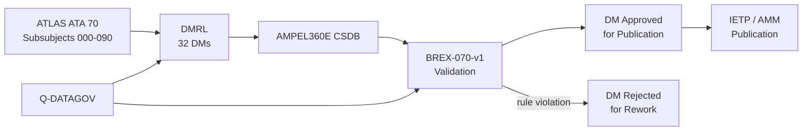
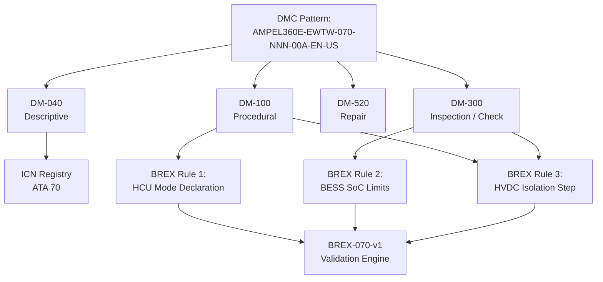

<!-- ──────────────────────────────────────────────────────────────────────────
     QATL-ATLAS-1000-ATLAS-070-079-070-090-S1000D-CSDB-MAPPING-AND-TRACEABILITY
     ATA 70 · S1000D / CSDB Mapping and Traceability
     AMPEL360E eWTW — ATLAS Register 1000
────────────────────────────────────────────────────────────────────────────── -->

# S1000D / CSDB Mapping and Traceability

---

## §0 Hyperlink Policy

> All hyperlinks in this document are **relative** (five directory levels: `../../../../../`).
> Absolute URLs are forbidden.

---

## §1 Purpose

This document maps the ATLAS ATA 70 subsubject structure to S1000D Data Module Codes (DMCs) and defines the Data Module Requirement List (DMRL) and Business Rules eXchange (BREX) constraints for the AMPEL360E eWTW Hybrid-Electric Architecture Overview Common Source DataBase (CSDB).

ATA 70 DMRL for AMPEL360E eWTW: **32 data modules**. DMC pattern: `AMPEL360E-EWTW-070-{NNN}-00A-EN-US`. BREX document: `AMPEL360E-BREX-070-v1`, enforcing three domain-specific constraints described in §3.

This document is owned by Q-DATAGOV and reviewed at each CSDB milestone (DMRL baseline, DMRL first issue, DMRL final).

---

## §2 Applicability

| Parameter | Value |
|---|---|
| Aircraft Program | AMPEL360E eWTW |
| ATA reference | ATA 70-090 — S1000D / CSDB Mapping and Traceability |
| Certification basis | S1000D Issue 5.0 |
| S1000D SNS | 070-090-00 |

---

## §3 Functional Description ![DRAFT]

**BREX AMPEL360E-BREX-070-v1 enforces three constraints:**

1. **HCU mode declaration rule:** All data modules referencing HCU commands, operating mode changes, or mode-specific procedures must explicitly state the applicable operating mode (AET, BTO, CRUISE, RGD, EE, or MAINT) at the beginning of the relevant procedural step. This prevents ambiguity in maintenance documentation when the same hardware behaves differently in different modes.

2. **BESS SoC limit citation rule:** All maintenance data modules for BESS work (inspection, replacement, testing) must cite the safe SoC limits (minimum 15 %, maximum 90 % for maintenance access; minimum 45 % for BTO dispatch) from the BESS OEM Component Maintenance Manual (CMM). This prevents maintenance personnel from proceeding with BESS access at unsafe charge levels.

3. **HVDC isolation rule:** All procedural data modules that require access to any HVDC zone (Zones A, B, C, or D) must include, as the first procedural step, the 5-minute residual charge dissipation waiting period and a voltage verification step (HVDC terminal voltage ≤ 50 V confirmed with calibrated meter) before any contact with HVDC components. This rule is mandatory and cannot be waived.

---

## §4 Functional Breakdown

| ID | Name | Description | Lead Division |
|---|---|---|---|
| F-001 | DMRL management (32 DMs) | 32 DM codes tracked; status managed by Q-DATAGOV | Q-DATAGOV |
| F-002 | BREX-070-v1 validation | Three constraints checked at CSDB ingestion for each DM | Q-DATAGOV |
| F-003 | ICN registry ATA 70 | Illustration Control Numbers for HCU, BESS, EP, HVDC diagrams | Q-DATAGOV |
| F-004 | DM-040 descriptive modules | System description DMs for HCU, BESS, EP array, PDCU, PMSG | Q-MECHANICS |
| F-005 | DM-300 inspection/check modules | Scheduled maintenance task DMs per MPD (HCU BITE, BESS cap, EP bearing) | Q-AIR |

---

## §5 System Context — Mermaid Diagram

---

## §6 Internal Architecture — Mermaid Diagram

---

## §7 Components and LRUs

| Component | Part Number | Qty | Location | Maintenance Interval | Notes |
|---|---|---|---|---|---|
| S1000D Issue 5.0 | S1000D.org | CSDB | IT infrastructure | Per S1000D issue update | XML authoring standard for all DMs |
| BREX-070-v1 | Programme document | CSDB validator | IT | Per programme revision | Three ATA 70 domain rules enforced |
| DMRL — 32 DMs | Q-DATAGOV tracker | PMO | PMO tool | Monthly review | All 32 DMs tracked for status |
| ICN registry ATA 70 | Q-DATAGOV database | CSDB | IT | Continuous | All HCU/BESS/EP illustrations traced |
| BESS SoC limit register | BESS OEM CMM + DMRL | Q-DATAGOV + CAMO | IT | Per CMM revision | Links BREX Rule 2 to OEM data |

---

## §8 Interfaces

| Interface Type | Connected System | Protocol / Medium | Data / Function |
|---|---|---|---|
| ATA 45 CMS | Central Maintenance System | AFDX | BITE fault codes cross-referenced to DM-300 task codes |
| S1000D CSDB | Common Source DataBase | XML / HTTP | DM storage, validation, publication |
| BESS OEM CMM | Component Maintenance Manual | Document exchange | SoC limit source for BREX Rule 2 |
| IETP Publication | Interactive Electronic Technical Publication | HTML5 / XML | Technician access to approved DMs |
| Q-DATAGOV DMRL Tracker | PMO tool | Web-based | 32 DM status tracking |

---

## §9 Operating Modes

| Mode | Trigger | System State | Actions / Consequences |
|---|---|---|---|
| DMRL baseline | PDR milestone | Initial 32 DM codes allocated | Q-DATAGOV issues DMRL-070-v0 |
| DM authoring | Programme schedule | Authors create DMs per DMRL | BREX-070-v1 checked at ingestion |
| BREX violation | Rule 1, 2, or 3 triggered | DM rejected | Author corrects DM; re-submit to CSDB |
| CSDB milestone review | Per programme gate | All DMs reviewed for status | Q-DATAGOV reports DM completion % |
| IETP publication | Certification milestone | All DMs approved | IETP issued to airline customers |

---

## §10 Performance and Budgets ![DRAFT]

| Parameter | Requirement | Target / Design Value | Status |
|---|---|---|---|
| DMRL completeness at CDR | ≥ 80 % DMs in DRAFT | 85 % target | ![TBD] |
| BREX validation pass rate | 100 % at final milestone | 100 % | ![TBD] |
| ICN traceability coverage | 100 % of figures in DMs | 100 % | ![TBD] |
| DM review cycle time | ≤ 10 working days per DM | 7 days target | ![TBD] |
| IETP publication lead time | ≤ 3 months pre-EIS | On schedule | ![TBD] |

---

## §11 Safety, Redundancy and Fault Tolerance

- BREX Rule 2 (BESS SoC limits) is a safety-relevant rule: proceeding with BESS maintenance at SoC > 90 % risks thermal event during pack removal.
- BREX Rule 3 (HVDC isolation) is a safety-critical rule: absence of the voltage verification step in a procedural DM could lead to technician contact with live HVDC (fatal risk).
- CSDB version control ensures only approved DMs are published; superseded DMs are archived with obsolescence date.
- BREX-070-v1 is validated against all 32 DMs at each CSDB milestone; no waiver process for Rules 2 and 3.

---

## §12 Maintenance and Diagnostics

| Task | Interval | Access | Special Tools |
|---|---|---|---|
| DMRL status review | Monthly | Q-DATAGOV PMO tool | PMO tracker |
| BREX validation run on all 32 DMs | At each CSDB milestone | CSDB BREX engine | CSDB tool |
| BESS CMM SoC limit verification | Per CMM revision | Q-DATAGOV document control | CMM comparison tool |
| ICN registry audit | Annually | Q-DATAGOV database | ICN tool |

---

## §13 Footprint — Physical, Electrical, Maintenance, Data ![TBD]

| Footprint Type | Parameter | Value | Notes |
|---|---|---|---|
| Data | Total DMs ATA 70 | 32 DMs | Per DMRL-070 |
| Data | DM types | 040 / 100 / 300 / 520 | Descriptive / Procedural / Inspection / Repair |
| Data | CSDB storage estimate | ![TBD] | Per DM average size × 32 |
| Maintenance | DMRL review man-hours | ~2 h/month | Q-DATAGOV |
| Data | BREX rules count | 3 rules | BREX-070-v1 |

---

## §14 Safety and Certification References ![DRAFT]

| Standard / Document | Title | Issuing Body | Applicability |
|---|---|---|---|
| S1000D Issue 5.0 | Technical Publications Standard | S1000D.org | DM authoring standard |
| ATA iSpec 2200 | Chapter 70 | ATA | ATA SNS reference for DM coding |
| EASA CS-25 §25.1529 | Instructions for Continued Airworthiness | EASA | ICA requirement driving DM content |
| AMPEL360E GP-CSDB-001 | CSDB Governance Procedure | Q-DATAGOV | CSDB workflow and DMRL management |
| BESS OEM CMM | Component Maintenance Manual | BESS OEM | SoC limit source for BREX Rule 2 |

---

## §15 V&V Approach ![TBD]

| Phase | Method | Acceptance Criterion | Status |
|---|---|---|---|
| Design | DMRL review at PDR | All 32 DM codes allocated and scoped | ![TBD] |
| Integration | BREX validation run at CDR | Zero BREX violations in submitted DMs | ![TBD] |
| Qualification | Full CSDB review at SOW milestone | All 32 DMs in REVIEW or APPROVED status | ![TBD] |
| Certification | EASA ICA review | AMM/CMM approved; IETP published | ![TBD] |

---

## §16 Glossary

| Term | Definition |
|---|---|
| **DMC** | Data Module Code — unique S1000D identifier for each DM. |
| **DMRL** | Data Module Requirement List — list of all required DMs for a publication. |
| **BREX** | Business Rules eXchange — enforced at CSDB ingestion to apply programme-specific rules. |
| **ICN** | Illustration Control Number — unique identifier for each graphic in a DM. |
| **CSDB** | Common Source DataBase — authoritative storage for S1000D DMs. |
| **IETP** | Interactive Electronic Technical Publication — electronic format for technician use. |
| **DM-040** | S1000D descriptive data module type. |
| **DM-300** | S1000D inspection/check data module type. |
| **DM-520** | S1000D repair data module type. |
| **CMM** | Component Maintenance Manual — OEM document specifying component maintenance. |

---

## §17 Open Issues

| ID | Description | Owner | Target |
|---|---|---|---|
| OI-070-090-001 | Obtain BESS OEM CMM SoC limit values (maintenance and dispatch limits) for BREX Rule 2 | Q-DATAGOV | 2026-Q3 |
| OI-070-090-002 | Confirm HCU operating mode list is finalised before locking BREX Rule 1 mode declaration list | Q-DATAGOV / Q-HPC | 2026-Q3 |

---

## §18 Status Legend

| Badge | Meaning |
|---|---|
| `![DRAFT]` | Section is drafted but not yet reviewed |
| `![TBD]` | Content not yet started — to be defined |
| `![To Be Completed]` | Partially complete — needs additional content |
| `![APPROVED]` | Reviewed and formally approved |

---

## §19 Related Documents (Siblings in this Subsection)

- [070-000](./070-000-Hybrid-Electric-Architecture-Overview-General.md)
- [070-010](./070-010-Propulsion-System-Topology.md)
- [070-020](./070-020-Electric-and-Thermal-Propulsion-Allocation.md)
- [070-030](./070-030-Hybrid-Electric-Operating-Modes.md)
- [070-040](./070-040-Propulsion-Redundancy-and-Degraded-Modes.md)
- [070-050](./070-050-Propulsion-Energy-Flow-Architecture.md)
- [070-060](./070-060-Propulsion-Safety-and-Isolation-Zones.md)
- [070-070](./070-070-Propulsion-Integration-and-Airframe-Interfaces.md)
- [070-080](./070-080-Hybrid-Electric-Monitoring-Diagnostics-and-Control-Interfaces.md)

---

## §20 Change Log

| Rev | Date | Author | Description |
|---|---|---|---|
| 0.1 | 2026-05-11 | @copilot | Initial DRAFT — contextualized content per AMPEL360E eWTW architecture |
