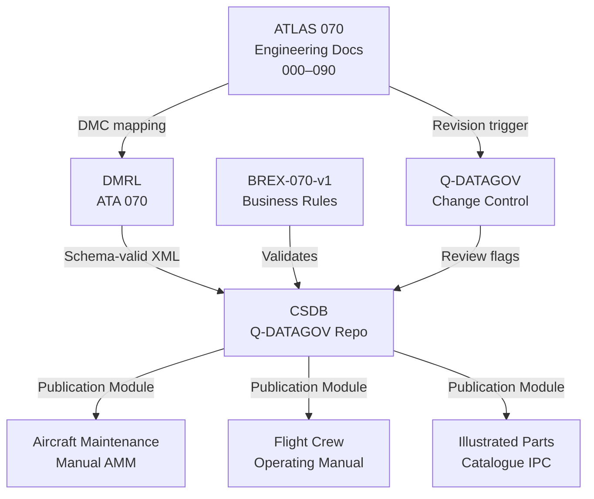
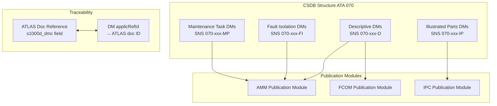

# S1000D CSDB Mapping and Traceability

---

## §0 Hyperlink Policy
All hyperlinks in this document are **relative**. Absolute URLs are forbidden.

---

## §1 Purpose
This document defines the S1000D Issue 5.0 Data Module Requirements List (DMRL), Business Rules Exchange (BREX) profile BREX-070-v1, and Q-DATAGOV traceability conventions for all technical publications covering the AMPEL360E eWTW ATA 070 hybrid-electric architecture. It maps each ATLAS 070 subsubject document to its corresponding S1000D Data Module Code (DMC), specifies the Common Source Data Base (CSDB) storage structure, and establishes the linkage between ATLAS engineering baseline documents and the maintainer-facing S1000D data modules.

## §2 Applicability
| Aircraft | Variant | MSN Range | Effectivity |
|---|---|---|---|
| AMPEL360E | eWTW | All | From EIS |

## §3 Functional Description 

The AMPEL360E eWTW technical publication programme adopts S1000D Issue 5.0 as the governing specification for all structured maintenance, operational, and illustrated parts data. ATA 070 (Hybrid-Electric Architecture Overview) is a new top-level system without a direct predecessor in conventional ATA chapter sets, requiring the definition of a dedicated BREX profile (BREX-070-v1) that extends the standard S1000D business rules to accommodate hybrid-electric specific data structures: battery SoC parameter encoding, HVDC voltage data, and EMS mode state machine descriptions.

The DMRL for ATA 070 is organised by the S1000D System/Sub-system/Subject/Unit hierarchy mapped to the ATLAS SNS (Subsubject Numbering System). Each ATLAS subsubject document (070-000 through 070-090) maps to a family of S1000D data modules covering: descriptive data modules (DMC type D), fault isolation data modules (FI), scheduled maintenance task data modules (MP), and illustrated parts data modules (IP). The CSDB instance for the AMPEL360E programme is hosted under the Q-DATAGOV managed repository, with access controlled by Q-DATAGOV authority roles and traceable to the Q+ATLANTIDE controlled baseline.

Traceability is maintained bidirectionally: each S1000D data module references its parent ATLAS engineering document via the `applicRefId` and `reasonForUpdate` metadata fields, and each ATLAS document includes its corresponding S1000D DMC in the frontmatter `s1000d_dmc` field. The Q-DATAGOV data governance process requires that any revision to an ATLAS 070 engineering document triggers a review flag on all associated S1000D data modules in the CSDB, ensuring publication currency with the engineering baseline. Change management employs the S1000D Publication Module (PM) and Change Markup (CM) markup to track differences between revisions.

## §4 Functional Breakdown
| ID | Function | Description | Owner | DAL |
|---|---|---|---|---|
| F-070-090-01 | DMRL Management | Maintain the full DMRL for ATA 070; assign DMC codes and schema types | Q-DATAGOV | DAL-C |
| F-070-090-02 | BREX-070-v1 Authoring | Define and maintain the business rules extension profile for hybrid-electric data | Q-DATAGOV | DAL-C |
| F-070-090-03 | CSDB Ingestion and Configuration | Process authored data modules into CSDB with schema validation and baseline labelling | Q-DATAGOV | DAL-C |
| F-070-090-04 | Traceability Link Management | Maintain bidirectional links between ATLAS docs and S1000D data modules | Q-DATAGOV | DAL-C |
| F-070-090-05 | Publication Module Assembly | Assemble approved data modules into AMM, FCOM, IPC publications via PM | Q-DATAGOV | DAL-C |

## §5 System Context — Architecture

## §6 Internal Architecture

## §7 Components and LRUs
| LRU ID | Name | P/N | Qty | Location |
|---|---|---|---|---|
| LRU-070-090-01 | CSDB Server Instance (Q-DATAGOV) | TBD | 1 | Q-DATAGOV cloud/on-prem |
| LRU-070-090-02 | BREX-070-v1 Schema File | TBD | 1 | CSDB configuration store |
| LRU-070-090-03 | DMRL Master Spreadsheet (ATA 070) | TBD | 1 | Q-DATAGOV controlled docs |
| LRU-070-090-04 | Publication Module (AMM ATA 070) | TBD | 1 | CSDB publication module set |
| LRU-070-090-05 | Traceability Link Database | TBD | 1 | Q-DATAGOV repository |

## §8 Interfaces
| Interface | Source | Destination | Protocol | Notes |
|---|---|---|---|---|
| IF-070-090-01 | ATLAS 070 Engineering Docs | DMRL | Manual / automated extraction | DMC assignment per S1000D SNS rules |
| IF-070-090-02 | BREX-070-v1 | CSDB XML validator | XML Schema (XSD) | Business rules enforced on ingest |
| IF-070-090-03 | CSDB | AMM/FCOM/IPC publisher | S1000D Publication Module | Output in PDF/IETP/IETM format |
| IF-070-090-04 | Q-DATAGOV change control | ATLAS 070 docs | Review flag via JIRA/GitHub Issues | Triggered by ATLAS doc revision |
| IF-070-090-05 | Traceability DB | Configuration Management | REST API | Links ATLAS IDs to DMC codes |

## §9 Operating Modes
| Mode | Trigger | Description | Power State | Notes |
|---|---|---|---|---|
| Authoring | Data module creation or update | Author edits DM in CSDB authoring tool per BREX-070-v1 | Authoring environment | Schema validation on save |
| Review | Engineering revision trigger | Q-DATAGOV flags associated DMs for technical review | Review workflow | Bidirectional traceability used |
| Baseline | Approval milestone | Approved DMs baselined in CSDB; version locked | Baseline label applied | Immutable after baselining |
| Publication | Publication module assembly | DMs compiled into AMM/FCOM/IPC and published | Output generation | Automated build pipeline |
| Archive | End of revision cycle | Superseded DMs archived with change markup | Archive only | Retrievable for audit |

## §10 Performance and Budgets 
| Parameter | Requirement | Current Estimate | Unit | Status |
|---|---|---|---|---|
| Total DMs in DMRL (ATA 070) |  | ~120 | DMs |  |
| BREX-070-v1 custom rule count |  | ~40 | rules |  |
| CSDB ingest validation time | ≤ 30 | — | s per DM |  |
| Traceability link completeness | 100 | — | % |  |
| Publication build time (AMM ATA 070) | ≤ 4 | — | h |  |

## §11 Safety, Redundancy and Fault Tolerance
- CSDB is hosted with daily automated backup and off-site disaster recovery copy; recovery point objective (RPO) is 24 h, recovery time objective (RTO) is 4 h.
- BREX-070-v1 validation is applied at ingest; non-compliant DMs are rejected with error codes and cannot be baselined, preventing invalid data from entering the publication pipeline.
- All ATLAS-to-DMC traceability links are stored in a version-controlled database; any deletion of a link requires dual-authority approval from the Q-DATAGOV and the responsible engineering Q-Division.
- Publication Module assembly is reproducible from any baselined CSDB snapshot, enabling reissue of any prior publication without manual rework.
- Q-DATAGOV access control enforces role-based permissions: authors, reviewers, approvers, and read-only roles, with full audit trail per ISO 9001 document control requirements.

## §12 Maintenance and Diagnostics
| Task | Interval | Tool | Reference |
|---|---|---|---|
| DMRL completeness audit | Per revision cycle | DMRL audit script DMRL-AUD-070 | Q-DATAGOV-PROC-001 |
| BREX-070-v1 rule regression test | Per BREX update | CSDB XML validator | Q-DATAGOV-PROC-002 |
| Traceability link integrity check | Monthly | Traceability DB report tool | Q-DATAGOV-PROC-003 |
| CSDB backup restore test | Quarterly | DR test procedure | Q-DATAGOV-PROC-004 |

## §13 Footprint
| Metric | Physical | Electrical | Maintenance | Data |
|---|---|---|---|---|
| CSDB storage (ATA 070 DMs) | N/A (cloud/on-prem) | N/A | Q-DATAGOV admin | S1000D Issue 5.0 XML |
| BREX-070-v1 file size |  KB | — | CSDB configuration | XSD schema |
| Traceability DB size |  MB | — | REST API | JSON / relational |

## §14 Safety and Certification References
| Standard | Requirement | Applicability | Status | Notes |
|---|---|---|---|---|
| DO-178C | N/A (documentation, not software) | S1000D authoring tools | Planned | Tool qualification may apply to authoring tools |
| DO-254 | N/A | — | — | Not applicable to documentation system |
| ARP4754A | Traceability of engineering data to tech pubs | DMRL–ATLAS traceability | Planned | Required for certification credit |
| CS-25 | §25.1529 Instructions for Continued Airworthiness | AMM data modules | Planned | ICA compliance required for TC |
| FAR Part 25 | §25.1529 equivalent | AMM data modules | Planned | Joint FAA/EASA ICA basis |

## §15 V&V Approach
| Phase | Method | Tool/Facility | Status |
|---|---|---|---|
| DMRL completeness review | Cross-check DMRL against ATA 070 maintenance task list | DMRL audit script |  |
| BREX validation regression test | Submit sample DMs against BREX-070-v1 | CSDB XML validator |  |
| Traceability coverage audit | Verify all ATLAS 070 docs have ≥ 1 S1000D DM link | Traceability DB report |  |
| ICA compliance review | EASA/FAA review of AMM ATA 070 data modules | Certification authority workshop |  |

## §16 Glossary
| Term | Definition |
|---|---|
| S1000D | International specification for technical publications using a common source database |
| CSDB | Common Source Data Base — S1000D repository storing all data modules |
| DMRL | Data Module Requirements List — master list of all required S1000D data modules |
| DMC | Data Module Code — unique identifier for an S1000D data module |
| BREX | Business Rules Exchange — S1000D profile defining authoring constraints for a programme |
| SNS | System/Subsystem/Subject/Unit numbering scheme used in S1000D and ATA chapters |
| ICA | Instructions for Continued Airworthiness — CS-25 §25.1529 required maintenance documentation |
| Publication Module | S1000D PM — defines which DMs are included in a specific publication (AMM, FCOM, IPC) |
| Q-DATAGOV | Q-Division responsible for data governance, CSDB management, and traceability |
| Applicability | S1000D mechanism linking a DM to a specific aircraft variant, MSN range, or modification state |

## §17 Open Issues
| ID | Description | Owner | Priority | Status |
|---|---|---|---|---|
| OI-070-090-001 | Draft and validate BREX-070-v1 custom rules for HVDC voltage and SoC parameter encoding | @copilot | High | Open |
| OI-070-090-002 | Confirm CSDB platform selection (Flatirons, Mekon, or bespoke) with Q-DATAGOV programme | @copilot | Medium | Open |

## §18 Status Legend
| Badge | Meaning |
|---|---|
|  | Content under active development |
|  | Value or content to be determined |
|  | Approved and baselined |
|  | Placeholder, not yet populated |

## §19 Related Documents
| Code | Title | Link |
|---|---|---|
| 070-000 | Hybrid-Electric Architecture Overview — General | [070-000-Hybrid-Electric-Architecture-Overview-General.md](070-000-Hybrid-Electric-Architecture-Overview-General.md) |
| 070-010 | Architecture Modes and Power Flow | [070-010-Architecture-Modes-and-Power-Flow.md](070-010-Architecture-Modes-and-Power-Flow.md) |
| 070-020 | Turbofan-Electric Integration | [070-020-Turbofan-Electric-Integration.md](070-020-Turbofan-Electric-Integration.md) |
| 070-030 | Electric Propulsion Integration | [070-030-Electric-Propulsion-Integration.md](070-030-Electric-Propulsion-Integration.md) |
| 070-040 | Energy Storage Integration | [070-040-Energy-Storage-Integration.md](070-040-Energy-Storage-Integration.md) |
| 070-050 | Power Electronics and Conversion | [070-050-Power-Electronics-and-Conversion.md](070-050-Power-Electronics-and-Conversion.md) |
| 070-060 | Hybrid Control Architecture | [070-060-Hybrid-Control-Architecture.md](070-060-Hybrid-Control-Architecture.md) |
| 070-070 | Safety, Redundancy and Fault Tolerance Architecture | [070-070-Safety-Redundancy-and-Fault-Tolerance-Architecture.md](070-070-Safety-Redundancy-and-Fault-Tolerance-Architecture.md) |
| 070-080 | Hybrid System Monitoring, Diagnostics and Control Interfaces | [070-080-Hybrid-System-Monitoring-Diagnostics-and-Control-Interfaces.md](070-080-Hybrid-System-Monitoring-Diagnostics-and-Control-Interfaces.md) |

## §20 Change Log
| Rev | Date | Author | Summary |
|---|---|---|---|
| 0.1 | 2026-05-11 | @copilot | Initial creation |
