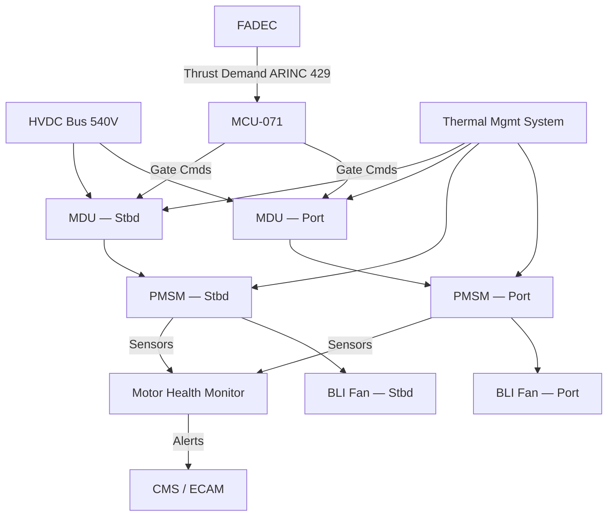
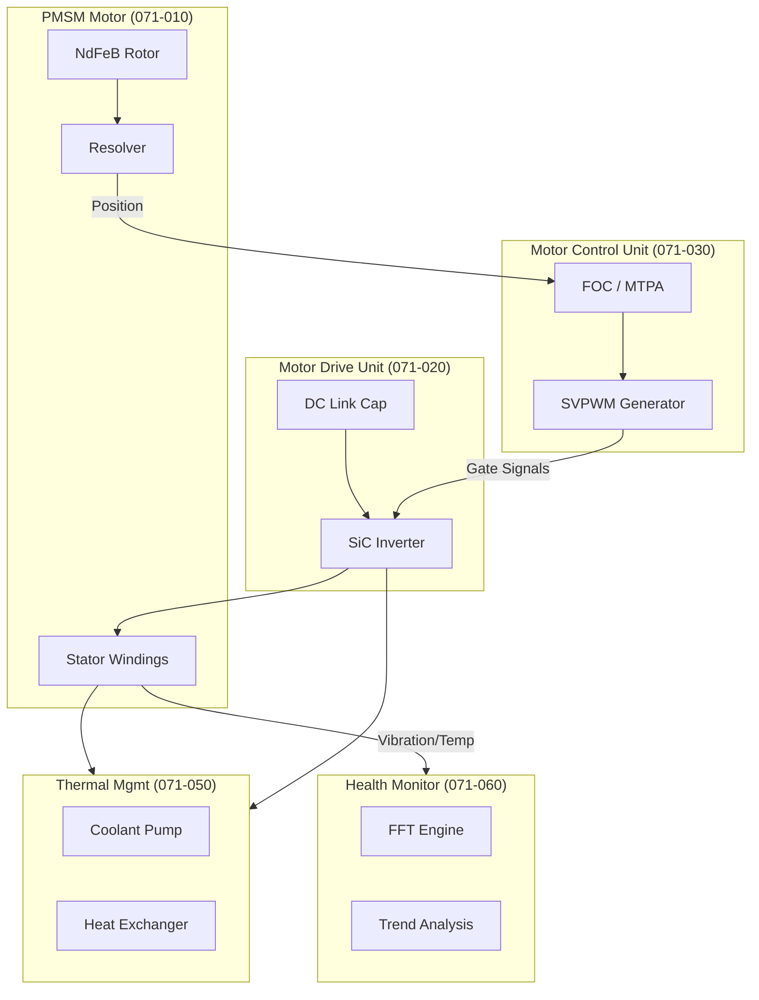

# Electric Motor and Drive Systems — General Overview

---

## §0 Hyperlink Policy
All hyperlinks in this document are **relative**. Absolute URLs are forbidden.

## §1 Purpose
This document provides the general system-level overview of the Electric Motor and Drive Systems (subsection 071) for the AMPEL360E eWTW aircraft. It describes the dual aft-fuselage Permanent Magnet Synchronous Motor (PMSM) architecture, power distribution topology, and the integration of Boundary Layer Ingestion (BLI) propulsion. It serves as the top-level reference that frames all subordinate 071-NNN data modules.

## §2 Applicability
| Aircraft | Variant | MSN Range | Effectivity |
|---|---|---|---|
| AMPEL360E | eWTW | All | From EIS |

## §3 Functional Description 
The AMPEL360E eWTW features two aft-fuselage PMSM propulsion motors rated at 2 MW peak each, fed directly from the aircraft High-Voltage Direct Current (HVDC) 540 V bus. Each motor is mechanically coupled to a ducted fan propulsor positioned at the aft fuselage boundary layer ingestion (BLI) aperture, exploiting wake-filling to reduce overall aircraft drag and improve propulsive efficiency by approximately 8–12 % relative to a podded equivalent.

Power flows from the HVDC main bus through independent Motor Drive Units (MDU), which employ Silicon Carbide (SiC) MOSFET three-phase voltage-source inverters to convert DC power into precisely controlled AC at variable frequency and amplitude. Each Motor Control Unit (MCU) implements Field-Oriented Control (FOC) with Maximum Torque Per Ampere (MTPA) optimisation, receiving thrust demand signals from the Full Authority Digital Engine Control (FADEC) system over an ARINC 429 / AFDX interface.

The subsystem family covered by ATA 071 encompasses motor electromagnetic design (071-010), the MDU/inverter hardware (071-020), the MCU control software and control laws (071-030), BLI aerodynamic integration (071-040), thermal management (071-050), health monitoring and diagnostics (071-060), mechanical interfaces and transmission (071-070), electrical interfaces and power quality (071-080), and S1000D data management traceability (071-090). This document establishes the overarching system architecture and interfaces that govern all those sub-topics.

## §4 Functional Breakdown
| ID | Function | Description | Owner | DAL |
|---|---|---|---|---|
| F-071-000-01 | System Power Conversion | Convert HVDC 540 V bus power to mechanical shaft power via MDU and PMSM | Q-GREENTECH | DAL-B |
| F-071-000-02 | Motor Speed/Torque Control | Receive FADEC thrust demand and regulate PMSM speed and torque via MCU/FOC | Q-GREENTECH | DAL-B |
| F-071-000-03 | BLI Thrust Generation | Generate net propulsive thrust through aft-fuselage BLI ducted fan integration | Q-AIR | DAL-C |
| F-071-000-04 | Thermal Management | Monitor and control motor and MDU thermal state within safe operating limits | Q-MECHANICS | DAL-C |
| F-071-000-05 | Health Monitoring | Continuously assess motor system health and provide ECAM/CMS alerts | Q-HPC | DAL-C |

## §5 System Context

## §6 Internal Architecture

## §7 Components and LRUs
| LRU ID | Name | P/N | Qty | Location |
|---|---|---|---|---|
| LRU-071-000-01 | PMSM Motor — Port | AMP-PMSM-2000-P | 1 | Aft fuselage port nacelle |
| LRU-071-000-02 | PMSM Motor — Starboard | AMP-PMSM-2000-S | 1 | Aft fuselage stbd nacelle |
| LRU-071-000-03 | Motor Drive Unit — Port | AMP-MDU-540-P | 1 | Aft equipment bay port |
| LRU-071-000-04 | Motor Drive Unit — Stbd | AMP-MDU-540-S | 1 | Aft equipment bay stbd |
| LRU-071-000-05 | Motor Control Unit | AMP-MCU-071 | 1 | Avionics bay aft |

## §8 Interfaces
| Interface | Source | Destination | Protocol | Notes |
|---|---|---|---|---|
| IF-071-000-01 | HVDC Main Bus | MDU (Port + Stbd) | 540 V DC hardwire | 800 A continuous per channel |
| IF-071-000-02 | FADEC | MCU-071 | ARINC 429 / AFDX | Thrust demand + mode commands |
| IF-071-000-03 | MCU-071 | MDU (Port + Stbd) | Fibre-optic | Gate drive PWM + telemetry |
| IF-071-000-04 | MHM | CMS / ECAM | ARINC 429 | Health alerts and diagnostics |
| IF-071-000-05 | TMS | PMSM + MDU | Coolant lines + CAN | Thermal loop control and monitoring |

## §9 Operating Modes
| Mode | Trigger | Description | Power State | Notes |
|---|---|---|---|---|
| Off | Pre-power / ground safe | All motor systems de-energised | Zero | Maintenance mode possible |
| Initialise | FADEC power-up | MCU BITE, resolver lock, MDU precharge | Standby | <30 s to ready |
| Taxi | Taxi thrust demand | Low speed torque control, gear ratio 3.5:1 | 10–20 % rated | Noise-sensitive operation |
| Climb/Cruise | Full thrust demand | FOC at rated speed, MTPA optimised | Up to 100 % rated | Primary propulsion mode |
| Deceleration / Regen | Thrust reduction / descent | Regenerative braking into HVDC bus | Negative | Subject to bus absorption capacity |

## §10 Performance and Budgets 
| Parameter | Requirement | Current Estimate | Unit | Status |
|---|---|---|---|---|
| Peak power (each motor) | ≥2000 | 2000 | kW |  |
| Continuous power (each motor) | ≥1500 | 1500 | kW |  |
| System electrical efficiency | ≥94 | 94.5 | % |  |
| HVDC bus voltage | 540 ±10 % | 540 | V |  |
| Motor speed range | 0 – 6000 | 0 – 6000 | rpm |  |

## §11 Safety, Redundancy and Fault Tolerance
- Dual independent motor channels (port and starboard) ensure continued single-channel operation following any single motor or MDU failure, maintaining minimum controllable thrust.
- Each MDU incorporates independent over-current, over-voltage and over-temperature hardware trip circuits compliant with DO-254 DAL-B, acting within 5 µs of fault detection.
- The MCU implements dual-redundant processing lanes (primary + monitor) with cross-lane comparison; disagreement triggers a safe-state shutdown of the affected channel within one control cycle (100 µs).
- Ground Fault Detection (GFD) units on each HVDC feed monitor isolation resistance continuously; resistance below 1 MΩ triggers a contactor open within 50 ms, isolating the fault from the main bus.
- Motor health monitoring (MHM) provides continuous prognostic alerting, enabling predictive maintenance actions before safety-critical degradation thresholds are reached.

## §12 Maintenance and Diagnostics
| Task | Interval | Tool | Reference |
|---|---|---|---|
| PMSM insulation resistance test | 600 FH or C-check | Megohmmeter AMP-IR-500 | AMM 071-00-11 |
| MDU cooling system flush and refill | 1200 FH | Coolant service cart AMP-CSC-01 | AMM 071-00-21 |
| MCU BITE full download and review | Every A-check | Ground laptop + ACMF software | AMM 071-00-31 |
| Resolver calibration verification | 600 FH | MCU diagnostic port + resolver test set | AMM 071-00-41 |

## §13 Footprint
| Dimension | Value | Unit | Notes |
|---|---|---|---|
| Physical mass | TBD | kg |  |
| Envelope | TBD | mm |  |
| Power draw (cont.) | TBD | W |  |
| Cooling demand | TBD | kW |  |
| Data interfaces | TBD | — |  |

## §14 Safety and Certification References
| Standard | Requirement | Applicability | Status | Notes |
|---|---|---|---|---|
| DO-178C | Software level per DAL | MCU software | Planned | DAL-B baseline |
| DO-254 | Hardware design assurance | MDU FPGA | Planned | DAL-B baseline |
| ARP4754A | System development | Motor system | Planned | System-level |
| CS-25 | Airworthiness requirements | Aircraft-level | Planned | EASA primary |
| FAR Part 25 | Airworthiness requirements | Aircraft-level | Planned | FAA bilateral |

## §15 V&V Approach
| Phase | Method | Tool/Facility | Status |
|---|---|---|---|
| Model-in-the-Loop | MATLAB/Simulink simulation of FOC and system model | Q-HPC simulation cluster |  |
| Hardware-in-the-Loop | MDU + MCU on real-time target with motor emulator | AMP HIL rig AMP-HIL-071 |  |
| Motor test bench | Full-power PMSM + MDU endurance and efficiency | AMP Motor Test Facility |  |
| Iron-bird / aircraft integration | End-to-end power, control and BLI tests | AMPEL360E iron-bird rig |  |

## §16 Glossary
| Term | Definition |
|---|---|
| BLI | Boundary Layer Ingestion — propulsion concept re-energising the aircraft's boundary layer |
| PMSM | Permanent Magnet Synchronous Motor |
| MDU | Motor Drive Unit — the inverter assembly converting DC to AC for the PMSM |
| MCU | Motor Control Unit — the control computer implementing FOC and control laws |
| FOC | Field-Oriented Control — vector control technique decoupling torque and flux |
| MTPA | Maximum Torque Per Ampere — FOC optimisation minimising copper losses |
| HVDC | High-Voltage Direct Current — 540 V power distribution bus on AMPEL360E |
| FADEC | Full Authority Digital Engine Control — top-level thrust management computer |
| MHM | Motor Health Monitor — subsystem for prognostic and diagnostic monitoring |
| DAL | Design Assurance Level — per DO-178C/DO-254; criticality classification A–E |

## §17 Open Issues
| ID | Description | Owner | Priority | Status |
|---|---|---|---|---|
| OI-071-000-001 | Define regenerative braking energy absorption capacity with battery system (ATA 072) | @copilot | High | Open |
| OI-071-000-002 | Confirm HVDC bus grounding strategy and GFD threshold values with electrical team | @copilot | Medium | Open |

## §18 Status Legend
| Badge | Meaning |
|---|---|
|  | Content under active development |
|  | Value or content to be determined |
|  | Approved and baselined |
|  | Placeholder |

## §19 Related Documents
| Code | Title | Link |
|---|---|---|
| 071-010 | PMSM Motor Design and Specifications | [071-010-PMSM-Motor-Design-and-Specifications.md](071-010-PMSM-Motor-Design-and-Specifications.md) |
| 071-020 | Motor Drive Unit (MDU) and Inverter | [071-020-Motor-Drive-Unit-MDU-and-Inverter.md](071-020-Motor-Drive-Unit-MDU-and-Inverter.md) |
| 071-030 | Motor Control Unit (MCU) and Control Laws | [071-030-Motor-Control-Unit-MCU-and-Control-Laws.md](071-030-Motor-Control-Unit-MCU-and-Control-Laws.md) |
| 071-040 | Boundary Layer Ingestion (BLI) Aerodynamic Integration | [071-040-Boundary-Layer-Ingestion-Integration.md](071-040-Boundary-Layer-Ingestion-Integration.md) |
| 071-050 | Motor Thermal Management System | [071-050-Motor-Thermal-Management.md](071-050-Motor-Thermal-Management.md) |
| 071-060 | Motor Health Monitoring and Diagnostics | [071-060-Motor-Health-Monitoring-and-Diagnostics.md](071-060-Motor-Health-Monitoring-and-Diagnostics.md) |
| 071-070 | Motor Mechanical Interface and Transmission | [071-070-Motor-Mechanical-Interface-and-Transmission.md](071-070-Motor-Mechanical-Interface-and-Transmission.md) |
| 071-080 | Motor Electrical Interface and Power Quality | [071-080-Motor-Electrical-Interface-and-Power-Quality.md](071-080-Motor-Electrical-Interface-and-Power-Quality.md) |
| 071-090 | S1000D CSDB Mapping and Traceability (071) | [071-090-S1000D-CSDB-Mapping-and-Traceability.md](071-090-S1000D-CSDB-Mapping-and-Traceability.md) |

## §20 Change Log
| Rev | Date | Author | Summary |
|---|---|---|---|
| 0.1 | 2026-05-11 | @copilot | Initial creation |
