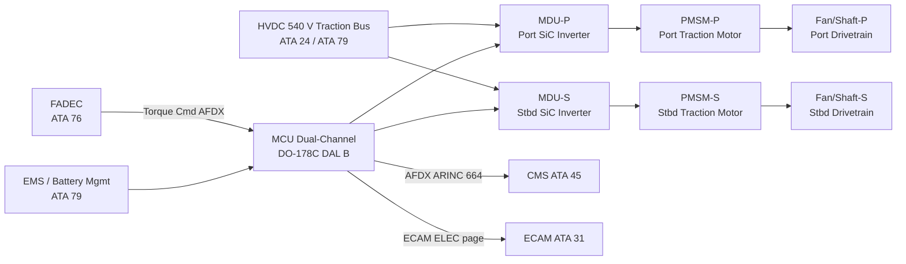
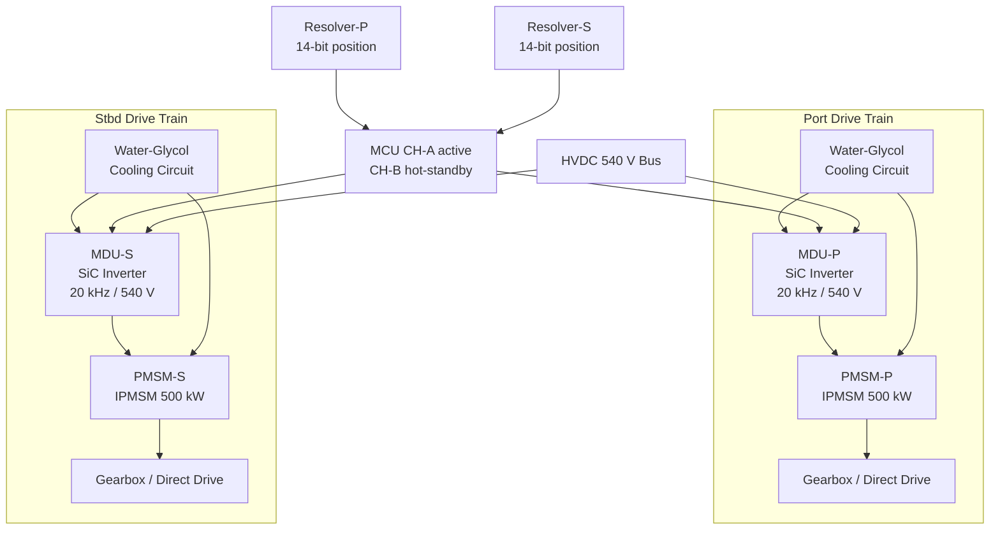

<!-- ──────────────────────────────────────────────────────────────────────────
     QATL-ATLAS-1000-ATLAS-070-079-071-000-ELECTRIC-MOTOR-AND-DRIVE-SYSTEMS-GENERAL
     ATA 71 · Electric Motor and Drive Systems — General
     AMPEL360E eWTW — ATLAS Register 1000
────────────────────────────────────────────────────────────────────────────── -->

# Electric Motor and Drive Systems — General

---

## §0 Hyperlink Policy

> All hyperlinks in this document are **relative** (five directory levels: `../../../../../`).
> Absolute URLs are forbidden. Every linked document must exist in the Q+ATLANTIDE repository
> before the link is activated. Broken links are treated as open issues and must be resolved
> before the document is promoted from `DRAFT` to `APPROVED`.

---

## §1 Purpose

ATA Chapter 71 covers the Electric Motor and Drive Systems of the AMPEL360E eWTW hybrid-electric narrowbody aircraft. This document establishes the general scope, top-level architecture, and governing standards for the entire ATA 71 subsystem.

The AMPEL360E eWTW employs two wing-mounted Permanent Magnet Synchronous Motors (PMSMs) — one per wing — as traction motors that **supplement turbofan thrust** during climb, cruise, and potentially provide motor-only taxi and regenerative braking capability on landing roll. Each traction motor is rated at **500 kW continuous / 600 kW peak** and is fed from the **HVDC 540 V traction bus**, sourced from the onboard battery pack (ATA 79) and/or the main engine generators.

In hybrid-electric assist mode, the two PMSMs drive the fan shaft (via a gearbox coupling or direct-drive, port and starboard respectively), enabling the turbofan cores to operate at reduced fuel flow while the required net thrust is maintained through combined thermal and electric propulsion. This architecture targets a **fuel burn reduction of 15–20 %** on short-to-medium range missions compared to a conventional turbofan-only baseline.

All subsubject documents (071-010 through 071-090) are subordinate to this general baseline. Any changes to system-level requirements or architecture defined here must trigger a formal revision of all affected subsubject documents.

---

## §2 Applicability

| Parameter | Value |
|---|---|
| Aircraft Program | AMPEL360E eWTW |
| ATA reference | ATA 71-000 — Electric Motor and Drive Systems General |
| Certification basis | EASA CS-25 Amdt 27+; EASA Special Condition SC-VTOL (adapted clauses for hybrid propulsion) |
| S1000D SNS | 071-000-00 |

---

## §3 Functional Description ![DRAFT]

The ATA 71 system on the AMPEL360E eWTW comprises two symmetrical electric drive trains — one per wing — each consisting of a PMSM traction motor, a Motor Drive Unit (MDU), and a Motor Control Unit (MCU). Both drive trains share a common HVDC 540 V traction bus and are supervised by the Energy Management System (EMS, ATA 79) and the Full-Authority Digital Engine Control (FADEC).

**PMSM traction motors (port and starboard):** Each motor is an 8-pole Interior PMSM (IPMSM) rated 500 kW continuous / 600 kW peak, producing up to 3 000 N·m peak torque at a rated speed of 3 600 rpm. The stator windings are Class H insulated and liquid-cooled via a water-glycol jacket integral to the stator housing. The rotor carries NdFeB permanent magnet tiles retained by a carbon fibre sleeve.

**Motor Drive Unit (MDU-P and MDU-S):** Each MDU is a 3-phase SiC MOSFET full-bridge inverter converting the HVDC 540 V DC input to variable-frequency 3-phase AC output for the PMSM. Switching frequency is 20 kHz; peak efficiency is ≥ 98 %. The MDU incorporates a film capacitor DC-link bank and an active discharge circuit that reduces DC-link voltage to < 60 V within 5 s after shutdown. The MDU cold plate is integrated into the aircraft liquid-cooling circuit (water-glycol).

**Motor Control Unit (MCU):** A single dual-channel MCU supervises both MDU-P and MDU-S. Channel A is the active control channel; Channel B operates in hot-standby monitoring mode. The MCU is qualified to DO-178C DAL B and implements Field-Oriented Control (FOC) with space-vector PWM modulation. Torque commands are received from the EMS/FADEC via AFDX (ARINC 664 P7) at a 10 ms update rate.

**Hybrid operating modes:** The EMS defines four primary traction operating modes: (1) **Electric Assist** — PMSM supplements turbofan thrust during take-off and climb; (2) **Motor-Only** — PMSM provides all propulsive force during ground taxi (zero-emission taxi); (3) **Regenerative Braking** — PMSM acts as generator during landing roll, recovering kinetic energy to the battery; (4) **Standby** — PMSM de-energised, MDU in ready state, turbofan providing all thrust.

---

## §4 Functional Breakdown

| ID | Name | Description | Lead Division |
|---|---|---|---|
| F-001 | PMSM-P — Port Traction Motor | 8-pole IPMSM, 500/600 kW, port wing gearbox coupling or direct drive; primary electric thrust element port side | Q-GREENTECH |
| F-002 | PMSM-S — Starboard Traction Motor | Identical to PMSM-P; starboard wing installation | Q-GREENTECH |
| F-003 | MDU-P — Port Motor Drive Unit | SiC 3-phase inverter, HVDC 540 V input, 20 kHz switching, ≥ 98 % efficiency; drives PMSM-P | Q-GREENTECH |
| F-004 | MDU-S — Starboard Motor Drive Unit | Identical to MDU-P; drives PMSM-S | Q-GREENTECH |
| F-005 | MCU — Motor Control Unit (dual-channel) | DO-178C DAL B; FOC/DTC control, torque command interface from EMS/FADEC, BITE and health monitoring | Q-HPC |
| F-006 | EMS Interface | Receives energy state from ATA 79 EMS; distributes torque setpoints to MCU; enforces power limits | Q-INDUSTRY |

---

## §5 System Context — Mermaid Diagram

---

## §6 Internal Architecture — Mermaid Diagram

---

## §7 Components and LRUs

| Component | Part Number | Qty | Location | Maintenance Interval | Notes |
|---|---|---|---|---|---|
| PMSM-P Port Traction Motor | PMSM-071-P-TBD | 1 | Port wing root nacelle | On condition (bearing L10 30 000 FH) | IPMSM 500/600 kW; Class H insulation |
| PMSM-S Stbd Traction Motor | PMSM-071-S-TBD | 1 | Stbd wing root nacelle | On condition (bearing L10 30 000 FH) | Identical to PMSM-P |
| MDU-P Port Motor Drive Unit | MDU-071-P-TBD | 1 | Port wing electronics bay | On condition / SiC inspection C-check | SiC MOSFET inverter; ≥ 98 % efficiency |
| MDU-S Stbd Motor Drive Unit | MDU-071-S-TBD | 1 | Stbd wing electronics bay | On condition / SiC inspection C-check | Identical to MDU-P |
| MCU Motor Control Unit | MCU-071-TBD | 1 | EE bay rack | Software update per MCU SB cycle | Dual-channel; DO-178C DAL B |

---

## §8 Interfaces

| Interface Type | Connected System | Protocol / Medium | Data / Function |
|---|---|---|---|
| ATA 24 Electrical Power | HVDC 540 V traction bus | HVDC cable (orange, MIL-spec) | Motor drive power; up to 600 kW per MDU |
| ATA 45 CMS | Central Maintenance System | AFDX ARINC 664 P7 | BITE faults, health parameters, exceedance log; 10 ms update |
| ATA 31 ECAM | Cockpit display (SD ELEC page) | AFDX | Motor torque, speed, temp, fault annunciation — traction motor synoptic |
| ATA 76 Engine Controls | FADEC | AFDX | Torque command to MCU; engine/motor power split scheduling |
| ATA 79 EMS / Battery | Energy Management System | AFDX | Battery state-of-charge, available power budget, regenerative mode command |

---

## §9 Operating Modes

| Mode | Trigger | System State | Actions / Consequences |
|---|---|---|---|
| Electric Assist | EMS commands hybrid boost during T/O or climb | Both PMSMs powered; MDUs active; MCU FOC running | PMSM supplements turbofan; fuel flow reduced; ECAM shows traction motor synoptic |
| Motor-Only Taxi | Cockpit TAXI ELEC mode selected; throttle idle | PMSMs provide all ground motion; turbofans at idle or off | Zero-emission surface operation; HVDC 540 V from battery; speed ≤ 30 kt |
| Regenerative Braking | Landing roll; EMS regen command | PMSMs act as generators; MDUs operate in rectifier mode | Kinetic energy recovered to battery; deceleration contribution up to 0.05 g |
| Standby | Normal turbofan-only cruise; battery conservation | MDUs in ready state; PMSMs coasting unpowered | No electrical power to drive train; MCU monitoring only |
| Maintenance | Aircraft grounded; MCU/MDU isolated | HVDC 540 V isolated; LOTO applied | MCU BITE accessible via CMS terminal; active discharge ≤ 60 V within 5 s |

---

## §10 Performance and Budgets ![DRAFT]

| Parameter | Requirement | Target / Design Value | Status |
|---|---|---|---|
| PMSM continuous power (each) | ≥ 500 kW | 500 kW | ![TBD] |
| PMSM peak power (each) | ≥ 600 kW (30 s) | 600 kW | ![TBD] |
| PMSM peak torque | ≥ 2 800 N·m | 3 000 N·m | ![TBD] |
| PMSM rated speed | 3 600 rpm | 3 600 rpm | ![TBD] |
| MDU efficiency | ≥ 97 % | ≥ 98 % | ![TBD] |
| PMSM peak efficiency | ≥ 96 % | 97.5 % | ![TBD] |
| Torque response time (10–90 %) | ≤ 100 ms | ≤ 50 ms | ![TBD] |
| BITE fault detection coverage | ≥ 85 % | ≥ 90 % | ![TBD] |

---

## §11 Safety, Redundancy and Fault Tolerance

- The two drive trains (port/starboard) are electrically independent downstream of the HVDC 540 V bus; loss of one MDU does not affect the other.
- MCU dual-channel (CH-A/CH-B) hot-standby ensures continued motor control after single control-channel failure. Changeover is automatic within one MCU computation cycle (100 μs).
- Loss of both PMSMs simultaneously is classified as a major failure condition; turbofan thrust remains available and the aircraft is airworthy in conventional mode. The FHA must confirm this classification.
- Active discharge circuit in each MDU reduces DC-link voltage to < 60 V within 5 s of isolation, ensuring safe maintenance access per IEC 60664-1 SELV limits.
- All PMSM and MDU maintenance tasks require HVDC 540 V isolation (LOTO procedure) before any connector is broken or cover removed.
- Orange HV cable identification per SAE J1654 is mandatory throughout the aircraft to prevent LV/HV cable confusion during maintenance.

---

## §12 Maintenance and Diagnostics

| Task | Interval | Access | Special Tools |
|---|---|---|---|
| MCU BITE log download and review | A-check | CMS terminal / ACARS | CMS terminal or ACARS download |
| Bearing vibration trend review | A-check | CMS terminal | ACARS download; MCU event log |
| Insulation resistance test (1 000 V DC) | B-check | Wing electronics bay access | Insulation tester; HVDC isolation kit |
| Partial discharge test | C-check | Wing root nacelle access | PD tester per IEC 60034-25 |
| Winding resistance 3-phase balance | C-check | PMSM HV connector disconnected | Winding resistance tester (mΩ resolution) |
| PMSM LRU replacement (bearing fault) | On condition | Wing root nacelle full access — ~8 h task | Torque wrench set; bearing puller; HVDC LOTO kit |
| MDU LRU replacement | On fault | Wing electronics bay — ~4 h task | MDU extraction tool; HVDC LOTO kit |

---

## §13 Footprint — Physical, Electrical, Maintenance, Data ![TBD]

| Footprint Type | Parameter | Value | Notes |
|---|---|---|---|
| Physical | Mass — each PMSM | ![TBD] | Pending OEM final design |
| Physical | Mass — each MDU | ![TBD] | Pending OEM final design |
| Physical | PMSM envelope | ![TBD] | Wing root nacelle zone |
| Electrical | Peak power (both PMSMs) | ~1 200 kW | Combined peak; per HVDC bus load analysis |
| Electrical | HVDC bus voltage | 540 V DC nominal | ±10 % operating range |
| Maintenance | PMSM access | Wing root nacelle panel | Line / heavy maintenance boundary TBD |
| Data | AFDX bandwidth (MCU to CMS) | ![TBD] | Per AFDX bus load analysis |

---

## §14 Safety and Certification References ![DRAFT]

| Standard / Document | Title | Issuing Body | Applicability |
|---|---|---|---|
| EASA CS-25 Amdt 27+ | Certification Specifications for Large Aeroplanes | EASA | Primary airworthiness basis |
| DO-178C | Software Considerations in Airborne Systems | RTCA | MCU software DO-178C DAL B |
| DO-160G | Environmental Conditions and Test Procedures | RTCA | MDU and MCU environmental qualification |
| IEC 60034-25 | Rotating Electrical Machines — AC motors for use in power drive systems | IEC | PMSM design and partial discharge testing |
| SAE J1654 | High Voltage Primary Cable | SAE International | Orange HV cable insulation identification standard |
| IEC 60664-1 | Insulation coordination for low-voltage equipment | IEC | SELV limit 60 V for maintenance access safety |
| ATA iSpec 2200 | Chapter 71 — Power Plant | ATA | ATA chapter scope definition |

---

## §15 V&V Approach ![TBD]

| Phase | Method | Acceptance Criterion | Status |
|---|---|---|---|
| Design | Analysis and FEM/thermal simulation | PMSM performance ≥ 500 kW; MDU efficiency ≥ 98 % | ![TBD] |
| Component test | MDU SiC switching test; PMSM back-EMF test | MDU THD < 3 %; PMSM back-EMF balance ≤ 1 % | ![TBD] |
| Integration | Ground functional test (MCU GSE; HVDC 540 V source) | All BITE tests pass; torque response ≤ 50 ms | ![TBD] |
| Qualification | DO-160G environmental test | All applicable categories pass (temp, vibration, EMI) | ![TBD] |
| Certification | EASA CS-25 hybrid propulsion flight test | Hybrid assist fuel burn reduction demonstrated; BITE coverage report | ![TBD] |

---

## §16 Glossary

| Term | Definition |
|---|---|
| **PMSM** | Permanent Magnet Synchronous Motor — high-efficiency traction motor using NdFeB permanent magnets in the rotor. |
| **IPMSM** | Interior PMSM — variant with magnets embedded in the rotor lamination stack, enabling reluctance torque utilisation. |
| **MDU** | Motor Drive Unit — 3-phase SiC MOSFET inverter converting HVDC 540 V to variable-frequency 3-phase AC for the PMSM. |
| **MCU** | Motor Control Unit — dual-channel digital controller implementing FOC and managing all motor drive functions. |
| **FOC** | Field-Oriented Control — vector control technique decoupling flux and torque current components for precise dynamic torque response. |
| **HVDC 540 V** | High-Voltage Direct Current traction bus at 540 V nominal supplying both MDUs. |
| **EMS** | Energy Management System (ATA 79) — supervises battery state-of-charge and electric/thermal power split. |
| **FADEC** | Full-Authority Digital Engine Control — issues torque commands to MCU as part of hybrid thrust management. |
| **DAL B** | Development Assurance Level B — MCU software criticality level per DO-178C; allows one level below catastrophic. |
| **SAE J1654** | SAE standard defining orange colour identification for HV primary cables in hybrid/electric vehicles and aircraft. |

---

## §17 Open Issues

| ID | Description | Owner | Target |
|---|---|---|---|
| OI-071-000-001 | Confirm gearbox coupling ratio and direct-drive selection (port/stbd) with drivetrain OEM | Q-MECHANICS | 2026-Q4 |
| OI-071-000-002 | Complete FHA for dual-PMSM loss scenario; confirm Major classification | Q-AIR / Safety | 2027-Q1 |
| OI-071-000-003 | Finalise HVDC 540 V bus load allocation with ATA 24 and ATA 79 | Q-GREENTECH | 2026-Q4 |

---

## §18 Status Legend

| Badge | Meaning |
|---|---|
| `![DRAFT]` | Section is drafted but not yet reviewed |
| `![TBD]` | Content not yet started — to be defined |
| `![To Be Completed]` | Partially complete — needs additional content |
| `![APPROVED]` | Reviewed and formally approved |

---

## §19 Related Documents (Siblings in this Subsection)

- [071-010](./071-010-Traction-Motor-Architecture.md)
- [071-020](./071-020-Motor-Rotor-Stator-and-Bearing-Assemblies.md)
- [071-030](./071-030-Inverter-and-Motor-Drive-Unit.md)
- [071-040](./071-040-Motor-Control-and-Torque-Command.md)
- [071-050](./071-050-Motor-Cooling-and-Thermal-Protection.md)
- [071-060](./071-060-Motor-Power-Connectors-and-Insulation.md)
- [071-070](./071-070-Motor-Inspection-Test-and-Maintenance.md)
- [071-080](./071-080-Electric-Drive-Monitoring-Diagnostics-and-Control-Interfaces.md)
- [071-090](./071-090-S1000D-CSDB-Mapping-and-Traceability.md)

---

## §20 Change Log

| Rev | Date | Author | Description |
|---|---|---|---|
| 0.1 | 2026-05-11 | @copilot | Initial DRAFT — contextualized content per AMPEL360E eWTW architecture |
