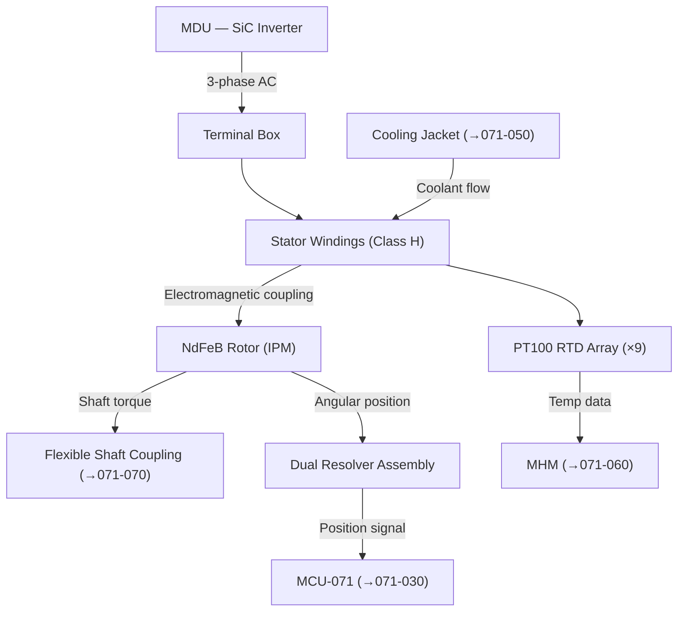
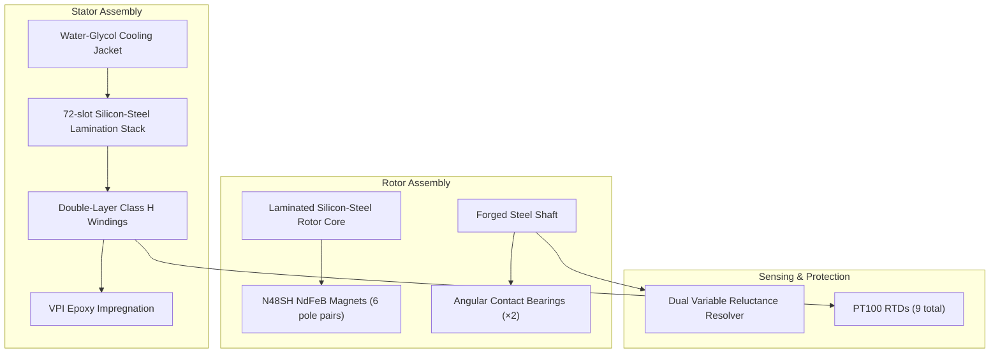

# PMSM Motor Design and Specifications

---

## §0 Hyperlink Policy
All hyperlinks in this document are **relative**. Absolute URLs are forbidden.

## §1 Purpose
This document defines the electromagnetic design, material specifications, ratings, and configuration of the Permanent Magnet Synchronous Motor (PMSM) used in the AMPEL360E eWTW aft-fuselage propulsion system. It covers rotor and stator geometry, permanent magnet material selection (NdFeB), insulation class, winding configuration, and integrated sensing. It serves as the motor equipment specification baseline for procurement and design assurance.

## §2 Applicability
| Aircraft | Variant | MSN Range | Effectivity |
|---|---|---|---|
| AMPEL360E | eWTW | All | From EIS |

## §3 Functional Description 
The AMPEL360E PMSM is an interior permanent magnet (IPM) machine designed for direct-drive compatibility with the aft-fuselage BLI fan assembly. The rotor employs Grade N48SH sintered Neodymium-Iron-Boron (NdFeB) magnets embedded in a laminated silicon-steel rotor core, arranged in a 6-pole pair configuration to achieve the rated combination of peak torque (3200 Nm) and top speed (6000 rpm) within the thermal and mechanical envelope of the aft nacelle. The magnet grade N48SH is selected for its elevated coercivity (≥1990 kA/m), providing resistance to demagnetisation under the high-current fault currents possible in aviation drive duty.

The stator features a 72-slot, double-layer distributed winding arrangement wound in Insulation Class H (180 °C rated) enamelled copper conductors. A form-wound coil design is employed to maximise slot fill factor (target ≥72 %) and to enable pre-impregnation of each coil with vacuum pressure impregnation (VPI) epoxy resin before assembly, ensuring mechanical robustness under aerospace vibration spectra per MIL-STD-810H. End-winding geometry is optimised for minimum axial length to respect the aft-fuselage structural envelope.

Rotor position sensing is provided by a dual-redundant variable reluctance resolver directly mounted on the motor shaft, providing absolute angular position to the MCU within ±0.1° over the full 0–6000 rpm range. Integrated PT100 resistance temperature detectors (RTD) are embedded in each phase winding (3 sensors per phase, 9 total) and in the end-windings, giving the Motor Health Monitor complete thermal visibility of the stator. Motor cooling is provided by a circumferential water-glycol jacket on the outer stator frame; cooling jacket design detail is covered in 071-050.

## §4 Functional Breakdown
| ID | Function | Description | Owner | DAL |
|---|---|---|---|---|
| F-071-010-01 | Electromagnetic Torque Generation | Produce mechanical torque at rotor shaft from AC stator currents interacting with NdFeB rotor flux | Q-GREENTECH | DAL-B |
| F-071-010-02 | Rotor Position Sensing | Provide accurate absolute shaft angle to MCU via dual resolver | Q-GREENTECH | DAL-B |
| F-071-010-03 | Stator Winding Protection | Monitor winding temperature via RTDs and trigger thermal protection at 155 °C limit | Q-MECHANICS | DAL-C |
| F-071-010-04 | Bearing Load Management | Transmit rotor radial and axial loads to nacelle structure via angular contact bearings | Q-MECHANICS | DAL-C |
| F-071-010-05 | Back-EMF Control | Limit back-EMF magnitude at maximum speed to remain within MDU DC-link voltage rating | Q-GREENTECH | DAL-C |

## §5 System Context

## §6 Internal Architecture

## §7 Components and LRUs
| LRU ID | Name | P/N | Qty | Location |
|---|---|---|---|---|
| LRU-071-010-01 | Stator Assembly (incl. frame and jacket) | AMP-STATOR-2000 | 2 | Aft port / stbd nacelles |
| LRU-071-010-02 | Rotor Assembly (shaft + magnets + core) | AMP-ROTOR-2000 | 2 | Aft port / stbd nacelles |
| LRU-071-010-03 | Dual Resolver / Encoder Assembly | AMP-RES-6000 | 2 | Motor shaft aft end |
| LRU-071-010-04 | Cooling Jacket (outer stator frame) | AMP-JACKET-2000 | 2 | Integral to stator frame |
| LRU-071-010-05 | Motor Terminal Box | AMP-TERMBOX-071 | 2 | Motor phase output face |

## §8 Interfaces
| Interface | Source | Destination | Protocol | Notes |
|---|---|---|---|---|
| IF-071-010-01 | MDU (071-020) | Terminal Box | 3-phase AC, variable freq 0–500 Hz | Lemo MIL-SPEC high-current connector |
| IF-071-010-02 | Dual Resolver | MCU-071 (071-030) | Analogue sine/cosine, 10 V ref | Shielded twisted pair, 2 mm² |
| IF-071-010-03 | PT100 RTD Array | MHM (071-060) | 4-wire PT100 analogue | 9 channels per motor |
| IF-071-010-04 | Cooling Jacket | TMS (071-050) | Coolant in/out, ¾" hose fittings | 50/50 EG/water, 8 L/min |
| IF-071-010-05 | Stator Frame | Nacelle Structure | Mechanical mounting flange | 8× M16 bolts, torque per AMM |

## §9 Operating Modes
| Mode | Trigger | Description | Power State | Notes |
|---|---|---|---|---|
| De-energised | No inverter output | Zero current, rotor free-wheeling | Zero | Resolver remains powered |
| Low-speed Torque | Taxi mode <1000 rpm | High torque, low speed, MTPA region | 10–30 % rated | Thermal monitoring active |
| Constant Torque | Climb 1000–4000 rpm | Peak torque 3200 Nm sustained for <60 s | 100 % peak | Thermal limit governs duration |
| Field Weakening | >4500 rpm | Negative d-axis current to extend speed range | Up to rated power | Back-EMF limited to 540 V |
| Safe Shutdown | MCU fault or maintenance | Inverter gate inhibit; motor coasts to stop | Zero | Thermal runaway protection active |

## §10 Performance and Budgets 
| Parameter | Requirement | Current Estimate | Unit | Status |
|---|---|---|---|---|
| Peak torque | ≥3200 | 3200 | Nm |  |
| Continuous torque | ≥2400 | 2400 | Nm |  |
| Rated speed | 6000 | 6000 | rpm |  |
| Efficiency at rated point | ≥97 | 97.2 | % |  |
| Insulation class | H (180 °C) | H | — |  |

## §11 Safety, Redundancy and Fault Tolerance
- Dual resolver redundancy ensures continued rotor position feedback following single resolver failure; the MCU switches to the standby resolver channel within one control cycle.
- PT100 RTD array (9 sensors per motor) provides triple-redundancy per phase; the MCU applies 2-out-of-3 voting to winding temperature before declaring an over-temperature fault.
- N48SH magnet grade selected to withstand worst-case short-circuit demagnetisation currents (estimated 3× rated current) without irreversible loss of remanence.
- Stator insulation rated to Class H (180 °C) with a thermal protection trip set at 155 °C, providing 25 °C margin against insulation degradation under continuous rated duty.
- Motor frame is fully isolated from airframe ground with an isolation resistance target of ≥10 MΩ at 500 V DC; monitored by the GFD unit in 071-080.

## §12 Maintenance and Diagnostics
| Task | Interval | Tool | Reference |
|---|---|---|---|
| Insulation resistance megger test (phase-to-frame, 500 V DC) | 600 FH | AMP-IR-500 Megohmmeter | AMM 071-10-11 |
| Resolver calibration and angle error check | 600 FH | MCU diagnostic port + PC tool | AMM 071-10-21 |
| Bearing vibration signature spectrum analysis | 300 FH | MHM automated | AMM 071-10-31 |
| Visual inspection of terminal connections and cooling jacket | Every A-check | Torque wrench, visual inspection kit | AMM 071-10-41 |

## §13 Footprint
| Dimension | Value | Unit | Notes |
|---|---|---|---|
| Physical mass | TBD | kg |  |
| Envelope | TBD | mm |  |
| Power draw (cont.) | TBD | W |  |
| Cooling demand | TBD | kW |  |
| Data interfaces | TBD | — |  |

## §14 Safety and Certification References
| Standard | Requirement | Applicability | Status | Notes |
|---|---|---|---|---|
| DO-178C | Software level per DAL | MCU software | Planned | DAL-B baseline |
| DO-254 | Hardware design assurance | MDU FPGA | Planned | DAL-B baseline |
| ARP4754A | System development | Motor system | Planned | System-level |
| CS-25 | Airworthiness requirements | Aircraft-level | Planned | EASA primary |
| FAR Part 25 | Airworthiness requirements | Aircraft-level | Planned | FAA bilateral |

## §15 V&V Approach
| Phase | Method | Tool/Facility | Status |
|---|---|---|---|
| FEA electromagnetic analysis | Finite element simulation of torque, back-EMF, losses | ANSYS Maxwell / JMAG |  |
| Thermal analysis | Lumped-parameter and CFD thermal model of stator and jacket | ANSYS Fluent / LPTN model |  |
| Motor acceptance test | Full-load torque–speed curve, efficiency map, thermal soak | AMP Motor Test Facility (4 MW load bank) |  |
| Vibration and shock qualification | Random vibe + shock per MIL-STD-810H | Environmental test lab |  |

## §16 Glossary
| Term | Definition |
|---|---|
| PMSM | Permanent Magnet Synchronous Motor |
| IPM | Interior Permanent Magnet — rotor topology with magnets embedded in core |
| NdFeB | Neodymium-Iron-Boron permanent magnet material |
| N48SH | NdFeB grade: remanence ≥1.37 T, coercivity ≥1990 kA/m, max temp 150 °C |
| VPI | Vacuum Pressure Impregnation — resin treatment for winding consolidation |
| Slot Fill Factor | Ratio of copper conductor cross-section to slot cross-section |
| Insulation Class H | IEC 60085 thermal class rated to 180 °C maximum winding temperature |
| Resolver | Electromagnetic rotary transducer providing absolute shaft angle |
| PT100 | Platinum RTD with 100 Ω at 0 °C; tolerance class A per IEC 60751 |
| Back-EMF | Voltage induced in stator windings by rotating rotor flux; limits top speed |

## §17 Open Issues
| ID | Description | Owner | Priority | Status |
|---|---|---|---|---|
| OI-071-010-001 | Confirm N48SH magnet supplier qualification and radiation-hardening assessment for altitude environment | @copilot | High | Open |
| OI-071-010-002 | Finalise slot-fill factor target and confirm VPI process compatibility with Class H conductor enamel | @copilot | Medium | Open |

## §18 Status Legend
| Badge | Meaning |
|---|---|
|  | Content under active development |
|  | Value or content to be determined |
|  | Approved and baselined |
|  | Placeholder |

## §19 Related Documents
| Code | Title | Link |
|---|---|---|
| 071-000 | Electric Motor and Drive Systems — General Overview | [071-000-Electric-Motor-and-Drive-Systems-General.md](071-000-Electric-Motor-and-Drive-Systems-General.md) |
| 071-020 | Motor Drive Unit (MDU) and Inverter | [071-020-Motor-Drive-Unit-MDU-and-Inverter.md](071-020-Motor-Drive-Unit-MDU-and-Inverter.md) |
| 071-030 | Motor Control Unit (MCU) and Control Laws | [071-030-Motor-Control-Unit-MCU-and-Control-Laws.md](071-030-Motor-Control-Unit-MCU-and-Control-Laws.md) |
| 071-040 | Boundary Layer Ingestion (BLI) Aerodynamic Integration | [071-040-Boundary-Layer-Ingestion-Integration.md](071-040-Boundary-Layer-Ingestion-Integration.md) |
| 071-050 | Motor Thermal Management System | [071-050-Motor-Thermal-Management.md](071-050-Motor-Thermal-Management.md) |
| 071-060 | Motor Health Monitoring and Diagnostics | [071-060-Motor-Health-Monitoring-and-Diagnostics.md](071-060-Motor-Health-Monitoring-and-Diagnostics.md) |
| 071-070 | Motor Mechanical Interface and Transmission | [071-070-Motor-Mechanical-Interface-and-Transmission.md](071-070-Motor-Mechanical-Interface-and-Transmission.md) |
| 071-080 | Motor Electrical Interface and Power Quality | [071-080-Motor-Electrical-Interface-and-Power-Quality.md](071-080-Motor-Electrical-Interface-and-Power-Quality.md) |
| 071-090 | S1000D CSDB Mapping and Traceability (071) | [071-090-S1000D-CSDB-Mapping-and-Traceability.md](071-090-S1000D-CSDB-Mapping-and-Traceability.md) |

## §20 Change Log
| Rev | Date | Author | Summary |
|---|---|---|---|
| 0.1 | 2026-05-11 | @copilot | Initial creation |
