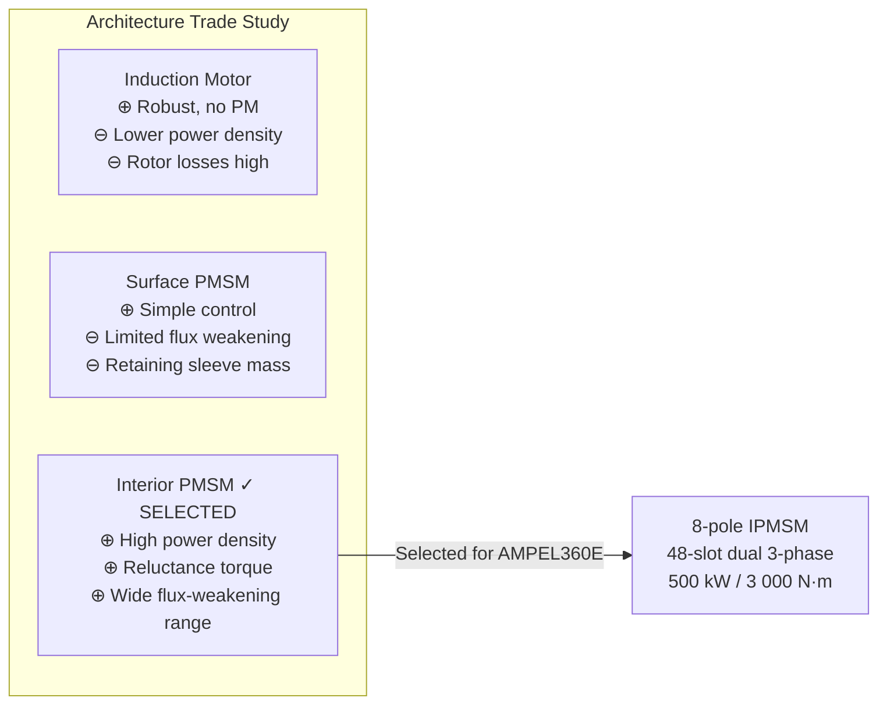
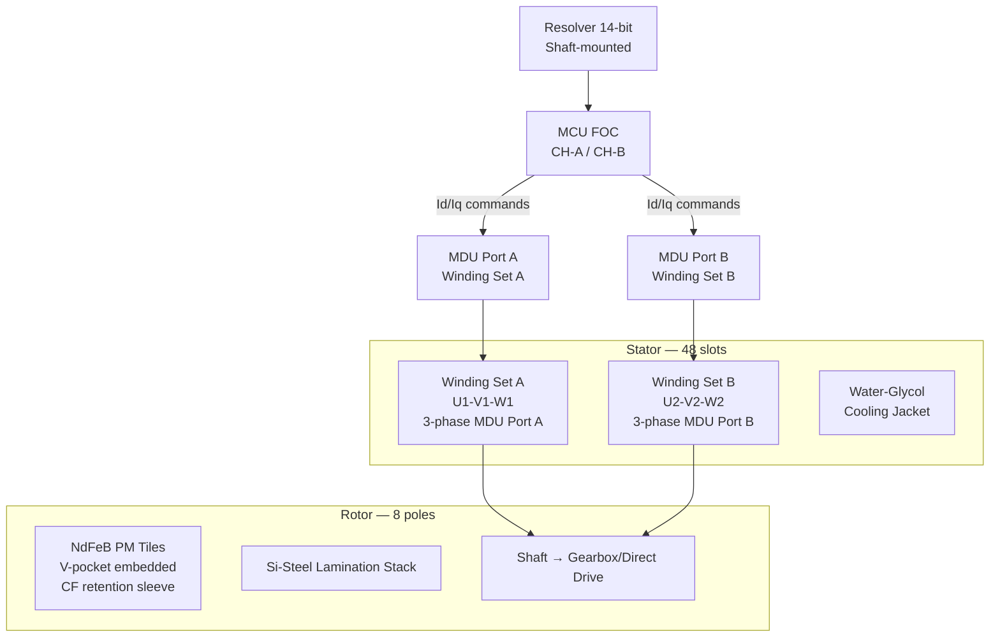

<!-- ──────────────────────────────────────────────────────────────────────────
     QATL-ATLAS-1000-ATLAS-070-079-071-010-TRACTION-MOTOR-ARCHITECTURE
     ATA 71 · Traction Motor Architecture
     AMPEL360E eWTW — ATLAS Register 1000
────────────────────────────────────────────────────────────────────────────── -->

# Traction Motor Architecture

---

## §0 Hyperlink Policy

> All hyperlinks in this document are **relative** (five directory levels: `../../../../../`).
> Absolute URLs are forbidden. Every linked document must exist in the Q+ATLANTIDE repository
> before the link is activated. Broken links are treated as open issues and must be resolved
> before the document is promoted from `DRAFT` to `APPROVED`.

---

## §1 Purpose

This document defines the PMSM traction motor architecture selection rationale, electromagnetic topology, pole count and winding configuration, and mechanical integration with the AMPEL360E eWTW hybrid drivetrain.

The two traction motors of the AMPEL360E eWTW are **8-pole Interior Permanent Magnet Synchronous Motors (IPMSMs)**. The IPMSM topology was selected over Surface PMSM (SPMSM) and induction motor alternatives following a multi-criteria trade study that evaluated power density, control bandwidth, saliency-based flux weakening range, and rotor structural integrity at high tip speeds. The IPMSM exploits both magnet torque and reluctance torque components, yielding a higher per-kilogram torque output than SPMSM at the same rated current.

Each IPMSM features a **dual 3-phase winding** (two independent sets of three-phase coils displaced by 30° electrical) to provide inter-winding fault tolerance and to allow the MDU to operate with a single winding set at 50 % power if one winding group develops a fault.

---

## §2 Applicability

| Parameter | Value |
|---|---|
| Aircraft Program | AMPEL360E eWTW |
| ATA reference | ATA 71-010 — Traction Motor Architecture |
| Certification basis | EASA CS-25 Amdt 27+; IEC 60034-25 |
| S1000D SNS | 071-010-00 |

---

## §3 Functional Description ![DRAFT]

**Motor topology — IPMSM:** The rotor of each traction motor uses NdFeB (Neodymium Iron Boron) PM tiles embedded in V-shaped pockets within a silicon-steel lamination stack. This interior placement gives saliency ratio (Ld/Lq) > 1.5, enabling field-weakening operation above base speed through Id current injection without incurring the mechanical stress risk of surface-mounted magnets at rotor peripheral speeds above 150 m/s.

**Pole count — 8 poles:** The 8-pole configuration was selected to balance fundamental electrical frequency (240 Hz at 3 600 rpm) against core loss and switching frequency demands on the MDU. An equivalent 6-pole design would increase the base frequency to 180 Hz, insufficiently separating from mechanical vibration frequencies; a 10-pole design would push fundamental frequency to 300 Hz, increasing MDU switching losses.

**Stator — 48 slots, distributed winding:** The 48-slot stator provides a 3-phase, 4-layer distributed winding with a winding pitch factor of 0.966, yielding low winding harmonic content (< 2 % THD on back-EMF). Two independent 3-phase winding sets (Winding Set A: phases U1-V1-W1; Winding Set B: phases U2-V2-W2) are displaced by 30° electrical, reducing torque ripple to < 1 % peak-to-peak and providing winding-group redundancy.

**Dual 3-phase winding redundancy:** If one winding set develops an inter-turn short or phase-to-phase fault, the MCU isolates that MDU winding port, and the motor continues at 50 % rated power on the healthy set. The aircraft can continue the mission at reduced hybrid boost level.

**Rated speed and flux weakening:** The motor is rated for 3 600 rpm base speed at full torque. Above base speed, the MCU implements flux weakening (negative Id injection) to extend the operating range to 4 000 rpm maximum, enabling wider hybrid operation across the flight envelope.

---

## §4 Functional Breakdown

| ID | Name | Description | Lead Division |
|---|---|---|---|
| F-001 | IPMSM Rotor Assembly | NdFeB PM tiles in V-pockets; laminated Si-steel; CF retention sleeve; 8-pole | Q-GREENTECH |
| F-002 | IPMSM Stator Assembly | 48-slot distributed winding; dual 3-phase winding sets; Class H insulation; water-glycol jacket | Q-GREENTECH |
| F-003 | Dual Winding Redundancy | Two independent 3-phase sets; MCU isolation of faulty set; 50 % power continuation | Q-HPC |
| F-004 | Flux Weakening Control | Negative Id injection above base speed; speed range 3 600–4 000 rpm; MCU FOC | Q-HPC |
| F-005 | Drivetrain Interface | Gearbox coupling or direct-drive flange; torque transmission to fan shaft | Q-MECHANICS |
| F-006 | Resolver Position Feedback | 14-bit resolver (shaft-mounted); rotor electrical angle to MCU at 100 μs sample rate | Q-HPC |

---

## §5 System Context — Mermaid Diagram

---

## §6 Internal Architecture — Mermaid Diagram

---

## §7 Components and LRUs

| Component | Part Number | Qty | Location | Maintenance Interval | Notes |
|---|---|---|---|---|---|
| IPMSM Complete Assembly | PMSM-071-TBD | 2 (P + S) | Wing root nacelle | On condition / bearing L10 30 000 FH | 8-pole; dual 3-phase winding |
| Resolver (shaft-mounted) | RES-071-TBD | 2 | PMSM NDE shaft end | Replace with PMSM | 14-bit resolution; DO-160G qualified |
| Drivetrain Coupling / Gearbox Interface Flange | COUP-071-TBD | 2 | PMSM shaft DE | Inspect at C-check | Torque-rated to 3 200 N·m (20 % margin) |

---

## §8 Interfaces

| Interface Type | Connected System | Protocol / Medium | Data / Function |
|---|---|---|---|
| MDU electrical output | MDU-P / MDU-S (3-phase AC) | HV 3-phase cable, orange, MIL-spec | Motor excitation; dual winding port connection |
| Drivetrain mechanical | Fan shaft gearbox or direct-drive | Rigid coupling / splined flange | Torque transmission 0–3 000 N·m |
| Resolver feedback | MCU (dual-channel) | Resolver cable, shielded | 14-bit rotor position; 100 μs sample rate |
| Thermal sensors (NTC) | MCU thermal model | Sensor cable, shielded | 8 NTC per motor; 2 per phase group per winding set |
| Cooling jacket | ATA 21 / ATA 71-050 water-glycol circuit | Coolant hose connections | Stator heat rejection; 12 L/min design flow |

---

## §9 Operating Modes

| Mode | Trigger | System State | Actions / Consequences |
|---|---|---|---|
| Below-base-speed (torque control) | Speed < 3 600 rpm | MCU FOC: Id = 0; Iq = torque command | Maximum torque per amp (MTPA) operation |
| Flux weakening (above base speed) | Speed 3 600–4 000 rpm | MCU FOC: negative Id injected; Iq reduced | Constant power above base speed; PM temperature monitored |
| Single winding set (degraded) | Winding fault detected; MDU port isolated | MCU routes to healthy winding set only | 50 % rated power; ECAM amber caution |
| Regenerative braking | EMS regen command; landing roll | PMSM acts as generator; MDU in rectifier mode | Kinetic energy to HVDC bus / battery |
| Standby / coasting | Turbofan-only mode | MDU gate signals inhibited; PMSM coasts | No electrical torque; bearing rotation check possible |

---

## §10 Performance and Budgets ![DRAFT]

| Parameter | Requirement | Target / Design Value | Status |
|---|---|---|---|
| Continuous power (each PMSM) | ≥ 500 kW | 500 kW | ![TBD] |
| Peak power (30 s) | ≥ 600 kW | 600 kW | ![TBD] |
| Peak torque | ≥ 2 800 N·m | 3 000 N·m | ![TBD] |
| Rated speed (base) | 3 600 rpm | 3 600 rpm | ![TBD] |
| Maximum speed (flux weakening) | 4 000 rpm | 4 000 rpm | ![TBD] |
| Peak efficiency | ≥ 96 % | 97.5 % | ![TBD] |
| Torque ripple | ≤ 2 % peak-to-peak | < 1 % (dual winding) | ![TBD] |
| Saliency ratio (Ld/Lq) | ≥ 1.3 | ≥ 1.5 | ![TBD] |

---

## §11 Safety, Redundancy and Fault Tolerance

- Dual 3-phase winding topology ensures the motor remains operational (at 50 % rated power) after an inter-turn short or phase fault in one winding set. The MCU detects the fault via current imbalance monitoring within one computation cycle and commands isolation of the faulty MDU port.
- NdFeB PM tiles are encapsulated in the rotor lamination V-pockets and retained by the lamination end-rings; the carbon fibre retention sleeve provides an additional containment layer against PM fragment release at speeds up to 20 % above maximum rated speed.
- Resolver dual-track output (coarse + fine) provides fault-tolerant position feedback; resolver failure triggers automatic fallback to sensorless FOC using back-EMF estimation (reduced accuracy at low speed).
- PM temperature history is logged by the MCU event log; any thermal exceedance above 150 °C triggers a maintenance flag requiring PM demagnetisation inspection per 071-090 BREX rule.

---

## §12 Maintenance and Diagnostics

| Task | Interval | Access | Special Tools |
|---|---|---|---|
| Resolver signal quality check | C-check | MCU GSE terminal | MCU GSE; oscilloscope |
| Winding resistance balance (3-phase, each winding set) | C-check | HV connector disconnected | Winding resistance tester (mΩ) |
| Back-EMF waveform check (motored rotation) | C-check | Wing nacelle; MDU GSE | MDU GSE; oscilloscope |
| PM demagnetisation inspection (after thermal event) | On condition | MCU event log review + OEM test procedure | MCU event log; OEM PM test fixture |
| Coupling/flange torque check | C-check | Wing nacelle access | Torque wrench; coupling inspection tool |

---

## §13 Footprint — Physical, Electrical, Maintenance, Data ![TBD]

| Footprint Type | Parameter | Value | Notes |
|---|---|---|---|
| Physical | Active length (stator stack) | ![TBD] | Pending electromagnetic design freeze |
| Physical | Outer diameter (stator OD) | ![TBD] | Constrained by nacelle envelope |
| Physical | Rotor inertia | ![TBD] | Drives torsional analysis with gearbox |
| Electrical | Winding resistance (per phase, 20 °C) | ![TBD] | Per OEM final design |
| Electrical | Back-EMF constant (Ke) | ![TBD] | Per electromagnetic design |
| Maintenance | LRU replacement access | Wing root nacelle removal | ~8 h task (see 071-070) |

---

## §14 Safety and Certification References ![DRAFT]

| Standard / Document | Title | Issuing Body | Applicability |
|---|---|---|---|
| EASA CS-25 Amdt 27+ | Certification Specifications for Large Aeroplanes | EASA | Primary airworthiness basis |
| IEC 60034-1 | Rotating Electrical Machines — Rating and Performance | IEC | PMSM rating definitions |
| IEC 60034-25 | Rotating Electrical Machines — AC motors for power drive systems | IEC | IPMSM design and PD test |
| IEC 60034-30-1 | Efficiency classes of line start AC motors (IE1–IE5) | IEC | Efficiency target reference |
| SAE AS50881 | Wiring Aerospace Vehicle | SAE International | Aircraft wiring practices for motor connections |

---

## §15 V&V Approach ![TBD]

| Phase | Method | Acceptance Criterion | Status |
|---|---|---|---|
| Design | Electromagnetic FEM analysis | Power density ≥ 1 kW/kg; saliency ≥ 1.5; torque ripple < 1 % | ![TBD] |
| Component test | Back-EMF test at design speed | Back-EMF waveform THD < 2 %; balance ≤ 1 % | ![TBD] |
| Component test | No-load and load performance test | Efficiency ≥ 97.5 % at rated point; torque accuracy ±2 % | ![TBD] |
| Integration test | Full drivetrain motoring test (MDU + PMSM + gearbox) | Peak torque 3 000 N·m achieved; dual-winding failover demonstrated | ![TBD] |
| Qualification | DO-160G vibration and temperature | All categories pass | ![TBD] |

---

## §16 Glossary

| Term | Definition |
|---|---|
| **IPMSM** | Interior Permanent Magnet Synchronous Motor — PM tiles embedded in rotor lamination; exploits reluctance torque. |
| **SPMSM** | Surface PMSM — PM tiles bonded on rotor outer surface; simpler but limited flux-weakening range. |
| **Saliency ratio** | Ratio of d-axis to q-axis inductance (Ld/Lq); values > 1 in IPMSM enable reluctance torque contribution. |
| **Flux weakening** | Operating above base speed by injecting negative d-axis current to reduce air-gap flux, maintaining voltage within inverter limits. |
| **MTPA** | Maximum Torque Per Ampere — control strategy minimising stator current for a given torque command below base speed. |
| **Resolver** | Rotary transformer sensor providing absolute rotor angular position; preferred over encoders for aerospace robustness. |
| **Dual 3-phase winding** | Two independent 3-phase winding sets in same stator, displaced 30° electrical; provides fault tolerance and torque ripple reduction. |
| **NdFeB** | Neodymium Iron Boron — rare-earth PM material offering the highest energy product (BHmax) of commercial PM materials. |

---

## §17 Open Issues

| ID | Description | Owner | Target |
|---|---|---|---|
| OI-071-010-001 | Finalise 3D electromagnetic FEM to confirm saliency ratio and torque ripple targets | Q-GREENTECH | 2026-Q4 |
| OI-071-010-002 | Confirm direct-drive vs gearbox coupling selection with systems engineering | Q-MECHANICS | 2026-Q3 |
| OI-071-010-003 | Define PM retention sleeve CF layup schedule and containment test plan | Q-MECHANICS | 2027-Q1 |

---

## §18 Status Legend

| Badge | Meaning |
|---|---|
| `![DRAFT]` | Section is drafted but not yet reviewed |
| `![TBD]` | Content not yet started — to be defined |
| `![To Be Completed]` | Partially complete — needs additional content |
| `![APPROVED]` | Reviewed and formally approved |

---

## §19 Related Documents (Siblings in this Subsection)

- [071-000](./071-000-Electric-Motor-and-Drive-Systems-General.md)
- [071-020](./071-020-Motor-Rotor-Stator-and-Bearing-Assemblies.md)
- [071-030](./071-030-Inverter-and-Motor-Drive-Unit.md)
- [071-040](./071-040-Motor-Control-and-Torque-Command.md)
- [071-050](./071-050-Motor-Cooling-and-Thermal-Protection.md)
- [071-060](./071-060-Motor-Power-Connectors-and-Insulation.md)
- [071-070](./071-070-Motor-Inspection-Test-and-Maintenance.md)
- [071-080](./071-080-Electric-Drive-Monitoring-Diagnostics-and-Control-Interfaces.md)
- [071-090](./071-090-S1000D-CSDB-Mapping-and-Traceability.md)

---

## §20 Change Log

| Rev | Date | Author | Description |
|---|---|---|---|
| 0.1 | 2026-05-11 | @copilot | Initial DRAFT — contextualized content per AMPEL360E eWTW architecture |
