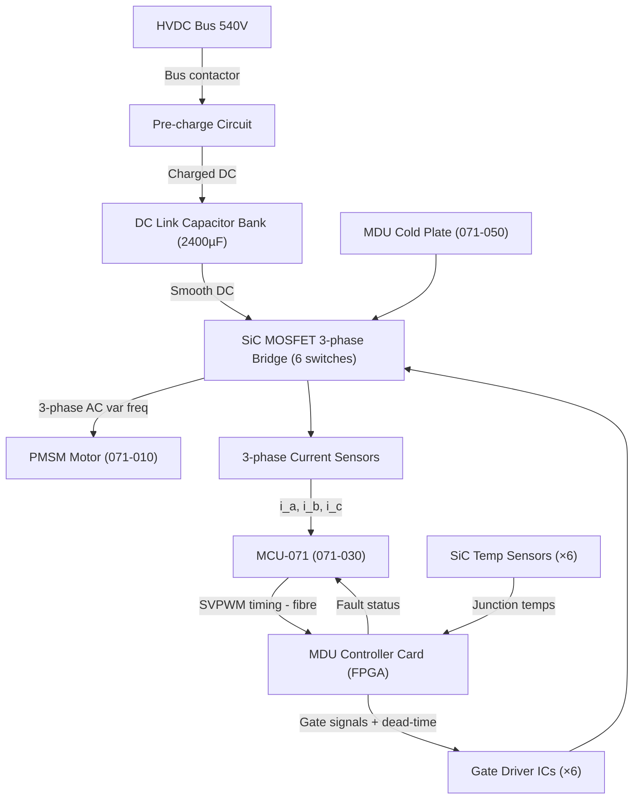
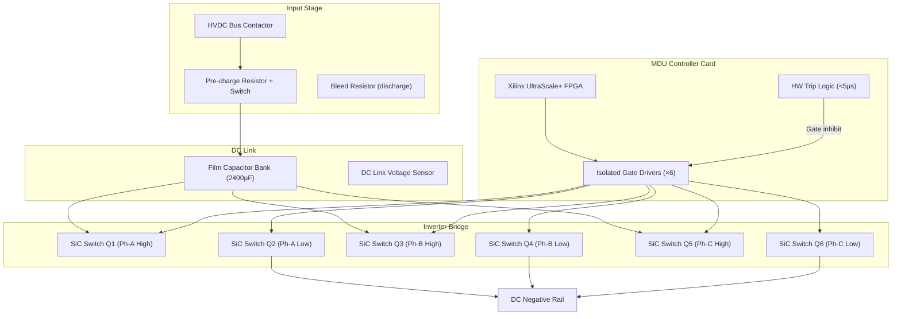

# Motor Drive Unit (MDU) and Inverter

---

## §0 Hyperlink Policy
All hyperlinks in this document are **relative**. Absolute URLs are forbidden.

## §1 Purpose
This document specifies the Motor Drive Unit (MDU) hardware design for the AMPEL360E eWTW, including the Silicon Carbide (SiC) MOSFET three-phase voltage-source inverter topology, DC link capacitor bank, gate drive circuitry, current sensing, and protection functions. It defines the MDU as the power electronics heart of the propulsion chain, converting 540 V HVDC bus power to variable-frequency AC for the PMSM.

## §2 Applicability
| Aircraft | Variant | MSN Range | Effectivity |
|---|---|---|---|
| AMPEL360E | eWTW | All | From EIS |

## §3 Functional Description 
Each Motor Drive Unit comprises a full three-phase two-level voltage-source inverter (VSI) built around six SiC MOSFET power switches rated at 1200 V / 600 A each (paralleled pairs giving 1200 A per switch position). Silicon Carbide is selected over conventional Si IGBTs to achieve lower switching losses at 20 kHz, enabling a more compact thermal design and reducing DC link ripple current. The 20 kHz switching frequency also shifts acoustic noise above human perception thresholds, important for urban and suburban operations. Each switch pair is mounted on a dedicated cold-plate segment of the MDU housing, cooled by the shared liquid cooling loop (see 071-050).

The DC link is provisioned with a film capacitor bank (total 2400 µF equivalent) designed to absorb PWM ripple current while limiting voltage overshoot to ≤5 % at maximum rated load step. A pre-charge circuit (soft-charge relay + NTC thermistor network) limits inrush current to ≤20 A during HVDC bus connection, protecting both the capacitor bank and bus contactors. A dedicated Insulated Gate Bipolar Transistor (IGBT) pre-charge switch and bleed resistor are included for controlled bus discharge during maintenance lockout. Current sensors (closed-loop Hall-effect, bandwidth 50 kHz) are placed in each of the three output phases and on the DC link, providing the MCU with real-time current vector data for FOC.

The MDU Controller Card (MDU-CC) is an FPGA-based board (Xilinx UltraScale+) that receives SVPWM gate timing from the MCU over a fibre-optic link, applies dead-time insertion (300 ns), and drives the isolated gate driver ICs for each SiC switch. The MDU-CC also performs local over-current, over-voltage, under-voltage, and over-temperature hardware trips within 5 µs, independent of MCU software, to provide hard-wired fault protection compliant with DO-254 DAL-B.

## §4 Functional Breakdown
| ID | Function | Description | Owner | DAL |
|---|---|---|---|---|
| F-071-020-01 | DC-AC Power Conversion | Convert 540 V DC input to 3-phase variable-frequency AC output for PMSM | Q-GREENTECH | DAL-B |
| F-071-020-02 | Gate Drive Control | Receive SVPWM timing from MCU, insert dead-time, and drive SiC MOSFET gates | Q-GREENTECH | DAL-B |
| F-071-020-03 | DC Link Voltage Regulation | Maintain stable DC link voltage via capacitor bank; limit pre-charge inrush | Q-GREENTECH | DAL-C |
| F-071-020-04 | Fault Current Protection | Hardware over-current trip (≤5 µs) isolating PMSM phases from HVDC bus | Q-GREENTECH | DAL-B |
| F-071-020-05 | Thermal Monitoring | Sense SiC junction and cold-plate temperatures; report to MHM and MCU | Q-MECHANICS | DAL-C |

## §5 System Context

## §6 Internal Architecture

## §7 Components and LRUs
| LRU ID | Name | P/N | Qty | Location |
|---|---|---|---|---|
| LRU-071-020-01 | SiC Power Module Assembly (3-phase bridge) | AMP-SiC-1200-3PH | 2 | MDU housing, per motor |
| LRU-071-020-02 | DC Link Capacitor Bank | AMP-DCLINK-2400 | 2 | MDU housing, per motor |
| LRU-071-020-03 | Gate Driver Board | AMP-GDB-071 | 2 | MDU housing, mounted on SiC module |
| LRU-071-020-04 | Current Sensor Assembly (3-phase + DC link) | AMP-CURSEN-071 | 2 | MDU phase output busbars |
| LRU-071-020-05 | MDU Controller Card (FPGA) | AMP-MDU-CC-071 | 2 | MDU control bay, per motor |

## §8 Interfaces
| Interface | Source | Destination | Protocol | Notes |
|---|---|---|---|---|
| IF-071-020-01 | HVDC Main Bus (071-080) | MDU DC input | 540 V DC, hardwire busbar | 1200 A peak capacity |
| IF-071-020-02 | MCU-071 (071-030) | MDU Controller Card | Fibre-optic serial, 100 Mbit/s | SVPWM timing + mode commands |
| IF-071-020-03 | MDU Controller Card | MCU-071 | CAN-FD | Fault status, temp telemetry |
| IF-071-020-04 | SiC bridge output | PMSM Terminal Box (071-010) | 3-phase AC via shielded cable | Lemo MIL-SPEC HV connector |
| IF-071-020-05 | Coolant loop (071-050) | MDU Cold Plate | Liquid coolant, ¾" SAE fitting | 8 L/min, ≤40 °C inlet |

## §9 Operating Modes
| Mode | Trigger | Description | Power State | Notes |
|---|---|---|---|---|
| Pre-charge | Bus connect command | Soft-charge DC link via NTC resistor network | Standby | Duration <2 s |
| Standby | Pre-charge complete | DC link at nominal voltage, gates inhibited | Standby | Ready for modulation in <10 ms |
| Motoring | Gate enable + SVPWM | Normal inverter operation driving PMSM | 0–100 % rated | FOC current commands from MCU |
| Regenerative | Negative torque demand | Power flow reversed; MDU acts as active rectifier | Negative | Limited by bus absorption capability |
| Fault Inhibit | Hardware trip | All gates inhibited within 5 µs; DC link held charged | Zero output | Fault logged; await MCU reset command |

## §10 Performance and Budgets 
| Parameter | Requirement | Current Estimate | Unit | Status |
|---|---|---|---|---|
| Switching frequency | 20 | 20 | kHz |  |
| DC input voltage range | 540 ±10 % | 486–594 | V |  |
| Peak output phase current | ≥3500 | 3500 | A |  |
| MDU conversion efficiency | ≥98.5 | 98.6 | % |  |
| SiC junction thermal limit | ≤175 °C | 85 °C (cold-plate) | °C |  |

## §11 Safety, Redundancy and Fault Tolerance
- Hardware over-current trip implemented in FPGA logic (DO-254 DAL-B) responds within 5 µs, fully independent of MCU software to prevent cascading failures from software faults.
- Dual-redundant DC link voltage sensors feed both the MDU Controller Card and MCU-071; disagreement between sensors within 5 % triggers a CAS advisory and a manual inspection requirement.
- SiC MOSFET gate drivers include desaturation detection circuits; if any switch exits saturation under current, the associated leg is hard-tripped within 500 ns, preventing uncontrolled energy dump.
- Pre-charge circuit limits inrush current to ≤20 A, protecting both DC link capacitors and HVDC bus contactors from mechanical fatigue due to repetitive high-current transients.
- Maintenance discharge path (bleed resistor + IGBT switch) reduces DC link to ≤50 V within 30 s after bus disconnection, enabling safe maintenance access per CDCCL safety requirements.

## §12 Maintenance and Diagnostics
| Task | Interval | Tool | Reference |
|---|---|---|---|
| DC link capacitor ESR and capacitance measurement | 1200 FH | AMP-CAP-TESTER-01 | AMM 071-20-11 |
| SiC module thermal resistance check (Rth-jc) | 600 FH | MDU BITE + thermal data log | AMM 071-20-21 |
| Gate driver isolation voltage test | C-check | BITE self-test or bench tester | AMM 071-20-31 |
| Current sensor offset and gain calibration | 600 FH | MCU calibration mode + PC tool | AMM 071-20-41 |

## §13 Footprint
| Dimension | Value | Unit | Notes |
|---|---|---|---|
| Physical mass | TBD | kg |  |
| Envelope | TBD | mm |  |
| Power draw (cont.) | TBD | W |  |
| Cooling demand | TBD | kW |  |
| Data interfaces | TBD | — |  |

## §14 Safety and Certification References
| Standard | Requirement | Applicability | Status | Notes |
|---|---|---|---|---|
| DO-178C | Software level per DAL | MCU software | Planned | DAL-B baseline |
| DO-254 | Hardware design assurance | MDU FPGA | Planned | DAL-B baseline |
| ARP4754A | System development | Motor system | Planned | System-level |
| CS-25 | Airworthiness requirements | Aircraft-level | Planned | EASA primary |
| FAR Part 25 | Airworthiness requirements | Aircraft-level | Planned | FAA bilateral |

## §15 V&V Approach
| Phase | Method | Tool/Facility | Status |
|---|---|---|---|
| SPICE / circuit simulation | SiC switching losses, DC link ripple, gate drive margins | LTspice + SiC vendor SPICE models |  |
| MDU hardware-in-the-loop | FPGA gate logic with simulated PMSM loads | AMP HIL rig AMP-HIL-071 |  |
| Full-power bench test | Efficiency map, switching waveforms, thermal soak at rated power | AMP Power Electronics Lab |  |
| EMC / DO-160G Section 16 | Conducted and radiated emissions, susceptibility | EMC certified test house |  |

## §16 Glossary
| Term | Definition |
|---|---|
| MDU | Motor Drive Unit — the inverter assembly for one PMSM channel |
| SiC MOSFET | Silicon Carbide Metal-Oxide-Semiconductor Field-Effect Transistor |
| VSI | Voltage-Source Inverter — inverter topology maintaining stiff DC link voltage |
| DC Link | Energy storage capacitor bank bridging the HVDC bus and inverter bridge |
| Dead-time | Blanking interval inserted between complementary gate signals to prevent shoot-through |
| SVPWM | Space Vector Pulse Width Modulation — optimal PWM technique minimising harmonics |
| Desaturation | Condition where MOSFET leaves linear saturation due to excessive current |
| Rth-jc | Junction-to-case thermal resistance of semiconductor device |
| ESR | Equivalent Series Resistance of capacitor; indicator of degradation |
| Pre-charge | Controlled DC link energisation to limit capacitor inrush current |

## §17 Open Issues
| ID | Description | Owner | Priority | Status |
|---|---|---|---|---|
| OI-071-020-001 | Confirm SiC module supplier qualification to AQS (Aviation Quality Standard) and radiation environment | @copilot | High | Open |
| OI-071-020-002 | Define EMI filter topology between HVDC contactor and MDU input (coordinate with 071-080) | @copilot | Medium | Open |

## §18 Status Legend
| Badge | Meaning |
|---|---|
|  | Content under active development |
|  | Value or content to be determined |
|  | Approved and baselined |
|  | Placeholder |

## §19 Related Documents
| Code | Title | Link |
|---|---|---|
| 071-000 | Electric Motor and Drive Systems — General Overview | [071-000-Electric-Motor-and-Drive-Systems-General.md](071-000-Electric-Motor-and-Drive-Systems-General.md) |
| 071-010 | PMSM Motor Design and Specifications | [071-010-PMSM-Motor-Design-and-Specifications.md](071-010-PMSM-Motor-Design-and-Specifications.md) |
| 071-030 | Motor Control Unit (MCU) and Control Laws | [071-030-Motor-Control-Unit-MCU-and-Control-Laws.md](071-030-Motor-Control-Unit-MCU-and-Control-Laws.md) |
| 071-040 | Boundary Layer Ingestion (BLI) Aerodynamic Integration | [071-040-Boundary-Layer-Ingestion-Integration.md](071-040-Boundary-Layer-Ingestion-Integration.md) |
| 071-050 | Motor Thermal Management System | [071-050-Motor-Thermal-Management.md](071-050-Motor-Thermal-Management.md) |
| 071-060 | Motor Health Monitoring and Diagnostics | [071-060-Motor-Health-Monitoring-and-Diagnostics.md](071-060-Motor-Health-Monitoring-and-Diagnostics.md) |
| 071-070 | Motor Mechanical Interface and Transmission | [071-070-Motor-Mechanical-Interface-and-Transmission.md](071-070-Motor-Mechanical-Interface-and-Transmission.md) |
| 071-080 | Motor Electrical Interface and Power Quality | [071-080-Motor-Electrical-Interface-and-Power-Quality.md](071-080-Motor-Electrical-Interface-and-Power-Quality.md) |
| 071-090 | S1000D CSDB Mapping and Traceability (071) | [071-090-S1000D-CSDB-Mapping-and-Traceability.md](071-090-S1000D-CSDB-Mapping-and-Traceability.md) |

## §20 Change Log
| Rev | Date | Author | Summary |
|---|---|---|---|
| 0.1 | 2026-05-11 | @copilot | Initial creation |
