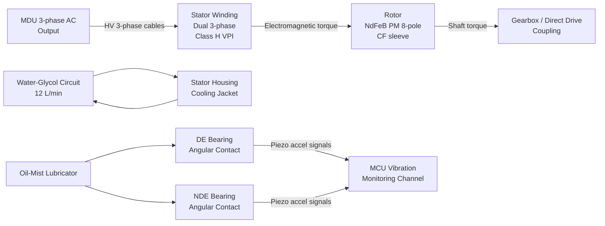
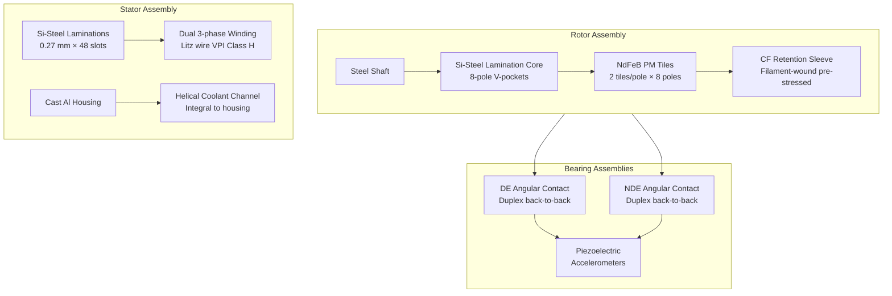

<!-- ──────────────────────────────────────────────────────────────────────────
     QATL-ATLAS-1000-ATLAS-070-079-071-020-MOTOR-ROTOR-STATOR-AND-BEARING-ASSEMBLIES
     ATA 71 · Motor Rotor, Stator and Bearing Assemblies
     AMPEL360E eWTW — ATLAS Register 1000
────────────────────────────────────────────────────────────────────────────── -->

# Motor Rotor, Stator and Bearing Assemblies

---

## §0 Hyperlink Policy

> All hyperlinks in this document are **relative** (five directory levels: `../../../../../`).
> Absolute URLs are forbidden. Every linked document must exist in the Q+ATLANTIDE repository
> before the link is activated. Broken links are treated as open issues and must be resolved
> before the document is promoted from `DRAFT` to `APPROVED`.

---

## §1 Purpose

This document describes the mechanical and electromagnetic sub-assemblies of the AMPEL360E eWTW traction motor: the **rotor assembly** (NdFeB PM tiles, laminated silicon-steel core, carbon fibre retention sleeve, shaft), the **stator assembly** (silicon-steel laminations, distributed dual 3-phase windings, Class H impregnation, water-glycol cooling jacket), and the **bearing assemblies** (drive-end and non-drive-end angular contact ball bearings, oil-mist lubrication, piezoelectric vibration sensors).

These assemblies are the core mechanical constituents of the PMSM-P and PMSM-S traction motors. Their correct assembly, handling, and condition monitoring are critical to achieving the 30 000 flight hour bearing L10 design life and maintaining the Class H insulation integrity throughout the motor service life.

---

## §2 Applicability

| Parameter | Value |
|---|---|
| Aircraft Program | AMPEL360E eWTW |
| ATA reference | ATA 71-020 — Motor Rotor, Stator and Bearing Assemblies |
| Certification basis | EASA CS-25 Amdt 27+; IEC 60034-25; ISO 15243 |
| S1000D SNS | 071-020-00 |

---

## §3 Functional Description ![DRAFT]

**Rotor assembly:** The rotor comprises a central steel shaft, a laminated silicon-steel core, and 8-pole NdFeB PM tiles embedded in V-shaped pockets (IPMSM topology). Each pole has two PM tiles per V-pocket, oriented to concentrate flux at the air-gap. The assembled PM-lamination stack is encased in a pre-stressed carbon fibre (CF) filament-wound retention sleeve which provides structural containment of PM fragments at speeds up to 120 % of maximum rated speed (4 800 rpm burst speed). The rotor assembly is dynamically balanced to ISO 21940 Grade G1.0. PM remanence is B_r ≥ 1.2 T (N42SH or equivalent grade); PM maximum operating temperature is 150 °C, above which irreversible demagnetisation risk increases.

**Stator assembly:** The stator is built from 0.27 mm silicon-steel laminations (NO27-1300) stacked and press-fitted into a cast aluminium housing. The 48 slots carry a dual 3-phase distributed winding (two independent 3-phase sets) wound from rectangular cross-section litz wire to minimise AC copper losses at 240 Hz fundamental. The complete winding assembly is vacuum-pressure impregnated (VPI) with thermally conductive epoxy resin (thermal conductivity ≥ 0.8 W/m·K) then cured at 160 °C. Insulation system is Class H (rated 180 °C). A helical water-glycol cooling channel is machined integral to the stator housing outer wall; inlet/outlet ports connect to the aircraft's water-glycol cooling circuit (see 071-050).

**Bearing assemblies:** The drive end (DE) and non-drive end (NDE) each carry a paired angular contact ball bearing (contact angle 40°, back-to-back duplex arrangement) rated to ISO standard for combined axial and radial loading. DE bearings are oil-mist lubricated via a controlled mist generator integrated into the drive end cap; NDE bearings share the same mist circuit. Each bearing housing incorporates a piezoelectric accelerometer (axial + radial axis) connected to the MCU vibration monitoring channel, enabling bearing defect frequency tracking and broadband RMS trending. Bearing design life is 30 000 FH at L10, based on ISO 281 calculation at maximum radial load combined with maximum axial preload at rated speed.

---

## §4 Functional Breakdown

| ID | Name | Description | Lead Division |
|---|---|---|---|
| F-001 | Rotor PM Assembly | NdFeB PM tiles (8-pole, V-pocket); Si-steel lamination stack; dynamic balance G1.0 | Q-GREENTECH |
| F-002 | CF Retention Sleeve | Carbon fibre filament-wound sleeve; burst containment to 120 % rated speed | Q-MECHANICS |
| F-003 | Stator Lamination Stack | NO27-1300 Si-steel; 48 slots; press-fit into aluminium housing | Q-GREENTECH |
| F-004 | Dual 3-Phase Winding | Litz wire rectangular section; VPI Class H; two independent 3-phase sets | Q-GREENTECH |
| F-005 | Water-Glycol Cooling Jacket | Helical channel integral to stator housing; 12 L/min; inlet ≤ 65 °C | Q-MECHANICS |
| F-006 | DE / NDE Bearing Assemblies | Angular contact ball bearings; oil-mist lubricated; piezo accelerometers for vibration monitoring | Q-MECHANICS |

---

## §5 System Context — Mermaid Diagram

---

## §6 Internal Architecture — Mermaid Diagram

---

## §7 Components and LRUs

| Component | Part Number | Qty | Location | Maintenance Interval | Notes |
|---|---|---|---|---|---|
| Rotor Assembly (with PM and CF sleeve) | ROT-071-TBD | 2 (P + S) | Inside PMSM housing | On condition (PM inspection after T > 150 °C event) | Dynamic balance G1.0; burst tested 120 % rated speed |
| Stator Assembly (with VPI winding and jacket) | STAT-071-TBD | 2 (P + S) | PMSM housing | On condition / VPI integrity check C-check | Class H; VPI epoxy thermal conductivity ≥ 0.8 W/m·K |
| DE Bearing Set (duplex angular contact) | BRG-DE-071-TBD | 2 (P + S) | PMSM drive end cap | On condition / L10 30 000 FH | Oil-mist lubricated; contact angle 40° |
| NDE Bearing Set (duplex angular contact) | BRG-NDE-071-TBD | 2 (P + S) | PMSM non-drive end cap | On condition / L10 30 000 FH | Identical to DE set |
| Piezoelectric Accelerometer (axial) | ACC-AX-071-TBD | 4 (2 per motor × 2 axes) | DE + NDE bearing housings | Replace with bearing | Shear-mode piezo; 0.1–10 000 Hz |
| Oil-Mist Lubricator | OML-071-TBD | 2 (1 per motor) | Motor drive end cap | Oil reservoir replenish per AMM schedule | ISO VG32 mineral oil or approved synthetic |

---

## §8 Interfaces

| Interface Type | Connected System | Protocol / Medium | Data / Function |
|---|---|---|---|
| MDU 3-phase output | MDU-P / MDU-S | HV 3-phase cable (MIL-spec, orange) | Motor excitation current to dual winding sets |
| Stator cooling jacket | ATA 71-050 / aircraft cooling circuit | Coolant hose (quick-disconnect) | Water-glycol coolant; heat rejection from stator |
| Bearing vibration sensors | MCU vibration monitoring | Shielded sensor cable | Piezo accelerometer signals; axial + radial per bearing |
| Oil-mist lubrication | Aircraft lube system (local) | Oil supply tube | ISO VG32 oil mist to DE and NDE bearings |
| Drivetrain shaft | Gearbox / direct drive coupling | Splined shaft flange | Torque output; axial and radial loads |
| NTC thermistors (8 per motor) | MCU thermal model | Sensor cable, shielded | Stator winding temperature per phase group |

---

## §9 Operating Modes

| Mode | Trigger | System State | Actions / Consequences |
|---|---|---|---|
| Motoring | MDU powered; torque command active | PMSM converting electrical to mechanical energy | Stator current heating; cooling jacket active |
| Regenerating | EMS regen command; landing roll | PMSM acting as generator | Stator current heating from braking current |
| Idle / coasting | MDU gate signals inhibited | Rotor spinning in residual air-gap flux | Bearing oil-mist continues; minimal heat generation |
| Thermal derating | Stator winding temp 155–175 °C | MCU reduces Iq setpoint | Power derated; ECAM amber caution; coolant pump verified |
| Shutdown (overheat) | Stator winding temp ≥ 175 °C | MCU commands MDU gate shutdown | Motor unpowered; turbofan takes full thrust load |

---

## §10 Performance and Budgets ![DRAFT]

| Parameter | Requirement | Target / Design Value | Status |
|---|---|---|---|
| PM operating temp limit | ≤ 150 °C | < 130 °C (continuous); 150 °C max transient | ![TBD] |
| Stator winding temp limit (Class H) | ≤ 180 °C | Derate at 155 °C; shutdown at 175 °C | ![TBD] |
| Bearing L10 design life | ≥ 25 000 FH | 30 000 FH | ![TBD] |
| Rotor balance grade | ISO G2.5 or better | G1.0 | ![TBD] |
| Winding insulation resistance (IR) | ≥ 100 MΩ at 1 000 V DC | ≥ 100 MΩ | ![TBD] |
| Partial discharge inception voltage | ≥ 1.5× rated voltage | ≥ 1.5× (per IEC 60034-25) | ![TBD] |
| Bearing vibration alarm threshold | Broadband RMS per MCU map | Operator-defined per vibration trending baseline | ![TBD] |

---

## §11 Safety, Redundancy and Fault Tolerance

- The CF retention sleeve provides primary structural containment of PM tiles in the event of PM adhesion failure; sleeve integrity is confirmed at manufacture by over-speed burst test to 120 % of maximum operating speed.
- All bearing and winding replacement tasks require HVDC 540 V isolation (LOTO) before opening the motor end cap; residual DC-link charge must be verified < 60 V (MDU active discharge confirmation).
- PM demagnetisation risk is managed via the MCU thermal event log: any recorded PM temperature exceedance above 150 °C triggers mandatory PM inspection per AMM procedure before return to service.
- NTC thermistors at 8 locations per motor (2 per phase group) provide redundant stator temperature feedback; loss of all 8 sensors triggers MCU to apply conservative derating based on coolant outlet temperature.
- Oil-mist lubrication failure (low oil level) is detected by the oil-mist lubricator level sensor and annunciated to the MCU; bearings have a minimum run-dry capability of 30 minutes at reduced load.

---

## §12 Maintenance and Diagnostics

| Task | Interval | Access | Special Tools |
|---|---|---|---|
| Bearing vibration trend review (ACARS download) | A-check | CMS/ACARS | ACARS terminal; MCU event log |
| NTC thermistor continuity check | B-check | Motor terminal box | Multimeter |
| Stator insulation resistance test (1 000 V DC) | B-check | HV connector disconnected | Insulation tester (1 000 V DC) |
| Partial discharge test | C-check | HV connector disconnected; PD tester applied | PD tester per IEC 60034-25 |
| Bearing replacement (on vibration fault) | On condition | Wing nacelle; motor DE/NDE end cap removal | Bearing puller; induction heater; HVDC LOTO kit |
| Oil-mist oil reservoir replenish | Per AMM schedule | Motor drive end cap access panel | Approved ISO VG32 oil; torque wrench |
| PM inspection (after thermal exceedance) | On condition | Full rotor extraction | OEM PM Gauss-meter test fixture; CF sleeve inspection |

---

## §13 Footprint — Physical, Electrical, Maintenance, Data ![TBD]

| Footprint Type | Parameter | Value | Notes |
|---|---|---|---|
| Physical | Rotor PM mass (per motor) | ![TBD] | High-strength NdFeB; rare-earth supply chain consideration |
| Physical | Stator lamination stack length | ![TBD] | Pending EM design freeze |
| Physical | Motor total mass | ![TBD] | Target ≤ 120 kg per motor |
| Thermal | Stator heat rejection rate (rated point) | ![TBD] | Input to cooling circuit sizing (see 071-050) |
| Maintenance | Rotor extraction envelope | ![TBD] | Wing nacelle must clear rotor length |

---

## §14 Safety and Certification References ![DRAFT]

| Standard / Document | Title | Issuing Body | Applicability |
|---|---|---|---|
| IEC 60034-25 | Rotating Electrical Machines — AC motors for power drive systems | IEC | PMSM design, insulation and PD testing |
| IEC 60034-1 | Rotating Electrical Machines — Rating and Performance | IEC | Temperature class definition (Class H = 180 °C) |
| ISO 21940-11 | Mechanical vibration — Rotor balancing (balance quality grades) | ISO | Dynamic balance Grade G1.0 |
| ISO 15243 | Rolling bearings — Damage and failure classification | ISO | Bearing fault classification for maintenance |
| ISO 281 | Rolling bearings — Dynamic load ratings and rating life | ISO | L10 bearing life calculation |

---

## §15 V&V Approach ![TBD]

| Phase | Method | Acceptance Criterion | Status |
|---|---|---|---|
| Design | FEM thermal and structural analysis | Winding temp ≤ 155 °C at rated; rotor stress < yield at 120 % speed | ![TBD] |
| Component test | Rotor over-speed burst test (120 % rated) | No PM fragment release; CF sleeve intact | ![TBD] |
| Component test | Stator VPI cure and IR test | IR ≥ 100 MΩ; PD inception ≥ 1.5× rated voltage | ![TBD] |
| Component test | Bearing endurance test at rated load/speed | L10 ≥ 30 000 FH by Weibull extrapolation | ![TBD] |
| Qualification | DO-160G temperature and vibration qualification | All categories pass | ![TBD] |

---

## §16 Glossary

| Term | Definition |
|---|---|
| **NdFeB** | Neodymium Iron Boron — rare-earth PM material with the highest energy product; used in IPMSM rotor tiles. |
| **CF retention sleeve** | Carbon fibre filament-wound sleeve pre-stressed onto rotor OD; contains PM tiles at high rotor speeds. |
| **Class H insulation** | IEC temperature class for winding insulation rated to 180 °C maximum hotspot temperature. |
| **VPI** | Vacuum Pressure Impregnation — process for fully filling stator winding interstices with thermally conductive epoxy. |
| **Angular contact bearing** | Rolling bearing designed to carry both radial and axial loads; contact angle 40° for this application. |
| **Oil-mist lubrication** | Lubrication method feeding oil as fine mist entrained in air to bearing surfaces; reduces churning loss vs splash lubrication. |
| **L10 life** | Bearing fatigue life at which 10 % of a population is expected to fail under given load; expressed in operating hours. |
| **PD (partial discharge)** | Localised electrical discharge in insulation not bridging both conductors; inception voltage testing per IEC 60034-25. |

---

## §17 Open Issues

| ID | Description | Owner | Target |
|---|---|---|---|
| OI-071-020-001 | Confirm PM grade (N42SH vs N45UH) for 150 °C limit; obtain OEM PM datasheet | Q-GREENTECH | 2026-Q4 |
| OI-071-020-002 | Finalise stator housing material (cast Al vs forged Al) and cooling channel geometry | Q-MECHANICS | 2026-Q4 |
| OI-071-020-003 | Define oil-mist lubricator oil change interval based on operating temperature profile | Q-MECHANICS | 2027-Q1 |

---

## §18 Status Legend

| Badge | Meaning |
|---|---|
| `![DRAFT]` | Section is drafted but not yet reviewed |
| `![TBD]` | Content not yet started — to be defined |
| `![To Be Completed]` | Partially complete — needs additional content |
| `![APPROVED]` | Reviewed and formally approved |

---

## §19 Related Documents (Siblings in this Subsection)

- [071-000](./071-000-Electric-Motor-and-Drive-Systems-General.md)
- [071-010](./071-010-Traction-Motor-Architecture.md)
- [071-030](./071-030-Inverter-and-Motor-Drive-Unit.md)
- [071-040](./071-040-Motor-Control-and-Torque-Command.md)
- [071-050](./071-050-Motor-Cooling-and-Thermal-Protection.md)
- [071-060](./071-060-Motor-Power-Connectors-and-Insulation.md)
- [071-070](./071-070-Motor-Inspection-Test-and-Maintenance.md)
- [071-080](./071-080-Electric-Drive-Monitoring-Diagnostics-and-Control-Interfaces.md)
- [071-090](./071-090-S1000D-CSDB-Mapping-and-Traceability.md)

---

## §20 Change Log

| Rev | Date | Author | Description |
|---|---|---|---|
| 0.1 | 2026-05-11 | @copilot | Initial DRAFT — contextualized content per AMPEL360E eWTW architecture |
