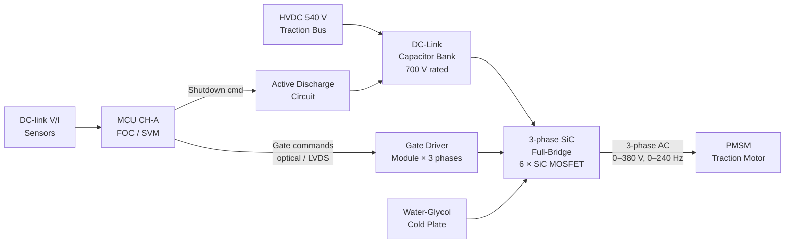
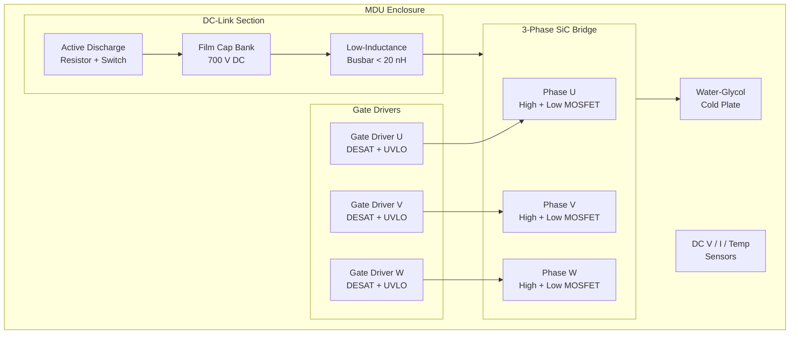

<!-- ──────────────────────────────────────────────────────────────────────────
     QATL-ATLAS-1000-ATLAS-070-079-071-030-INVERTER-AND-MOTOR-DRIVE-UNIT
     ATA 71 · Inverter and Motor Drive Unit (MDU)
     AMPEL360E eWTW — ATLAS Register 1000
────────────────────────────────────────────────────────────────────────────── -->

# Inverter and Motor Drive Unit (MDU)

---

## §0 Hyperlink Policy

> All hyperlinks in this document are **relative** (five directory levels: `../../../../../`).
> Absolute URLs are forbidden. Every linked document must exist in the Q+ATLANTIDE repository
> before the link is activated. Broken links are treated as open issues and must be resolved
> before the document is promoted from `DRAFT` to `APPROVED`.

---

## §1 Purpose

This document defines the Motor Drive Unit (MDU) architecture for the AMPEL360E eWTW traction drive. Each MDU is a **3-phase Silicon Carbide (SiC) MOSFET full-bridge inverter** that converts the HVDC 540 V traction bus voltage to variable-frequency, variable-amplitude 3-phase AC power to drive the PMSM traction motor.

Two identical MDUs are installed: MDU-P (port) and MDU-S (starboard). Each MDU includes the SiC power bridge, gate driver module with programmable dead-time, a film capacitor DC-link bank, an active discharge circuit, a water-glycol cooled cold plate, and a control interface that receives switching commands from the MCU via a high-speed gate command link.

The SiC MOSFET technology (vs conventional Si IGBT) was selected to achieve ≥ 98 % inverter efficiency at 20 kHz switching frequency, reducing the thermal load on the cold plate and enabling a 20 kHz switching frequency that keeps the fundamental output voltage harmonic content (THD) below 3 % without additional output filter inductors.

---

## §2 Applicability

| Parameter | Value |
|---|---|
| Aircraft Program | AMPEL360E eWTW |
| ATA reference | ATA 71-030 — Inverter and Motor Drive Unit |
| Certification basis | EASA CS-25 Amdt 27+; DO-160G; IEC 61800-5-1 |
| S1000D SNS | 071-030-00 |

---

## §3 Functional Description ![DRAFT]

**SiC MOSFET full-bridge:** The inverter stage uses six SiC MOSFET devices arranged in a 3-phase H-bridge (2 devices per phase leg: high-side and low-side switches). SiC MOSFETs are used in preference to Si IGBTs because: (a) lower switching losses at 20 kHz enable higher switching frequency with < 1 % switching loss penalty; (b) higher junction temperature rating (175 °C vs 150 °C for Si IGBT) reduces cold plate sizing requirements; (c) faster switching transitions (< 50 ns rise/fall) yield lower THD at the same switching frequency.

**Gate driver module:** Each phase leg gate driver is a dual-channel isolated driver providing ±18 V gate drive with programmable dead-time (200–500 ns, default 300 ns). The gate driver provides desaturation (DESAT) over-current detection and under-voltage lockout (UVLO) for the gate supply. Gate driver signals are galvanically isolated from the control logic via signal transformers.

**DC-link capacitor bank:** The DC-link uses film capacitors (polypropylene, self-healing) arranged in a low-inductance busbar. Total capacitance is sized to limit DC-link voltage ripple to < 2 % at rated power. The busbar has stray inductance < 20 nH. Capacitor operating voltage is rated 700 V DC (30 % margin over 540 V nominal).

**Active discharge circuit:** On MDU shutdown or isolation command, the active discharge circuit connects a power resistor across the DC-link capacitors, reducing DC-link voltage from 540 V to < 60 V within 5 seconds. This ensures safe access to HV connectors after shutdown per IEC 60664-1 SELV limits. Discharge status is reported to the MCU.

**Cold plate cooling:** The SiC device mounting surface is thermally bonded to a liquid-cooled aluminium cold plate through which water-glycol coolant flows. Cold plate inlet temperature is ≤ 65 °C; flow rate is shared with the stator cooling circuit (see 071-050). SiC junction temperature limit is 175 °C; the cold plate is sized to keep junction temperatures below 165 °C at rated power.

---

## §4 Functional Breakdown

| ID | Name | Description | Lead Division |
|---|---|---|---|
| F-001 | SiC MOSFET Inverter Bridge | 3-phase full-bridge; 6 SiC MOSFETs; switching frequency 20 kHz; peak current 1 200 A | Q-GREENTECH |
| F-002 | Gate Driver + Dead-Time Control | Dual-channel isolated drivers per phase; DESAT over-current; UVLO; dead-time 300 ns | Q-HPC |
| F-003 | DC-Link Capacitor Bank | Film capacitors (PP self-healing); 700 V DC rated; ripple < 2 %; stray inductance < 20 nH | Q-GREENTECH |
| F-004 | Active Discharge Circuit | Power resistor + switch; reduces DC-link to < 60 V within 5 s on shutdown/isolation command | Q-GREENTECH |
| F-005 | MDU Cold Plate (water-glycol) | Aluminium cold plate; shared cooling circuit with stator jacket; SiC junction ≤ 165 °C | Q-MECHANICS |
| F-006 | MDU Control Interface (from MCU) | High-speed gate command link (optical fibre or LVDS); switching command signals from MCU | Q-HPC |

---

## §5 System Context — Mermaid Diagram

---

## §6 Internal Architecture — Mermaid Diagram

---

## §7 Components and LRUs

| Component | Part Number | Qty | Location | Maintenance Interval | Notes |
|---|---|---|---|---|---|
| MDU-P Port Motor Drive Unit | MDU-071-P-TBD | 1 | Port wing electronics bay | On fault / SiC inspection C-check | SiC MOSFET; 540 V in; 380 V AC out; 1 200 A peak |
| MDU-S Stbd Motor Drive Unit | MDU-071-S-TBD | 1 | Stbd wing electronics bay | On fault / SiC inspection C-check | Identical to MDU-P |
| DC-Link Film Capacitor Bank | CAP-071-TBD | 2 (1 per MDU) | Inside MDU enclosure | C-check capacitance / ESR measurement | PP self-healing; 700 V DC; replace on degradation |
| Active Discharge Resistor Module | DISC-071-TBD | 2 (1 per MDU) | Inside MDU enclosure | Inspect at C-check | Replace if resistance drift > 5 % from nominal |
| MDU Cold Plate Assembly | COLD-071-TBD | 2 (1 per MDU) | MDU thermal interface | Flush coolant circuit at C-check | Aluminium; bonded to SiC device mounting surface |

---

## §8 Interfaces

| Interface Type | Connected System | Protocol / Medium | Data / Function |
|---|---|---|---|
| HVDC 540 V input | ATA 24 / ATA 79 traction bus | HV DC cable, orange, MIL-spec | DC power supply to MDU; up to 640 V DC (peak) |
| 3-phase AC output | PMSM traction motor (ATA 71-020) | HV 3-phase cable, orange, MIL-spec | Variable frequency 3-phase AC; 0–380 V, 0–240 Hz |
| Gate command link | MCU (ATA 71-040) | Optical fibre or LVDS; galvanically isolated | Switching commands; switching frequency 20 kHz |
| Cooling circuit | ATA 71-050 water-glycol cooling | Coolant hose (quick-disconnect) | Cold plate coolant; max inlet 65 °C; flow per circuit design |
| MDU status and diagnostics | MCU (ATA 71-040) | Isolated digital/analogue signals | DC-link voltage, output current, junction temp, DESAT faults |
| Active discharge status | MCU | Digital signal | Discharge complete flag (< 60 V); interlock for maintenance access |

---

## §9 Operating Modes

| Mode | Trigger | System State | Actions / Consequences |
|---|---|---|---|
| Active inverting | MCU gate commands active; HVDC bus healthy | SiC bridge switching at 20 kHz; 3-phase output to PMSM | Motor driven per FOC torque command; DC-link regulated |
| Active rectifying (regen) | EMS regen command; landing roll | SiC bridge in rectifier mode; PMSM feeds DC-link | Kinetic energy converted to DC; battery charging via traction bus |
| Standby (gate inhibit) | Turbofan-only; MCU gate inhibit signal | Gate drivers held off; DC-link at HVDC bus voltage | No output current; HVDC bus remains connected |
| Active discharge | Shutdown / HVDC isolation command | Discharge resistor across DC-link | DC-link drops to < 60 V within 5 s; MCU confirms |
| Fault shutdown | DESAT over-current; UVLO; over-temp | Gate signals inhibited by gate driver hardware | MDU faulted; MCU logs event; ECAM amber/red annunciation |

---

## §10 Performance and Budgets ![DRAFT]

| Parameter | Requirement | Target / Design Value | Status |
|---|---|---|---|
| Output voltage (phase-phase) | 0–380 V AC | 0–380 V AC rms | ![TBD] |
| Peak output current | ≥ 1 100 A | 1 200 A | ![TBD] |
| Efficiency at rated power | ≥ 97 % | ≥ 98 % | ![TBD] |
| Switching frequency | 20 kHz | 20 kHz | ![TBD] |
| Output voltage THD | < 5 % | < 3 % | ![TBD] |
| DC-link ripple voltage | < 5 % of nominal | < 2 % | ![TBD] |
| Active discharge time (540 V → 60 V) | ≤ 10 s | ≤ 5 s | ![TBD] |
| SiC junction temp limit | ≤ 175 °C | ≤ 165 °C at rated | ![TBD] |

---

## §11 Safety, Redundancy and Fault Tolerance

- DESAT over-current detection in each gate driver provides hardware-level over-current protection independent of MCU software; response time < 3 μs.
- Active discharge ensures DC-link voltage < 60 V within 5 s of isolation, meeting SELV requirement for maintenance personnel safety (IEC 60664-1).
- MDU-P and MDU-S are electrically independent; a fault in one MDU does not affect the other drive train.
- Film capacitors are self-healing: localised dielectric breakdown events cause local metallisation clearing, maintaining capacitor function up to a defined energy threshold. Capacitance degradation is monitored at C-check.
- SiC MOSFET short-circuit withstand time is ≥ 2 μs, providing sufficient time for DESAT protection to activate before device damage.

---

## §12 Maintenance and Diagnostics

| Task | Interval | Access | Special Tools |
|---|---|---|---|
| Active discharge functional test | C-check | MDU service port | MDU GSE; voltage meter (< 60 V confirmation) |
| DC-link capacitor capacitance and ESR measurement | C-check | MDU enclosure open | Capacitor tester (LCR meter) |
| SiC device visual inspection (solder joint integrity) | C-check | MDU enclosure open | Inspection camera; thermal imaging camera |
| Cold plate coolant flush and leak check | C-check | Cooling circuit access | Coolant flush pump; pressure leak test kit |
| MDU LRU replacement (on fault) | On condition | Wing electronics bay — ~4 h task | MDU extraction tool; HVDC LOTO kit; torque wrench |

---

## §13 Footprint — Physical, Electrical, Maintenance, Data ![TBD]

| Footprint Type | Parameter | Value | Notes |
|---|---|---|---|
| Physical | MDU mass | ![TBD] | Includes cold plate; target ≤ 25 kg |
| Physical | MDU envelope | ![TBD] | Wing electronics bay allocation |
| Electrical | Peak power loss (per MDU) | ~12 kW at 600 kW output | Based on ≥ 98 % efficiency; cold plate sizing input |
| Maintenance | MDU access | Wing electronics bay panel | Line maintenance classification TBD |

---

## §14 Safety and Certification References ![DRAFT]

| Standard / Document | Title | Issuing Body | Applicability |
|---|---|---|---|
| IEC 61800-5-1 | Adjustable speed electrical power drive systems — Safety requirements | IEC | MDU safety requirements; active discharge |
| IEC 60664-1 | Insulation coordination — Low-voltage equipment | IEC | SELV limit 60 V for maintenance access |
| DO-160G | Environmental Conditions and Test Procedures | RTCA | MDU environmental qualification (EMI, vibration, temp) |
| EASA CS-25 Amdt 27+ | Certification Specifications for Large Aeroplanes | EASA | Primary airworthiness basis |
| MIL-STD-461G | Requirements for the Control of Electromagnetic Interference | DoD | EMC requirements for MDU shielding |

---

## §15 V&V Approach ![TBD]

| Phase | Method | Acceptance Criterion | Status |
|---|---|---|---|
| Design | Loss modelling (SiC datasheet + switching waveforms) | Efficiency ≥ 98 % at rated; junction temp < 165 °C | ![TBD] |
| Component test | MDU efficiency test (calorimetric) | Efficiency ≥ 98 % at 500 kW rated point | ![TBD] |
| Component test | Active discharge test | DC-link ≤ 60 V within 5 s from 540 V | ![TBD] |
| Component test | THD measurement at rated current | THD < 3 % | ![TBD] |
| Qualification | DO-160G EMI / environmental | All categories pass | ![TBD] |

---

## §16 Glossary

| Term | Definition |
|---|---|
| **SiC MOSFET** | Silicon Carbide Metal-Oxide-Semiconductor Field-Effect Transistor — wide-bandgap power semiconductor with lower switching losses than Si IGBT. |
| **DC-link** | The DC capacitor bank connecting the HVDC bus input to the inverter bridge; buffers energy during switching. |
| **DESAT** | Desaturation detection — gate driver protection that detects MOSFET over-current by monitoring on-state voltage. |
| **UVLO** | Under-Voltage Lockout — gate driver feature preventing switch-on if gate supply is below minimum threshold. |
| **Active discharge** | Circuit that rapidly dissipates DC-link capacitor energy through a resistor on shutdown; mandatory for maintenance safety. |
| **Dead-time** | Minimum off-time inserted between high-side and low-side switching to prevent shoot-through (direct HVDC short-circuit). |
| **Film capacitor** | Polypropylene dielectric capacitor with self-healing capability; preferred for DC-link due to low ESR and high ripple current rating. |
| **THD** | Total Harmonic Distortion — measure of output voltage/current harmonic content relative to fundamental. |

---

## §17 Open Issues

| ID | Description | Owner | Target |
|---|---|---|---|
| OI-071-030-001 | Select SiC MOSFET device part number and confirm avalanche rating in HVDC 540 V circuit | Q-GREENTECH | 2026-Q4 |
| OI-071-030-002 | Finalise DC-link capacitance and busbar inductance with electromagnetic simulation | Q-GREENTECH | 2026-Q4 |
| OI-071-030-003 | Complete DO-160G EMI pre-compliance test plan for MDU | Q-INDUSTRY | 2027-Q1 |

---

## §18 Status Legend

| Badge | Meaning |
|---|---|
| `![DRAFT]` | Section is drafted but not yet reviewed |
| `![TBD]` | Content not yet started — to be defined |
| `![To Be Completed]` | Partially complete — needs additional content |
| `![APPROVED]` | Reviewed and formally approved |

---

## §19 Related Documents (Siblings in this Subsection)

- [071-000](./071-000-Electric-Motor-and-Drive-Systems-General.md)
- [071-010](./071-010-Traction-Motor-Architecture.md)
- [071-020](./071-020-Motor-Rotor-Stator-and-Bearing-Assemblies.md)
- [071-040](./071-040-Motor-Control-and-Torque-Command.md)
- [071-050](./071-050-Motor-Cooling-and-Thermal-Protection.md)
- [071-060](./071-060-Motor-Power-Connectors-and-Insulation.md)
- [071-070](./071-070-Motor-Inspection-Test-and-Maintenance.md)
- [071-080](./071-080-Electric-Drive-Monitoring-Diagnostics-and-Control-Interfaces.md)
- [071-090](./071-090-S1000D-CSDB-Mapping-and-Traceability.md)

---

## §20 Change Log

| Rev | Date | Author | Description |
|---|---|---|---|
| 0.1 | 2026-05-11 | @copilot | Initial DRAFT — contextualized content per AMPEL360E eWTW architecture |
