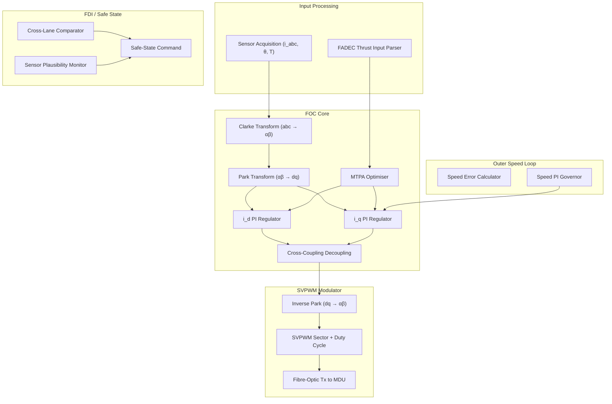

# Motor Control Unit (MCU) and Control Laws


---

## §0 Hyperlink Policy
All hyperlinks in this document are **relative**. Absolute URLs are forbidden.

## §1 Purpose
This document defines the Motor Control Unit (MCU) hardware architecture and the embedded control law suite used for the AMPEL360E eWTW PMSM propulsion system. It covers Field-Oriented Control (FOC), the FADEC thrust-to-torque mapping interface, Maximum Torque Per Ampere (MTPA) optimisation, Space Vector PWM (SVPWM) generation, speed and current regulation loop design, and the Fault Detection and Isolation (FDI) logic. It is the primary software and control design reference for MCU-071.

## §2 Applicability
| Aircraft | Variant | MSN Range | Effectivity |
|---|---|---|---|
| AMPEL360E | eWTW | All | From EIS |

## §3 Functional Description 
The Motor Control Unit (MCU-071) is a dual-redundant embedded computing platform implementing the complete closed-loop control of both PMSM channels. The primary lane hosts the real-time control algorithms at a 100 µs control cycle rate (10 kHz), while the monitor lane runs identical software at the same rate for cross-lane comparison. Disagreement in output between lanes beyond a configurable tolerance triggers a safe-state transition within one cycle, isolating the faulty lane and notifying FADEC. The processor is an ARINC 653-capable dual-core safety processor (e.g., NXP MPC5748G or equivalent qualified to DO-254 DAL-B), with 2 MB safety RAM and 8 MB NOR flash for persistent data logging.

The core control algorithm is Field-Oriented Control (FOC) implemented in the rotating d-q reference frame. Rotor angular position θ from the dual resolver feeds a Park transformation to decompose three-phase stator currents (i_a, i_b, i_c, sampled at 100 µs) into flux-axis (i_d) and torque-axis (i_q) components. The MTPA algorithm computes the optimal i_d/i_q ratio at each operating point to maximise torque per unit current, minimising copper losses throughout the envelope. In the field-weakening region (above base speed ≈4500 rpm), the MCU applies a negative i_d reference to limit stator back-EMF within the MDU DC link voltage capability. An outer speed governor loop (proportional-integral, bandwidth 20 Hz) provides the i_q reference for cruise steady-state, while a direct torque demand path bypasses the speed loop for transient response during thrust changes.

FADEC communicates via ARINC 429 (primary) and AFDX (secondary) with thrust demand in the range 0–100 % normalised, which the MCU maps to a torque reference using a pre-computed thrust-to-torque look-up table that includes BLI fan loading and propulsive efficiency models. SVPWM sector calculation and duty-cycle update are performed in a dedicated sub-task synchronised to the 20 kHz MDU switching frequency. The resulting six gate-timing values are transmitted to the MDU Controller Card over a fibre-optic serial link for dead-time insertion and hardware trip supervision.

## §4 Functional Breakdown
| ID | Function | Description | Owner | DAL |
|---|---|---|---|---|
| F-071-030-01 | Thrust-to-Torque Demand Processing | Receive FADEC thrust demand and compute torque reference via look-up table | Q-GREENTECH | DAL-B |
| F-071-030-02 | Field-Oriented Control | Implement Park/Clarke transforms, i_d/i_q regulators, and MTPA optimisation | Q-GREENTECH | DAL-B |
| F-071-030-03 | Space Vector PWM Generation | Compute SVPWM sector, duty cycles, and transmit gate timing to MDU | Q-GREENTECH | DAL-B |
| F-071-030-04 | Speed Governor | Outer PI speed loop providing steady-state i_q reference at cruise | Q-GREENTECH | DAL-C |
| F-071-030-05 | Fault Detection and Isolation | Cross-lane comparison, sensor plausibility checks, safe-state transitions | Q-HPC | DAL-B |

## §5 System Context
```mermaid
graph TD
    FADEC["FADEC"] -->|Thrust demand ARINC 429 / AFDX| MCU["MCU-071 (Primary + Monitor lanes)"]
    MCU -->|SVPWM gate timing - fibre| MDU_P["MDU — Port (071-020)"]
    MCU -->|SVPWM gate timing - fibre| MDU_S["MDU — Stbd (071-020)"]
    RES_P["Resolver — Port (071-010)"] -->|θ (angle)| MCU
    RES_S["Resolver — Stbd (071-010)"] -->|θ (angle)| MCU
    CUR_P["Phase Current Sensors — Port"] -->|i_abc| MCU
    CUR_S["Phase Current Sensors — Stbd"] -->|i_abc| MCU
    TEMP["Motor Temp Sensors (071-010)"] -->|Winding temps| MCU
    MCU -->|Fault + health data CAN-FD| MHM["MHM (071-060)"]
    MCU -->|Status ARINC 429| FADEC
```

## §6 Internal Architecture


## §7 Components and LRUs
| LRU ID | Name | P/N | Qty | Location |
|---|---|---|---|---|
| LRU-071-030-01 | MCU Processor Board (dual-lane) | AMP-MCU-PROC-071 | 1 | Avionics bay aft |
| LRU-071-030-02 | MCU I/O Board (sensor inputs + bus interfaces) | AMP-MCU-IO-071 | 1 | Avionics bay aft |
| LRU-071-030-03 | Resolver Interface Card (2 channels) | AMP-MCU-RIC-071 | 1 | Avionics bay aft |
| LRU-071-030-04 | CAN-FD / ARINC 429 / AFDX Gateway | AMP-MCU-GW-071 | 1 | Avionics bay aft |
| LRU-071-030-05 | MCU Power Supply Module (28 V → 5 V / 3.3 V) | AMP-MCU-PSU-071 | 1 | Avionics bay aft |

## §8 Interfaces
| Interface | Source | Destination | Protocol | Notes |
|---|---|---|---|---|
| IF-071-030-01 | FADEC | MCU-071 | ARINC 429 (primary) + AFDX (secondary) | Thrust demand + mode, 100 ms update |
| IF-071-030-02 | Dual Resolver (port + stbd) | MCU Resolver Interface Card | Analogue sine/cosine, 10 V ref | 2-channel, shielded pair |
| IF-071-030-03 | Phase current sensors (MDU) | MCU I/O Board | Analogue ±10 V, 50 kHz BW | 6 channels (3 per motor) |
| IF-071-030-04 | MCU-071 | MDU Controller Card (×2) | Fibre-optic serial 100 Mbit/s | SVPWM timing per channel |
| IF-071-030-05 | MCU-071 | MHM (071-060) | CAN-FD | Fault codes, loop state, diagnostics |

## §9 Operating Modes
| Mode | Trigger | Description | Power State | Notes |
|---|---|---|---|---|
| BITE / Initialise | Power-on | Self-test of all lanes, sensor checks, FADEC handshake | Standby | <30 s to ready state |
| Torque Control | FADEC direct torque demand | Speed loop bypassed; torque reference directly from FADEC | Variable | Used during transient manoeuvres |
| Speed Control | FADEC speed set-point | Outer speed governor active; i_q demand from PI | Variable | Steady cruise and taxi |
| Field Weakening | Speed > base speed | Negative i_d applied; power maintained at speed limit | Full power | Back-EMF protection active |
| Safe State | FDI trip or FADEC inhibit | Gates inhibited; MCU retains logs and alerts FADEC | Zero | Await ground reset command |

## §10 Performance and Budgets 
| Parameter | Requirement | Current Estimate | Unit | Status |
|---|---|---|---|---|
| Torque response (demand to 90 % actual) | ≤5 | 4.5 | ms |  |
| Speed control accuracy (steady-state) | ±0.5 | ±0.3 | rpm |  |
| Current loop closed-loop bandwidth | ≥2000 | 2200 | Hz |  |
| Control cycle time | 100 | 100 | µs |  |
| Thrust resolution | 0.1 | 0.1 | % |  |

## §11 Safety, Redundancy and Fault Tolerance
- Dual primary+monitor processor lanes with cycle-synchronous cross-comparison; single-lane failure results in continued operation on the surviving lane with a FADEC advisory within 100 µs.
- Sensor plausibility monitoring cross-checks resolver angle against estimated angle from current model; plausibility failure triggers resolver switchover within one control cycle.
- All control law software developed to DO-178C DAL-B; independent verification of timing, numerical precision, and stability margins (gain and phase margins ≥6 dB and ≥45° respectively).
- FADEC watchdog: MCU must refresh a hardware watchdog register every 50 ms; failure to do so causes an independent gate inhibit command to the MDU within 60 ms.
- Current-limit clamp in the i_q regulator output is a hard-coded maximum, preventing software bugs from commanding destructive over-current in the PMSM.

## §12 Maintenance and Diagnostics
| Task | Interval | Tool | Reference |
|---|---|---|---|
| MCU BITE full log download and parameter review | Every A-check | Ground laptop + ACMF software AMP-ACMF-071 | AMM 071-30-11 |
| Lane comparison threshold calibration check | 600 FH | MCU diagnostic mode + PC tool | AMM 071-30-21 |
| Resolver interface offset nulling | 600 FH | Resolver test set + MCU diagnostic port | AMM 071-30-31 |
| FOC parameter consistency check vs. as-built PMSM | C-check | MCU software update tool | AMM 071-30-41 |

## §13 Footprint
| Dimension | Value | Unit | Notes |
|---|---|---|---|
| Physical mass | TBD | kg |  |
| Envelope | TBD | mm |  |
| Power draw (cont.) | TBD | W |  |
| Cooling demand | TBD | kW |  |
| Data interfaces | TBD | — |  |

## §14 Safety and Certification References
| Standard | Requirement | Applicability | Status | Notes |
|---|---|---|---|---|
| DO-178C | Software level per DAL | MCU software | Planned | DAL-B baseline |
| DO-254 | Hardware design assurance | MDU FPGA | Planned | DAL-B baseline |
| ARP4754A | System development | Motor system | Planned | System-level |
| CS-25 | Airworthiness requirements | Aircraft-level | Planned | EASA primary |
| FAR Part 25 | Airworthiness requirements | Aircraft-level | Planned | FAA bilateral |

## §15 V&V Approach
| Phase | Method | Tool/Facility | Status |
|---|---|---|---|
| Model-in-the-Loop | Simulink FOC model with PMSM plant, stability margin analysis | MATLAB R2025a, Q-HPC cluster |  |
| Software-in-the-Loop | Auto-generated C code vs. model, numerical equivalence check | Embedded Coder + polyspace |  |
| Hardware-in-the-Loop | Processor board with real-time motor emulator, full FADEC interface | AMP HIL rig AMP-HIL-071 |  |
| Flight test (iron-bird) | Step thrust demands, fault injection, lane switchover tests | AMPEL360E iron-bird rig |  |

## §16 Glossary
| Term | Definition |
|---|---|
| FOC | Field-Oriented Control — vector control in rotating d-q reference frame |
| MTPA | Maximum Torque Per Ampere — optimisation minimising copper losses |
| SVPWM | Space Vector PWM — modulation technique optimising harmonic distortion |
| Park Transform | Mathematical rotation of stationary frame vectors into rotating d-q frame |
| Clarke Transform | Three-phase to two-phase αβ transformation |
| Field Weakening | Operation above base speed using negative i_d to limit back-EMF |
| d-axis | Flux axis of rotating reference frame; aligned with rotor flux |
| q-axis | Torque axis of rotating reference frame; 90° leading d-axis |
| FDI | Fault Detection and Isolation — MCU function for safety monitoring |
| Watchdog | Hardware timer requiring periodic software refresh; resets on timeout |

## §17 Open Issues
| ID | Description | Owner | Priority | Status |
|---|---|---|---|---|
| OI-071-030-001 | Define FADEC thrust-to-torque LUT update mechanism post-EIS for BLI performance changes | @copilot | High | Open |
| OI-071-030-002 | Validate current loop bandwidth ≥2 kHz requirement against MDU SiC switching noise on current sensors | @copilot | Medium | Open |

## §18 Status Legend
| Badge | Meaning |
|---|---|
|  | Content under active development |
|  | Value or content to be determined |
|  | Approved and baselined |
|  | Placeholder |

## §19 Related Documents
| Code | Title | Link |
|---|---|---|
| 071-000 | Electric Motor and Drive Systems — General Overview | [071-000-Electric-Motor-and-Drive-Systems-General.md](071-000-Electric-Motor-and-Drive-Systems-General.md) |
| 071-010 | PMSM Motor Design and Specifications | [071-010-PMSM-Motor-Design-and-Specifications.md](071-010-PMSM-Motor-Design-and-Specifications.md) |
| 071-020 | Motor Drive Unit (MDU) and Inverter | [071-020-Motor-Drive-Unit-MDU-and-Inverter.md](071-020-Motor-Drive-Unit-MDU-and-Inverter.md) |
| 071-040 | Boundary Layer Ingestion (BLI) Aerodynamic Integration | [071-040-Boundary-Layer-Ingestion-Integration.md](071-040-Boundary-Layer-Ingestion-Integration.md) |
| 071-050 | Motor Thermal Management System | [071-050-Motor-Thermal-Management.md](071-050-Motor-Thermal-Management.md) |
| 071-060 | Motor Health Monitoring and Diagnostics | [071-060-Motor-Health-Monitoring-and-Diagnostics.md](071-060-Motor-Health-Monitoring-and-Diagnostics.md) |
| 071-070 | Motor Mechanical Interface and Transmission | [071-070-Motor-Mechanical-Interface-and-Transmission.md](071-070-Motor-Mechanical-Interface-and-Transmission.md) |
| 071-080 | Motor Electrical Interface and Power Quality | [071-080-Motor-Electrical-Interface-and-Power-Quality.md](071-080-Motor-Electrical-Interface-and-Power-Quality.md) |
| 071-090 | S1000D CSDB Mapping and Traceability (071) | [071-090-S1000D-CSDB-Mapping-and-Traceability.md](071-090-S1000D-CSDB-Mapping-and-Traceability.md) |

## §20 Change Log
| Rev | Date | Author | Summary |
|---|---|---|---|
| 0.1 | 2026-05-11 | @copilot | Initial creation |
