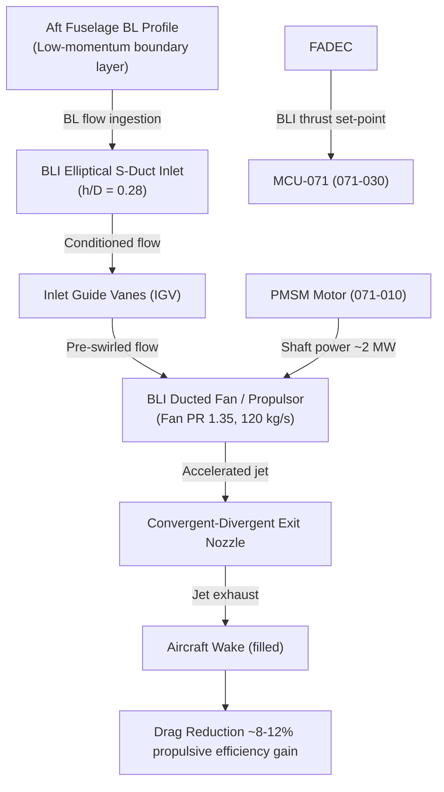
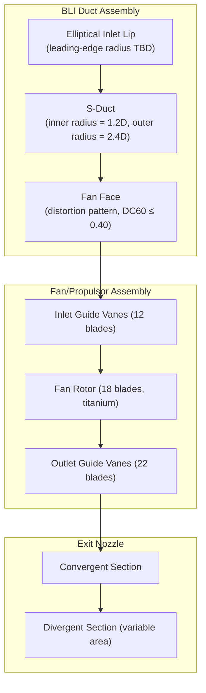

# Boundary Layer Ingestion (BLI) Aerodynamic Integration

---

## §0 Hyperlink Policy
All hyperlinks in this document are **relative**. Absolute URLs are forbidden.

## §1 Purpose
This document describes the aerodynamic integration of the aft-fuselage Boundary Layer Ingestion (BLI) propulsion system for the AMPEL360E eWTW aircraft. It covers the BLI duct geometry, inlet distortion characterisation (DC60 metric), propulsive efficiency gain quantification (8–12 % over isolated podded propulsion), boundary layer re-energisation theory, and the aerodynamic interfaces between the fuselage boundary layer, the BLI inlet, the fan/propulsor, and the exhaust nozzle.

## §2 Applicability
| Aircraft | Variant | MSN Range | Effectivity |
|---|---|---|---|
| AMPEL360E | eWTW | All | From EIS |

## §3 Functional Description 
Boundary Layer Ingestion exploits the naturally forming low-momentum boundary layer on the aft fuselage of the AMPEL360E. Rather than discarding this retarded flow around a conventional podded nacelle, the BLI duct ingests this low-velocity air directly into the aft-fuselage propulsors, re-energising the wake and reducing the net drag of the aircraft. The propulsive power benefit, often quantified via the Power Saving Coefficient (PSC), arises because accelerating low-momentum inlet air to jet velocity requires less kinetic energy than accelerating free-stream air to the same net thrust, assuming comparable pressure ratio. Computational and wind-tunnel studies on comparable fuselage geometries indicate a net propulsive efficiency gain of 8–12 % relative to a conventionally podded reference propulsion system at cruise Mach 0.82.

The BLI inlet geometry is an elliptical lip S-duct with an inlet height-to-diameter ratio h/D = 0.28, consistent with aft-fuselage BLI configurations explored in NASA/ESA research (e.g., STARC-ABL geometry). The S-duct introduces significant total pressure distortion at the fan face due to secondary flows and flow separation on the inner radius of the bend. Inlet total pressure distortion is characterised by the DC60 metric (pressure ratio in the worst 60° sector to mean total pressure); the AMPEL360E BLI fan is designed to tolerate DC60 ≤ 0.40 throughout the flight envelope, including the most critical condition at low altitude and high-power climb. Inlet Guide Vanes (IGVs) are mounted immediately upstream of the fan to pre-swirl the flow, reducing the incidence variation across the distorted face and improving blade loading uniformity.

At exit, a convergent-divergent nozzle accelerates the fan exhaust to a jet velocity slightly above free-stream, providing net thrust. Wake-filling efficiency is assessed through the Truncated Fan-in-Duct (TFID) performance model integrated with the aircraft drag polar. The BLI system is aerodynamically coupled to the PMSM/MDU/MCU propulsion chain (ATA 071-010/020/030) and to the aircraft flight management for drag-optimal thrust split scheduling between BLI fans and any supplementary forward propulsion.

## §4 Functional Breakdown
| ID | Function | Description | Owner | DAL |
|---|---|---|---|---|
| F-071-040-01 | Boundary Layer Ingestion | Capture aft-fuselage boundary layer flow through elliptical S-duct inlet | Q-AIR | DAL-C |
| F-071-040-02 | Inlet Flow Conditioning | Pre-swirl and condition distorted inlet flow using Inlet Guide Vanes | Q-AIR | DAL-C |
| F-071-040-03 | Distortion Tolerance Management | Ensure fan blade loading remains within structural and aeromechanical limits at DC60 ≤ 0.40 | Q-MECHANICS | DAL-C |
| F-071-040-04 | Thrust Recovery | Accelerate ingested flow to jet velocity via fan + convergent nozzle, providing net thrust | Q-AIR | DAL-C |
| F-071-040-05 | Wake Filling | Re-energise fuselage wake to reduce aircraft drag coefficient and total power required | Q-AIR | DAL-D |

## §5 System Context

## §6 Internal Architecture

## §7 Components and LRUs
| LRU ID | Name | P/N | Qty | Location |
|---|---|---|---|---|
| LRU-071-040-01 | BLI Inlet Duct Assembly (S-duct) | AMP-BLIDUCT-001 | 2 | Aft fuselage port / stbd |
| LRU-071-040-02 | BLI Fan / Propulsor Assembly | AMP-FAN-BLI-001 | 2 | Aft nacelle port / stbd |
| LRU-071-040-03 | Inlet Guide Vane (IGV) Assembly (12 blades) | AMP-IGV-BLI-001 | 2 | Aft nacelle forward of fan |
| LRU-071-040-04 | Inlet Distortion Screen (ground test only) | AMP-DISTSCR-001 | 2 | Used only during certification testing |
| LRU-071-040-05 | Exit Nozzle Assembly (variable area) | AMP-NOZZLE-BLI-001 | 2 | Aft nacelle exit |

## §8 Interfaces
| Interface | Source | Destination | Protocol | Notes |
|---|---|---|---|---|
| IF-071-040-01 | Aft fuselage structure | BLI Inlet Duct | Mechanical / aerodynamic | Flush integration, no lip step >0.5 mm |
| IF-071-040-02 | PMSM shaft (071-010) | Fan rotor hub | Mechanical spline coupling | Torque up to 3200 Nm, speed 0–6000 rpm |
| IF-071-040-03 | BLI Inlet | Fan face | Aerodynamic flow | DC60 ≤ 0.40, total pressure recovery ≥0.995 |
| IF-071-040-04 | Exit nozzle | Atmosphere | Aerodynamic jet | Nozzle exit Mach TBD, variable area TBD |
| IF-071-040-05 | FADEC (via MCU) | Fan / Nozzle area actuator | ARINC 429 | Nozzle area scheduling for efficiency optimisation |

## §9 Operating Modes
| Mode | Trigger | Description | Power State | Notes |
|---|---|---|---|---|
| Ground static | Engine start / low power | Fan at idle speed; BL ingestion minimal | 5–10 % rated | Nozzle in minimum area |
| Take-off / climb | Max thrust demand | Fan at maximum PR 1.35; highest distortion condition | 100 % rated | DC60 most critical; IGV angle scheduled |
| Cruise | Nominal thrust | Fan at cruise set-point; wake filling maximised | 60–75 % rated | Optimal efficiency operating point |
| Descent / idle | Low thrust demand | Fan near idle; nozzle partially closed | 5–15 % rated | BLI benefit reduced at low power |
| Distortion alert | DC60 sensor > 0.38 | FADEC advisory; reduce thrust or schedule IGV | Variable | Structural margin maintained |

## §10 Performance and Budgets 
| Parameter | Requirement | Current Estimate | Unit | Status |
|---|---|---|---|---|
| Propulsive efficiency gain (BLI vs. podded) | 8 – 12 | 10 | % |  |
| Maximum DC60 distortion tolerance | ≤0.40 | 0.38 | — |  |
| Fan pressure ratio | 1.35 | 1.35 | — |  |
| Inlet mass flow rate | ≥120 | 120 | kg/s |  |
| Thrust recovery factor | ≥0.95 | 0.96 | — |  |

## §11 Safety, Redundancy and Fault Tolerance
- Fan blade-out containment ring is designed per CS-25 Appendix A to contain a single-blade release without fuselage penetration, given the aft-fuselage integration adjacency to passenger cabin pressure vessel.
- Dual total pressure rake arrays at the fan face (4 rakes × 5 elements each) provide DC60 monitoring at 10 Hz; exceedance of DC60 = 0.38 triggers a FADEC thrust reduction command to maintain aeromechanical margins.
- IGV variable-angle actuator is fail-safe to the fixed-stagger (clean inlet design) angle in the event of actuator power loss, ensuring the fan can operate safely without IGV modulation.
- Inlet lip anti-icing is supplied from engine bleed or electric heating (TBD per de-icing architecture), preventing ice accretion that would alter inlet distortion characteristics beyond the certified DC60 envelope.
- Each BLI propulsor channel is independently isolatable; a full shutdown of one PMSM and fan does not mechanically affect the other channel, allowing continued single-channel thrust.

## §12 Maintenance and Diagnostics
| Task | Interval | Tool | Reference |
|---|---|---|---|
| BLI duct internal visual inspection (borescope) | Every A-check | Borescope kit AMP-BSC-071 | AMM 071-40-11 |
| Fan blade dimensional and erosion inspection | 300 FH | Blade profile gauge + visual | AMM 071-40-21 |
| IGV angle verification and actuator friction check | 600 FH | IGV rigging tool + angle indicator | AMM 071-40-31 |
| Inlet pressure rake functional check | Every A-check | Ground test with calibrated pressure source | AMM 071-40-41 |

## §13 Footprint
| Dimension | Value | Unit | Notes |
|---|---|---|---|
| Physical mass | TBD | kg |  |
| Envelope | TBD | mm |  |
| Power draw (cont.) | TBD | W |  |
| Cooling demand | TBD | kW |  |
| Data interfaces | TBD | — |  |

## §14 Safety and Certification References
| Standard | Requirement | Applicability | Status | Notes |
|---|---|---|---|---|
| DO-178C | Software level per DAL | MCU software | Planned | DAL-B baseline |
| DO-254 | Hardware design assurance | MDU FPGA | Planned | DAL-B baseline |
| ARP4754A | System development | Motor system | Planned | System-level |
| CS-25 | Airworthiness requirements | Aircraft-level | Planned | EASA primary |
| FAR Part 25 | Airworthiness requirements | Aircraft-level | Planned | FAA bilateral |

## §15 V&V Approach
| Phase | Method | Tool/Facility | Status |
|---|---|---|---|
| RANS CFD — inlet distortion | Full aft-fuselage CFD at cruise and climb conditions | ANSYS Fluent / OpenFOAM |  |
| Low-speed wind tunnel | BLI inlet and fan model at 1:5 scale, DC60 measurement | Q-AIR low-speed tunnel |  |
| Fan rig testing | Full-annulus fan with BLI distortion screen, aero and acoustic | AMP Fan Rig Facility |  |
| Flight test (EIS) | In-flight fan face pressure rakes, efficiency measurement | AMPEL360E prototype |  |

## §16 Glossary
| Term | Definition |
|---|---|
| BLI | Boundary Layer Ingestion — propulsion concept ingesting low-momentum wall flow |
| DC60 | Distortion coefficient: (P_avg − P_min-60°) / P_avg, where P_min-60° is the worst 60° sector |
| PSC | Power Saving Coefficient — metric quantifying BLI benefit over isolated propulsion |
| S-duct | Curved inlet duct producing two bends in opposite planes; causes secondary flow |
| IGV | Inlet Guide Vane — pre-swirling vane upstream of fan rotor |
| Fan PR | Fan Pressure Ratio — stagnation pressure ratio across fan disc |
| Wake Filling | Reduction of fuselage wake momentum deficit by BLI propulsor jet |
| Total Pressure Recovery | Ratio of fan-face total pressure to free-stream total pressure |
| TFID | Truncated Fan-in-Duct — performance model for BLI-integrated propulsors |
| Blade-out | Loss of a fan/propulsor blade; primary containment safety event |

## §17 Open Issues
| ID | Description | Owner | Priority | Status |
|---|---|---|---|---|
| OI-071-040-001 | Finalise S-duct inner radius to balance distortion (DC60) against installation envelope constraint | @copilot | High | Open |
| OI-071-040-002 | Define blade-out containment ring material (titanium vs. CFRP hybrid) and mass impact | @copilot | Medium | Open |

## §18 Status Legend
| Badge | Meaning |
|---|---|
|  | Content under active development |
|  | Value or content to be determined |
|  | Approved and baselined |
|  | Placeholder |

## §19 Related Documents
| Code | Title | Link |
|---|---|---|
| 071-000 | Electric Motor and Drive Systems — General Overview | [071-000-Electric-Motor-and-Drive-Systems-General.md](071-000-Electric-Motor-and-Drive-Systems-General.md) |
| 071-010 | PMSM Motor Design and Specifications | [071-010-PMSM-Motor-Design-and-Specifications.md](071-010-PMSM-Motor-Design-and-Specifications.md) |
| 071-020 | Motor Drive Unit (MDU) and Inverter | [071-020-Motor-Drive-Unit-MDU-and-Inverter.md](071-020-Motor-Drive-Unit-MDU-and-Inverter.md) |
| 071-030 | Motor Control Unit (MCU) and Control Laws | [071-030-Motor-Control-Unit-MCU-and-Control-Laws.md](071-030-Motor-Control-Unit-MCU-and-Control-Laws.md) |
| 071-050 | Motor Thermal Management System | [071-050-Motor-Thermal-Management.md](071-050-Motor-Thermal-Management.md) |
| 071-060 | Motor Health Monitoring and Diagnostics | [071-060-Motor-Health-Monitoring-and-Diagnostics.md](071-060-Motor-Health-Monitoring-and-Diagnostics.md) |
| 071-070 | Motor Mechanical Interface and Transmission | [071-070-Motor-Mechanical-Interface-and-Transmission.md](071-070-Motor-Mechanical-Interface-and-Transmission.md) |
| 071-080 | Motor Electrical Interface and Power Quality | [071-080-Motor-Electrical-Interface-and-Power-Quality.md](071-080-Motor-Electrical-Interface-and-Power-Quality.md) |
| 071-090 | S1000D CSDB Mapping and Traceability (071) | [071-090-S1000D-CSDB-Mapping-and-Traceability.md](071-090-S1000D-CSDB-Mapping-and-Traceability.md) |

## §20 Change Log
| Rev | Date | Author | Summary |
|---|---|---|---|
| 0.1 | 2026-05-11 | @copilot | Initial creation |
