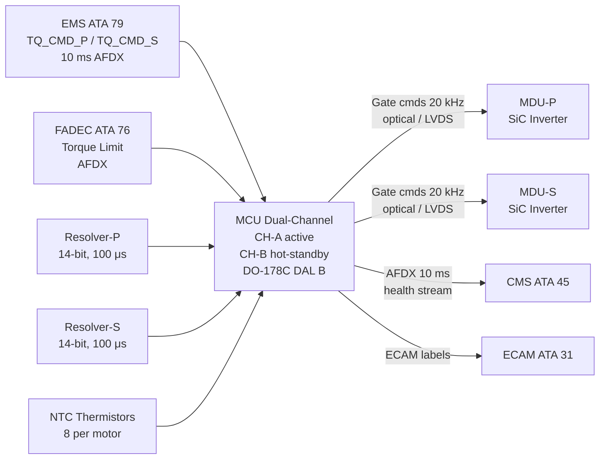
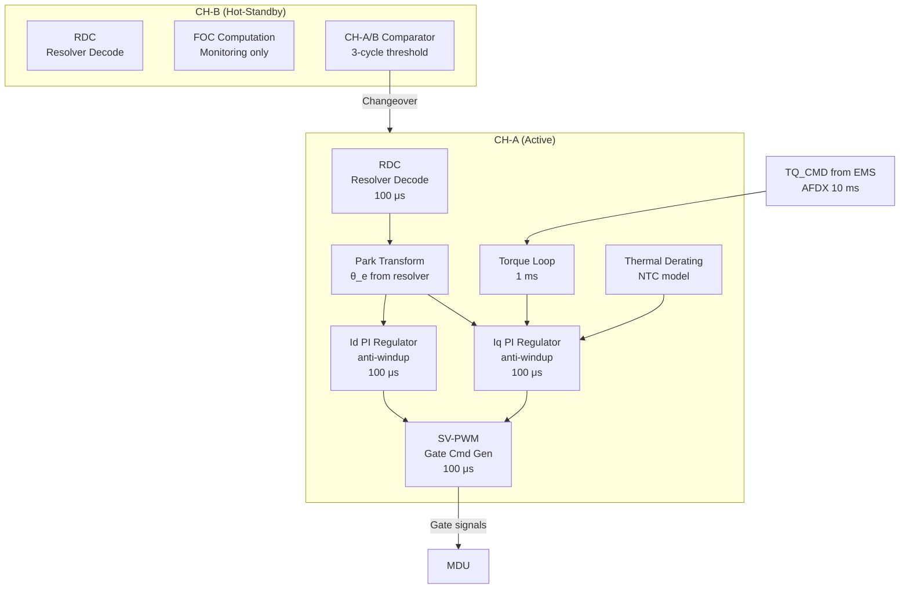

<!-- ──────────────────────────────────────────────────────────────────────────
     QATL-ATLAS-1000-ATLAS-070-079-071-040-MOTOR-CONTROL-AND-TORQUE-COMMAND
     ATA 71 · Motor Control and Torque Command
     AMPEL360E eWTW — ATLAS Register 1000
────────────────────────────────────────────────────────────────────────────── -->

# Motor Control and Torque Command

---

## §0 Hyperlink Policy

> All hyperlinks in this document are **relative** (five directory levels: `../../../../../`).
> Absolute URLs are forbidden. Every linked document must exist in the Q+ATLANTIDE repository
> before the link is activated. Broken links are treated as open issues and must be resolved
> before the document is promoted from `DRAFT` to `APPROVED`.

---

## §1 Purpose

This document defines the Motor Control Unit (MCU) control architecture for the AMPEL360E eWTW traction drive. The MCU implements **Field-Oriented Control (FOC)** with space-vector pulse-width modulation (SV-PWM) to achieve precise dynamic torque response. Torque commands are received from the Energy Management System (EMS) and/or FADEC via AFDX (ARINC 664 P7) at a 10 ms update rate. Rotor position and speed feedback are provided by shaft-mounted resolvers (14-bit resolution).

The MCU architecture is **dual-channel (CH-A active, CH-B hot-standby)**, qualified to **DO-178C DAL B**, ensuring continued motor control after single control-channel failure with automatic channel changeover within one computation cycle (100 μs). The MCU is common to both MDU-P and MDU-S, with separate gate command links to each MDU.

---

## §2 Applicability

| Parameter | Value |
|---|---|
| Aircraft Program | AMPEL360E eWTW |
| ATA reference | ATA 71-040 — Motor Control and Torque Command |
| Certification basis | EASA CS-25 Amdt 27+; DO-178C DAL B; DO-254 DAL B (FPGA elements) |
| S1000D SNS | 071-040-00 |

---

## §3 Functional Description ![DRAFT]

**FOC control structure:** The MCU implements FOC in the synchronous (d-q) reference frame. The inner current loops (Id regulator and Iq regulator) execute at a 100 μs cycle rate, controlling d-axis (flux) and q-axis (torque) current components independently via PI controllers with anti-windup integral clamp. The outer torque loop executes at a 1 ms cycle rate, computing the Iq reference from the torque command signal received via AFDX at 10 ms. The FOC reference frame is defined by the rotor electrical angle θ_e derived from the resolver output. Space-vector modulation (SVM) computes the six gate switching duty cycles from the d-q voltage commands at each 100 μs cycle.

**Torque command interface:** The EMS (ATA 79) sends a torque setpoint (TQ_CMD_P and TQ_CMD_S, for port and starboard respectively) to the MCU via AFDX Label-type messages at a 10 ms update rate. The FADEC can override the EMS torque command via a separate AFDX message (FADEC torque limit) for thrust management. The MCU applies a rate limiter (50 N·m/ms) and a torque saturation limit (3 000 N·m) before passing TQ_CMD to the Iq regulator.

**Resolver feedback:** Shaft-mounted resolvers provide absolute rotor electrical angle at 14-bit resolution (0.022° LSB). The MCU resolver digital converter (RDC) samples at 100 μs. Speed is computed as the derivative of angle over 1 ms window. Resolver dual-track output (coarse 2-pole + fine 8-pole) provides fault detection; a resolver fault triggers sensorless mode (back-EMF estimator active above 10 % rated speed).

**Dual-channel redundancy:** CH-A is the active control channel executing the full FOC loop and generating gate commands for both MDU-P and MDU-S. CH-B operates in hot-standby mode, running an identical FOC computation and monitoring CH-A output. If CH-A output disagrees with CH-B computation by more than a defined threshold for three consecutive cycles, CH-B automatically takes over and CH-A is declared failed. Changeover time ≤ 100 μs (one computation cycle). The MCU reports the active channel to the CMS (ATA 45) via AFDX.

**Thermal derating model:** The MCU maintains a real-time thermal model of the stator winding temperature (using NTC thermistor readings and a simplified thermal RC model). When winding temperature exceeds 155 °C, the MCU applies a linear Iq derating ramp (reducing torque command proportionally). At 175 °C, the MCU commands MDU gate shutdown.

**DTC fallback:** An alternative Direct Torque Control (DTC) mode is implemented as a fallback in case the resolver fails at low speed where sensorless FOC is inaccurate. DTC uses stator current and voltage measurements only, without rotor position feedback, but provides reduced torque ripple at speeds above 100 rpm.

---

## §4 Functional Breakdown

| ID | Name | Description | Lead Division |
|---|---|---|---|
| F-001 | FOC Torque/Flux Regulation | Id/Iq current loops at 100 μs; outer torque loop 1 ms; SV-PWM generation; anti-windup PI | Q-HPC |
| F-002 | Speed/Position Feedback (Resolver) | 14-bit RDC; dual-track resolver; speed computation; sensorless FOC fallback (back-EMF) | Q-HPC |
| F-003 | Torque Command Interface (AFDX) | AFDX ARINC 664 P7 receive; TQ_CMD from EMS at 10 ms; FADEC override; rate limiter + saturation | Q-HPC |
| F-004 | Dual-Channel CH-A / CH-B | Hot-standby CH-B monitoring; automatic changeover ≤ 100 μs; channel health reporting to CMS | Q-HPC |
| F-005 | Thermal Derating Algorithm | NTC-based winding temperature; linear Iq derate 155–175 °C; shutdown at 175 °C | Q-HPC |
| F-006 | Fault Management | DESAT / UVLO fault reception from MDU; resolver fault; over-speed; winding fault detection; FCI to CMS | Q-HPC |

---

## §5 System Context — Mermaid Diagram

---

## §6 Internal Architecture — Mermaid Diagram

---

## §7 Components and LRUs

| Component | Part Number | Qty | Location | Maintenance Interval | Notes |
|---|---|---|---|---|---|
| MCU Motor Control Unit | MCU-071-TBD | 1 | EE bay rack | Software update per MCU SB cycle | Dual-channel; DO-178C DAL B; DO-254 DAL B FPGA |
| Resolver-P (port PMSM) | RES-P-071-TBD | 1 | PMSM-P NDE shaft | Replace with PMSM | 14-bit; dual-track; DO-160G qualified |
| Resolver-S (stbd PMSM) | RES-S-071-TBD | 1 | PMSM-S NDE shaft | Replace with PMSM | Identical to Resolver-P |
| NTC Thermistor Set (per motor) | NTC-071-TBD | 16 (8 per motor × 2 motors) | PMSM stator winding | Replace with winding (C-check continuity check) | 2 per phase group; Class H rated |

---

## §8 Interfaces

| Interface Type | Connected System | Protocol / Medium | Data / Function |
|---|---|---|---|
| AFDX receive (torque command) | EMS ATA 79 | AFDX ARINC 664 P7 | TQ_CMD_P, TQ_CMD_S at 10 ms; power limit from EMS |
| AFDX receive (FADEC override) | FADEC ATA 76 | AFDX ARINC 664 P7 | Torque limit, mode command from FADEC |
| Gate command link (MDU-P and MDU-S) | MDU-P, MDU-S (ATA 71-030) | Optical fibre or LVDS, galvanic isolation | Switching commands at 20 kHz to gate drivers |
| Resolver feedback (P and S) | Resolver-P, Resolver-S | Shielded resolver cable | 14-bit rotor position at 100 μs; speed signal |
| NTC thermal feedback | NTC thermistors in PMSM (× 16) | Shielded analogue cable | Stator winding temperatures per phase group |
| AFDX transmit (health stream) | CMS ATA 45 | AFDX ARINC 664 P7 | Speed, torque, temps, BITE word at 10 ms update |
| ECAM output | ECAM ATA 31 | AFDX | Traction motor synoptic labels for SD ELEC page |
| MDU fault reception | MDU-P, MDU-S | Digital signal (isolated) | DESAT fault, UVLO, over-temp MDU flags |

---

## §9 Operating Modes

| Mode | Trigger | System State | Actions / Consequences |
|---|---|---|---|
| Normal FOC (below base speed) | TQ_CMD > 0; speed < 3 600 rpm | FOC MTPA: Id = 0, Iq = TQ_CMD / (k × Ψ_PM) | Maximum torque per amp; full FOC loop active |
| Flux weakening (above base speed) | Speed 3 600–4 000 rpm | FOC: negative Id injected to reduce air-gap flux | Constant power region; Iq reduced; PM temperature monitored |
| Thermal derating | Stator temp 155–175 °C | FOC: Iq setpoint multiplied by derating factor | Power reduced proportionally; ECAM amber caution |
| Sensorless FOC fallback | Resolver fault detected; speed > 10 % rated | Back-EMF estimator provides estimated θ_e | Reduced accuracy at low speed; speed floor enforced |
| CH-B takeover | CH-A output disagrees with CH-B ≥ 3 cycles | CH-B becomes active control channel; CH-A isolated | Seamless torque continuity; ECAM advisory; CMS log |
| Gate shutdown | Stator temp ≥ 175 °C or MCU command | All MDU gate signals inhibited | Motor unpowered; turbofan takes full thrust |

---

## §10 Performance and Budgets ![DRAFT]

| Parameter | Requirement | Target / Design Value | Status |
|---|---|---|---|
| Torque response time (10–90 %) | ≤ 100 ms | ≤ 50 ms | ![TBD] |
| Torque control accuracy | ±5 % | ±2 % | ![TBD] |
| Speed range (FOC) | 0–4 000 rpm | 0–4 000 rpm | ![TBD] |
| MCU inner loop cycle time | ≤ 200 μs | 100 μs | ![TBD] |
| Resolver resolution | ≥ 12-bit | 14-bit | ![TBD] |
| CH-A to CH-B changeover time | ≤ 1 ms | ≤ 100 μs | ![TBD] |
| Thermal derating activation temp | — | 155 °C | ![TBD] |
| Shutdown activation temp | — | 175 °C | ![TBD] |

---

## §11 Safety, Redundancy and Fault Tolerance

- MCU dual-channel CH-A/CH-B is the primary safety feature for MCU control loss; designed to DO-178C DAL B to support a Major failure classification.
- The MCU cannot command torque above the physical MDU current limit (1 200 A) due to hardware current limiting in the MDU gate driver DESAT circuit, providing a second-level torque saturation protection independent of MCU software.
- AFDX watchdog: if the MCU does not receive a valid TQ_CMD message within 3 consecutive frames (30 ms), the MCU applies a torque-to-zero ramp at the rate limiter slope, preventing sudden thrust transient.
- Resolver dual-track fault detection and sensorless fallback ensure motor remains controllable (above 10 % rated speed) even after resolver failure; loss of position below 10 % rated speed triggers motor stop.
- Over-speed protection: if measured speed exceeds 4 200 rpm (105 % of maximum operating speed) for more than 100 ms, MCU commands gate shutdown and logs a Major fault to CMS.

---

## §12 Maintenance and Diagnostics

| Task | Interval | Access | Special Tools |
|---|---|---|---|
| MCU BITE log download | A-check | CMS terminal / ACARS | CMS terminal |
| MCU software version verification | A-check | CMS terminal | CMS terminal |
| Resolver signal quality check (RDC output vs coarse track) | C-check | MCU GSE terminal | MCU GSE; oscilloscope |
| MCU channel health status verification | C-check | MCU GSE terminal | MCU GSE |
| MCU LRU replacement (on fault) | On condition | EE bay rack — ~2 h task | Standard EE bay tools; software load tool |

---

## §13 Footprint — Physical, Electrical, Maintenance, Data ![TBD]

| Footprint Type | Parameter | Value | Notes |
|---|---|---|---|
| Physical | MCU mass | ![TBD] | Dual-channel processor; target ≤ 5 kg |
| Physical | MCU envelope | ![TBD] | Standard ARINC 600 rack unit TBD |
| Electrical | MCU power consumption | ![TBD] | From 28 V DC essential bus |
| Data | AFDX transmit bandwidth | ![TBD] | Per AFDX bus load analysis ATA 46 |

---

## §14 Safety and Certification References ![DRAFT]

| Standard / Document | Title | Issuing Body | Applicability |
|---|---|---|---|
| DO-178C | Software Considerations in Airborne Systems | RTCA | MCU software DAL B |
| DO-254 | Design Assurance Guidance for Airborne Electronic Hardware | RTCA | MCU FPGA elements DAL B |
| DO-297 | Integrated Modular Avionics Development Guidance | RTCA | MCU integration in IMA if applicable |
| ARINC 664 Part 7 | AFDX — Avionics Full-Duplex Switched Ethernet | ARINC | MCU AFDX interface specification |
| EASA AMC 25.1309 | System Design and Analysis | EASA | Safety assessment for MCU dual-channel |

---

## §15 V&V Approach ![TBD]

| Phase | Method | Acceptance Criterion | Status |
|---|---|---|---|
| Design | Control loop stability analysis (Bode; root-locus) | Phase margin ≥ 45°; gain margin ≥ 12 dB for all operating points | ![TBD] |
| SIL simulation | Software-in-the-loop with PMSM plant model | Torque response ≤ 50 ms; steady-state error ≤ 2 % | ![TBD] |
| HIL integration test | Hardware-in-the-loop with MDU simulator | CH-A/CH-B changeover < 100 μs; AFDX watchdog ramp confirmed | ![TBD] |
| DO-178C review | Software qualification review (SQR) | All DAL B objectives met; MCDC coverage ≥ 100 % | ![TBD] |
| Certification | EASA flight test (hybrid propulsion) | Torque accuracy ±2 % demonstrated in flight | ![TBD] |

---

## §16 Glossary

| Term | Definition |
|---|---|
| **FOC** | Field-Oriented Control — vector control decoupling d-axis (flux) and q-axis (torque) currents for precise torque response. |
| **SV-PWM** | Space-Vector Pulse Width Modulation — optimised PWM technique maximising DC-link voltage utilisation (factor √3 better than sinusoidal PWM). |
| **MTPA** | Maximum Torque Per Ampere — optimal Id/Iq ratio below base speed to minimise stator copper loss for given torque. |
| **DTC** | Direct Torque Control — alternative control method using stator flux and torque estimators; no explicit current loops or PWM. |
| **RDC** | Resolver-to-Digital Converter — integrated circuit converting resolver sine/cosine analogue signals to digital rotor angle. |
| **Anti-windup** | PI regulator feature preventing integrator accumulation during output saturation (e.g., current limit), avoiding torque overshoot on release. |
| **AFDX** | Avionics Full-Duplex Switched Ethernet (ARINC 664 P7) — deterministic aircraft data network used for MCU-EMS-CMS communication. |
| **DAL B** | Development Assurance Level B (DO-178C) — second highest software criticality level; applies to systems whose failure is classified as Hazardous. |

---

## §17 Open Issues

| ID | Description | Owner | Target |
|---|---|---|---|
| OI-071-040-001 | Finalise PMSM motor model parameters (Ld, Lq, R_s, Ψ_PM) from OEM electromagnetic design | Q-HPC | 2026-Q4 |
| OI-071-040-002 | Complete DO-178C Software Development Plan (SDP) for MCU software | Q-HPC | 2026-Q3 |
| OI-071-040-003 | Confirm MCU hardware platform (COTS processor + FPGA vs custom ASIC) | Q-HPC | 2026-Q3 |

---

## §18 Status Legend

| Badge | Meaning |
|---|---|
| `![DRAFT]` | Section is drafted but not yet reviewed |
| `![TBD]` | Content not yet started — to be defined |
| `![To Be Completed]` | Partially complete — needs additional content |
| `![APPROVED]` | Reviewed and formally approved |

---

## §19 Related Documents (Siblings in this Subsection)

- [071-000](./071-000-Electric-Motor-and-Drive-Systems-General.md)
- [071-010](./071-010-Traction-Motor-Architecture.md)
- [071-020](./071-020-Motor-Rotor-Stator-and-Bearing-Assemblies.md)
- [071-030](./071-030-Inverter-and-Motor-Drive-Unit.md)
- [071-050](./071-050-Motor-Cooling-and-Thermal-Protection.md)
- [071-060](./071-060-Motor-Power-Connectors-and-Insulation.md)
- [071-070](./071-070-Motor-Inspection-Test-and-Maintenance.md)
- [071-080](./071-080-Electric-Drive-Monitoring-Diagnostics-and-Control-Interfaces.md)
- [071-090](./071-090-S1000D-CSDB-Mapping-and-Traceability.md)

---

## §20 Change Log

| Rev | Date | Author | Description |
|---|---|---|---|
| 0.1 | 2026-05-11 | @copilot | Initial DRAFT — contextualized content per AMPEL360E eWTW architecture |
