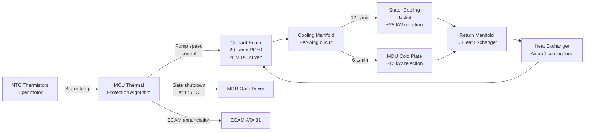

<!-- ──────────────────────────────────────────────────────────────────────────
     QATL-ATLAS-1000-ATLAS-070-079-071-050-MOTOR-COOLING-AND-THERMAL-PROTECTION
     ATA 71 · Motor Cooling and Thermal Protection
     AMPEL360E eWTW — ATLAS Register 1000
────────────────────────────────────────────────────────────────────────────── -->

# Motor Cooling and Thermal Protection


---

## §0 Hyperlink Policy

> All hyperlinks in this document are **relative** (five directory levels: `../../../../../`).
> Absolute URLs are forbidden. Every linked document must exist in the Q+ATLANTIDE repository
> before the link is activated. Broken links are treated as open issues and must be resolved
> before the document is promoted from `DRAFT` to `APPROVED`.

---

## §1 Purpose

This document describes the liquid cooling system for the AMPEL360E eWTW PMSM traction motors and Motor Drive Units (MDUs), the thermal protection limits and derating algorithm, and the fault responses to stator winding over-temperature and coolant system anomalies.

Effective thermal management is critical to sustaining the 500 kW continuous output rating of each PMSM, protecting the Class H winding insulation from thermal degradation, and preventing irreversible NdFeB PM demagnetisation. The cooling architecture uses a **shared water-glycol liquid circuit** serving both the stator cooling jacket (per motor) and the MDU cold plate (per MDU). The circuit is aircraft-level, fed from the cabin/avionics cooling loop via a thermally regulated mixing valve.

---

## §2 Applicability

| Parameter | Value |
|---|---|
| Aircraft Program | AMPEL360E eWTW |
| ATA reference | ATA 71-050 — Motor Cooling and Thermal Protection |
| Certification basis | EASA CS-25 Amdt 27+; IEC 60034-1; IEC 60034-25 |
| S1000D SNS | 071-050-00 |

---

## §3 Functional Description ![DRAFT]

**Stator cooling jacket:** A helical water-glycol coolant channel is machined integral to the stator outer housing. Coolant flows in series through the stator jacket at a design flow rate of **12 L/min per motor**. Coolant inlet temperature to the stator jacket is ≤ 65 °C under all normal operating conditions (ground and flight). The coolant absorbs stator copper and iron losses (~25 kW at rated output per motor) and returns to the heat exchanger at a temperature not exceeding 85 °C. Eight NTC thermistors embedded in the stator winding (2 per phase group, winding set A + B combined) monitor stator hot-spot temperature. The MCU averages all valid NTC readings and applies the thermal derating algorithm.

**MDU cold plate:** The SiC MOSFET device mounting surface is thermally bonded to a liquid-cooled aluminium cold plate integrated into the same water-glycol circuit as the stator jacket. The cold plate is in parallel with the stator jacket in the per-wing cooling circuit, with a flow control orifice setting the cold plate flow at 6 L/min (stator jacket receives priority at 12 L/min). The SiC junction temperature limit is 175 °C; the cold plate design maintains junction temperatures below **165 °C** at rated power with inlet coolant at 65 °C.

**Coolant pump and circuit:** An electrically driven coolant pump (rated 3.5 kPa, 20 L/min total) circulates coolant through the per-wing circuit (stator jacket + MDU cold plate). The pump is powered from the 28 V DC avionics bus and is controlled by the MCU. A secondary pump (backup) engages automatically on primary pump failure. Coolant composition: 50 % propylene glycol / 50 % de-ionised water (PG50), freeze point −37 °C.

**Thermal protection algorithm (MCU):** The MCU runs a continuous thermal protection algorithm with three protection levels:
1. **Normal operation** (Stator temp ≤ 155 °C): No derating. Full torque command passed to Iq regulator.
2. **Thermal derating zone** (155 °C < stator temp ≤ 175 °C): MCU applies a linear derating factor: `Derate = 1 − (T_stator − 155) / (175 − 155)`. Iq setpoint is multiplied by Derate. ECAM amber caution (TRACTION MOTOR HOT) annunciated. Crew aware; no crew action required.
3. **Overheat shutdown** (stator temp > 175 °C sustained for 500 ms): MCU commands MDU gate shutdown. Motor unpowered; turbofan takes full thrust load. ECAM red warning (TRACTION MOTOR OVERHEAT). Crew confirms motor shutdown via ELEC page.

**Rotor / PM thermal protection:** PM temperature is not directly measured (resolver is not a temperature sensor). PM thermal protection is provided by: (a) limiting stator temperature via the above algorithm (stator-to-PM thermal resistance is characterised, PM temperature estimated); (b) MCU thermal event log recording all stator temperature peaks above 150 °C; (c) an AM return-to-service inspection requirement (see 071-090 BREX rule #3) to review the event log and inspect PMs after any exceedance.

---

## §4 Functional Breakdown

| ID | Name | Description | Lead Division |
|---|---|---|---|
| F-001 | Stator Cooling Jacket | Helical water-glycol channel; 12 L/min; integral to stator housing; rejects stator copper + iron losses | Q-MECHANICS |
| F-002 | MDU Cold Plate | Aluminium cold plate; 6 L/min; parallel branch; rejects SiC switching and conduction losses | Q-MECHANICS |
| F-003 | Coolant Pump and Circuit (primary + backup) | Electrically driven pump 20 L/min; PG50 coolant; MCU controlled; backup pump on failure | Q-MECHANICS |
| F-004 | Thermal Protection Algorithm (MCU derating) | 3-level: normal / derate 155–175 °C / shutdown at 175 °C; ECAM annunciation per level | Q-HPC |
| F-005 | Overheat Shutdown (MDU gate inhibit) | Hard shutdown at 175 °C stator temp (500 ms timer); irreversible until maintenance reset | Q-HPC |

---

## §5 System Context — Mermaid Diagram



---

## §6 Internal Architecture — Mermaid Diagram

```mermaid
flowchart TB
    subgraph THERMAL_PROT["Thermal Protection Algorithm (MCU)"]
        NTC_AVG[NTC Average\n8 sensors → T_stator_avg]
        TMAX[T_stator_max\nhot-spot selector]
        CMP1{T > 155 °C ?}
        CMP2{T > 175 °C\n500 ms ?}
        DERATE[Linear Derate\nIq × (1-(T-155)/20)]
        SHUTDOWN[Gate Shutdown\nCommand]
        ECAM_AMB[ECAM Amber\nTRACTION MOTOR HOT]
        ECAM_RED[ECAM Red\nTRACTION MOTOR OVERHEAT]
    end
    NTC_AVG --> TMAX --> CMP1
    CMP1 -->|Yes| CMP2
    CMP1 -->|No| NORMAL[Normal operation\nFull torque]
    CMP2 -->|No| DERATE --> ECAM_AMB
    CMP2 -->|Yes| SHUTDOWN --> ECAM_RED
```

---

## §7 Components and LRUs

| Component | Part Number | Qty | Location | Maintenance Interval | Notes |
|---|---|---|---|---|---|
| Stator Cooling Jacket (integral to PMSM housing) | Integral to PMSM assembly | 2 | Wing root nacelle | Flush at C-check; replace with PMSM on condition | PG50 coolant; inlet ≤ 65 °C |
| MDU Cold Plate | COLD-071-TBD | 2 (1 per MDU) | MDU enclosure | Flush at C-check; replace with MDU | Al alloy; direct-bond to SiC devices |
| Coolant Pump (primary) | PUMP-P-071-TBD | 2 (1 per wing) | Wing root electronics zone | On condition / 12 000 FH | 28 V DC; 20 L/min; PG50 rated |
| Coolant Pump (backup) | PUMP-B-071-TBD | 2 (1 per wing) | Wing root electronics zone | Same as primary | Engages automatically on primary failure |
| NTC Thermistor (stator) | NTC-071-TBD | 16 (8 per motor) | PMSM stator winding | Replace with stator winding | Class H rated; 10 kΩ at 25 °C |
| Coolant Mixing Valve | MIX-071-TBD | 2 (1 per wing) | Wing root coolant manifold | Functional check C-check | Thermostatically regulated; maintains inlet ≤ 65 °C |

---

## §8 Interfaces

| Interface Type | Connected System | Protocol / Medium | Data / Function |
|---|---|---|---|
| Aircraft cooling loop | ATA 21 / ATA 36 thermal management | Coolant hose (quick-disconnect) | Heat rejection to aircraft loop; inlet coolant supply ≤ 65 °C |
| MCU thermal model | MCU (ATA 71-040) | NTC thermistor cable (shielded) | 8 NTC readings per motor; stator hot-spot temperature |
| MDU gate shutdown | MDU-P / MDU-S (ATA 71-030) | Digital command signal | Hard gate inhibit on overheat; resets only on ground |
| ECAM (ATA 31) | Cockpit display | AFDX | Amber caution and red warning annunciation |
| CMS (ATA 45) | Central Maintenance System | AFDX | Thermal event log (temp exceedances); pump fault reporting |
| Coolant pump control | Pump controller (local MCU output) | Discrete output | Pump speed modulation for thermal regulation |

---

## §9 Operating Modes

| Mode | Trigger | System State | Actions / Consequences |
|---|---|---|---|
| Normal cooling | PMSM powered; stator temp ≤ 155 °C | Primary pump active; coolant circulating 20 L/min | Stator and MDU within thermal limits; no derating |
| Backup pump active | Primary pump fault detected | Backup pump engages; primary pump off | MCU logs event; ECAM advisory TRACTION MOTOR COOLING DEGR |
| Thermal derating | Stator temp 155–175 °C | MCU derate factor applied to Iq setpoint | Power reduced proportionally; ECAM amber |
| Overheat shutdown | Stator temp > 175 °C sustained 500 ms | MDU gate shutdown; PMSM unpowered | Turbofan only; crew confirms on ELEC page; ECAM red |
| Ground cooling | Aircraft on ground; MDU powered | Pump active; fans may supplement via nacelle ground cooling mode | Pre-cool before motor restart; MCU monitors temp trend |

---

## §10 Performance and Budgets ![DRAFT]

| Parameter | Requirement | Target / Design Value | Status |
|---|---|---|---|
| Stator max continuous temperature | ≤ 155 °C (derating threshold) | < 140 °C at rated power, 65 °C coolant inlet | ![TBD] |
| Stator shutdown temperature | — | 175 °C (500 ms sustained) | ![TBD] |
| SiC junction temp (MDU) | ≤ 175 °C | ≤ 165 °C at rated power | ![TBD] |
| Coolant flow rate (stator jacket) | ≥ 10 L/min | 12 L/min | ![TBD] |
| Coolant inlet temperature | ≤ 65 °C | ≤ 65 °C (mixing valve controlled) | ![TBD] |
| Coolant outlet temperature (stator jacket) | ≤ 90 °C | ≤ 85 °C | ![TBD] |
| Stator heat rejection rate (rated, per motor) | Per thermal model | ~25 kW | ![TBD] |
| MDU heat rejection rate (rated, per MDU) | Per thermal model | ~12 kW | ![TBD] |

---

## §11 Safety, Redundancy and Fault Tolerance

- Primary + backup coolant pump redundancy ensures continued cooling after single pump failure; time to reach derating threshold on backup pump (lower flow rate) is analysed to ensure > 5 minutes margin.
- The 500 ms thermal shutdown timer prevents nuisance shutdowns from transient NTC sensor spikes while ensuring protection against genuine sustained overtemperature within the Class H insulation damage accumulation time constant.
- Loss of all NTC thermistor readings (all 8 sensors open-circuit) triggers MCU to immediately apply maximum derating (50 % Iq) as a conservative response, logging a thermal monitoring fault to CMS.
- Coolant leak detection: coolant inlet/outlet temperature differential monitoring provides indirect leak indication; a sudden increase in ΔT at constant flow suggests reduced flow rate consistent with a partial blockage or leak.
- The PM thermal exceedance event log (MCU non-volatile memory) records every event where the estimated PM temperature exceeds 140 °C, enabling targeted PM demagnetisation inspection during maintenance.

---

## §12 Maintenance and Diagnostics

| Task | Interval | Access | Special Tools |
|---|---|---|---|
| Coolant circuit flush and refill (PG50) | C-check | Wing root coolant manifold access | Coolant flush pump; refractometer (glycol concentration check) |
| NTC continuity and calibration check | C-check | Motor terminal box | Multimeter; reference temperature bath |
| Coolant pressure and leak test | C-check | Cooling circuit pressurised to 150 kPa | Pressure test pump; pressure gauge |
| Primary/backup pump function test | A-check | MCU GSE terminal | MCU GSE (pump test command) |
| Thermal event log review | A-check | CMS terminal / ACARS | CMS terminal |
| MDU cold plate visual inspection (blocking check) | C-check | MDU enclosure open | Inspection mirror; borescope |

---

## §13 Footprint — Physical, Electrical, Maintenance, Data ![TBD]

| Footprint Type | Parameter | Value | Notes |
|---|---|---|---|
| Physical | Coolant volume per wing circuit | ![TBD] | PG50; subject to heat exchanger sizing |
| Physical | Pump mass (per pump) | ![TBD] | 28 V DC motor driven |
| Electrical | Pump power consumption (both pumps, per wing) | ![TBD] | From 28 V DC avionics bus |
| Thermal | Total heat rejection (both PMSMs + both MDUs) | ~74 kW (nominal) | ~25 × 2 + ~12 × 2 kW; aircraft cooling loop input |

---

## §14 Safety and Certification References ![DRAFT]

| Standard / Document | Title | Issuing Body | Applicability |
|---|---|---|---|
| IEC 60034-1 | Rotating Electrical Machines — Rating and Performance | IEC | Temperature class H definition; insulation thermal life |
| IEC 60034-25 | Rotating Electrical Machines for power drive systems | IEC | Thermal protection requirements for inverter-fed motors |
| EASA CS-25 Amdt 27+ | Certification Specifications for Large Aeroplanes | EASA | Primary airworthiness basis |
| SAE AS5780 | High Power Density Propulsion Systems — Thermal Management | SAE International | Reference for hybrid-electric propulsion cooling architecture |

---

## §15 V&V Approach ![TBD]

| Phase | Method | Acceptance Criterion | Status |
|---|---|---|---|
| Design | Thermal FEM (stator + MDU) | Stator < 140 °C at rated; SiC junction < 165 °C | ![TBD] |
| Component test | PMSM thermal test (rated load, 65 °C coolant) | Stator winding temp < 155 °C at rated 500 kW | ![TBD] |
| Component test | Derating algorithm HIL test | Iq derate confirmed at 155 °C simulated NTC input; shutdown at 175 °C | ![TBD] |
| Integration test | Cooling circuit flow and pressure test | 12 L/min at design ΔP; no leaks at 150 kPa | ![TBD] |
| Qualification | DO-160G temperature test (MDU) | MDU operational at 70 °C coolant inlet for 1 h | ![TBD] |

---

## §16 Glossary

| Term | Definition |
|---|---|
| **PG50** | 50 % propylene glycol / 50 % de-ionised water coolant mixture; aircraft-approved; freeze point −37 °C. |
| **NTC thermistor** | Negative Temperature Coefficient thermistor — resistance decreases as temperature increases; used for stator winding hot-spot sensing. |
| **Thermal derating** | Reduction of motor output torque (via reduced Iq) as temperature approaches the Class H insulation limit. |
| **Hot-spot temperature** | The highest temperature in the winding, typically in the slot centre; NTC placement targets representative hot-spot locations. |
| **Class H** | IEC insulation temperature class rated to 180 °C maximum hot-spot temperature. |
| **Cold plate** | Liquid-cooled metal plate to which power semiconductor devices are bonded; primary thermal interface of the MDU. |
| **L/min** | Litres per minute — volumetric flow unit for coolant. |
| **ΔT** | Temperature difference between coolant outlet and inlet; proportional to heat rejection rate at constant flow. |

---

## §17 Open Issues

| ID | Description | Owner | Target |
|---|---|---|---|
| OI-071-050-001 | Finalise aircraft-level cooling loop allocation (PMSM + MDU heat load vs available capacity) | Q-MECHANICS / ATA 21 | 2026-Q4 |
| OI-071-050-002 | Define coolant pump sizing (flow rate, pressure, power) from thermal circuit analysis | Q-MECHANICS | 2026-Q4 |
| OI-071-050-003 | Validate thermal derating algorithm parameters (155/175 °C thresholds) vs insulation thermal life model | Q-GREENTECH | 2027-Q1 |

---

## §18 Status Legend

| Badge | Meaning |
|---|---|
| `![DRAFT]` | Section is drafted but not yet reviewed |
| `![TBD]` | Content not yet started — to be defined |
| `![To Be Completed]` | Partially complete — needs additional content |
| `![APPROVED]` | Reviewed and formally approved |

---

## §19 Related Documents (Siblings in this Subsection)

- [071-000](./071-000-Electric-Motor-and-Drive-Systems-General.md)
- [071-010](./071-010-Traction-Motor-Architecture.md)
- [071-020](./071-020-Motor-Rotor-Stator-and-Bearing-Assemblies.md)
- [071-030](./071-030-Inverter-and-Motor-Drive-Unit.md)
- [071-040](./071-040-Motor-Control-and-Torque-Command.md)
- [071-060](./071-060-Motor-Power-Connectors-and-Insulation.md)
- [071-070](./071-070-Motor-Inspection-Test-and-Maintenance.md)
- [071-080](./071-080-Electric-Drive-Monitoring-Diagnostics-and-Control-Interfaces.md)
- [071-090](./071-090-S1000D-CSDB-Mapping-and-Traceability.md)

---

## §20 Change Log

| Rev | Date | Author | Description |
|---|---|---|---|
| 0.1 | 2026-05-11 | @copilot | Initial DRAFT — contextualized content per AMPEL360E eWTW architecture |
