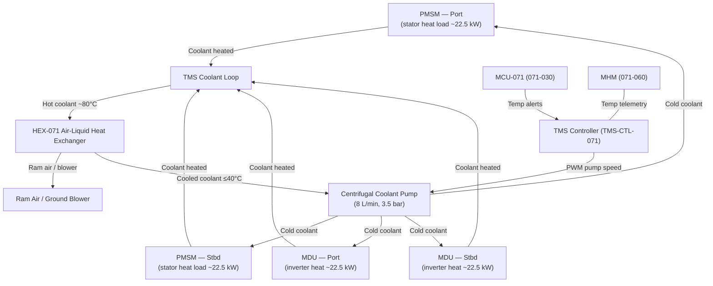
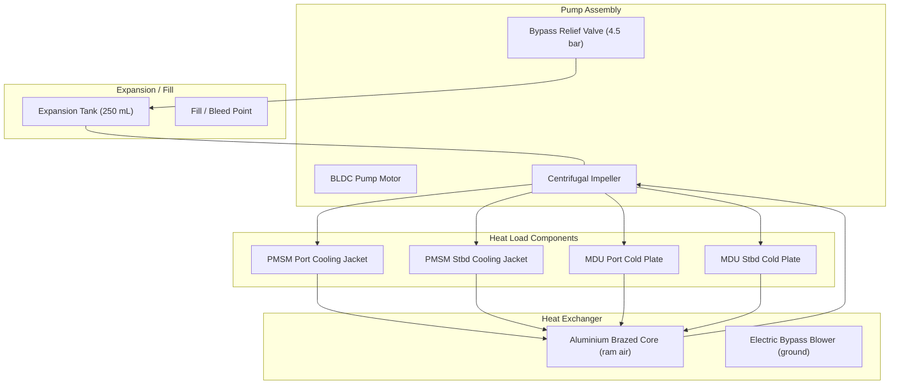

# Motor Thermal Management System

---

## §0 Hyperlink Policy
All hyperlinks in this document are **relative**. Absolute URLs are forbidden.

## §1 Purpose
This document specifies the Motor Thermal Management System (TMS-071) for the AMPEL360E eWTW electric propulsion system, covering the liquid cooling loops for the PMSM stator housings and the MDU cold plates. It defines the coolant specification (50/50 ethylene glycol/water by mass), heat exchanger design, pump sizing, temperature monitoring, and the thermal protection logic interfaced with the MCU and MHM. It is the primary thermal design reference for sustained rated motor and inverter operation across the full flight envelope.

## §2 Applicability
| Aircraft | Variant | MSN Range | Effectivity |
|---|---|---|---|
| AMPEL360E | eWTW | All | From EIS |

## §3 Functional Description 
The thermal management system is a single-loop forced liquid cooling circuit serving both PMSM stator housings and both MDU cold plates in series-parallel configuration. A centrifugal coolant pump (driven by a brushless DC motor) circulates a 50/50 ethylene glycol/water (EGW) mixture at a nominal 8 L/min, 3.5 bar gauge pressure. The EGW coolant is chosen for its combination of low-temperature freeze protection (to −37 °C), corrosion inhibition compatible with aluminium alloy cooling jacket surfaces, and favourable heat capacity (approximately 3600 J/kg·K at the 40–80 °C operating range).

The primary heat load is the PMSM stator winding and iron losses (estimated 45 kW combined for both motors at rated continuous power, equivalent to approximately 3 % of 2 × 1.5 MW continuous shaft power at 97 % motor efficiency). The MDU cold plate rejects the SiC MOSFET conduction and switching losses; at 1.5 % system losses per inverter (1.4 % efficiency), the MDU heat load per channel is approximately 22.5 kW. Total TMS design point heat rejection capacity is therefore 45 kW (PMSM) + 45 kW (MDU × 2) = 90 kW, with a 50 % margin giving a rated design capacity of 135 kW peak. Heat is ultimately rejected to ram air through a dedicated air-to-liquid heat exchanger (HEX-071) mounted in a ventral cooling duct, with a ground-cooling bypass to an electrically-driven blower for operation during pre-flight ground power.

Thermal protection is a two-stage function: a warning is triggered at 140 °C stator winding temperature (monitored by PT100 RTDs, see 071-010), and a mandatory power derating is commanded by the MCU at 150 °C; at 155 °C the MCU commands a motor shutdown. MDU cold-plate temperature is limited to 70 °C for normal operation, with SiC junction temperature estimated at ≤125 °C under worst-case thermal resistance stack. The TMS controller is a dedicated embedded module (TMS-CTL-071) that regulates pump speed via PWM drive to maintain coolant inlet temperature to the PMSM at ≤40 °C.

## §4 Functional Breakdown
| ID | Function | Description | Owner | DAL |
|---|---|---|---|---|
| F-071-050-01 | Motor Winding Cooling | Remove resistive and iron losses from PMSM stator via circumferential cooling jacket | Q-MECHANICS | DAL-C |
| F-071-050-02 | MDU Cold Plate Cooling | Remove SiC switching and conduction losses from MDU via aluminium cold plate | Q-MECHANICS | DAL-C |
| F-071-050-03 | Coolant Circulation | Pump EGW coolant at 8 L/min, 3.5 bar through closed loop | Q-MECHANICS | DAL-C |
| F-071-050-04 | Heat Rejection | Transfer thermal energy from coolant to ram air via air-liquid heat exchanger | Q-MECHANICS | DAL-D |
| F-071-050-05 | Thermal Protection Monitoring | Measure coolant and component temperatures; trigger derate/shutdown thresholds via MCU | Q-HPC | DAL-C |

## §5 System Context

## §6 Internal Architecture

## §7 Components and LRUs
| LRU ID | Name | P/N | Qty | Location |
|---|---|---|---|---|
| LRU-071-050-01 | Coolant Pump Assembly (BLDC + impeller) | AMP-PUMP-TMS-071 | 1 | Aft equipment bay |
| LRU-071-050-02 | PMSM Stator Cooling Jacket | AMP-JACKET-2000 | 2 | Integral to PMSM stator frame |
| LRU-071-050-03 | MDU Cold Plate Assembly | AMP-COLDPLATE-MDU | 2 | Integral to MDU housing |
| LRU-071-050-04 | Air-Liquid Heat Exchanger (HEX-071) | AMP-HEX-TMS-071 | 1 | Ventral fuselage cooling duct |
| LRU-071-050-05 | Coolant Expansion Tank | AMP-EXPTANK-071 | 1 | Aft equipment bay |

## §8 Interfaces
| Interface | Source | Destination | Protocol | Notes |
|---|---|---|---|---|
| IF-071-050-01 | Coolant Pump | PMSM Cooling Jackets (×2) | Liquid coolant, ¾" SAE braided hose | 8 L/min, 3.5 bar nominal |
| IF-071-050-02 | Coolant Pump | MDU Cold Plates (×2) | Liquid coolant, ½" SAE braided hose | Series branch from PMSM return |
| IF-071-050-03 | HEX-071 | Ram air / ground blower | Air-side ducting | 200 mm × 300 mm face area TBD |
| IF-071-050-04 | TMS Controller | MCU-071 + MHM | CAN-FD | Pump status, coolant temps, fault flags |
| IF-071-050-05 | TMS Controller | Aircraft 28 V DC bus | 28 V DC hardwire | Pump motor and controller power |

## §9 Operating Modes
| Mode | Trigger | Description | Power State | Notes |
|---|---|---|---|---|
| Pre-flight (ground) | APU / GPU power available | Pump at minimum speed; ground blower active | 20 % pump speed | Prevents heat soak during pre-flight |
| Take-off | Max motor power | Pump at maximum speed (100 %); ram air + blower | 100 % pump speed | Peak heat rejection demand |
| Cruise | Normal motor power | Pump modulated to maintain coolant inlet ≤40 °C | 60–80 % pump speed | TMS controller PID active |
| Thermal warning | Stator >140 °C | Pump at maximum; MCU notified for power derate | 100 % pump speed | Operator advisory via ECAM |
| Shutdown drained | Post-flight / maintenance | Pump circulates until coolant <50 °C then stops | Varies | Prevents post-shutdown heat soak |

## §10 Performance and Budgets 
| Parameter | Requirement | Current Estimate | Unit | Status |
|---|---|---|---|---|
| Max stator winding temperature | ≤155 (shutdown) | 148 (rated cont.) | °C |  |
| Coolant flow rate | ≥8 | 8 | L/min |  |
| Total heat rejection capacity | ≥90 | 135 | kW |  |
| Coolant inlet temperature to PMSM | ≤40 | 38 | °C |  |
| Pump system pressure | 3.5 | 3.5 | bar |  |

## §11 Safety, Redundancy and Fault Tolerance
- Pump speed is continuously monitored; a pump failure (speed <10 % commanded) within 2 s triggers a motor power derate command from the MCU, reducing heat generation to a level manageable by passive cooling for ≥5 min to allow controlled descent.
- Coolant temperature is sensed at pump inlet and outlet and at each PMSM jacket; triple-redundant temperature measurement provides a fault-tolerant thermal picture with 2-out-of-3 voting for shutdown commands.
- Bypass relief valve (set at 4.5 bar) prevents system over-pressure due to thermal expansion or pump runaway, diverting excess flow to the expansion tank.
- Coolant loop is fully sealed and pressurised to 1.0 bar above atmospheric; a pressure drop of >0.5 bar within 30 s indicates a leak and triggers a CAS warning with power derate.
- All coolant hose fittings and connectors are SAE-type with dual O-ring face seal (ORFS) to minimise leak probability; no fluid connections are routed near electrical buses or avionics.

## §12 Maintenance and Diagnostics
| Task | Interval | Tool | Reference |
|---|---|---|---|
| Coolant sample analysis (glycol concentration, pH, inhibitor content) | 1200 FH or annually | Coolant test kit AMP-CTK-001 | AMM 071-50-11 |
| Full coolant flush and refill with fresh EGW | 2400 FH | Coolant service cart AMP-CSC-01 | AMM 071-50-21 |
| Pump motor current draw and speed calibration check | 600 FH | TMS diagnostic port + PC tool | AMM 071-50-31 |
| HEX-071 external cleaning (fin fouling inspection) | Every A-check | Compressed air / approved solvent | AMM 071-50-41 |

## §13 Footprint
| Dimension | Value | Unit | Notes |
|---|---|---|---|
| Physical mass | TBD | kg |  |
| Envelope | TBD | mm |  |
| Power draw (cont.) | TBD | W |  |
| Cooling demand | TBD | kW |  |
| Data interfaces | TBD | — |  |

## §14 Safety and Certification References
| Standard | Requirement | Applicability | Status | Notes |
|---|---|---|---|---|
| DO-178C | Software level per DAL | MCU software | Planned | DAL-B baseline |
| DO-254 | Hardware design assurance | MDU FPGA | Planned | DAL-B baseline |
| ARP4754A | System development | Motor system | Planned | System-level |
| CS-25 | Airworthiness requirements | Aircraft-level | Planned | EASA primary |
| FAR Part 25 | Airworthiness requirements | Aircraft-level | Planned | FAA bilateral |

## §15 V&V Approach
| Phase | Method | Tool/Facility | Status |
|---|---|---|---|
| LPTN thermal model | Lumped parameter network simulation of full TMS loop | MATLAB/Simscape Thermal toolbox |  |
| HEX performance test | Air-side and coolant-side pressure drop and heat transfer at rated flow | AMP Thermal Test Lab |  |
| Pump endurance test | 5000-cycle start/stop + continuous operation at rated pressure/flow | AMP Pump Test Bench |  |
| Thermal soak test (motor bench) | Full-power soak at rated continuous; measure winding temps at steady state | AMP Motor Test Facility |  |

## §16 Glossary
| Term | Definition |
|---|---|
| EGW | Ethylene Glycol/Water — 50/50 by mass coolant mixture |
| HEX | Heat Exchanger — device transferring thermal energy between coolant and ram air |
| LPTN | Lumped Parameter Thermal Network — simplified thermal model for simulation |
| Cooling Jacket | Channels machined or cast around PMSM stator outer frame for coolant flow |
| Cold Plate | Flat aluminium heat spreader with internal coolant channels for MDU mounting |
| PT100 | Platinum RTD resistance thermometer, 100 Ω at 0 °C |
| Thermal Runaway | Condition where component heat generation exceeds cooling capacity |
| ORFS | O-Ring Face Seal — SAE hydraulic/coolant fitting with dual face-seal |
| Pump Head | Pressure rise across pump at given flow rate |
| TMS-CTL | Thermal Management System Controller — embedded module for pump regulation |

## §17 Open Issues
| ID | Description | Owner | Priority | Status |
|---|---|---|---|---|
| OI-071-050-001 | Define HEX-071 ram air duct integration with fuselage aerodynamics (drag penalty quantification) | @copilot | High | Open |
| OI-071-050-002 | Confirm coolant freeze-down time at −55 °C altitude park and ground heater requirement for cold-soak start | @copilot | Medium | Open |

## §18 Status Legend
| Badge | Meaning |
|---|---|
|  | Content under active development |
|  | Value or content to be determined |
|  | Approved and baselined |
|  | Placeholder |

## §19 Related Documents
| Code | Title | Link |
|---|---|---|
| 071-000 | Electric Motor and Drive Systems — General Overview | [071-000-Electric-Motor-and-Drive-Systems-General.md](071-000-Electric-Motor-and-Drive-Systems-General.md) |
| 071-010 | PMSM Motor Design and Specifications | [071-010-PMSM-Motor-Design-and-Specifications.md](071-010-PMSM-Motor-Design-and-Specifications.md) |
| 071-020 | Motor Drive Unit (MDU) and Inverter | [071-020-Motor-Drive-Unit-MDU-and-Inverter.md](071-020-Motor-Drive-Unit-MDU-and-Inverter.md) |
| 071-030 | Motor Control Unit (MCU) and Control Laws | [071-030-Motor-Control-Unit-MCU-and-Control-Laws.md](071-030-Motor-Control-Unit-MCU-and-Control-Laws.md) |
| 071-040 | Boundary Layer Ingestion (BLI) Aerodynamic Integration | [071-040-Boundary-Layer-Ingestion-Integration.md](071-040-Boundary-Layer-Ingestion-Integration.md) |
| 071-060 | Motor Health Monitoring and Diagnostics | [071-060-Motor-Health-Monitoring-and-Diagnostics.md](071-060-Motor-Health-Monitoring-and-Diagnostics.md) |
| 071-070 | Motor Mechanical Interface and Transmission | [071-070-Motor-Mechanical-Interface-and-Transmission.md](071-070-Motor-Mechanical-Interface-and-Transmission.md) |
| 071-080 | Motor Electrical Interface and Power Quality | [071-080-Motor-Electrical-Interface-and-Power-Quality.md](071-080-Motor-Electrical-Interface-and-Power-Quality.md) |
| 071-090 | S1000D CSDB Mapping and Traceability (071) | [071-090-S1000D-CSDB-Mapping-and-Traceability.md](071-090-S1000D-CSDB-Mapping-and-Traceability.md) |

## §20 Change Log
| Rev | Date | Author | Summary |
|---|---|---|---|
| 0.1 | 2026-05-11 | @copilot | Initial creation |
