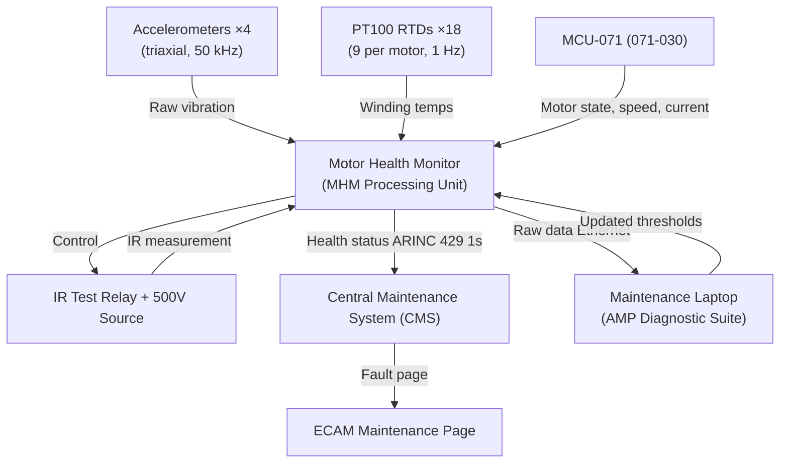
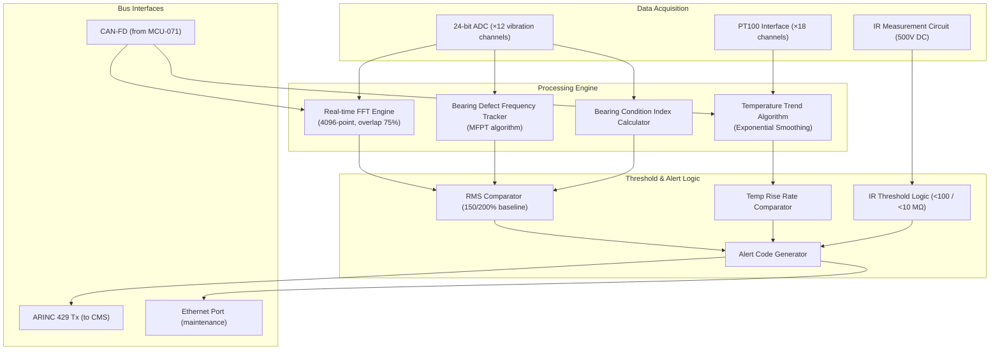

# Motor Health Monitoring and Diagnostics

---

## §0 Hyperlink Policy
All hyperlinks in this document are **relative**. Absolute URLs are forbidden.

## §1 Purpose
This document specifies the Motor Health Monitoring (MHM) system for the AMPEL360E eWTW, covering the hardware, embedded algorithms, and data interfaces required to monitor PMSM and MDU health in service. It defines vibration spectrum analysis (using MFPT/FFT algorithms), winding temperature trending, insulation resistance measurement, bearing condition monitoring, and the integration with the aircraft Central Maintenance System (CMS) and ECAM. The MHM system supports predictive maintenance and reduces unscheduled removal rates.

## §2 Applicability
| Aircraft | Variant | MSN Range | Effectivity |
|---|---|---|---|
| AMPEL360E | eWTW | All | From EIS |

## §3 Functional Description 
The Motor Health Monitor (MHM) is an embedded diagnostic processing unit mounted in the aft avionics bay, connected to a sensor network distributed across both PMSM motors and MDUs. The MHM samples four triaxial accelerometers (one per motor end-shield, plus two on the MDU housings) at 50 kHz per channel, performing real-time Fast Fourier Transform (FFT) spectral analysis to identify bearing defect frequencies (BPFO, BPFI, BSF, FTF per bearing geometry), rotor eccentricity sidebands, and structural looseness. Alarm thresholds are set at 150 % and 200 % of baseline rolling-average RMS vibration level, generating progressive ECAM advisory and caution messages respectively. Baseline spectral signatures are recorded during the first 50 flight hours and stored in non-volatile MHM flash memory.

Winding temperature trending is performed by the MHM on the 9 PT100 RTD signals per motor (sampled at 1 Hz), applying an exponential smoothing filter and comparing rolling 24-hour temperature rise rates against degradation models. A rate exceeding 0.5 °C/h above trending baseline at rated power triggers a maintenance alert, indicating possible partial turn-to-turn short or cooling system degradation. Insulation resistance (IR) testing is scheduled automatically by the MHM during ground power-down cycles; the MHM controls a dedicated IR test relay and measures isolation resistance from each phase winding to the motor frame using an on-board 500 V DC source, logging results over time to detect moisture ingress or gradual insulation breakdown. Alert thresholds are set at <100 MΩ (advisory) and <10 MΩ (action required).

All MHM-generated health data, fault codes, and prognostic estimates are transmitted to the aircraft CMS over ARINC 429 at 1 s report intervals, and displayed on the aircraft ECAM Maintenance Page. A maintenance laptop (running AMP Diagnostic Suite software) can connect to the MHM via Ethernet to perform deep spectral analysis, download raw time-domain vibration records for MFPT analysis, and upload revised alarm thresholds post-maintenance.

## §4 Functional Breakdown
| ID | Function | Description | Owner | DAL |
|---|---|---|---|---|
| F-071-060-01 | Vibration Spectrum Monitoring | Acquire accelerometer data at 50 kHz; perform real-time FFT and bearing defect frequency tracking | Q-HPC | DAL-C |
| F-071-060-02 | Winding Temperature Trending | Sample PT100 RTDs at 1 Hz; compute temperature rise rate; compare against degradation model | Q-HPC | DAL-C |
| F-071-060-03 | Insulation Resistance Measurement | Apply 500 V DC to phase windings and measure IR to frame at each power-down; log trend | Q-MECHANICS | DAL-C |
| F-071-060-04 | Bearing Condition Monitoring | Track BPFO/BPFI/BSF/FTF spectral peaks and compute bearing condition index (BCI) | Q-HPC | DAL-C |
| F-071-060-05 | ECAM/CMS Alert Generation | Transmit health status, fault codes and prognostic remaining useful life to CMS/ECAM | Q-HPC | DAL-C |

## §5 System Context

## §6 Internal Architecture

## §7 Components and LRUs
| LRU ID | Name | P/N | Qty | Location |
|---|---|---|---|---|
| LRU-071-060-01 | MHM Processing Unit | AMP-MHM-PROC-071 | 1 | Aft avionics bay |
| LRU-071-060-02 | Vibration Accelerometer Set (triaxial, ×4) | AMP-ACCL-071 | 4 | Motor end-shields (×2) + MDU (×2) |
| LRU-071-060-03 | Winding Temperature Sensor Array (PT100 ×18) | AMP-RTD-WND-071 | 18 | Embedded in stator windings |
| LRU-071-060-04 | Insulation Resistance Monitor (500 V DC source) | AMP-IRM-071 | 1 | Integral to MHM Processing Unit |
| LRU-071-060-05 | CMS Interface Module (ARINC 429 + Ethernet) | AMP-MHM-CMS-071 | 1 | Integral to MHM Processing Unit |

## §8 Interfaces
| Interface | Source | Destination | Protocol | Notes |
|---|---|---|---|---|
| IF-071-060-01 | Accelerometers (×4) | MHM Processing Unit | Analogue ±5 V, 50 kHz BW | Shielded coaxial cable, MIL-DTL-38999 |
| IF-071-060-02 | PT100 RTD Array (×18) | MHM Processing Unit | 4-wire PT100 analogue | IEC 60751 Class A, multi-pin connector |
| IF-071-060-03 | MHM IR relay | PMSM phase terminals | 500 V DC switched | Isolated solid-state relay |
| IF-071-060-04 | MCU-071 | MHM Processing Unit | CAN-FD 5 Mbit/s | Motor state, speed, current vector data |
| IF-071-060-05 | MHM Processing Unit | CMS / ECAM | ARINC 429 | Health codes, RUL estimates, 1 s update |

## §9 Operating Modes
| Mode | Trigger | Description | Power State | Notes |
|---|---|---|---|---|
| Initialise / Baseline | First 50 FH from new installation | Record baseline vibration spectra and temperature profiles | Active | One-time calibration |
| Continuous Monitoring | Any motor power-on state | Real-time FFT, temperature logging, bearing tracking | Active | 24/7 in-flight monitoring |
| IR Test | Motor power-down detected | Auto-triggered insulation resistance test (500 V DC, 60 s) | Standby | Pre-condition: motor de-energised |
| Ground Download | Maintenance laptop connect | Transfer raw vibration records and full trend history | Active | Via Ethernet SFTP |
| Alarm Active | Threshold exceedance | ECAM/CMS alert raised; MHM logs event with timestamp | Active | Awaits maintenance action |

## §10 Performance and Budgets 
| Parameter | Requirement | Current Estimate | Unit | Status |
|---|---|---|---|---|
| Vibration measurement bandwidth | 0 – 10000 | 0 – 10000 | Hz |  |
| Temperature measurement accuracy | ±2 | ±1.5 | °C |  |
| IR measurement range | 0 – 100 | 0 – 100 | MΩ |  |
| CMS report interval | 1 | 1 | s |  |
| MHM unit MTBF | ≥25000 | 28000 (estimate) | h |  |

## §11 Safety, Redundancy and Fault Tolerance
- MHM is a monitoring-only system with no direct authority over motor operation; it may only request advisory or caution levels from FADEC/MCU, not command shutdown (shutdown authority resides exclusively in MCU/MDU hardware trips).
- MHM processor incorporates a hardware watchdog; if MHM processing freezes, a maintenance advisory is generated, but motor operation continues unaffected.
- All MHM sensor faults (open-circuit accelerometer, failed RTD) are annunciated as degraded monitoring status on the ECAM Maintenance Page, with the specific failed sensor identified for targeted replacement.
- Raw vibration and temperature data are stored in MHM non-volatile flash (≥64 GB); circular buffer retains the last 200 flight hours of compressed data for post-event analysis.
- Ethernet maintenance interface is isolated from aircraft avionics networks by a data diode; no maintenance laptop can write to avionics buses, only to MHM configuration flash via authenticated upload.

## §12 Maintenance and Diagnostics
| Task | Interval | Tool | Reference |
|---|---|---|---|
| MHM full data download and trend review | Every A-check | Maintenance laptop + AMP Diagnostic Suite | AMM 071-60-11 |
| Accelerometer sensitivity check (end-to-end) | 600 FH | MHM self-test mode | AMM 071-60-21 |
| IR measurement result review (trend) | Every A-check | MHM data download + trending tool | AMM 071-60-31 |
| MHM processor BITE and memory check | Every A-check | MHM BITE auto-test on power-up | AMM 071-60-41 |

## §13 Footprint
| Dimension | Value | Unit | Notes |
|---|---|---|---|
| Physical mass | TBD | kg |  |
| Envelope | TBD | mm |  |
| Power draw (cont.) | TBD | W |  |
| Cooling demand | TBD | kW |  |
| Data interfaces | TBD | — |  |

## §14 Safety and Certification References
| Standard | Requirement | Applicability | Status | Notes |
|---|---|---|---|---|
| DO-178C | Software level per DAL | MCU software | Planned | DAL-B baseline |
| DO-254 | Hardware design assurance | MDU FPGA | Planned | DAL-B baseline |
| ARP4754A | System development | Motor system | Planned | System-level |
| CS-25 | Airworthiness requirements | Aircraft-level | Planned | EASA primary |
| FAR Part 25 | Airworthiness requirements | Aircraft-level | Planned | FAA bilateral |

## §15 V&V Approach
| Phase | Method | Tool/Facility | Status |
|---|---|---|---|
| Algorithm verification | FFT bearing defect detection accuracy against seeded fault motor rig | AMP Motor Test Facility |  |
| Temperature trending validation | Simulated RTD degradation signals injected into MHM; verify alert timing | MHM HIL bench |  |
| IR measurement accuracy test | Known resistances injected at MHM IR test port | Calibrated resistance standards |  |
| CMS integration test | MHM connected to aircraft CMS simulator; verify all alert codes and formats | AMP System Integration Lab |  |

## §16 Glossary
| Term | Definition |
|---|---|
| MHM | Motor Health Monitor — embedded diagnostic unit for prognostic monitoring |
| FFT | Fast Fourier Transform — algorithm converting time-domain signal to frequency spectrum |
| MFPT | Machinery Failure Prevention Technology — bearing defect frequency analysis methodology |
| BPFO | Ball Pass Frequency Outer race — bearing defect frequency for outer race fault |
| BPFI | Ball Pass Frequency Inner race — bearing defect frequency for inner race fault |
| BSF | Ball Spin Frequency — bearing rolling element defect frequency |
| FTF | Fundamental Train Frequency — bearing cage defect frequency |
| BCI | Bearing Condition Index — scalar health metric derived from spectral features |
| IR | Insulation Resistance — resistance from winding conductors to motor frame; indicator of insulation integrity |
| RUL | Remaining Useful Life — prognostic estimate of component life before maintenance action |

## §17 Open Issues
| ID | Description | Owner | Priority | Status |
|---|---|---|---|---|
| OI-071-060-001 | Validate MFPT bearing defect detection sensitivity at low speed (<500 rpm) for taxi phase monitoring | @copilot | High | Open |
| OI-071-060-002 | Define MHM data retention and GDPR-equivalent privacy compliance for operator fleet analytics upload | @copilot | Medium | Open |

## §18 Status Legend
| Badge | Meaning |
|---|---|
|  | Content under active development |
|  | Value or content to be determined |
|  | Approved and baselined |
|  | Placeholder |

## §19 Related Documents
| Code | Title | Link |
|---|---|---|
| 071-000 | Electric Motor and Drive Systems — General Overview | [071-000-Electric-Motor-and-Drive-Systems-General.md](071-000-Electric-Motor-and-Drive-Systems-General.md) |
| 071-010 | PMSM Motor Design and Specifications | [071-010-PMSM-Motor-Design-and-Specifications.md](071-010-PMSM-Motor-Design-and-Specifications.md) |
| 071-020 | Motor Drive Unit (MDU) and Inverter | [071-020-Motor-Drive-Unit-MDU-and-Inverter.md](071-020-Motor-Drive-Unit-MDU-and-Inverter.md) |
| 071-030 | Motor Control Unit (MCU) and Control Laws | [071-030-Motor-Control-Unit-MCU-and-Control-Laws.md](071-030-Motor-Control-Unit-MCU-and-Control-Laws.md) |
| 071-040 | Boundary Layer Ingestion (BLI) Aerodynamic Integration | [071-040-Boundary-Layer-Ingestion-Integration.md](071-040-Boundary-Layer-Ingestion-Integration.md) |
| 071-050 | Motor Thermal Management System | [071-050-Motor-Thermal-Management.md](071-050-Motor-Thermal-Management.md) |
| 071-070 | Motor Mechanical Interface and Transmission | [071-070-Motor-Mechanical-Interface-and-Transmission.md](071-070-Motor-Mechanical-Interface-and-Transmission.md) |
| 071-080 | Motor Electrical Interface and Power Quality | [071-080-Motor-Electrical-Interface-and-Power-Quality.md](071-080-Motor-Electrical-Interface-and-Power-Quality.md) |
| 071-090 | S1000D CSDB Mapping and Traceability (071) | [071-090-S1000D-CSDB-Mapping-and-Traceability.md](071-090-S1000D-CSDB-Mapping-and-Traceability.md) |

## §20 Change Log
| Rev | Date | Author | Summary |
|---|---|---|---|
| 0.1 | 2026-05-11 | @copilot | Initial creation |
