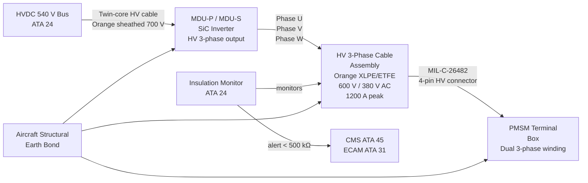
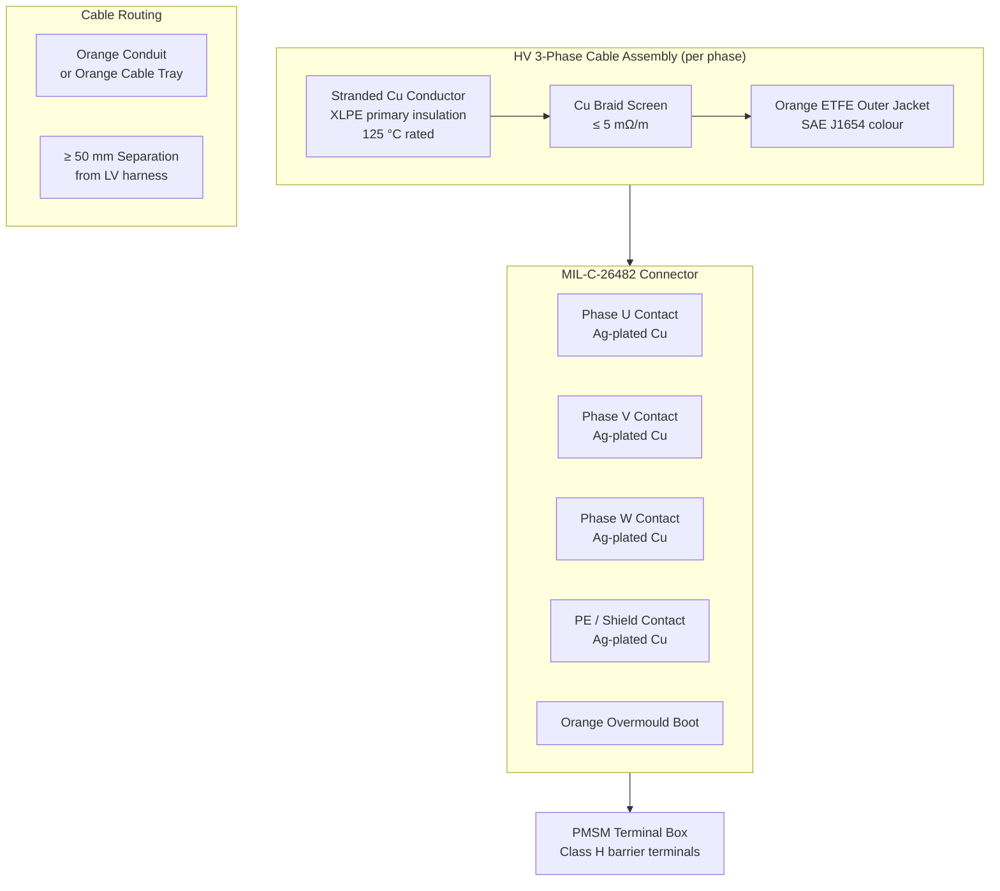

<!-- ──────────────────────────────────────────────────────────────────────────
     QATL-ATLAS-1000-ATLAS-070-079-071-060-MOTOR-POWER-CONNECTORS-AND-INSULATION
     ATA 71 · Motor Power Connectors and Insulation
     AMPEL360E eWTW — ATLAS Register 1000
────────────────────────────────────────────────────────────────────────────── -->

# Motor Power Connectors and Insulation

---

## §0 Hyperlink Policy

> All hyperlinks in this document are **relative** (five directory levels: `../../../../../`).
> Absolute URLs are forbidden. Every linked document must exist in the Q+ATLANTIDE repository
> before the link is activated. Broken links are treated as open issues and must be resolved
> before the document is promoted from `DRAFT` to `APPROVED`.

---

## §1 Purpose

This document defines the High Voltage (HV) 3-phase power cable assemblies, connectors (MIL-spec circular HV connectors), orange insulation and cable identification per SAE J1654, shielding and grounding architecture, insulation resistance test requirements, and partial discharge testing requirements per IEC 60034-25 for the AMPEL360E eWTW traction motor drive circuits.

Correct identification, installation, and periodic testing of the HV power cables and connectors between the MDU and the PMSM is a critical airworthiness requirement. The **orange colour identification** of all HV cables (nominal 540 V DC / 380 V AC phase-to-phase) per SAE J1654 is mandatory throughout the aircraft to eliminate the possibility of LV cable confusion during maintenance. This colour rule is enforced as a BREX constraint in the S1000D data modules (see 071-090).

---

## §2 Applicability

| Parameter | Value |
|---|---|
| Aircraft Program | AMPEL360E eWTW |
| ATA reference | ATA 71-060 — Motor Power Connectors and Insulation |
| Certification basis | EASA CS-25 Amdt 27+; SAE J1654; IEC 60034-25; IEC 60664-1 |
| S1000D SNS | 071-060-00 |

---

## §3 Functional Description ![DRAFT]

**HV 3-phase power cables:** Three HV cables (phases U, V, W) connect each MDU to its PMSM. Each cable is a single-conductor design: cross-linked polyethylene (XLPE) insulation rated **125 °C** conductor temperature, over-sheathed with orange-pigmented ETFE (ethylene tetrafluoroethylene) jacket. Cable system rated voltage is **600 V DC / 380 V AC (phase-to-phase)**. Cable cross-section is selected from the wiring load analysis (WLA) to carry 1 200 A peak without exceeding the insulation temperature rating.

All three phase conductors are individually screened (copper braid screen) and the screens are bonded to the aircraft structure earth at both the MDU end and the PMSM terminal box, providing EMC shielding and return current path for shield-referenced ground faults. Screen impedance ≤ 5 mΩ/m.

**Connectors:** The MDU-to-PMSM 3-phase connection uses MIL-C-26482 Series II circular HV connectors: a 4-pin configuration (3 HV power contacts + 1 protective earth contact). Pin-and-socket contact material is silver-plated copper alloy rated for the full 1 200 A peak current. Connector housing is cadmium-free passivated aluminium alloy with orange overmould boot. Connector rated voltage 600 V DC; rated current 400 A per contact (three contacts in parallel give 1 200 A total per phase when bundle-connected).

**HVDC bus cable (MDU DC input):** The HVDC 540 V bus cable from the traction bus distribution point to each MDU DC-link input is a twin-core (positive + negative) orange-sheathed cable, rated 700 V DC, with overall copper braid screen. Both conductors are individually insulated (orange + blue marking over orange outer jacket). The screen is bonded to aircraft structural earth at the MDU end.

**Cable routing:** All HV cables are routed in orange conduit or dedicated orange cable trays, physically separated from LV wiring harnesses by a minimum of **50 mm** throughout the cable run. Where 50 mm separation cannot be maintained (due to structure constraints), metallic separation barriers are installed. Cable bends comply with the minimum bend radius ≥ 8× cable outer diameter.

**Insulation Monitoring System (IMS):** An Insulation Monitoring System (IMS, per ATA 24 / ATA 45) continuously monitors the insulation resistance of the HV traction circuit during operation. An IMS alert (insulation resistance < 500 kΩ) triggers a ECAM advisory and CMS fault log.

---

## §4 Functional Breakdown

| ID | Name | Description | Lead Division |
|---|---|---|---|
| F-001 | HV 3-Phase Cable Assembly (MDU to PMSM) | XLPE/ETFE orange cable; screened; 600 V / 380 V; 125 °C; individual phase conductors | Q-GREENTECH |
| F-002 | MIL-Spec HV Circular Connector | MIL-C-26482 Series II; 4-pin (3 phase + PE); 600 V DC; orange overmould boot | Q-MECHANICS |
| F-003 | Orange Insulation / Identification (SAE J1654) | Orange outer jacket and conduit; mandatory HV identification; BREX enforcement | Q-INDUSTRY |
| F-004 | Cable Shield / Protective Earth | Copper braid screen; bonded at both ends; ≤ 5 mΩ/m; EMC + fault current return path | Q-MECHANICS |
| F-005 | Insulation Monitoring System (IMS) | ATA 24 IMS monitors traction HV circuit insulation resistance; alert at < 500 kΩ | Q-GREENTECH |

---

## §5 System Context — Mermaid Diagram

---

## §6 Internal Architecture — Mermaid Diagram

---

## §7 Components and LRUs

| Component | Part Number | Qty | Location | Maintenance Interval | Notes |
|---|---|---|---|---|---|
| HV 3-phase cable set (MDU-P to PMSM-P, 3 cables) | CAB-071-P-TBD | 1 set | Port wing MDU to PMSM | B-check IR test; replace on PD fail or damage | Orange XLPE/ETFE; 125 °C; 600 V |
| HV 3-phase cable set (MDU-S to PMSM-S, 3 cables) | CAB-071-S-TBD | 1 set | Stbd wing MDU to PMSM | B-check IR test; replace on PD fail or damage | Identical to port set |
| MIL-C-26482 connector (MDU end, per phase) | CONN-MDU-071-TBD | 6 (3 per MDU × 2) | MDU HV output port | Inspect at B-check; replace on pin damage | 4-pin; orange boot; 600 V DC |
| MIL-C-26482 connector (PMSM end, per phase) | CONN-PMSM-071-TBD | 6 (3 per PMSM × 2) | PMSM terminal box | Inspect at B-check; replace on pin damage | Identical to MDU end connector |
| HVDC bus cable (per MDU, twin-core) | CAB-DC-071-TBD | 2 (1 per MDU) | Traction bus to MDU DC input | B-check IR test | Orange; 700 V DC; overall screened |
| Orange conduit / cable tray | COND-071-TBD | Per cable run | Wing structure cable routes | Inspect at C-check | Metallic or high-temp polymer; orange |

---

## §8 Interfaces

| Interface Type | Connected System | Protocol / Medium | Data / Function |
|---|---|---|---|
| MDU 3-phase AC output | MDU-P / MDU-S (ATA 71-030) | HV cable assembly (orange XLPE/ETFE) | 3-phase AC; 0–380 V, 1 200 A peak |
| PMSM terminal box | PMSM-P / PMSM-S (ATA 71-020) | MIL-C-26482 connector; Class H barrier terminals | Winding excitation input |
| HVDC traction bus | ATA 24 / ATA 79 traction bus | Twin-core orange HV cable, 700 V DC | DC power input to MDU |
| Insulation monitoring | IMS (ATA 24) | Monitoring circuit tap on HV cable | Insulation resistance measurement; alert at < 500 kΩ |
| Aircraft structural earth | Aircraft earth (ZSSK) | Cable screen bond; PE contact | EMC screen return; fault current path; continuity ≤ 5 mΩ |

---

## §9 Operating Modes

| Mode | Trigger | System State | Actions / Consequences |
|---|---|---|---|
| Normal operation | HV circuit energised; IMS nominal | IMS: insulation resistance > 500 kΩ; no alerts | Normal power flow; orange cable system fully energised |
| IMS alert (degraded insulation) | IMS detects IR < 500 kΩ | ECAM advisory; CMS fault log | Crew informed; maintenance investigation at next opportunity |
| HV isolated (maintenance) | LOTO applied; MDU shutdown + active discharge | DC-link < 60 V confirmed; HV circuit isolated | Orange covers installed on open connectors; IR test can proceed |
| Over-current fault | MDU DESAT detection | Gate shutdown; HV cable current = 0 within μs | Cable and connector within peak 1 200 A rated; no damage expected |
| Cable damage / insulation fault | IMS IR below trip threshold or physical damage | Depending on fault severity: IMS alert or direct arc fault detection | ECAM warning; MCU commands gate shutdown; maintenance required |

---

## §10 Performance and Budgets ![DRAFT]

| Parameter | Requirement | Target / Design Value | Status |
|---|---|---|---|
| Cable rated voltage | 600 V DC / 380 V AC | 600 V DC; 380 V AC (phase-phase) | ![TBD] |
| Insulation resistance (new, 1 000 V DC test) | ≥ 100 MΩ | ≥ 100 MΩ | ![TBD] |
| In-service IR limit (B-check) | ≥ 100 MΩ | ≥ 100 MΩ (replace if < 100 MΩ) | ![TBD] |
| PD inception voltage | ≥ 1.5× rated voltage | ≥ 900 V DC (1.5 × 600 V) | ![TBD] |
| Cable conductor temp rating | ≥ 125 °C | 125 °C (XLPE) | ![TBD] |
| Screen resistance | ≤ 5 mΩ/m | ≤ 5 mΩ/m | ![TBD] |
| LV/HV separation | ≥ 50 mm | ≥ 50 mm or metallic barrier | ![TBD] |

---

## §11 Safety, Redundancy and Fault Tolerance

- Orange cable identification per SAE J1654 is the primary administrative control preventing LV cable disconnection on an energised HV circuit during maintenance. All AMM procedures must reference the orange identification requirement (enforced by BREX rule in 071-090).
- LOTO procedure requires active discharge confirmation (DC-link < 60 V via MDU GSE or test point) before any HV connector is disconnected. Orange protective covers are installed on open connectors as a secondary barrier.
- The IMS continuously monitors insulation resistance during aircraft operation; an IR fall below 500 kΩ indicates incipient insulation degradation well before cable failure, enabling planned maintenance.
- Partial discharge testing at B-check and C-check intervals detects early insulation aging (corona at HV stress concentrations) before complete breakdown, consistent with the IEC 60034-25 maintenance philosophy.
- Connector contact resistance is verified at each B-check (mΩ measurement at HV connector mating face); contact resistance > 5 mΩ (per contact) is cause for replacement to prevent hot-joint thermal runaway.

---

## §12 Maintenance and Diagnostics

| Task | Interval | Access | Special Tools |
|---|---|---|---|
| Insulation resistance test (1 000 V DC, IR ≥ 100 MΩ) | B-check | HV connector disconnected; HVDC LOTO applied | Insulation tester 1 000 V DC; HVDC isolation kit |
| Connector visual inspection (pin condition, boot integrity) | B-check | HV connector mating face visible | Inspection lamp; magnifier |
| Connector contact resistance (mΩ per contact) | B-check | HV connector disconnected | Contact resistance tester (mΩ); HVDC isolation kit |
| Partial discharge test (≥ 1.5× rated voltage) | C-check | HV connector disconnected; PD tester | PD tester per IEC 60034-25 |
| Cable routing and conduit inspection (chafing, orange identification) | C-check | Wing access panels open | Inspection lamp; chafe check per AMM |
| HVDC bus cable IR test | B-check | HVDC bus isolated | Insulation tester 1 000 V DC |

---

## §13 Footprint — Physical, Electrical, Maintenance, Data ![TBD]

| Footprint Type | Parameter | Value | Notes |
|---|---|---|---|
| Physical | 3-phase HV cable set mass (per wing) | ![TBD] | Per WLA and routing length |
| Physical | Cable run length (MDU to PMSM per wing) | ![TBD] | Per aircraft installation drawing |
| Electrical | Cable voltage drop at 1 200 A | ![TBD] | Per cable cross-section selection from WLA |
| Maintenance | LOTO time (HV isolation + active discharge confirm) | ≤ 10 min | Per active discharge ≤ 5 s + LOTO procedure |

---

## §14 Safety and Certification References ![DRAFT]

| Standard / Document | Title | Issuing Body | Applicability |
|---|---|---|---|
| SAE J1654 | High Voltage Primary Cable | SAE International | Orange cable colour identification standard |
| IEC 60034-25 | Rotating Electrical Machines for power drive systems | IEC | Insulation and PD testing for inverter-fed motors |
| IEC 60664-1 | Insulation coordination — Low-voltage equipment | IEC | SELV 60 V limit for maintenance access after discharge |
| MIL-C-26482 | Connectors, Electrical, Circular, Miniature, Quick-Disconnect | DoD / MIL-SPEC | HV connector specification |
| SAE AS50881 | Wiring Aerospace Vehicle | SAE International | Cable routing, bend radius, separation rules |
| EASA CS-25 Amdt 27+ | Certification Specifications for Large Aeroplanes | EASA | Primary airworthiness basis |

---

## §15 V&V Approach ![TBD]

| Phase | Method | Acceptance Criterion | Status |
|---|---|---|---|
| Design | Wiring load analysis (WLA) | Cable conductor temp ≤ 125 °C at 1 200 A peak | ![TBD] |
| Component test | IR test (1 000 V DC, new cable) | IR ≥ 100 MΩ | ![TBD] |
| Component test | PD inception test | PD inception ≥ 900 V (1.5× 600 V) per IEC 60034-25 | ![TBD] |
| Component test | Connector contact resistance | ≤ 5 mΩ per contact at rated current | ![TBD] |
| Integration test | Installed cable routing inspection | Orange identification verified throughout; ≥ 50 mm LV separation | ![TBD] |
| Qualification | DO-160G vibration / temperature (connector) | Connector retention and IR maintained after qualification test | ![TBD] |

---

## §16 Glossary

| Term | Definition |
|---|---|
| **SAE J1654** | SAE standard specifying orange outer colour for HV primary cables in hybrid/electric powertrains; mandatory for LV/HV cable discrimination. |
| **XLPE** | Cross-Linked Polyethylene — thermoset cable insulation rated to 125 °C or 150 °C; superior to PVC for high-temperature aerospace cable. |
| **ETFE** | Ethylene Tetrafluoroethylene — fluoropolymer jacket material; orange-pigmented for HV identification; excellent chemical and abrasion resistance. |
| **MIL-C-26482** | Military specification for circular quick-disconnect miniature connectors; Series II used for high-current HV applications. |
| **IMS** | Insulation Monitoring System — monitors insulation resistance of an energised HV circuit without disconnecting it; provides early degradation warning. |
| **PD** | Partial Discharge — localised electrical discharge in insulation void; early indicator of insulation aging; tested per IEC 60034-25. |
| **LOTO** | Lock-Out / Tag-Out — safety procedure isolating and securing energy sources (electrical, mechanical) before maintenance work. |
| **IR** | Insulation Resistance — resistance between conductor and screen/earth; measured at 1 000 V DC; minimum acceptance 100 MΩ. |

---

## §17 Open Issues

| ID | Description | Owner | Target |
|---|---|---|---|
| OI-071-060-001 | Complete WLA for HV 3-phase cable cross-section selection (peak 1 200 A; routing length TBD) | Q-MECHANICS | 2026-Q4 |
| OI-071-060-002 | Confirm IMS integration with ATA 24 IMS or standalone IMS for traction circuit | Q-GREENTECH | 2026-Q4 |
| OI-071-060-003 | Verify 50 mm LV/HV separation is achievable in wing root installation zone; identify barrier locations | Q-MECHANICS | 2027-Q1 |

---

## §18 Status Legend

| Badge | Meaning |
|---|---|
| `![DRAFT]` | Section is drafted but not yet reviewed |
| `![TBD]` | Content not yet started — to be defined |
| `![To Be Completed]` | Partially complete — needs additional content |
| `![APPROVED]` | Reviewed and formally approved |

---

## §19 Related Documents (Siblings in this Subsection)

- [071-000](./071-000-Electric-Motor-and-Drive-Systems-General.md)
- [071-010](./071-010-Traction-Motor-Architecture.md)
- [071-020](./071-020-Motor-Rotor-Stator-and-Bearing-Assemblies.md)
- [071-030](./071-030-Inverter-and-Motor-Drive-Unit.md)
- [071-040](./071-040-Motor-Control-and-Torque-Command.md)
- [071-050](./071-050-Motor-Cooling-and-Thermal-Protection.md)
- [071-070](./071-070-Motor-Inspection-Test-and-Maintenance.md)
- [071-080](./071-080-Electric-Drive-Monitoring-Diagnostics-and-Control-Interfaces.md)
- [071-090](./071-090-S1000D-CSDB-Mapping-and-Traceability.md)

---

## §20 Change Log

| Rev | Date | Author | Description |
|---|---|---|---|
| 0.1 | 2026-05-11 | @copilot | Initial DRAFT — contextualized content per AMPEL360E eWTW architecture |
