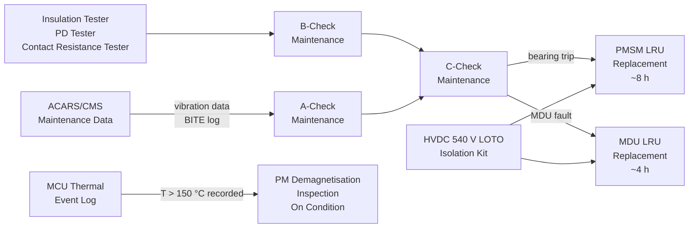
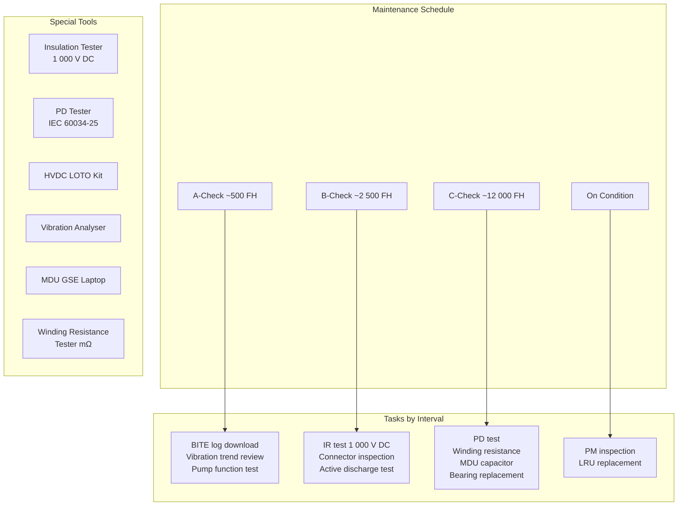

<!-- ──────────────────────────────────────────────────────────────────────────
     QATL-ATLAS-1000-ATLAS-070-079-071-070-MOTOR-INSPECTION-TEST-AND-MAINTENANCE
     ATA 71 · Motor Inspection, Test and Maintenance
     AMPEL360E eWTW — ATLAS Register 1000
────────────────────────────────────────────────────────────────────────────── -->

# Motor Inspection, Test and Maintenance

---

## §0 Hyperlink Policy

> All hyperlinks in this document are **relative** (five directory levels: `../../../../../`).
> Absolute URLs are forbidden. Every linked document must exist in the Q+ATLANTIDE repository
> before the link is activated. Broken links are treated as open issues and must be resolved
> before the document is promoted from `DRAFT` to `APPROVED`.

---

## §1 Purpose

This document defines the scheduled and on-condition maintenance programme for the ATA 71 Electric Motor and Drive System components on the AMPEL360E eWTW: the PMSM traction motors (PMSM-P and PMSM-S), the Motor Drive Units (MDU-P and MDU-S), and the Motor Control Unit (MCU). It covers maintenance tasks at A-check, B-check, C-check, and on-condition intervals, as well as LRU replacement procedures and the special tools required for each task.

All ATA 71 maintenance tasks are performed in accordance with the Aircraft Maintenance Manual (AMM), which derives its task structure from the S1000D data modules listed in ATA 71-090. **HVDC 540 V isolation (LOTO) is mandatory before any HV connector is broken or any motor/MDU cover is removed.**

---

## §2 Applicability

| Parameter | Value |
|---|---|
| Aircraft Program | AMPEL360E eWTW |
| ATA reference | ATA 71-070 — Motor Inspection, Test and Maintenance |
| Certification basis | EASA CS-25 Amdt 27+; EASA Part-M; EASA Part-145 |
| S1000D SNS | 071-070-00 |

---

## §3 Functional Description ![DRAFT]

**A-Check tasks (every 500 FH approx.):**
- MCU BITE log download via CMS terminal or ACARS transmission; review for fault codes, exceedance events, and channel changeover events.
- Bearing vibration trend review: ACARS download of MCU vibration monitoring data; compare broadband RMS and bearing defect frequency amplitudes against trending baseline and alert thresholds.
- Coolant pump primary/backup function test: MCU GSE ground command to cycle primary and backup pumps; verify no pump failure faults in MCU log.
- Visual inspection of HV cable orange conduit routing in accessible zones (during A-check access panel opening); check for chafing or mechanical damage.

**B-Check tasks (every 2 500 FH approx.):**
- Insulation resistance test of HV 3-phase cable assemblies and PMSM stator windings: 1 000 V DC applied via insulation tester with HVDC LOTO applied; both winding sets (A and B) tested separately; result ≥ 100 MΩ required for continued service.
- Connector visual inspection: MDU-end and PMSM-end MIL-C-26482 connectors inspected for pin condition, corrosion, orange boot integrity, and mating thread condition.
- Connector contact resistance test (mΩ per contact); limit ≤ 5 mΩ per contact.
- NTC thermistor continuity and resistance check at ambient temperature (10 kΩ at 25 °C nominal ±5 %).
- Active discharge functional test: MCU GSE commands MDU shutdown with power applied; timer measures time to reach < 60 V on DC-link; limit ≤ 5 s.

**C-Check tasks (every 6 years or 12 000 FH approx.):**
- Partial discharge test on PMSM stator windings per IEC 60034-25: apply ≥ 1.5× rated voltage (900 V); measure PD inception voltage; replace winding if PD inception < 900 V.
- Winding resistance 3-phase balance: measure DC resistance of each phase (U, V, W) of each winding set (A and B); balance criterion: individual phase resistance within ±1 % of mean.
- MDU capacitor inspection: measure DC-link capacitor capacitance (acceptance criterion: within −5 % of rated value) and ESR (within 2× new value) using LCR meter.
- SiC device visual inspection: borescope inspection of SiC MOSFET solder joints and gate driver PCB.
- Bearing replacement (on condition): if vibration trending shows bearing defect frequency amplitude exceeding 3 times the baseline, or broadband RMS exceeds alarm threshold for 3 consecutive A-checks, bearings are replaced.
- Oil-mist lubricator oil reservoir refill and condition check.
- Cooling circuit flush, coolant concentration check (refractometer), and pressure test.

**PM demagnetisation inspection (on condition — after MCU thermal exceedance event):**
Per BREX rule in 071-090: if MCU event log records any stator temperature peak ≥ 150 °C (estimated PM temperature exceedance proxy), the maintenance organisation must:
1. Download MCU event log and identify exceedance duration and peak temperature.
2. If any single event lasted > 5 min or > 160 °C estimated, perform OEM PM Gauss-meter test on extracted rotor.
3. Document result in aircraft maintenance record before return to service.

**PMSM LRU replacement (on condition — bearing fault or winding fault):**
- Estimated task time: ~8 hours (including LOTO, nacelle access, motor extraction, new motor installation, HV connector re-installation, IR test, and functional test).
- Special tools: rotor extraction mandrel, bearing replacement kit, HV LOTO kit, torque wrench calibrated set.

**MDU LRU replacement (on fault):**
- Estimated task time: ~4 hours (LOTO, wing electronics bay access, MDU extraction, MDU installation, connector re-installation, active discharge test, functional test).
- Special tools: MDU extraction/installation cradle, HV LOTO kit, laptop with MDU GSE software.

**MCU LRU replacement (on fault):**
- Estimated task time: ~2 hours (EE bay access, MCU extraction from rack, MCU installation, software load, BITE self-test).
- Special tools: standard EE bay tools, MCU software load tool (laptop + adapter).

---

## §4 Functional Breakdown

| ID | Name | Description | Lead Division |
|---|---|---|---|
| F-001 | A-Check Programme | MCU BITE log download; vibration trend review; pump function test; visual inspection | Q-GREENTECH |
| F-002 | B-Check Programme | IR test (1 000 V DC); connector inspection and contact resistance; NTC check; active discharge test | Q-MECHANICS |
| F-003 | C-Check Programme | PD test; winding resistance balance; MDU capacitor; SiC inspection; bearing replacement on condition; cooling flush | Q-MECHANICS |
| F-004 | On-Condition PM Inspection | MCU event log thermal exceedance review; OEM Gauss-meter PM test; return-to-service documentation | Q-GREENTECH |
| F-005 | PMSM LRU Replacement | 8 h task; bearing/winding fault; nacelle access; HV LOTO; IR test post-installation | Q-MECHANICS |
| F-006 | MDU / MCU LRU Replacement | MDU: 4 h; MCU: 2 h; on fault; wing electronics bay / EE bay access; functional test post-installation | Q-MECHANICS |

---

## §5 System Context — Mermaid Diagram

---

## §6 Internal Architecture — Mermaid Diagram

---

## §7 Components and LRUs

| Component | Part Number | Qty | Location | Maintenance Interval | Notes |
|---|---|---|---|---|---|
| Winding resistance tester (mΩ resolution) | TOOL-WR-071-TBD | 1 (GSE) | Maintenance tool store | Calibrate per tool calibration schedule | Measures DC resistance per phase to ±0.1 mΩ |
| Insulation tester (1 000 V DC) | TOOL-IR-071-TBD | 1 (GSE) | Maintenance tool store | Calibrate per tool calibration schedule | Pass: ≥ 100 MΩ |
| Partial discharge tester | TOOL-PD-071-TBD | 1 (GSE) | Maintenance tool store | Calibrate per tool calibration schedule | Per IEC 60034-25; 900 V AC application |
| Vibration analyser (portable) | TOOL-VIB-071-TBD | 1 (GSE) | Maintenance tool store | Calibrate per tool calibration schedule | Connected to bearing accelerometer outputs |
| HVDC LOTO isolation kit | TOOL-LOTO-071-TBD | 2 (per wing) | Wing maintenance kit | Inspect per use | Includes lockout device, discharge test point, < 60 V meter |
| MDU GSE software (laptop + adapter) | TOOL-GSE-MDU-TBD | 1 | Line maintenance laptop | Software version per MDU SB | MDU functional test, active discharge test |
| MCU GSE software (laptop + adapter) | TOOL-GSE-MCU-TBD | 1 | Line maintenance laptop | Software version per MCU SB | MCU BITE log, vibration data, pump test |

---

## §8 Interfaces

| Interface Type | Connected System | Protocol / Medium | Data / Function |
|---|---|---|---|
| CMS terminal / ACARS | CMS ATA 45 | AFDX / ACARS | MCU BITE log download; vibration trend data |
| MDU GSE connection | MDU maintenance port | USB / Ethernet | MDU functional test; active discharge test; fault readout |
| MCU GSE connection | MCU maintenance port | USB / Ethernet | MCU BITE; event log; vibration data; pump command |
| Insulation tester | HV cable / PMSM terminal (disconnected) | Test lead; 1 000 V DC | IR measurement; requires HVDC LOTO |
| PD tester | PMSM terminal (disconnected) | HV test cable; 900 V AC | PD inception voltage measurement |
| Aircraft maintenance record | AMOS / digital maintenance system | Data entry | Task completion, tool serial numbers, measurements recorded |

---

## §9 Operating Modes

| Mode | Trigger | System State | Actions / Consequences |
|---|---|---|---|
| Aircraft in service (between checks) | Normal operations | IMS monitoring; MCU vibration trending | Condition monitoring between scheduled checks |
| A-check maintenance | A-check interval reached | Aircraft on ground; MDU/MCU accessible | BITE log review; vibration trend check; no HV disconnection |
| B-check maintenance | B-check interval reached | HVDC LOTO applied; HV connectors disconnected | IR test; connector inspection; active discharge test |
| C-check maintenance | C-check interval reached | Aircraft in hangar; nacelle access | PD test; winding resistance; bearing assessment; MDU capacitor |
| PMSM LRU replacement | On condition (bearing/winding fault) | HVDC LOTO; nacelle open | Motor extraction; replacement; IR test; functional ground test |
| MDU LRU replacement | On fault | HVDC LOTO; wing bay open | MDU extraction; replacement; functional test; active discharge confirm |

---

## §10 Performance and Budgets ![DRAFT]

| Parameter | Requirement | Target / Design Value | Status |
|---|---|---|---|
| Bearing L10 design life | ≥ 25 000 FH | 30 000 FH | ![TBD] |
| Winding resistance balance (3-phase) | ≤ 1 % delta per phase from mean | ≤ 1 % | ![TBD] |
| Insulation resistance (IR) at B-check | ≥ 100 MΩ (1 000 V DC) | ≥ 100 MΩ | ![TBD] |
| PD inception voltage at C-check | ≥ 1.5× rated (900 V) | ≥ 900 V (pass) | ![TBD] |
| Active discharge test (MDU) | ≤ 10 s to < 60 V | ≤ 5 s | ![TBD] |
| PMSM LRU replacement task time | ≤ 10 h | ~8 h | ![TBD] |
| MDU LRU replacement task time | ≤ 6 h | ~4 h | ![TBD] |

---

## §11 Safety, Redundancy and Fault Tolerance

- **HVDC LOTO is mandatory** before any HV connector is broken. The AMM procedure requires a written isolation check confirming DC-link voltage < 60 V (via MDU GSE or dedicated test point) before any orange-covered connector is opened.
- The PM demagnetisation inspection on-condition trigger (MCU thermal event log) ensures that any stator overtemperature event that could have caused PM demagnetisation is caught by maintenance before the next flight.
- Bearing replacement is on-condition, triggered by vibration trending rather than fixed time intervals, maximising bearing life utilisation while preventing in-service failure.
- All maintenance personnel working on HV systems must hold the required ATA 71 HVDC authorisation per operator's Part-147 Training Organisation programme. This is a regulatory requirement under EASA Part-66 Module 17 (Propellers) adapted for electric propulsion.

---

## §12 Maintenance and Diagnostics

| Task | Interval | Access | Special Tools |
|---|---|---|---|
| MCU BITE log download | A-check | CMS terminal | CMS terminal or ACARS |
| Bearing vibration trend review | A-check | CMS terminal | ACARS / MCU GSE |
| HV cable visual inspection (accessible zones) | A-check | Access panels in wing | Inspection lamp |
| IR test (PMSM stator, 1 000 V DC) | B-check | HV connector disconnected; LOTO applied | IR tester; LOTO kit |
| Connector inspection and contact resistance | B-check | HV connector mating face | mΩ tester; magnifier |
| Active discharge test | B-check | MDU GSE | MDU GSE laptop |
| PD test on stator windings | C-check | HV connector disconnected; LOTO | PD tester |
| Winding resistance 3-phase balance | C-check | HV connector disconnected; LOTO | Winding resistance tester (mΩ) |
| MDU capacitor ESR and capacitance | C-check | MDU enclosure open; LOTO | LCR meter |
| Bearing replacement (on condition) | On condition | Wing nacelle; motor end cap open | Bearing puller; induction heater |
| PM demagnetisation inspection | On condition (temp event) | Rotor extraction required | OEM PM test fixture; Gauss meter |

---

## §13 Footprint — Physical, Electrical, Maintenance, Data ![TBD]

| Footprint Type | Parameter | Value | Notes |
|---|---|---|---|
| Maintenance | PMSM LRU replacement task time | ~8 h | Two-person team; nacelle removal required |
| Maintenance | MDU LRU replacement task time | ~4 h | One-person + assistant; wing bay access |
| Maintenance | MCU LRU replacement task time | ~2 h | One technician; EE bay access |
| Maintenance | Access equipment | Wing access stand; overhead fixture for PMSM lift | Per AMM; PMSM mass TBD |

---

## §14 Safety and Certification References ![DRAFT]

| Standard / Document | Title | Issuing Body | Applicability |
|---|---|---|---|
| EASA CS-25 Amdt 27+ | Certification Specifications for Large Aeroplanes | EASA | Primary airworthiness basis |
| EASA Part-M | Continuing Airworthiness Management | EASA | Maintenance programme approval |
| EASA Part-145 | Approved Maintenance Organisation | EASA | AMO requirements for ATA 71 HV tasks |
| EASA Part-66 Module 17 | Propeller / Propulsion maintenance licence | EASA | HVDC authorisation for ATA 71 tasks (adapted) |
| IEC 60034-25 | Rotating Electrical Machines for power drive systems | IEC | PD test procedure for inverter-fed PMSM |
| IEC 60664-1 | Insulation coordination — SELV limit | IEC | 60 V SELV safe access limit after LOTO |

---

## §15 V&V Approach ![TBD]

| Phase | Method | Acceptance Criterion | Status |
|---|---|---|---|
| Design | Maintainability analysis (FMEA × maintenance task list) | All identified failure modes have a corresponding maintenance task | ![TBD] |
| Design | Task time estimation (MTTR analysis) | PMSM MTTR ≤ 10 h; MDU MTTR ≤ 6 h | ![TBD] |
| Validation | Maintenance demonstration (2 × technician, actual nacelle mock-up) | PMSM replacement ≤ 8 h demonstrated | ![TBD] |
| Certification | EASA continued airworthiness review | Maintenance programme approved by EASA | ![TBD] |

---

## §16 Glossary

| Term | Definition |
|---|---|
| **LOTO** | Lock-Out / Tag-Out — energy isolation and locking procedure preventing inadvertent re-energisation during maintenance. |
| **IR test** | Insulation Resistance test — 1 000 V DC applied across conductor-to-screen; pass ≥ 100 MΩ. |
| **PD test** | Partial Discharge test — HV stress at ≥ 1.5× rated voltage to detect incipient insulation voids per IEC 60034-25. |
| **Winding resistance balance** | 3-phase DC resistance measured per phase; balance ≤ 1 % confirms uniform conductor cross-section and no partial winding open-circuit. |
| **A-check** | Scheduled maintenance check at ~500 FH interval; typically overnight; limited system access. |
| **B-check** | Scheduled maintenance check at ~2 500 FH interval; weekend stop; wing access panels opened. |
| **C-check** | Scheduled maintenance check at ~12 000 FH / 6 years; hangar-based; nacelle removal access. |
| **MTTR** | Mean Time To Repair — metric for LRU replacement task time; used in maintainability analysis. |

---

## §17 Open Issues

| ID | Description | Owner | Target |
|---|---|---|---|
| OI-071-070-001 | Finalise A/B/C-check intervals with MSG-3 analysis and OEM bearing fatigue data | Q-MECHANICS | 2027-Q1 |
| OI-071-070-002 | Define PM demagnetisation inspection procedure (OEM scope, go/no-go criteria) | Q-GREENTECH | 2027-Q1 |
| OI-071-070-003 | Validate PMSM ~8 h task time with maintainability demonstration on structural mock-up | Q-MECHANICS | 2027-Q2 |

---

## §18 Status Legend

| Badge | Meaning |
|---|---|
| `![DRAFT]` | Section is drafted but not yet reviewed |
| `![TBD]` | Content not yet started — to be defined |
| `![To Be Completed]` | Partially complete — needs additional content |
| `![APPROVED]` | Reviewed and formally approved |

---

## §19 Related Documents (Siblings in this Subsection)

- [071-000](./071-000-Electric-Motor-and-Drive-Systems-General.md)
- [071-010](./071-010-Traction-Motor-Architecture.md)
- [071-020](./071-020-Motor-Rotor-Stator-and-Bearing-Assemblies.md)
- [071-030](./071-030-Inverter-and-Motor-Drive-Unit.md)
- [071-040](./071-040-Motor-Control-and-Torque-Command.md)
- [071-050](./071-050-Motor-Cooling-and-Thermal-Protection.md)
- [071-060](./071-060-Motor-Power-Connectors-and-Insulation.md)
- [071-080](./071-080-Electric-Drive-Monitoring-Diagnostics-and-Control-Interfaces.md)
- [071-090](./071-090-S1000D-CSDB-Mapping-and-Traceability.md)

---

## §20 Change Log

| Rev | Date | Author | Description |
|---|---|---|---|
| 0.1 | 2026-05-11 | @copilot | Initial DRAFT — contextualized content per AMPEL360E eWTW architecture |
