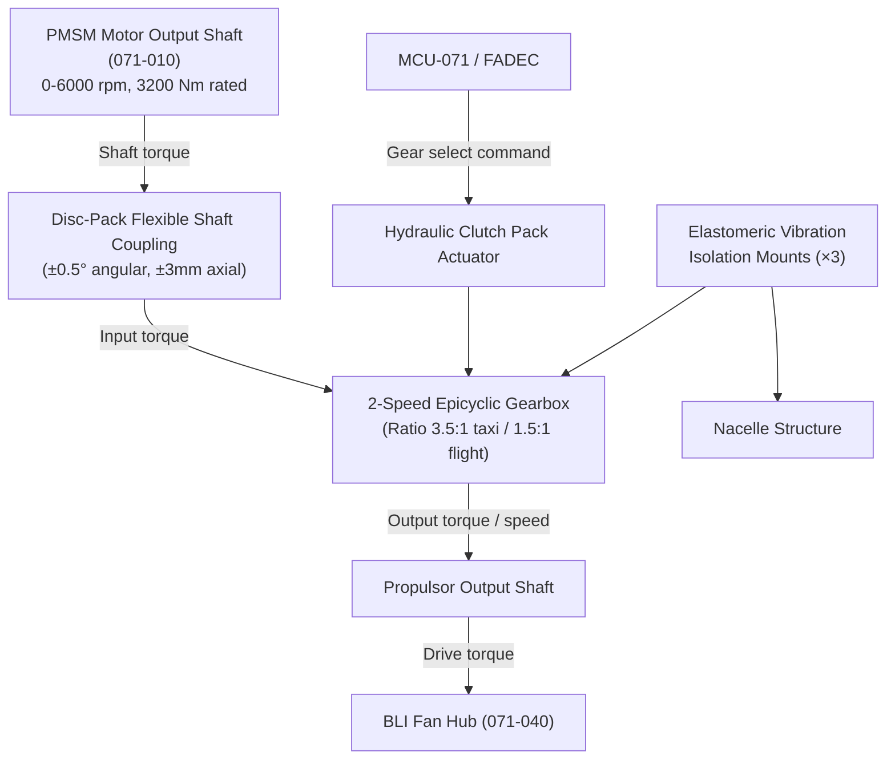
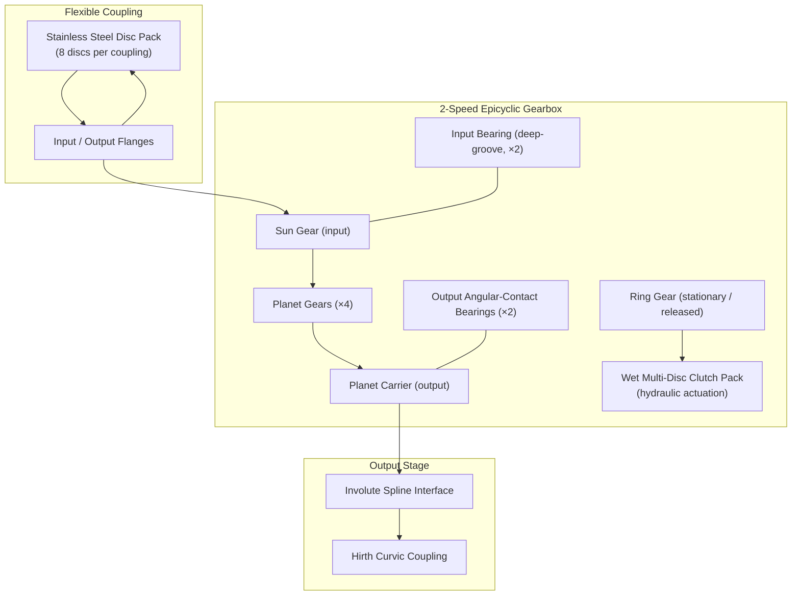

# Motor Mechanical Interface and Transmission

---

## §0 Hyperlink Policy
All hyperlinks in this document are **relative**. Absolute URLs are forbidden.

## §1 Purpose
This document defines the mechanical interface and power transmission system between the PMSM motor and the BLI fan/propulsor for the AMPEL360E eWTW. It covers the flexible shaft coupling, the two-speed epicyclic gearbox (providing taxi and flight gear ratios), the bearing arrangement, vibration isolation mounting, and alignment tolerances. It is the primary mechanical design reference for the torque transmission path from PMSM output shaft to fan hub.

## §2 Applicability
| Aircraft | Variant | MSN Range | Effectivity |
|---|---|---|---|
| AMPEL360E | eWTW | All | From EIS |

## §3 Functional Description 
The mechanical transmission of the AMPEL360E eWTW propulsion system connects the PMSM output shaft (rated at up to 3200 Nm peak, 6000 rpm) to the BLI fan hub through a flexible shaft coupling and a two-speed epicyclic gearbox. The two-speed configuration is a key efficiency enabler: in taxi mode, a high gear ratio (3.5:1) allows the PMSM to operate at a higher, more efficient speed while the fan turns at low speed to minimise taxiway noise and unnecessary thrust; in flight mode, the lower ratio (1.5:1) enables the fan to be driven at high speed to maximise mass flow and propulsive efficiency at cruise. Gear ratio selection is commanded by the FADEC via the MCU and executed by a wet multi-disc clutch pack actuated by the aircraft hydraulic system.

The flexible shaft coupling between the PMSM output and the gearbox input accommodates angular misalignment of up to ±0.5° and axial displacement of ±3 mm under thermal growth and structural deflection conditions. It is a disc-pack type coupling (stainless steel flexing discs) selected for its torsional stiffness in the drive plane while providing bending compliance, and for its maintenance-free operation without lubrication. The coupling is designed to be torque-overload-safe: at 150 % of rated torque (4800 Nm) the discs flex and slip rather than fracturing, protecting the PMSM shaft from shock torque.

The gearbox output shaft connects to the fan hub via an involute spline interface with a Hirth curvic coupling for positive angular lock. Two deep-groove angular-contact ball bearings in a cross-braced arrangement on the gearbox output shaft react the fan thrust (propulsive + BLI pressure) axial loads of up to 15 kN, and radial loads from BLI inlet distortion side forces. The entire gearbox and motor assembly is mounted to the nacelle structure through three vibration isolation mounts (elastomeric isolators) that attenuate transmission-rate vibrations above 80 Hz from the nacelle structure, limiting structural fatigue excitation.

## §4 Functional Breakdown
| ID | Function | Description | Owner | DAL |
|---|---|---|---|---|
| F-071-070-01 | Torque Transmission | Transmit PMSM shaft torque (up to 3500 Nm) to fan propulsor hub through coupling and gearbox | Q-MECHANICS | DAL-C |
| F-071-070-02 | Speed Ratio Adaptation (2-speed) | Provide gear ratio 3.5:1 (taxi) or 1.5:1 (flight) via epicyclic gearbox and clutch pack | Q-MECHANICS | DAL-C |
| F-071-070-03 | Vibration Isolation | Attenuate motor and gearbox vibration transmission to nacelle structure above 80 Hz | Q-MECHANICS | DAL-D |
| F-071-070-04 | Bearing Load Distribution | React fan thrust and radial loads through angular-contact bearings to gearbox housing | Q-MECHANICS | DAL-C |
| F-071-070-05 | Alignment Compensation | Absorb PMSM-to-gearbox angular misalignment and axial thermal growth via disc-pack coupling | Q-MECHANICS | DAL-D |

## §5 System Context

## §6 Internal Architecture

## §7 Components and LRUs
| LRU ID | Name | P/N | Qty | Location |
|---|---|---|---|---|
| LRU-071-070-01 | Flexible Disc-Pack Shaft Coupling | AMP-COUPLING-071 | 2 | PMSM output shaft — gearbox input |
| LRU-071-070-02 | 2-Speed Epicyclic Gearbox Assembly | AMP-GEARBOX-2SPD-071 | 2 | Aft nacelle, forward of fan hub |
| LRU-071-070-03 | Input Bearing Assembly (gearbox) | AMP-BRG-INPUT-071 | 2 | Integral to gearbox input shaft |
| LRU-071-070-04 | Output Bearing Assembly (angular contact) | AMP-BRG-OUTPUT-071 | 2 | Gearbox output shaft / propulsor |
| LRU-071-070-05 | Elastomeric Vibration Isolation Mounts (×3) | AMP-VISOMT-071 | 6 (3 per nacelle) | Gearbox-to-nacelle structure |

## §8 Interfaces
| Interface | Source | Destination | Protocol | Notes |
|---|---|---|---|---|
| IF-071-070-01 | PMSM output shaft (071-010) | Flexible coupling input flange | Mechanical spline, M30 locknut | Torque rating 3500 Nm |
| IF-071-070-02 | Flexible coupling output flange | Gearbox input shaft | Rigid flange bolts (8× M16 grade 12.9) | Angular tolerance ±0.5° |
| IF-071-070-03 | Gearbox output shaft | Fan hub spline | Involute spline + Hirth coupling | Max torque 3500 Nm, 35 mm pitch diam |
| IF-071-070-04 | FADEC / MCU (071-030) | Clutch hydraulic actuator | 28 V DC solenoid + hydraulic 3000 psi | Gear selection <2 s |
| IF-071-070-05 | Gearbox housing | Nacelle structure | Elastomeric mount M20 bolts | Isolation above 80 Hz |

## §9 Operating Modes
| Mode | Trigger | Description | Power State | Notes |
|---|---|---|---|---|
| Parked / Static | No power | Gearbox in taxi ratio (default); coupling at rest | Zero | Fail-safe to taxi ratio on loss of hydraulics |
| Taxi (3.5:1) | Taxi thrust demand | Clutch engaged — taxi ratio; fan at low speed ≤1715 rpm | 10–20 % rated | PMSM 6000 rpm → fan 1715 rpm |
| Gear Shift | FADEC gear-change command | Clutch modulation; torque handover <2 s | Transient | MCU torque-tracking during shift |
| Flight (1.5:1) | Flight thrust demand | Clutch engaged — flight ratio; fan at up to 4000 rpm | Up to 100 % rated | PMSM 6000 rpm → fan 4000 rpm |
| Freewheel | Motor shutdown | Clutch disengaged; fan freewheels (windmill) | Zero | Only in emergency or ferry |

## §10 Performance and Budgets 
| Parameter | Requirement | Current Estimate | Unit | Status |
|---|---|---|---|---|
| Gear ratio — taxi | 3.5:1 | 3.5:1 | — |  |
| Gear ratio — flight | 1.5:1 | 1.5:1 | — |  |
| Maximum transmitted torque | ≥3500 | 3500 | Nm |  |
| Gearbox mechanical efficiency | ≥99 | 99.1 | % |  |
| Angular misalignment tolerance (coupling) | ±0.5 | ±0.5 | ° |  |

## §11 Safety, Redundancy and Fault Tolerance
- Gearbox default fail-safe state is taxi gear ratio (3.5:1); loss of hydraulic pressure or clutch solenoid power results in gear lock in taxi ratio, allowing safe continued taxi and low-power flight manoeuvring.
- Gearbox oil chip detectors (magnetic and inductive) are monitored by the MHM; metal chip detection triggers a FADEC advisory and mandatory inspection within the next A-check, preventing undetected gear wear escalation.
- Disc-pack coupling is designed to shear (torsional overload protection) at 200 % rated torque (6400 Nm) before transmitting destructive shock torque to the PMSM shaft or gearbox input shaft.
- All gearbox-to-nacelle attachment bolts are torque-checked and safety-wired at each A-check; bolt stretch monitors (ultrasonic) are built into the four primary isolator mount studs.
- Angular-contact output bearings are pre-loaded to 2 kN to prevent skidding under low-thrust BLI fan operation and to maintain defined gear mesh contacts under all flight load combinations.

## §12 Maintenance and Diagnostics
| Task | Interval | Tool | Reference |
|---|---|---|---|
| Gearbox oil chip detector read and oil analysis | 300 FH | Chip detector tool + oil analysis kit | AMM 071-70-11 |
| Flexible coupling disc-pack visual inspection | 600 FH | Borescope through access panel | AMM 071-70-21 |
| Vibration isolation mount stiffness check | 1200 FH | Mount deflection gauge under known static load | AMM 071-70-31 |
| Gear ratio verification (output/input speed ratio) | C-check | MCU diagnostic + tachometer cross-check | AMM 071-70-41 |

## §13 Footprint
| Dimension | Value | Unit | Notes |
|---|---|---|---|
| Physical mass | TBD | kg |  |
| Envelope | TBD | mm |  |
| Power draw (cont.) | TBD | W |  |
| Cooling demand | TBD | kW |  |
| Data interfaces | TBD | — |  |

## §14 Safety and Certification References
| Standard | Requirement | Applicability | Status | Notes |
|---|---|---|---|---|
| DO-178C | Software level per DAL | MCU software | Planned | DAL-B baseline |
| DO-254 | Hardware design assurance | MDU FPGA | Planned | DAL-B baseline |
| ARP4754A | System development | Motor system | Planned | System-level |
| CS-25 | Airworthiness requirements | Aircraft-level | Planned | EASA primary |
| FAR Part 25 | Airworthiness requirements | Aircraft-level | Planned | FAA bilateral |

## §15 V&V Approach
| Phase | Method | Tool/Facility | Status |
|---|---|---|---|
| FEA structural analysis | Gearbox housing and bearing loads at limit torque and fan blade-out | ANSYS Mechanical |  |
| Gearbox efficiency test | Measured input/output power at rated torque across speed range | AMP Mechanical Test Bench |  |
| Vibration isolation measurement | Transfer function measurement on mount assembly per MIL-STD-810H | AMP Dynamics Lab |  |
| Gear shift transient test | Torque continuity during 3.5:1 to 1.5:1 shift under load | AMP Motor + Gearbox Test Rig |  |

## §16 Glossary
| Term | Definition |
|---|---|
| Epicyclic Gearbox | Planetary gear arrangement with sun, planet, ring and carrier elements |
| Disc-Pack Coupling | Flexible shaft coupling using stacks of thin metal discs for misalignment accommodation |
| Hirth Coupling | Curvic face-spline coupling providing positive angular indexing between shaft flanges |
| Clutch Pack | Multi-disc wet clutch assembly for gear ratio selection |
| Involute Spline | Gear-tooth spline profile for torque transmission with self-centring |
| Angular Misalignment | Angular deviation between input and output shaft centre lines |
| Vibration Isolation | Attenuation of dynamic forces transmitted between motor/gearbox and structure |
| Chip Detector | Magnetic or inductive probe detecting ferrous metal particles in gearbox oil |
| Gear Ratio | Output-to-input speed ratio of gearbox (input rpm / output rpm) |
| Curvic Coupling | Precision face-tooth coupling for positive angular registration of flanges |

## §17 Open Issues
| ID | Description | Owner | Priority | Status |
|---|---|---|---|---|
| OI-071-070-001 | Confirm hydraulic supply source and pressure (3000 psi vs. 5000 psi) for clutch actuation compatibility with ATA 029 hydraulic system | @copilot | High | Open |
| OI-071-070-002 | Define gearbox oil type and quantity; confirm compatibility with TMS EGW coolant in event of oil/coolant cross-contamination | @copilot | Medium | Open |

## §18 Status Legend
| Badge | Meaning |
|---|---|
|  | Content under active development |
|  | Value or content to be determined |
|  | Approved and baselined |
|  | Placeholder |

## §19 Related Documents
| Code | Title | Link |
|---|---|---|
| 071-000 | Electric Motor and Drive Systems — General Overview | [071-000-Electric-Motor-and-Drive-Systems-General.md](071-000-Electric-Motor-and-Drive-Systems-General.md) |
| 071-010 | PMSM Motor Design and Specifications | [071-010-PMSM-Motor-Design-and-Specifications.md](071-010-PMSM-Motor-Design-and-Specifications.md) |
| 071-020 | Motor Drive Unit (MDU) and Inverter | [071-020-Motor-Drive-Unit-MDU-and-Inverter.md](071-020-Motor-Drive-Unit-MDU-and-Inverter.md) |
| 071-030 | Motor Control Unit (MCU) and Control Laws | [071-030-Motor-Control-Unit-MCU-and-Control-Laws.md](071-030-Motor-Control-Unit-MCU-and-Control-Laws.md) |
| 071-040 | Boundary Layer Ingestion (BLI) Aerodynamic Integration | [071-040-Boundary-Layer-Ingestion-Integration.md](071-040-Boundary-Layer-Ingestion-Integration.md) |
| 071-050 | Motor Thermal Management System | [071-050-Motor-Thermal-Management.md](071-050-Motor-Thermal-Management.md) |
| 071-060 | Motor Health Monitoring and Diagnostics | [071-060-Motor-Health-Monitoring-and-Diagnostics.md](071-060-Motor-Health-Monitoring-and-Diagnostics.md) |
| 071-080 | Motor Electrical Interface and Power Quality | [071-080-Motor-Electrical-Interface-and-Power-Quality.md](071-080-Motor-Electrical-Interface-and-Power-Quality.md) |
| 071-090 | S1000D CSDB Mapping and Traceability (071) | [071-090-S1000D-CSDB-Mapping-and-Traceability.md](071-090-S1000D-CSDB-Mapping-and-Traceability.md) |

## §20 Change Log
| Rev | Date | Author | Summary |
|---|---|---|---|
| 0.1 | 2026-05-11 | @copilot | Initial creation |
