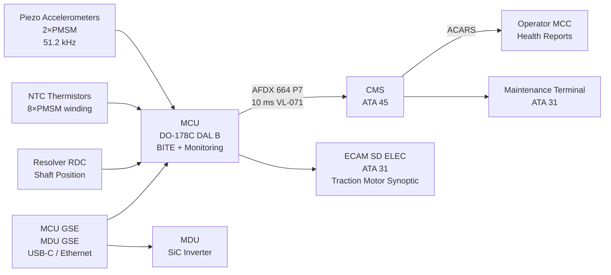
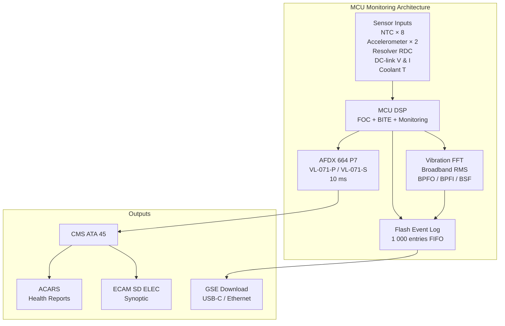

<!-- ──────────────────────────────────────────────────────────────────────────
     QATL-ATLAS-1000-ATLAS-070-079-071-080-ELECTRIC-DRIVE-MONITORING-DIAGNOSTICS-AND-CONTROL-INTERFACES
     ATA 71 · Electric Drive Monitoring, Diagnostics and Control Interfaces
     AMPEL360E eWTW — ATLAS Register 1000
────────────────────────────────────────────────────────────────────────────── -->

# Electric Drive Monitoring, Diagnostics and Control Interfaces

---

## §0 Hyperlink Policy

> All hyperlinks in this document are **relative** (five directory levels: `../../../../../`).
> Absolute URLs are forbidden. Every linked document must exist in the Q+ATLANTIDE repository
> before the link is activated. Broken links are treated as open issues and must be resolved
> before the document is promoted from `DRAFT` to `APPROVED`.

---

## §1 Purpose

This document defines the monitoring, diagnostic, Built-In Test Equipment (BITE), and external control interfaces for the ATA 71 Electric Drive System on the AMPEL360E eWTW. It covers:

- The MCU real-time health monitoring stream over AFDX ARINC 664 P7 to the Central Maintenance System (CMS, ATA 45).
- The ECAM traction motor synoptic on the System Display (SD) ELEC page (ATA 31).
- MCU BITE: design requirements (≥ 90 % fault coverage), fault code structure, and the 1 000-event non-volatile log.
- Bearing vibration trending: broadband RMS and bearing defect frequency monitoring from the piezoelectric accelerometers on the PMSM.
- External GSE (Ground Support Equipment) interfaces for maintenance and functional test.
- ACARS-based health data transmission to the operator's MCC.

---

## §2 Applicability

| Parameter | Value |
|---|---|
| Aircraft Program | AMPEL360E eWTW |
| ATA reference | ATA 71-080 — Electric Drive Monitoring, Diagnostics and Control Interfaces |
| Certification basis | EASA CS-25 Amdt 27+; ARINC 664 P7; ARINC 429; DO-178C DAL B |
| S1000D SNS | 071-080-00 |

---

## §3 Functional Description ![DRAFT]

**AFDX health monitoring stream (10 ms cycle):**
The MCU transmits a continuous health monitoring data frame over AFDX ARINC 664 P7 (Virtual Link VL-071-P and VL-071-S for port and starboard respectively) to the CMS at a 10 ms update rate. The frame contains: shaft speed (rpm), motor torque estimated (N·m), DC-link voltage (V), DC-link current (A), stator winding temperatures (8 × NTC thermistors: 4 per winding set A and B), MDU cold plate outlet temperature, instantaneous power (kW), active control channel (CH-A or CH-B), fault status word, and bearing vibration broadband RMS (g).

**ECAM traction motor synoptic (SD ELEC page):**
The ATA 31 ECAM SD ELEC page contains a traction motor synoptic panel showing: two traction motor symbols (port / starboard), per-motor: speed (rpm), torque (%), winding temperature (°C, highest of 8 NTC sensors), power (kW), and a status colour indicator:
- Green: normal operation (all parameters within normal envelopes)
- Amber: advisory (derate mode active, or IMS IR advisory, or thermal warning 155 °C)
- Red: warning (thermal shutdown 175 °C, or BITE fault, or channel changeover fault)

**MCU BITE (≥ 90 % fault coverage):**
The MCU implements a DO-178C DAL B BITE function covering: resolver RDC self-test, gate driver fault detection (DESAT, short-circuit, UV), DC-link voltage and current sense calibration check, NTC thermistor open/short detection (8 sensors), cooling pump current sense, AFDX communication heartbeat, and channel CH-A / CH-B cross-check. BITE is executed at power-on and continuously during operation. BITE fault coverage target: ≥ 90 % of listed failure modes per FMEA. All detected faults are logged in the non-volatile event log.

**Non-volatile event log (1 000 events):**
The MCU maintains a 1 000-entry FIFO non-volatile event log in flash memory. Each entry contains: timestamp (GPS-synchronized), fault code (per ATA 71-080 fault code table), severity (advisory / warning / shutdown), active channel at time of fault, motor speed at time of fault, highest stator temperature at time of fault, and DC-link voltage. Log is readable via MDU/MCU GSE (USB/Ethernet) at ground and via CMS/ACARS in-flight (on-request BITE page transmission).

**Bearing vibration trending:**
Each PMSM is equipped with 2 × piezoelectric accelerometers (axial and radial planes) sampling at 51.2 kHz. The MCU FFT processor computes: broadband RMS (10–10 000 Hz), bearing outer race defect frequency (BPFO), bearing inner race defect frequency (BPFI), and bearing rolling element defect frequency (BSF) amplitudes. Values are logged per A-check interval in a trending buffer. Alert thresholds: broadband RMS > 5 g = amber; > 10 g = red (shutdown). BPFO/BPFI/BSF > 3× baseline amplitude = amber maintenance advisory.

**ACARS health transmission:**
CMS aggregates MCU health data and transmits an ATA 71 health report via ACARS at top-of-descent for each flight and on-request from ground MCC. The report includes: flight leg min/max values for speed, temperature, torque, DC-link voltage, event log summary (count of advisory/warning/shutdown events during flight leg), and bearing vibration amplitude summary.

**GSE maintenance interfaces:**
- MCU GSE port (USB-C / Ethernet RJ-45): MCU BITE log download, event log dump, parameter reset, vibration waveform snapshot, software version readout.
- MDU GSE port (USB-C): MDU fault log, active discharge test trigger, SiC gate timing verification, DC-link sensor calibration.
- CMS terminal (cabin / ATA 31 maintenance terminal): BITE log paging, fault code display, BITE initiation (ground test).

---

## §4 Functional Breakdown

| ID | Name | Description | Lead Division |
|---|---|---|---|
| F-001 | AFDX Health Monitoring Stream | 10 ms cycle; VL-071-P and VL-071-S; speed, torque, temperatures, fault status, bearing RMS | Q-HPC |
| F-002 | ECAM Traction Motor Synoptic | SD ELEC page; per-motor speed, torque %, winding temp, power, status colour (G/A/R) | Q-GREENTECH |
| F-003 | MCU BITE (≥ 90 % coverage) | DO-178C DAL B; resolver/gate driver/thermal/AFDX/CH cross-check; continuous + power-on | Q-GREENTECH |
| F-004 | Non-Volatile Event Log | 1 000-entry FIFO; timestamp + fault code + severity + motor state; GSE and ACARS readable | Q-HPC |
| F-005 | Bearing Vibration Trending | 51.2 kHz accelerometers; broadband RMS; BPFO/BPFI/BSF per A-check; alert thresholds | Q-MECHANICS |
| F-006 | ACARS Health Transmission | Per-flight health report; top-of-descent; event log summary; MCC on-request | Q-HPC |
| F-007 | GSE Maintenance Interfaces | MCU GSE (USB-C / Ethernet); MDU GSE (USB-C); CMS terminal; BITE log; vibration waveform | Q-MECHANICS |

---

## §5 System Context — Mermaid Diagram

---

## §6 Internal Architecture — Mermaid Diagram

---

## §7 Components and LRUs

| Component | Part Number | Qty | Location | Maintenance Interval | Notes |
|---|---|---|---|---|---|
| MCU (Motor Control Unit) — includes BITE + monitoring | MCU-071-TBD | 2 (P and S) | EE bay (forward) | Replace on fault; SW load per SB | DO-178C DAL B; dual-channel CH-A/CH-B |
| Piezoelectric accelerometer (PMSM axial) | ACC-AX-071-TBD | 2 (1 per PMSM) | PMSM bearing end cap | C-check inspection | 51.2 kHz sampling; IEPE 100 mV/g |
| Piezoelectric accelerometer (PMSM radial) | ACC-RA-071-TBD | 2 (1 per PMSM) | PMSM mid-frame | C-check inspection | 51.2 kHz sampling; IEPE 100 mV/g |
| AFDX switch (ATA 71 Virtual Links) | Per ATA 46 | — | Per ATA 46 installation | Per ATA 46 schedule | VL-071-P and VL-071-S provisioned |

---

## §8 Interfaces

| Interface Type | Connected System | Protocol / Medium | Data / Function |
|---|---|---|---|
| AFDX health stream (10 ms) | CMS (ATA 45) | AFDX ARINC 664 P7; VL-071-P and VL-071-S | Speed, torque, temperatures, fault status, bearing RMS |
| ECAM SD ELEC synoptic | ECAM (ATA 31) | AFDX (via CMS data concentrator) | Traction motor status, speed, temp, power; G/A/R status colours |
| ACARS transmission | ACARS (ATA 46) | Via CMS aggregation → ACARS MU | Per-flight health report; event log summary |
| MCU GSE port | GSE laptop | USB-C / Ethernet RJ-45 | BITE log, event log, vibration waveform, SW version, parameter reset |
| MDU GSE port | GSE laptop | USB-C | MDU fault log, active discharge test, gate timing verification |
| CMS maintenance terminal | ATA 31 cabin terminal | AFDX | BITE page display, fault codes, ground test initiation |

---

## §9 Operating Modes

| Mode | Trigger | System State | Actions / Consequences |
|---|---|---|---|
| In-flight monitoring | Aircraft airborne | Continuous 10 ms AFDX health stream; FFT vibration every 100 ms | CMS receives live health data; ECAM synoptic live; event log active |
| ECAM advisory (amber) | Thermal ≥ 155 °C or IMS IR < 500 kΩ or derate active | Amber status on SD ELEC; advisory message | Crew awareness; MCU continues with derate if thermal |
| ECAM warning (red) | Thermal ≥ 175 °C or MCU shutdown or BITE fault | Red status SD ELEC; ECAM warning | MCU commands gate shutdown; traction motor off; maintenance required |
| Channel changeover (CH-A → CH-B) | CH-A fault detected by dual-channel cross-check | MCU switches to CH-B; continues with no thrust interruption | Event log entry; ECAM advisory amber; maintenance at next check |
| Ground BITE test | CMS BITE page or GSE initiation | Aircraft on ground; BITE full test sequence | All BITE coverage tests run; results logged; faults displayed on GSE |
| ACARS health download | Top-of-descent trigger from CMS | Flight leg data aggregated | Health report transmitted; accessible at gate by ground crew |

---

## §10 Performance and Budgets ![DRAFT]

| Parameter | Requirement | Target / Design Value | Status |
|---|---|---|---|
| AFDX health stream update rate | 10 ms (100 Hz) | 10 ms | ![TBD] |
| BITE fault coverage | ≥ 90 % (failure modes per FMEA) | ≥ 90 % | ![TBD] |
| Event log capacity | ≥ 500 events | 1 000 events | ![TBD] |
| Accelerometer sampling rate | ≥ 20 kHz (Nyquist for bearing defect frequencies) | 51.2 kHz | ![TBD] |
| Vibration broadband RMS alert threshold (amber) | Engineering analysis TBD | > 5 g | ![TBD] |
| Vibration broadband RMS alert threshold (red / shutdown) | Engineering analysis TBD | > 10 g | ![TBD] |
| AFDX Virtual Link allocation | Per ATA 46 AFDX network resource allocation | VL-071-P and VL-071-S allocated | ![TBD] |

---

## §11 Safety, Redundancy and Fault Tolerance

- The AFDX health monitoring stream (10 ms) provides real-time visibility of the traction motor system to both the crew (via ECAM) and to the CMS and ACARS health management loop.
- MCU BITE is implemented to DO-178C DAL B and achieves ≥ 90 % fault coverage. This ensures that most detectable faults are annunciated promptly; residual undetected fault probability is addressed by scheduled maintenance tasks in ATA 71-070.
- The dual-channel MCU architecture (CH-A / CH-B hot-standby) ensures that a single MCU channel failure does not interrupt traction motor drive capability; BITE detects the channel failure and logs it for maintenance.
- The 1 000-event non-volatile event log provides evidence for maintenance investigation of intermittent faults and exceedance events (including the PM demagnetisation trigger per ATA 71-070 and BREX rule in ATA 71-090).
- Bearing vibration trending (BPFO, BPFI, BSF) enables predictive maintenance scheduling, preventing unexpected in-service bearing failure between C-checks.

---

## §12 Maintenance and Diagnostics

| Task | Interval | Access | Special Tools |
|---|---|---|---|
| MCU BITE log download (BITE page on CMS terminal) | A-check | CMS terminal | CMS terminal access |
| ACARS health report review | Per flight (MCC) | Ground MCC ACARS system | ACARS MCC terminal |
| MCU event log download (full dump) | B-check | MCU GSE port | MCU GSE laptop |
| Bearing vibration trend review (broadband + BPFO/BPFI/BSF) | A-check (trending); threshold alerts | MCU GSE / CMS terminal | MCU GSE laptop; ACARS health report |
| GSE full BITE test (ground) | B-check | MCU GSE port | MCU GSE laptop |
| MDU GSE fault log download | B-check | MDU GSE port | MDU GSE laptop |
| Accelerometer output verification (PMSM vibration known source test) | C-check | Accessible with PMSM end cap off | Portable vibration reference (calibration block) |

---

## §13 Footprint — Physical, Electrical, Maintenance, Data ![TBD]

| Footprint Type | Parameter | Value | Notes |
|---|---|---|---|
| Data | AFDX bandwidth (VL-071-P + VL-071-S) | ![TBD] | Per AFDX network resource allocation (ATA 46) |
| Data | Event log flash memory (per MCU) | ![TBD] | 1 000 × ~64 byte entries = ~64 kB minimum |
| Data | ACARS health report size (per flight) | ![TBD] | Per message format design |
| Maintenance | BITE test duration (full ground BITE via GSE) | ![TBD] | Target ≤ 15 min per motor drive |

---

## §14 Safety and Certification References ![DRAFT]

| Standard / Document | Title | Issuing Body | Applicability |
|---|---|---|---|
| EASA CS-25 Amdt 27+ | Certification Specifications for Large Aeroplanes | EASA | Primary airworthiness basis |
| DO-178C DAL B | Software Considerations in Airborne Systems | RTCA | MCU BITE software level |
| ARINC 664 P7 | AFDX — Avionics Full Duplex Switched Ethernet | ARINC | AFDX health monitoring network |
| DO-160G | Environmental Conditions and Test Procedures | RTCA | MCU and accelerometer environmental qualification |
| SAE ARP4754A | Guidelines for Development of Civil Aircraft and Systems | SAE International | MCU system development assurance |

---

## §15 V&V Approach ![TBD]

| Phase | Method | Acceptance Criterion | Status |
|---|---|---|---|
| SW development | DO-178C DAL B review and test coverage | 100 % MC/DC coverage for BITE logic | ![TBD] |
| Lab test | BITE fault injection (hardware-in-the-loop) | ≥ 90 % detected faults per FMEA | ![TBD] |
| Lab test | AFDX VL timing test | 10 ms update rate maintained under network load | ![TBD] |
| Lab test | Bearing vibration FFT accuracy | BPFO/BPFI/BSF frequencies ±1 % at known defect speeds | ![TBD] |
| Integration test | Event log persistence test (power cycle) | 1 000-event log retained across 10 power cycles | ![TBD] |
| Certification | CMS and ECAM integration test | ECAM SD ELEC displays correct values; G/A/R state transitions verified | ![TBD] |

---

## §16 Glossary

| Term | Definition |
|---|---|
| **AFDX** | Avionics Full Duplex Switched Ethernet — ARINC 664 P7 deterministic Ethernet network for avionics data. |
| **BITE** | Built-In Test Equipment — self-diagnostic function in the MCU; achieves ≥ 90 % fault coverage. |
| **BPFO** | Bearing outer race defect frequency — vibration signature at characteristic bearing outer ring defect; computed from bearing geometry and shaft speed. |
| **BPFI** | Bearing inner race defect frequency — vibration signature at characteristic bearing inner ring defect. |
| **BSF** | Ball Spin Frequency — vibration signature at bearing rolling element defect frequency. |
| **Virtual Link (VL)** | AFDX logical communication channel with defined bandwidth, latency, and jitter guarantees; VL-071-P and VL-071-S allocated for ATA 71. |
| **SD ELEC page** | ECAM System Display ELEC (electrical) page — shows traction motor synoptic panel on AMPEL360E. |
| **ACARS** | Aircraft Communications Addressing and Reporting System — digital datalink for airline operational communications and health monitoring reports. |

---

## §17 Open Issues

| ID | Description | Owner | Target |
|---|---|---|---|
| OI-071-080-001 | Define AFDX VL-071-P and VL-071-S message frame format and bandwidth allocation with ATA 46 | Q-HPC | 2026-Q4 |
| OI-071-080-002 | Finalise bearing vibration alert thresholds (broadband RMS, BPFO/BPFI/BSF) with PMSM OEM | Q-MECHANICS | 2026-Q4 |
| OI-071-080-003 | Confirm ECAM SD ELEC page layout and colour coding with ATA 31 display design | Q-GREENTECH | 2027-Q1 |

---

## §18 Status Legend

| Badge | Meaning |
|---|---|
| `![DRAFT]` | Section is drafted but not yet reviewed |
| `![TBD]` | Content not yet started — to be defined |
| `![To Be Completed]` | Partially complete — needs additional content |
| `![APPROVED]` | Reviewed and formally approved |

---

## §19 Related Documents (Siblings in this Subsection)

- [071-000](./071-000-Electric-Motor-and-Drive-Systems-General.md)
- [071-010](./071-010-Traction-Motor-Architecture.md)
- [071-020](./071-020-Motor-Rotor-Stator-and-Bearing-Assemblies.md)
- [071-030](./071-030-Inverter-and-Motor-Drive-Unit.md)
- [071-040](./071-040-Motor-Control-and-Torque-Command.md)
- [071-050](./071-050-Motor-Cooling-and-Thermal-Protection.md)
- [071-060](./071-060-Motor-Power-Connectors-and-Insulation.md)
- [071-070](./071-070-Motor-Inspection-Test-and-Maintenance.md)
- [071-090](./071-090-S1000D-CSDB-Mapping-and-Traceability.md)

---

## §20 Change Log

| Rev | Date | Author | Description |
|---|---|---|---|
| 0.1 | 2026-05-11 | @copilot | Initial DRAFT — contextualized content per AMPEL360E eWTW architecture |
