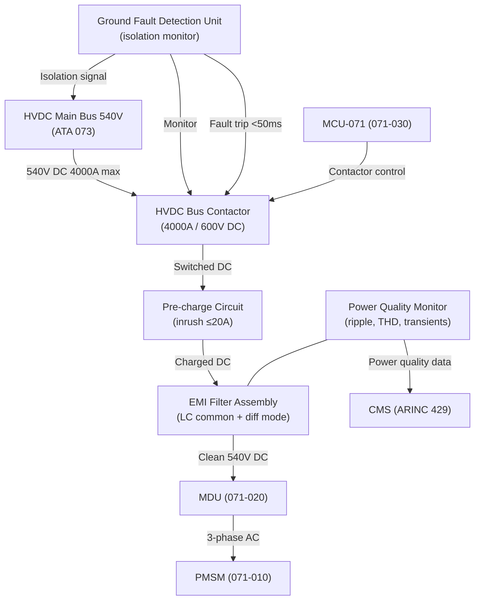
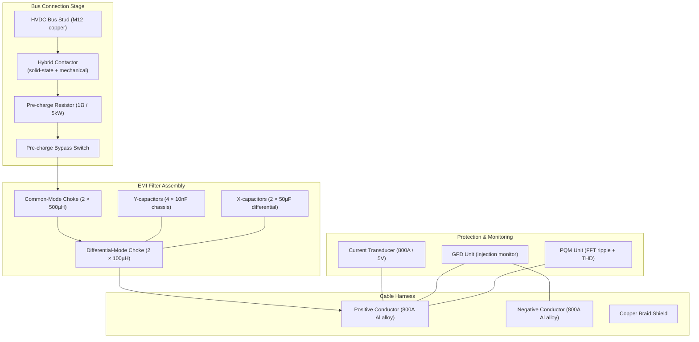

# Motor Electrical Interface and Power Quality

---

## §0 Hyperlink Policy
All hyperlinks in this document are **relative**. Absolute URLs are forbidden.

## §1 Purpose
This document defines the electrical interface between the AMPEL360E HVDC 540 V main bus and the Motor Drive Unit (MDU) for each propulsion channel. It covers the HVDC feed routing, bus contactor specification, EMI filtering topology, cable harness design and shielding, ground fault detection, and power quality monitoring requirements per DO-160G Section 16. It is the primary electrical interface design reference for subsystem 071 integration with the aircraft power distribution system (ATA 024/073).

## §2 Applicability
| Aircraft | Variant | MSN Range | Effectivity |
|---|---|---|---|
| AMPEL360E | eWTW | All | From EIS |

## §3 Functional Description 
Each propulsion channel draws up to 2 MW peak from the HVDC 540 V main bus, corresponding to a peak DC current of approximately 3700 A, and a continuous current of 2800 A at 1.5 MW. The HVDC feed from the main bus to each MDU is routed via a dedicated high-current bus contactor (solid-state or electromechanical hybrid, rated 4000 A interrupt at 600 V DC) mounted in the aft power distribution panel. A soft-start pre-charge circuit limits the initial inrush current to ≤20 A when the contactor closes onto the discharged MDU DC link capacitor bank; the pre-charge resistor is automatically bypassed after DC link voltage reaches 95 % of bus voltage.

An EMI filter assembly (LC common-mode and differential-mode filter, designed to MIL-STD-461G Class CE102 limits) is installed between the contactor and the MDU input terminals. The EMI filter attenuates conducted emissions from the 20 kHz SiC PWM switching spectrum back onto the HVDC bus, protecting the avionics bus and battery management electronics from switching noise. The cable harness from the power panel to the MDU uses high-temperature aluminium alloy conductor (rated 800 A continuous, 1200 A for 5 s peak, insulation Tefzel/ETFE), shielded with a continuous copper braid terminating at both ends to chassis ground, with a cable derating factor per CS-25 CDCCL for bundled installation. Cable routing avoids proximity to fuel system components and is segregated from avionics wiring bundles.

Ground Fault Detection (GFD) units monitor the isolation resistance between each HVDC conductor and airframe ground continuously during operation, using a low-level injection method that does not disturb the power circuit. If isolation resistance falls below 1 MΩ (warning) or 100 kΩ (trip), the GFD commands the bus contactor open within 50 ms, isolating the faulted channel. A Power Quality Monitor (PQM) installed at the MDU input measures bus voltage ripple, transient events, and harmonic content, logging power quality data for maintenance review and FADEC visibility of bus health. Total harmonic distortion (THD) at the MDU input is limited to ≤5 % to comply with aircraft bus compatibility requirements.

## §4 Functional Breakdown
| ID | Function | Description | Owner | DAL |
|---|---|---|---|---|
| F-071-080-01 | HVDC Power Distribution | Route 540 V HVDC from main bus to MDU via contactor, pre-charge and harness | Q-GREENTECH | DAL-B |
| F-071-080-02 | Harmonic Current Filtering | Attenuate MDU switching harmonics from reaching HVDC bus via EMI filter (CE102 class) | Q-GREENTECH | DAL-C |
| F-071-080-03 | EMI/EMC Shielding | Provide cable braid shielding and chassis bonding to limit radiated emissions | Q-GREENTECH | DAL-C |
| F-071-080-04 | Ground Fault Detection | Continuously monitor conductor-to-airframe isolation resistance; trip contactor on fault | Q-GREENTECH | DAL-B |
| F-071-080-05 | Power Quality Monitoring | Measure HVDC bus ripple, transients and THD at MDU input; log and report to CMS | Q-HPC | DAL-C |

## §5 System Context

## §6 Internal Architecture

## §7 Components and LRUs
| LRU ID | Name | P/N | Qty | Location |
|---|---|---|---|---|
| LRU-071-080-01 | HVDC Bus Contactor (hybrid, 4000 A) | AMP-CONT-HVDC-4000 | 2 | Aft power distribution panel |
| LRU-071-080-02 | EMI Filter Assembly | AMP-EMIFILT-071 | 2 | Aft power distribution panel |
| LRU-071-080-03 | High-Current Cable Harness (540V, 800A Al) | AMP-HARNESS-071 | 2 | Cable tray: aft panel to MDU |
| LRU-071-080-04 | Ground Fault Detection Unit | AMP-GFD-071 | 2 | Aft power distribution panel |
| LRU-071-080-05 | Power Quality Monitor | AMP-PQM-071 | 2 | Aft power distribution panel |

## §8 Interfaces
| Interface | Source | Destination | Protocol | Notes |
|---|---|---|---|---|
| IF-071-080-01 | HVDC Main Bus (ATA 073) | HVDC Bus Contactor | 540 V DC busbar, M12 studs | 4000 A interrupt rating |
| IF-071-080-02 | HVDC Bus Contactor | EMI Filter input | 540 V DC busbar, copper, 800 A | Pre-charge bypass relay in parallel |
| IF-071-080-03 | EMI Filter output | MDU input terminals | High-current cable harness (shielded) | ETFE insulation, copper braid shield |
| IF-071-080-04 | GFD Unit | Bus contactor trip coil | 28 V DC control signal | Trip within 50 ms of fault |
| IF-071-080-05 | Power Quality Monitor | CMS (via ARINC 429) | ARINC 429 | THD, ripple, transient event codes |

## §9 Operating Modes
| Mode | Trigger | Description | Power State | Notes |
|---|---|---|---|---|
| Isolated | Bus contactor open | No power to MDU; GFD injection monitoring active | Zero | Safe maintenance state |
| Pre-charge | Contactor close command | Pre-charge resistor limits inrush; DC link charges | Standby | <2 s to full DC link voltage |
| Normal operation | DC link ready | Full HVDC power available to MDU at rated current | Full | EMI filter and PQM active |
| GFD Warning | Isolation <1 MΩ | CAS advisory; continue operation with monitoring | Full | Mandatory inspection at next landing |
| GFD Trip | Isolation <100 kΩ | Contactor open within 50 ms; channel isolated | Zero | Fault logged; MCU notified |

## §10 Performance and Budgets 
| Parameter | Requirement | Current Estimate | Unit | Status |
|---|---|---|---|---|
| HVDC nominal voltage | 540 | 540 | V |  |
| DC bus ripple (at MDU input) | ≤2 | 1.8 | % |  |
| THD at MDU input | ≤5 | 4.2 | % |  |
| Cable continuous ampacity | ≥800 | 800 | A |  |
| Isolation resistance (normal) | ≥1 | ≥1 | MΩ |  |

## §11 Safety, Redundancy and Fault Tolerance
- The HVDC bus contactor is a hybrid design combining a solid-state switch for fast fault isolation (arc-free opening <1 µs) with a mechanical contact for zero-standby-loss in steady operation; dual-element design meets FAA AC 25.1329 electrical system reliability targets.
- GFD units use low-level injection (≤1 mA) to monitor isolation resistance without affecting motor operation; the injection frequency is chosen outside the power quality monitoring band to prevent false readings.
- Cable harness braid shield is bonded to chassis at both ends through low-impedance (≤5 mΩ) bonding straps, ensuring shield effectiveness ≥40 dB from 100 kHz to 100 MHz per DO-160G Section 21.
- EMI filter is rated to withstand the full HVDC bus ripple and transient levels per DO-160G Section 16 Category Z, including lightning indirect effects (Section 22).
- Each HVDC channel (port and starboard) is fully independent: a fault in one channel's contactor, filter, or cable does not propagate to the other channel, ensuring single-failure tolerance at the propulsion power level.

## §12 Maintenance and Diagnostics
| Task | Interval | Tool | Reference |
|---|---|---|---|
| GFD injection circuit self-test and calibration | 600 FH | GFD BITE mode | AMM 071-80-11 |
| Cable harness insulation resistance test (500V DC, phase to shield) | 1200 FH | Megohmmeter AMP-IR-500 | AMM 071-80-21 |
| Bus contactor contact resistance measurement | C-check | Micro-ohmmeter | AMM 071-80-31 |
| EMI filter insertion loss verification (spot check 20 kHz) | C-check | Spectrum analyser + signal injection | AMM 071-80-41 |

## §13 Footprint
| Dimension | Value | Unit | Notes |
|---|---|---|---|
| Physical mass | TBD | kg |  |
| Envelope | TBD | mm |  |
| Power draw (cont.) | TBD | W |  |
| Cooling demand | TBD | kW |  |
| Data interfaces | TBD | — |  |

## §14 Safety and Certification References
| Standard | Requirement | Applicability | Status | Notes |
|---|---|---|---|---|
| DO-178C | Software level per DAL | MCU software | Planned | DAL-B baseline |
| DO-254 | Hardware design assurance | MDU FPGA | Planned | DAL-B baseline |
| ARP4754A | System development | Motor system | Planned | System-level |
| CS-25 | Airworthiness requirements | Aircraft-level | Planned | EASA primary |
| FAR Part 25 | Airworthiness requirements | Aircraft-level | Planned | FAA bilateral |

## §15 V&V Approach
| Phase | Method | Tool/Facility | Status |
|---|---|---|---|
| EMI filter simulation | SPICE model of LC filter with MDU switching source at 20 kHz | LTspice + measured SiC drive impedance |  |
| Conducted emissions test | CE102 per MIL-STD-461G at MDU input; verify filter insertion loss | EMC certified test house |  |
| GFD accuracy test | Known fault resistances injected; verify trip time ≤50 ms | AMP Electrical Lab bench |  |
| Cable thermal qualification | Current soak at 800 A continuous; measure bundle temperatures | AMP Wiring Test Lab |  |

## §16 Glossary
| Term | Definition |
|---|---|
| HVDC | High-Voltage Direct Current — 540 V power distribution architecture of AMPEL360E |
| GFD | Ground Fault Detection — system monitoring isolation resistance of HVDC conductors |
| THD | Total Harmonic Distortion — ratio of harmonic content to fundamental in a waveform |
| EMI Filter | Electromagnetic Interference filter — LC network attenuating conducted noise |
| CE102 | MIL-STD-461G conducted emissions limit class for power leads |
| PQM | Power Quality Monitor — instrument measuring bus ripple, THD and transients |
| Braid Shield | Woven copper over-braid around cable conductors for EMC screening |
| Hybrid Contactor | Contactor combining fast solid-state trip with zero-loss mechanical contact |
| Bus Ripple | AC voltage variation superimposed on DC bus due to switching loads |
| Bonding Strap | Low-impedance conductor connecting shield or structure to airframe ground |

## §17 Open Issues
| ID | Description | Owner | Priority | Status |
|---|---|---|---|---|
| OI-071-080-001 | Define HVDC bus contactor supplier and confirm 4000 A DC interrupt qualification status | @copilot | High | Open |
| OI-071-080-002 | Coordinate EMI filter design with ATA 024/073 power team to confirm shared vs. dedicated filter approach per channel | @copilot | Medium | Open |

## §18 Status Legend
| Badge | Meaning |
|---|---|
|  | Content under active development |
|  | Value or content to be determined |
|  | Approved and baselined |
|  | Placeholder |

## §19 Related Documents
| Code | Title | Link |
|---|---|---|
| 071-000 | Electric Motor and Drive Systems — General Overview | [071-000-Electric-Motor-and-Drive-Systems-General.md](071-000-Electric-Motor-and-Drive-Systems-General.md) |
| 071-010 | PMSM Motor Design and Specifications | [071-010-PMSM-Motor-Design-and-Specifications.md](071-010-PMSM-Motor-Design-and-Specifications.md) |
| 071-020 | Motor Drive Unit (MDU) and Inverter | [071-020-Motor-Drive-Unit-MDU-and-Inverter.md](071-020-Motor-Drive-Unit-MDU-and-Inverter.md) |
| 071-030 | Motor Control Unit (MCU) and Control Laws | [071-030-Motor-Control-Unit-MCU-and-Control-Laws.md](071-030-Motor-Control-Unit-MCU-and-Control-Laws.md) |
| 071-040 | Boundary Layer Ingestion (BLI) Aerodynamic Integration | [071-040-Boundary-Layer-Ingestion-Integration.md](071-040-Boundary-Layer-Ingestion-Integration.md) |
| 071-050 | Motor Thermal Management System | [071-050-Motor-Thermal-Management.md](071-050-Motor-Thermal-Management.md) |
| 071-060 | Motor Health Monitoring and Diagnostics | [071-060-Motor-Health-Monitoring-and-Diagnostics.md](071-060-Motor-Health-Monitoring-and-Diagnostics.md) |
| 071-070 | Motor Mechanical Interface and Transmission | [071-070-Motor-Mechanical-Interface-and-Transmission.md](071-070-Motor-Mechanical-Interface-and-Transmission.md) |
| 071-090 | S1000D CSDB Mapping and Traceability (071) | [071-090-S1000D-CSDB-Mapping-and-Traceability.md](071-090-S1000D-CSDB-Mapping-and-Traceability.md) |

## §20 Change Log
| Rev | Date | Author | Summary |
|---|---|---|---|
| 0.1 | 2026-05-11 | @copilot | Initial creation |
