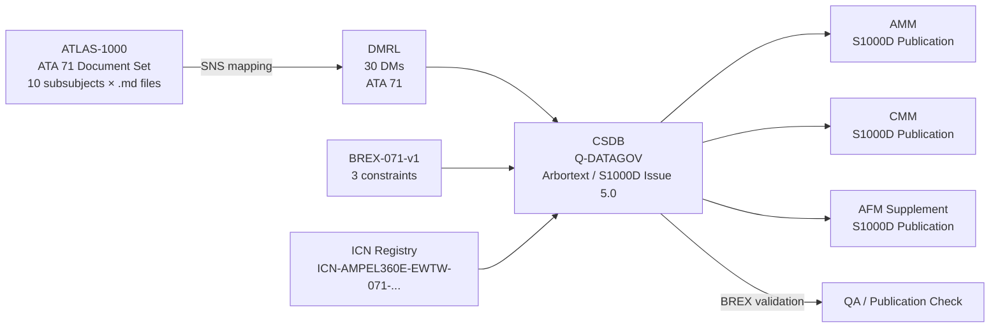

<!-- ──────────────────────────────────────────────────────────────────────────
     QATL-ATLAS-1000-ATLAS-070-079-071-090-S1000D-CSDB-MAPPING-AND-TRACEABILITY
     ATA 71 · S1000D CSDB Mapping and Traceability
     AMPEL360E eWTW — ATLAS Register 1000
────────────────────────────────────────────────────────────────────────────── -->

# S1000D CSDB Mapping and Traceability


---

## §0 Hyperlink Policy

> All hyperlinks in this document are **relative** (five directory levels: `../../../../../`).
> Absolute URLs are forbidden. Every linked document must exist in the Q+ATLANTIDE repository
> before the link is activated. Broken links are treated as open issues and must be resolved
> before the document is promoted from `DRAFT` to `APPROVED`.

---

## §1 Purpose

This document defines the S1000D Issue 5.0 Data Module (DM) structure, the Common Source Database (CSDB) organisation, the Data Module Requirements List (DMRL), the Business Rules Exchange (BREX) constraints, and the Information Control Number (ICN) registry scheme for the ATA 71 Electric Motor and Drive System on the AMPEL360E eWTW. It provides the complete mapping between the ATLAS-1000 documentation structure (this document set) and the S1000D technical publication deliverables required for the AMM (Aircraft Maintenance Manual), CMM (Component Maintenance Manual), and AFM (Aircraft Flight Manual) supplement.

---

## §2 Applicability

| Parameter | Value |
|---|---|
| Aircraft Program | AMPEL360E eWTW |
| ATA reference | ATA 71-090 — S1000D CSDB Mapping and Traceability |
| S1000D issue | Issue 5.0 |
| BREX document | AMPEL360E-BREX-071-v1 |
| Certification basis | EASA CS-25 Amdt 27+ |
| S1000D SNS | 071-090-00 |

---

## §3 Functional Description ![DRAFT]

**Data Module Code (DMC) pattern:**
All ATA 71 S1000D data modules for the AMPEL360E eWTW follow the DMC pattern:

```
DMC-AMPEL360E-EWTW-071-{NNN}-00A-EN-US
```

Where:
- `AMPEL360E-EWTW` = Model Identification Code (MIC)
- `071` = System code (ATA 71 Electric Motor and Drive Systems)
- `{NNN}` = Subsubject code (000–090 per ATLAS-1000 subsubject index)
- `00A` = Disassembly code variant A
- `EN-US` = Language / country code

**CSDB structure:**
The AMPEL360E eWTW ATA 71 CSDB comprises 30 data modules total, allocated across the 9 subsubjects (071-000 through 071-090) per the DMRL in §4. The CSDB is managed in the Q-DATAGOV CSDB instance (Arbortext Content Manager or equivalent). All data modules are authored in S1000D Issue 5.0 XML with schema validation against the S1000D Issue 5.0 XSD suite.

**BREX constraints (AMPEL360E-BREX-071-v1):**

Three BREX rules are defined for ATA 71 to enforce the key technical and regulatory requirements of the PMSM drive system:

| BREX Rule ID | Context | Constraint |
|---|---|---|
| BREX-071-001 | All DMs referencing HV cables or connectors | HV cable colour identification: all S1000D data modules referencing HV power cables or connectors at 540 V DC or 380 V AC must include the SAE J1654 orange identification statement: *"WARNING: High voltage cable. Colour: orange per SAE J1654. Isolate before disconnecting."* |
| BREX-071-002 | All DMs referencing MCU or control channels | MCU channel identification: all DMs referencing the MCU must identify the active control channel as CH-A or CH-B using the standard label `MCU-CH-A` or `MCU-CH-B`. No other channel naming convention is permitted. |
| BREX-071-003 | All DMs describing post-exceedance inspection | PM demagnetisation inspection trigger: all DMs covering post-overtemperature inspection must include the warning: *"If MCU event log records any stator winding temperature ≥ 150 °C, perform PM demagnetisation inspection per AMM 71-070 before return to service."* |

**ICN registry scheme:**
ICN (Information Control Numbers) for ATA 71 graphic resources follow the convention:
```
ICN-AMPEL360E-EWTW-071-{NNN}-{SEQ}-{TYPE}
```
Where `{SEQ}` is a 3-digit sequence number (001–999) per DM, and `{TYPE}` is:
- `DIA` = Diagram
- `SCH` = Schematic
- `PHO` = Photograph
- `TBL` = Table (if ICN-referenced)

Example: `ICN-AMPEL360E-EWTW-071-000-001-DIA` = first diagram in the DM-000 (General) data module.

**ATLAS-1000 to S1000D traceability:**
Each ATLAS-1000 document in the 071 subsection maps to one or more S1000D DMs per the DM allocations in §4. The SNS field in each ATLAS document YAML front-matter (`sns: "071-NNN-00"`) corresponds directly to the DM subsubject code in the DMC pattern.

---

## §4 Functional Breakdown

| ID | Name | Description | Lead Division |
|---|---|---|---|
| F-001 | DMRL (Data Module Requirements List) | 30 DMs; allocation per subsubject 000–090; type (descriptive/procedural/IPD) | Q-DATAGOV |
| F-002 | BREX Validation | BREX-071-v1 with 3 constraints; schema-validated at DM authoring time | Q-DATAGOV |
| F-003 | ICN Registry | ICN naming convention for ATA 71 graphic resources; tracked in CSDB metadata | Q-DATAGOV |
| F-004 | Descriptive DMs (DM-040 type) | Architecture, functional description, and component description data modules | Q-GREENTECH |
| F-005 | Procedural DMs (DM-300 type) | Maintenance inspection, test, and replacement procedure data modules | Q-MECHANICS |

---

## §5 System Context — Mermaid Diagram



---

## §6 Internal Architecture — Mermaid Diagram

```mermaid
flowchart TB
    subgraph DMRL_STRUCT["DMRL — 30 DMs by Subsubject"]
        SS000[071-000: 4 DMs\nGeneral description\nSystem overview]
        SS010[071-010: 3 DMs\nMotor architecture\nDescriptive]
        SS020[071-020: 3 DMs\nRotor/stator/bearing\nDescriptive + CMM]
        SS030[071-030: 3 DMs\nMDU inverter\nDescriptive]
        SS040[071-040: 3 DMs\nMCU control\nDescriptive]
        SS050[071-050: 3 DMs\nCooling system\nDescriptive + procedural]
        SS060[071-060: 3 DMs\nConnectors/insulation\nProcedural + descriptive]
        SS070[071-070: 4 DMs\nInspection/maintenance\nProcedural (DM-300)]
        SS080[071-080: 2 DMs\nMonitoring/BITE\nDescriptive]
        SS090[071-090: 2 DMs\nCSDB/BREX mapping\nS1000D management]
    end
    subgraph TYPES["DM Types"]
        DESC[Descriptive DM\nDM-040]
        PROC[Procedural DM\nDM-300]
        IPD[IPD DM\nDM-941]
    end
```

---

## §7 Components and LRUs

| Component | Part Number | Qty | Location | Maintenance Interval | Notes |
|---|---|---|---|---|---|
| S1000D DM set (30 DMs — ATA 71) | CSDB-071-TBD | 30 DMs | CSDB (Q-DATAGOV system) | DM review at each aircraft SB issuance | S1000D Issue 5.0 XML |
| BREX document (AMPEL360E-BREX-071-v1) | BREX-071-v1 | 1 | CSDB (Q-DATAGOV system) | Revise at each BREX constraint change | Controls 3 constraints listed in §3 |
| DMRL spreadsheet / CSDB DMRL record | DMRL-071-TBD | 1 | CSDB metadata / Q-DATAGOV | Maintain at each DM addition or deletion | 30 DMs; status tracked per DM |
| ICN registry (ATA 71 graphic resources) | ICN-REG-071-TBD | 1 | CSDB metadata | Update at each new ICN addition | Convention: ICN-AMPEL360E-EWTW-071-{NNN}-{SEQ}-{TYPE} |

---

## §8 Interfaces

| Interface Type | Connected System | Protocol / Medium | Data / Function |
|---|---|---|---|
| ATLAS-1000 → CSDB | Q-DATAGOV CSDB | SNS / DMC mapping table | ATLAS document content feeds DM authoring |
| BREX validation | CSDB authoring tool | S1000D BREX schema validation | Validate DMs against BREX-071-v1 at publish |
| AMM publication | S1000D AMM output | S1000D Issue 5.0 publication format | Maintenance task S1000D output to AMO |
| CMM publication | S1000D CMM output | S1000D Issue 5.0 publication format | Component MRO data module set |
| AFM supplement | AFM supplement editorial | PDF / S1000D | Operational limitations relevant to ATA 71 |

---

## §9 Operating Modes

| Mode | Trigger | System State | Actions / Consequences |
|---|---|---|---|
| DM authoring | New ATLAS document section completed | CSDB DM in DRAFT status | Author creates DM in S1000D Issue 5.0 XML per DMRL assignment |
| BREX validation | DM submitted for QA review | BREX check run against AMPEL360E-BREX-071-v1 | DM rejected if BREX-071-001, 002, or 003 constraints not satisfied |
| DM publication | DM approved and released | CSDB status = RELEASED | DM included in AMM/CMM publication output |
| DM revision | Aircraft SB or technical change | DM in DRAFT (new revision); DMRL updated | Revised DM re-validated against BREX; republished |

---

## §10 Performance and Budgets ![DRAFT]

| Parameter | Requirement | Target / Design Value | Status |
|---|---|---|---|
| Total DMs (ATA 71) | 30 DMs per DMRL | 30 DMs | ![TBD] |
| BREX constraints | 3 (BREX-071-001, 002, 003) | 3 | ![TBD] |
| DM authoring schema compliance | 100 % S1000D Issue 5.0 XSD validation | 100 % | ![TBD] |
| BREX validation pass rate at release | 100 % | 100 % (DMs rejected at QA if fail) | ![TBD] |
| ICN registry completeness | All ICNs referenced in DMs registered | 100 % | ![TBD] |

---

## §11 Safety, Redundancy and Fault Tolerance

- BREX-071-001 (orange HV cable warning) is a safety-critical BREX rule: failure to include the orange identification warning in a maintenance DM referencing HV cables could lead to a maintenance technician disconnecting an energised HV cable. The BREX validation enforces this at publication time.
- BREX-071-003 (PM demagnetisation inspection trigger) is a BREX rule tied to continued airworthiness: without the return-to-service inspection warning in the relevant DMs, the MCU thermal event log evidence could be overlooked, and a demagnetised PM rotor could be returned to service with degraded performance.
- All ATA 71 S1000D data modules are under configuration management in the Q-DATAGOV CSDB. Any change to a DM requires a formal DM revision record and BREX re-validation.

---

## §12 Maintenance and Diagnostics

| Task | Interval | Access | Special Tools |
|---|---|---|---|
| DMRL review (add/delete DMs at SB or drawing change) | Each SB or major design change | Q-DATAGOV CSDB access | CSDB terminal; DMRL spreadsheet |
| BREX validation of all released DMs | Each DM revision cycle | CSDB authoring tool | CSDB BREX validation plugin |
| ICN registry audit (verify all referenced ICNs present) | Each publication release | CSDB ICN registry | CSDB automated ICN check tool |
| DM status audit (DRAFT / IN REVIEW / RELEASED) | Each publication release | Q-DATAGOV CSDB | CSDB status dashboard |

---

## §13 Footprint — Physical, Electrical, Maintenance, Data ![TBD]

| Footprint Type | Parameter | Value | Notes |
|---|---|---|---|
| Data | Total DMs (ATA 71 CSDB) | 30 DMs | Per DMRL; 4 descriptive + procedural types |
| Data | BREX document revision | v1 | AMPEL360E-BREX-071-v1; 3 constraints |
| Data | DMC pattern | DMC-AMPEL360E-EWTW-071-{NNN}-00A-EN-US | Per §3 pattern |
| Data | ICN naming convention | ICN-AMPEL360E-EWTW-071-{NNN}-{SEQ}-{TYPE} | Per §3 pattern |

---

## §14 Safety and Certification References ![DRAFT]

| Standard / Document | Title | Issuing Body | Applicability |
|---|---|---|---|
| S1000D Issue 5.0 | International Specification for Technical Publications | ASD/AIA/ATA | CSDB and DM authoring standard |
| EASA CS-25 Amdt 27+ | Certification Specifications for Large Aeroplanes | EASA | Primary airworthiness basis |
| ATA Spec 100 / iSpec 2200 | ATA specification for technical documents | ATA | ATA chapter/section numbering compatibility |
| AMPEL360E-BREX-071-v1 | Business Rules Exchange document for ATA 71 | Q-DATAGOV | BREX constraints 001, 002, 003 |
| SAE J1654 | High Voltage Primary Cable | SAE International | Basis for BREX-071-001 orange identification constraint |

---

## §15 V&V Approach ![TBD]

| Phase | Method | Acceptance Criterion | Status |
|---|---|---|---|
| DM authoring | S1000D XSD schema validation | 0 schema errors at CSDB commit | ![TBD] |
| BREX validation | BREX-071-v1 automated check at QA gate | 100 % DMs pass BREX-071-001, 002, 003 | ![TBD] |
| ICN audit | CSDB ICN registry check at publication | 0 unregistered ICNs in released DMs | ![TBD] |
| Publication test | AMM publication generation test | 30 DMs included; no missing DM links | ![TBD] |
| Certification | EASA technical publication review (CS-25 Appendix H) | AMM accepted by EASA for type certificate | ![TBD] |

---

## §16 Glossary

| Term | Definition |
|---|---|
| **S1000D** | International specification for the production of technical publications, Issue 5.0; uses XML data modules stored in a CSDB. |
| **CSDB** | Common Source Database — the central repository for all S1000D data modules and associated resources. |
| **DMRL** | Data Module Requirements List — a managed list of all required data modules for a system or aircraft, each with type, status, and responsible author. |
| **BREX** | Business Rules Exchange — an S1000D data module containing project-specific authoring rules validated at DM publication time. |
| **DMC** | Data Module Code — the unique identifier for each S1000D data module, following the standardised pattern defined in §3. |
| **ICN** | Information Control Number — unique identifier for graphics and multimedia resources referenced in S1000D data modules. |
| **MIC** | Model Identification Code — the aircraft model designator used in the DMC (`AMPEL360E-EWTW`). |
| **DM-040** | S1000D data module information code 040 = Description and operation (descriptive type). |
| **DM-300** | S1000D data module information code 300 = Inspect/check (procedural type). |

---

## §17 Open Issues

| ID | Description | Owner | Target |
|---|---|---|---|
| OI-071-090-001 | Complete DMRL allocation (assign all 30 DMs to specific subsubjects with DM type and responsible author) | Q-DATAGOV | 2026-Q4 |
| OI-071-090-002 | Publish BREX-071-v1 as formal CSDB document with S1000D BREX schema | Q-DATAGOV | 2026-Q4 |
| OI-071-090-003 | Establish ICN registry for ATA 71 graphic resources in Q-DATAGOV CSDB | Q-DATAGOV | 2027-Q1 |

---

## §18 Status Legend

| Badge | Meaning |
|---|---|
| `![DRAFT]` | Section is drafted but not yet reviewed |
| `![TBD]` | Content not yet started — to be defined |
| `![To Be Completed]` | Partially complete — needs additional content |
| `![APPROVED]` | Reviewed and formally approved |

---

## §19 Related Documents (Siblings in this Subsection)

- [071-000](./071-000-Electric-Motor-and-Drive-Systems-General.md)
- [071-010](./071-010-Traction-Motor-Architecture.md)
- [071-020](./071-020-Motor-Rotor-Stator-and-Bearing-Assemblies.md)
- [071-030](./071-030-Inverter-and-Motor-Drive-Unit.md)
- [071-040](./071-040-Motor-Control-and-Torque-Command.md)
- [071-050](./071-050-Motor-Cooling-and-Thermal-Protection.md)
- [071-060](./071-060-Motor-Power-Connectors-and-Insulation.md)
- [071-070](./071-070-Motor-Inspection-Test-and-Maintenance.md)
- [071-080](./071-080-Electric-Drive-Monitoring-Diagnostics-and-Control-Interfaces.md)

---

## §20 Change Log

| Rev | Date | Author | Description |
|---|---|---|---|
| 0.1 | 2026-05-11 | @copilot | Initial DRAFT — Q-DATAGOV; 30 DMs; BREX-071-v1 with 3 constraints; DMC pattern; ICN registry |
