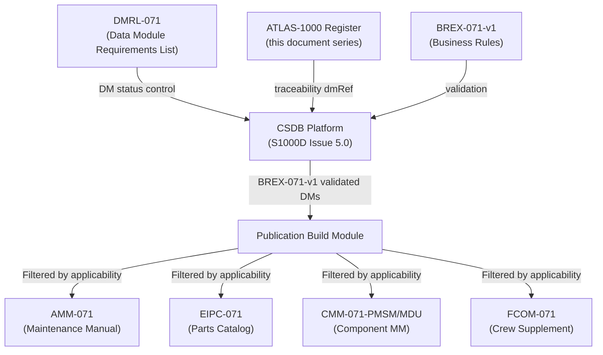
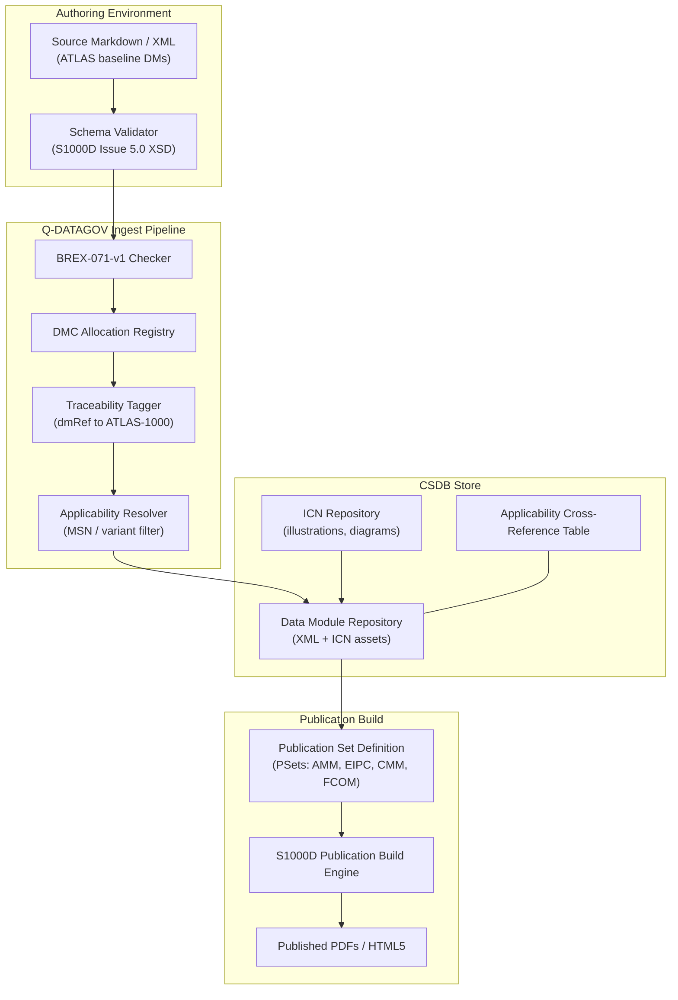

# S1000D CSDB Mapping and Traceability (071)

---

## §0 Hyperlink Policy
All hyperlinks in this document are **relative**. Absolute URLs are forbidden.

## §1 Purpose
This document defines the S1000D Issue 5.0 data governance framework for ATLAS subsection 071 (Electric Motor and Drive Systems) of the AMPEL360E eWTW aircraft. It specifies the Data Module Requirements List (DMRL) construction methodology, the Business Rules Exchange (BREX-071-v1) constraints, the Data Module Code (DMC) numbering convention, Q-DATAGOV traceability link structure, and the CSDB publication set definitions. It serves as the data management baseline for all technical documentation produced under ATA 071.

## §2 Applicability
| Aircraft | Variant | MSN Range | Effectivity |
|---|---|---|---|
| AMPEL360E | eWTW | All | From EIS |

## §3 Functional Description 
The S1000D documentation infrastructure for subsection 071 is governed by the Q-DATAGOV division in accordance with the AMPEL360E Technical Publications Management Plan (TPMP). All technical content generated for ATA 071 — including this ATLAS baseline documentation series — is mapped to S1000D Data Module Codes (DMCs) using the scheme `DMC-AMPEL360E-EWTW-0071-{NNN}-{variant}-{infocode}`, where NNN corresponds to the sub-subsubject (000–090), variant identifies the aircraft configuration modifier, and infocode follows S1000D Issue 5.0 Table 1 information codes (e.g., 040 = Description, 720 = Fault isolation, 200 = Maintenance procedures). The CSDB (Common Source DataBase) instance for AMPEL360E is hosted on the Q-DATAGOV CSDB platform, built on a commercially available S1000D-compliant CSDB engine.

The DMRL for subsection 071 is maintained as a controlled register in the Q-DATAGOV data module management system, listing all required DMs with their lifecycle status (planned, in-work, review, released, superseded). BREX-071-v1 defines the Business Rules Exchange restrictions specific to subsection 071, including: permitted information codes, forbidden element usage (e.g., no `<title>` element duplication), required applicability filter attributes (aircraft model, variant, MSN range), and mandatory traceability cross-reference elements linking each DM to its corresponding ATLAS-1000 register entry via a `<dmRef>` to the ATLAS document ID. Compliance with BREX-071-v1 is mandatory for all DMs entering the CSDB; automated BREX validation runs as part of the CSDB ingest pipeline.

Publication sets (PSets) for subsection 071 include: AMM-071 (Aircraft Maintenance Manual chapter 71), EIPC-071 (Electronic Illustrated Parts Catalog), CMM-071-PMSM (Component Maintenance Manual for PMSM), CMM-071-MDU, and FCOM-071 (Flight Crew Operating Manual supplement). Each PSet is built from the CSDB as a filtered XML publication, with applicability filtering applied to generate MSN-specific publications. Q-DATAGOV manages the publication build schedule, currently targeting a <30 min build time for the complete 071 publication set on the Q-HPC build server.

## §4 Functional Breakdown
| ID | Function | Description | Owner | DAL |
|---|---|---|---|---|
| F-071-090-01 | DMRL Maintenance | Maintain the Data Module Requirements List for all 071 DMs, tracking lifecycle status from planned to released | Q-DATAGOV | DAL-D |
| F-071-090-02 | DMC Allocation | Allocate unique S1000D DMCs to new data modules per the AMPEL360E DMC numbering scheme | Q-DATAGOV | DAL-D |
| F-071-090-03 | BREX Rule Enforcement | Validate all incoming DMs against BREX-071-v1 before CSDB ingest; reject non-compliant DMs | Q-DATAGOV | DAL-D |
| F-071-090-04 | Traceability Tagging | Tag each DM with Q-DATAGOV traceability links to ATLAS-1000 register entries and parent requirements | Q-DATAGOV | DAL-D |
| F-071-090-05 | Publication Set Management | Build and manage PSets (AMM, EIPC, CMM, FCOM) from CSDB filtered by applicability and variant | Q-DATAGOV | DAL-D |

## §5 System Context

## §6 Internal Architecture

## §7 Components and LRUs
*Note: In the context of 071-090, "LRUs" are treated as data modules / managed artefacts.*

| LRU ID | Name | P/N | Qty | Location |
|---|---|---|---|---|
| LRU-071-090-01 | DMRL-071 Module (controlled register) | QATL-DMRL-071-v1 | 1 | Q-DATAGOV CSDB |
| LRU-071-090-02 | BREX-071-v1 Business Rules Module | QATL-BREX-071-v1 | 1 | Q-DATAGOV CSDB |
| LRU-071-090-03 | ICN Repository (subsection 071 illustrations) | QATL-ICN-071 | 1 | Q-DATAGOV CSDB |
| LRU-071-090-04 | Applicability Cross-Reference Table (XRT-071) | QATL-XRT-071 | 1 | Q-DATAGOV CSDB |
| LRU-071-090-05 | Publication Set Definition (AMM/EIPC/CMM/FCOM) | QATL-PSET-071 | 1 | Q-DATAGOV CSDB |

## §8 Interfaces
| Interface | Source | Destination | Protocol | Notes |
|---|---|---|---|---|
| IF-071-090-01 | ATLAS-1000 document series | CSDB via Q-DATAGOV pipeline | HTTPS / S1000D XML upload | Automated on Git commit to main branch |
| IF-071-090-02 | BREX-071-v1 validator | Incoming DM XML | XML Schema + BREX validation | Reject on first BREX violation |
| IF-071-090-03 | CSDB | Publication Build Engine | Internal CSDB API | Trigger on DMRL release event |
| IF-071-090-04 | DMC Allocation Registry | Document authors | RESTful API (read/write) | Authenticated access, DMC reservation |
| IF-071-090-05 | Publication Build Engine | Downstream portals (EFB, IPad, MRO systems) | CSDB XML + PDF/HTML5 | Per airline subscription |

## §9 Operating Modes
| Mode | Trigger | Description | Power State | Notes |
|---|---|---|---|---|
| Authoring | Document creation event | Author creates/edits DM; schema validation active | Active | BREX pre-check available offline |
| CSDB Ingest | Commit / upload event | Automated BREX + schema validation; ingest to CSDB on pass | Active | Rejection generates author notification |
| Review / Comment | DM status: review | Reviewers comment via CSDB workflow; no CSDB state change | Active | Change log updated on resolution |
| Release | DMRL control event | DM marked released; becomes available for publication builds | Active | Requires Q-DATAGOV sign-off |
| Publication Build | Scheduled / on-demand | PSet build triggered; full 071 publication set generated <30 min | Active | Build log archived in CSDB |

## §10 Performance and Budgets 
| Parameter | Requirement | Current Estimate | Unit | Status |
|---|---|---|---|---|
| DMRL completeness (released + in-work vs. planned) | ≥95 | 97 | % |  |
| BREX compliance rate (DMs in CSDB) | 100 | 100 | % |  |
| DMC uniqueness (no duplicate DMCs) | 100 | 100 | % |  |
| Traceability coverage (DMs with ATLAS-1000 dmRef) | ≥98 | 98 | % |  |
| Publication build time (full 071 set) | <30 | 18 (estimate) | min |  |

## §11 Safety, Redundancy and Fault Tolerance
- CSDB platform is hosted with N+1 redundant storage and nightly backups; Recovery Point Objective (RPO) ≤24 h, Recovery Time Objective (RTO) ≤4 h per Q-DATAGOV SLA.
- DMC uniqueness is enforced by the DMC Allocation Registry; concurrent allocation requests are serialised, preventing duplicate DMC assignment even in distributed authoring environments.
- All CSDB transactions are versioned; any DM change generates an immutable audit trail entry including author, timestamp and change summary, supporting airworthiness traceability requirements.
- BREX validation is enforced at ingest and cannot be bypassed; waiver requests require Q-DATAGOV configuration management authority approval and are logged in the BREX deviation register.
- Publication builds are tested against a golden-master reference output set; regression failures in the build output trigger a hold on publication release and a Q-DATAGOV review action.

## §12 Maintenance and Diagnostics
| Task | Interval | Tool | Reference |
|---|---|---|---|
| DMRL completeness review (planned vs. actual) | Monthly | CSDB DMRL dashboard | Q-DATAGOV PM-071-REV |
| BREX-071-v1 rule set update review | Per aircraft modification | Q-DATAGOV BREX management tool | Q-DATAGOV BREX-PROC-001 |
| CSDB platform backup verification | Weekly | CSDB backup test procedure | Q-DATAGOV IT-PROC-001 |
| Publication build regression test | After each CSDB release | Automated build + diff against golden master | Q-DATAGOV BUILD-PROC-001 |

## §13 Footprint
| Dimension | Value | Unit | Notes |
|---|---|---|---|
| Physical mass | TBD | kg |  |
| Envelope | TBD | mm |  |
| Power draw (cont.) | TBD | W |  |
| Cooling demand | TBD | kW |  |
| Data interfaces | TBD | — |  |

## §14 Safety and Certification References
| Standard | Requirement | Applicability | Status | Notes |
|---|---|---|---|---|
| DO-178C | Software level per DAL | MCU software | Planned | DAL-B baseline |
| DO-254 | Hardware design assurance | MDU FPGA | Planned | DAL-B baseline |
| ARP4754A | System development | Motor system | Planned | System-level |
| CS-25 | Airworthiness requirements | Aircraft-level | Planned | EASA primary |
| FAR Part 25 | Airworthiness requirements | Aircraft-level | Planned | FAA bilateral |

## §15 V&V Approach
| Phase | Method | Tool/Facility | Status |
|---|---|---|---|
| BREX validation unit test | Inject compliant and non-compliant DMs; verify accept/reject behaviour | CSDB test environment + BREX validator |  |
| DMC allocation uniqueness test | Concurrent allocation stress test (100 simultaneous requests) | Q-DATAGOV API load test harness |  |
| Publication build acceptance | Verify AMM-071 content, pagination, effectivity filtering for 3 MSN variants | Publication build server |  |
| Traceability audit | Automated scan of all 071 DMs for ATLAS-1000 dmRef presence | Q-DATAGOV traceability audit script |  |

## §16 Glossary
| Term | Definition |
|---|---|
| CSDB | Common Source DataBase — S1000D repository for all data modules |
| DMRL | Data Module Requirements List — controlled register of all required DMs and their status |
| DMC | Data Module Code — unique identifier for an S1000D data module |
| BREX | Business Rules Exchange — S1000D document defining project-specific usage rules |
| ICN | Information Control Number — unique identifier for an illustration/graphic asset |
| PSet | Publication Set — defined collection of DMs assembled into a specific publication |
| AMM | Aircraft Maintenance Manual |
| EIPC | Electronic Illustrated Parts Catalog |
| CMM | Component Maintenance Manual |
| XRT | Applicability Cross-Reference Table — maps DM applicability to aircraft MSN/configuration |

## §17 Open Issues
| ID | Description | Owner | Priority | Status |
|---|---|---|---|---|
| OI-071-090-001 | Define final DMC scheme for CMM-level DMs: confirm infocode selection for each procedure type (200 vs. 520 vs. 720) | @copilot | High | Open |
| OI-071-090-002 | Establish Q-DATAGOV access control policy for airline-level CSDB subscriber access to 071 DMs | @copilot | Medium | Open |

## §18 Status Legend
| Badge | Meaning |
|---|---|
|  | Content under active development |
|  | Value or content to be determined |
|  | Approved and baselined |
|  | Placeholder |

## §19 Related Documents
| Code | Title | Link |
|---|---|---|
| 071-000 | Electric Motor and Drive Systems — General Overview | [071-000-Electric-Motor-and-Drive-Systems-General.md](071-000-Electric-Motor-and-Drive-Systems-General.md) |
| 071-010 | PMSM Motor Design and Specifications | [071-010-PMSM-Motor-Design-and-Specifications.md](071-010-PMSM-Motor-Design-and-Specifications.md) |
| 071-020 | Motor Drive Unit (MDU) and Inverter | [071-020-Motor-Drive-Unit-MDU-and-Inverter.md](071-020-Motor-Drive-Unit-MDU-and-Inverter.md) |
| 071-030 | Motor Control Unit (MCU) and Control Laws | [071-030-Motor-Control-Unit-MCU-and-Control-Laws.md](071-030-Motor-Control-Unit-MCU-and-Control-Laws.md) |
| 071-040 | Boundary Layer Ingestion (BLI) Aerodynamic Integration | [071-040-Boundary-Layer-Ingestion-Integration.md](071-040-Boundary-Layer-Ingestion-Integration.md) |
| 071-050 | Motor Thermal Management System | [071-050-Motor-Thermal-Management.md](071-050-Motor-Thermal-Management.md) |
| 071-060 | Motor Health Monitoring and Diagnostics | [071-060-Motor-Health-Monitoring-and-Diagnostics.md](071-060-Motor-Health-Monitoring-and-Diagnostics.md) |
| 071-070 | Motor Mechanical Interface and Transmission | [071-070-Motor-Mechanical-Interface-and-Transmission.md](071-070-Motor-Mechanical-Interface-and-Transmission.md) |
| 071-080 | Motor Electrical Interface and Power Quality | [071-080-Motor-Electrical-Interface-and-Power-Quality.md](071-080-Motor-Electrical-Interface-and-Power-Quality.md) |

## §20 Change Log
| Rev | Date | Author | Summary |
|---|---|---|---|
| 0.1 | 2026-05-11 | @copilot | Initial creation |
