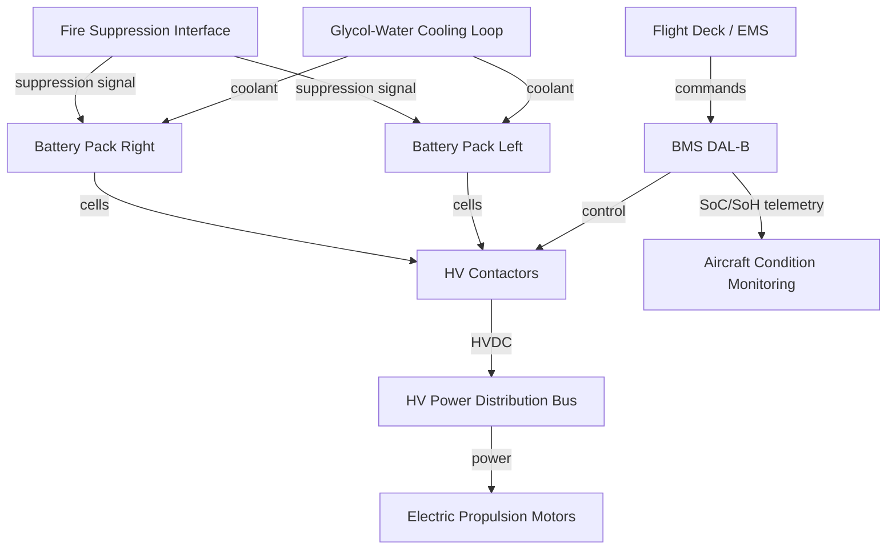

# Battery Energy Storage — General Overview


---

## §0 Hyperlink Policy
All hyperlinks in this document are **relative**. Absolute URLs are forbidden.

## §1 Purpose

This document defines the agnostic ATLAS standard-level architecture context for `Battery Energy Storage — General Overview`.

It describes the controlled scope, functions, interfaces, safety considerations, lifecycle traceability, and S1000D/CSDB mapping logic that programme implementations shall instantiate when this node is applicable.

This document is not a programme design baseline. Programme-specific capacities, locations, part numbers, effectivity, operating limits, maintenance references, and data module codes shall be defined only inside the applicable programme implementation branch.
## §2 Applicability

| Applicability Level | Rule |
|---|---|
| Standard taxonomy | Applies to the ATLAS node `072` |
| Programme implementation | Conditional; determined by programme architecture, trade studies, certification basis, and applicability model |
| Product configuration | Defined in the programme-specific configuration baseline |
| Effectivity | Defined in the programme CSDB / applicability layer |
| Non-applicability | Must be explicitly stated in the programme impact-study branch when excluded |
## §3 Functional Description 
The Battery Energy Storage (BES) subsystem of the programme-defined aircraft type is the primary propulsion energy source, providing <ENERGY-CAPACITY> total capacity (approximately <USABLE-ENERGY> at 90% Depth of Discharge). The system is distributed across two [programme-defined battery bay]s, each housing a <ENERGY-CAPACITY-PER-UNIT> pack, enabling symmetric load distribution and independent fault isolation. The nominal bus voltage is <NOMINAL-VOLTAGE> HVDC, compatible with the aircraft's high-voltage power distribution architecture.

The chemistry selected is <BATTERY-CHEMISTRY>, chosen for its high specific energy density (~250 Wh/kg at cell level), enabling the aircraft to meet range requirements while minimising structural weight penalty. Cell-level monitoring, pack-level protection (OVP, UVP, OCP, OTP), and thermal management via a glycol-water liquid cooling loop maintain safe operation across the 20–30°C target operating range.

The Battery Management System (BMS), certified to DAL B with dual-lane architecture, provides continuous State of Charge (SoC) and State of Health (SoH) estimation, fault detection, and protection actuation. High-voltage contactors (main and precharge) and a Manual Service Disconnect (MSD) provide isolation capability for ground operations and emergency response. Thermal runaway protection, dedicated venting channels, and a fire suppression interface complete the safety architecture.

## §4 Functional Breakdown
| ID | Function | Description | Owner | DAL |
|---|---|---|---|---|
| F-072-000-01 | Energy Storage | Store and deliver <USABLE-ENERGY> energy to propulsion bus | Q-GREENTECH | DAL C |
| F-072-000-02 | Battery Management | Monitor, protect and optimise battery state via BMS | Q-HPC | DAL B |
| F-072-000-03 | Thermal Regulation | Maintain cell temperature 20–30°C via liquid cooling | Q-MECHANICS | DAL C |
| F-072-000-04 | HV Isolation | Provide controlled HV connection/disconnection and MSD | Q-INDUSTRY | DAL B |
| F-072-000-05 | Safety Protection | Detect and mitigate thermal runaway, fire and HV faults | Q-AIR | DAL A |

## §5 System Context


## §6 Internal Architecture
```mermaid
graph TD
    subgraph LEFT_BAY[[Programme-defined Installation Location] - <ENERGY-CAPACITY-PER-UNIT>]
        MOD_L1[Module Group L1] --> PACK_L[Pack Controller L]
        MOD_L2[Module Group L2] --> PACK_L
        PACK_L --> MSD_L[MSD Left]
    end
    subgraph RIGHT_BAY[[Programme-defined Installation Location] - <ENERGY-CAPACITY-PER-UNIT>]
        MOD_R1[Module Group R1] --> PACK_R[Pack Controller R]
        MOD_R2[Module Group R2] --> PACK_R
        PACK_R --> MSD_R[MSD Right]
    end
    MSD_L -->|main fuse + contactor| BMS_L[BMS Lane A]
    MSD_R -->|main fuse + contactor| BMS_R[BMS Lane B]
    BMS_L <-->|cross-channel data| BMS_R
    BMS_L --> HVBUS[<NOMINAL-VOLTAGE> HVDC Bus]
    BMS_R --> HVBUS
```

## §7 Components and LRUs
| LRU ID | Name | P/N | Qty | Location |
|---|---|---|---|---|
| LRU-072-000-01 | Battery Pack Assembly (Left) | [BATTERY-PACK-PN-L] | 1 | [programme-defined installation location] |
| LRU-072-000-02 | Battery Pack Assembly (Right) | [BATTERY-PACK-PN-R] | 1 | [programme-defined installation location] |
| LRU-072-000-03 | Battery Management Unit (BMU) | [BMU-PN] | 2 | Avionics bay |
| LRU-072-000-04 | Manual Service Disconnect | [MSD-PN] | 2 | Bay access panels |
| LRU-072-000-05 | Thermal Management Module | [TMM-PN] | 2 | Wing root |

## §8 Interfaces
| Interface | Source | Destination | Protocol | Notes |
|---|---|---|---|---|
| IF-072-000-01 | BMS Lane A/B | HVDC Bus | <NOMINAL-VOLTAGE> DC Power | Main + precharge contactors |
| IF-072-000-02 | BMS Lane A/B | ACMS | ARINC 429 | SoC/SoH, fault data |
| IF-072-000-03 | BMS Lane A/B | Flight Management | CAN FD | Energy prediction data |
| IF-072-000-04 | Thermal Module | Environmental Control | Coolant loop | Glycol-water 30 kW capacity |
| IF-072-000-05 | Safety Controller | Fire Suppression | Discrete 28V | TR event trigger |

## §9 Operating Modes
| Mode | Trigger | Description | Power State | Notes |
|---|---|---|---|---|
| Standby | Power-on | BMS active, contactors open | Low (~50W) | Pre-flight checks active |
| Pre-charge | Contactor close cmd | Ramp <NOMINAL-VOLTAGE> via precharge resistor | Medium | <5s duration |
| Discharge | Propulsion demand | Supply power to HVDC bus | High (up to 1 MW) | Normal flight |
| Regen Charge | Motor braking signal | Accept regenerative energy | Medium | Limited by SoC ceiling |
| Ground Charge | GSE connect | Charge from ground power | High (up to 350 kW) | EVSE/GSE protocol |
| Fault Isolation | BMS fault detect | Open contactors, log fault | Zero | MSD accessible |

## §10 Performance and Budgets 
| Parameter | Requirement | Current Estimate | Unit | Status |
|---|---|---|---|---|
| Total Energy Capacity | ≥500 | 500 | kWh |  |
| Usable Energy (90% DoD) | ≥450 | 450 | kWh |  |
| Nominal Bus Voltage | <NOMINAL-VOLTAGE> DC |  |
| Peak Discharge Power | ≥1000 | 1050 | kW |  |
| System Mass (total) | ≤2200 | 2100 | kg |  |

## §11 Safety, Redundancy and Fault Tolerance
- Dual-lane BMS (Lane A / Lane B) with independent processor, power supply and comms paths; either lane can safely isolate the battery.
- Two independent battery packs (left/right) with separate contactors allow single-pack operation in degraded mode.
- Manual Service Disconnects (MSD) on each bay provide mechanic-actuated HV isolation without tools.
- Thermal runaway detection triggers automatic contactor opening, fire suppression interface activation, and crew alerting within 500 ms.
- All HV wiring routed in fire-resistant conduit with ground-fault monitoring; automatic isolation on insulation resistance drop below threshold.

## §12 Maintenance and Diagnostics
| Task | Interval | Tool | Reference |
|---|---|---|---|
| BMS BITE self-test | Pre-flight | Onboard (automatic) | AMM [NODE]-[TASK] |
| Cell-level impedance scan | 500 FH | GSE-BMS-DIAG-01 | CMM [NODE]-[TASK] |
| Coolant level and quality check | 1000 FH / Annual | Coolant analyser kit | AMM [NODE]-[TASK] |
| MSD continuity and torque check | Annual / C-Check | Torque wrench + DMM | AMM [NODE]-[TASK] |

## §13 Footprint
| Metric | Value |
|---|---|
| Pack volume (each) | ~1.2 m × 2.8 m × 0.35 m |
| Total system mass | <SYSTEM-MASS> (est.) |
| Nominal voltage | <NOMINAL-VOLTAGE> DC |
| Peak current | ~1300 A |
| Cooling capacity | 30 kW per bay |
| Data interfaces | ARINC 429, CAN FD, Discrete 28V |

## §14 Safety and Certification References
| Standard | Requirement | Applicability | Status | Notes |
|---|---|---|---|---|
| DO-178C | BMS software — DAL B | BMS firmware | Planned | Dual-lane coverage |
| DO-254 | BMS hardware — DAL B | BMU FPGA/ASIC | Planned | Complex electronics |
| ARP4754A | System development assurance | Full BES system | Planned | FHA/PSSA/SSA |
| CS-25 | Airworthiness — battery installation | Structural/electrical | Planned | CS-25.1353 |
| UN 38.3 | Battery transport safety | Cell/module | Planned | Pre-install logistics |

## §15 V&V Approach
| Phase | Method | Tool/Facility | Status |
|---|---|---|---|
| Cell qualification | UN 38.3 abuse testing | Cell test lab |  |
| Pack integration test | Electrical performance, thermal runaway | Battery integration rig |  |
| BMS software V&V | Requirements-based test, MC/DC coverage | HIL bench |  |
| Aircraft-level EIS validation | Ground and flight test | programme-defined aircraft prototype |  |

## §16 Glossary
| Term | Definition |
|---|---|
| BES | Battery Energy Storage — the complete <ENERGY-CAPACITY> traction battery system |
| BMS | Battery Management System — monitors, protects and controls the battery |
| DAL | Development Assurance Level (DO-178C / DO-254) |
| DoD | Depth of Discharge — fraction of total capacity used |
| HVDC | High-Voltage Direct Current (<NOMINAL-VOLTAGE> nominal bus) |
| MSD | Manual Service Disconnect — mechanic-actuated HV isolation device |
| <BATTERY-CHEMISTRY> | <BATTERY-CHEMISTRY> lithium-ion chemistry |
| OCP | Over-Current Protection |
| OTP | Over-Temperature Protection |
| OVP | Over-Voltage Protection |

## §17 Open Issues
| ID | Description | Owner | Priority | Status |
|---|---|---|---|---|
| OI-072-000-001 | Finalise mass budget with structural team | @copilot | High | Open |
| OI-072-000-002 | Confirm peak discharge power with propulsion team | @copilot | Medium | Open |

## §18 Status Legend
| Badge | Meaning |
|---|---|
|  | Content under active development |
|  | Value or content to be determined |
|  | Approved and baselined |
|  | Placeholder |

## §19 Related Documents
| Code | Title | Link |
|---|---|---|
| 072-010 | Battery Cell and Module Design | [072-010-Battery-Cell-and-Module-Design.md](072-010-Battery-Cell-and-Module-Design.md) |
| 072-020 | Battery Pack Architecture | [072-020-Battery-Pack-Architecture.md](072-020-Battery-Pack-Architecture.md) |
| 072-030 | Battery Management System (BMS) | [072-030-Battery-Management-System-BMS.md](072-030-Battery-Management-System-BMS.md) |
| 072-040 | Battery Thermal Management | [072-040-Battery-Thermal-Management.md](072-040-Battery-Thermal-Management.md) |
| 072-050 | HV Contactors and Protection | [072-050-HV-Contactors-and-Protection.md](072-050-HV-Contactors-and-Protection.md) |
| 072-060 | Battery State Estimation | [072-060-Battery-State-Estimation.md](072-060-Battery-State-Estimation.md) |
| 072-070 | Battery Safety and Thermal Runaway Protection | [072-070-Battery-Safety-and-Thermal-Runaway-Protection.md](072-070-Battery-Safety-and-Thermal-Runaway-Protection.md) |
| 072-080 | Battery Charging and Ground Support | [072-080-Battery-Charging-and-Ground-Support.md](072-080-Battery-Charging-and-Ground-Support.md) |
| 072-090 | S1000D CSDB Mapping and Traceability | [072-090-S1000D-CSDB-Mapping-and-Traceability.md](072-090-S1000D-CSDB-Mapping-and-Traceability.md) |

## §20 Change Log
| Rev | Date | Author | Summary |
|---|---|---|---|
| 0.1 | 2026-05-11 | @copilot | Initial creation |
