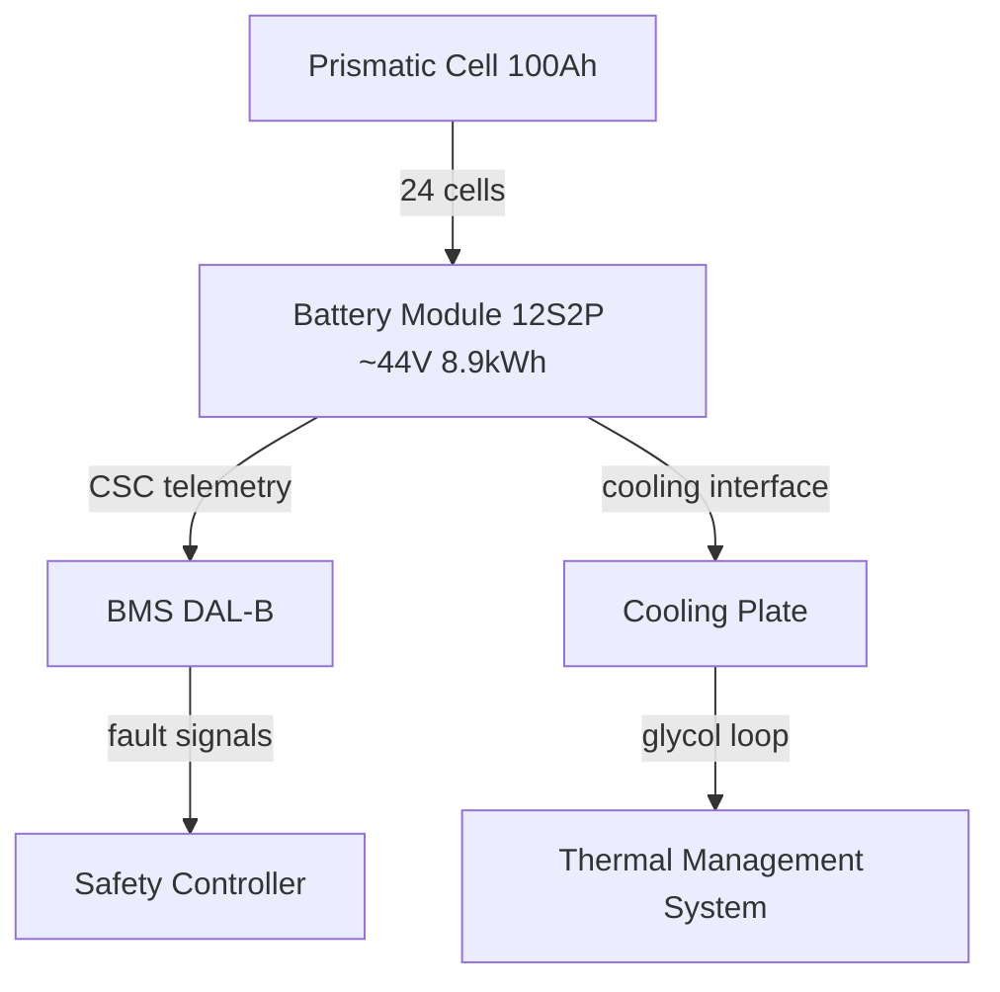
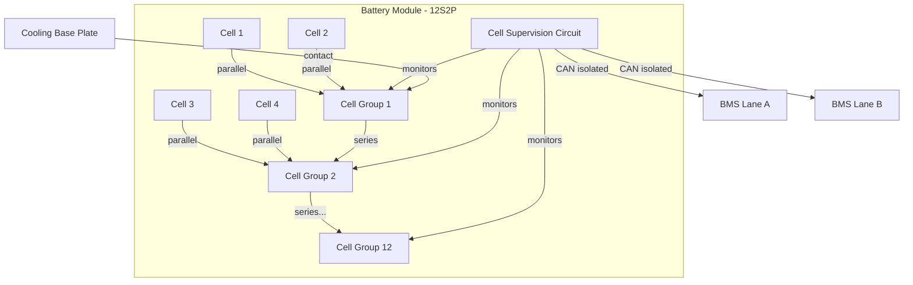

# Battery Cell and Module Design

---

## §0 Hyperlink Policy
All hyperlinks in this document are **relative**. Absolute URLs are forbidden.

## §1 Purpose

This document defines the agnostic ATLAS standard-level architecture context for `Battery Cell and Module Design`.

It describes the controlled scope, functions, interfaces, safety considerations, lifecycle traceability, and S1000D/CSDB mapping logic that programme implementations shall instantiate when this node is applicable.

This document is not a programme design baseline. Programme-specific capacities, locations, part numbers, effectivity, operating limits, maintenance references, and data module codes shall be defined only inside the applicable programme implementation branch.
## §2 Applicability

| Applicability Level | Rule |
|---|---|
| Standard taxonomy | Applies to the ATLAS node `072` |
| Programme implementation | Conditional; determined by programme architecture, trade studies, certification basis, and applicability model |
| Product configuration | Defined in the programme-specific configuration baseline |
| Effectivity | Defined in the programme CSDB / applicability layer |
| Non-applicability | Must be explicitly stated in the programme impact-study branch when excluded |
## §3 Functional Description 
The [PROGRAMME-AIRCRAFT] battery system uses large-format prismatic <BATTERY-CHEMISTRY> cells with a nominal capacity of ~100 Ah and a nominal cell voltage of 3.7 V. Each cell incorporates an integrated current interrupt device (CID) and a safety vent, providing first-level protection against overpressure events. The <BATTERY-CHEMISTRY> chemistry achieves approximately 250 Wh/kg at cell level, enabling the total pack to meet the <ENERGY-CAPACITY> capacity target within the available structural envelope.

Cells are assembled into modules of 24 cells configured in a 12S2P arrangement (12 cells in series, 2 in parallel), giving a module nominal voltage of approximately 44.4 V and a module capacity of ~8.9 kWh. Each module contains a cell supervision circuit (CSC) that measures individual cell voltages (±2 mV accuracy) and temperatures (±1°C accuracy) at 100 ms intervals. The CSC communicates with the pack-level BMS via an isolated CAN bus, providing cell-level granularity for SoC estimation and fault detection.

Module housings are constructed from fire-resistant aerospace aluminium alloy with an integrated cooling plate at the base for contact with the glycol-water cooling circuit. Mechanical cell retention uses compressed foam pads and aluminium end plates torqued to maintain cell-to-cell contact pressure throughout the thermal expansion range. Module interconnects use laser-welded busbar assemblies to minimise contact resistance and eliminate oxidation risk over the service life.

## §4 Functional Breakdown
| ID | Function | Description | Owner | DAL |
|---|---|---|---|---|
| F-072-010-01 | Cell Energy Storage | Store electrochemical energy; deliver/accept current safely | Q-GREENTECH | DAL C |
| F-072-010-02 | Cell-Level Voltage Monitoring | Measure each cell voltage ±2 mV at 100 ms | Q-HPC | DAL B |
| F-072-010-03 | Cell-Level Temperature Monitoring | Measure cell temperature ±1°C at 100 ms | Q-MECHANICS | DAL B |
| F-072-010-04 | Module Mechanical Containment | Retain cells under vibration/shock per DO-160G | Q-MECHANICS | DAL C |
| F-072-010-05 | Module Thermal Interface | Conduct heat from cells to cooling plate | Q-MECHANICS | DAL C |

## §5 System Context

## §6 Internal Architecture

## §7 Components and LRUs
| LRU ID | Name | P/N | Qty per pack | Location |
|---|---|---|---|---|
| LRU-072-010-01 | <BATTERY-CHEMISTRY> Prismatic Cell 100 Ah | CELL-NMC811-100AH | 1344 | Within modules |
| LRU-072-010-02 | Battery Module Assembly 12S2P | MOD-12S2P-9KWH | 56 | Per pack (28/pack) |
| LRU-072-010-03 | Cell Supervision Circuit (CSC) | CSC-24CH-CANISO | 56 | One per module |
| LRU-072-010-04 | Module Interconnect Busbar | BUS-MOD-LASWELD | 56 | Between modules |
| LRU-072-010-05 | Module Cooling Base Plate | COOL-BASE-AL-01 | 56 | Base of each module |

## §8 Interfaces
| Interface | Source | Destination | Protocol | Notes |
|---|---|---|---|---|
| IF-072-010-01 | Cell Group | Module Busbar | DC Power (44V) | Laser-welded connection |
| IF-072-010-02 | CSC | BMS Lane A | CAN FD isolated | Cell V/T data, 100 ms |
| IF-072-010-03 | CSC | BMS Lane B | CAN FD isolated | Redundant monitoring |
| IF-072-010-04 | Module Cooling Plate | Thermal Loop | Glycol-water contact | 30 W/cell max heat flux |
| IF-072-010-05 | Module Housing | Aircraft Structure | Mechanical | Vibration-isolated mounts |

## §9 Operating Modes
| Mode | Trigger | Description | Power State | Notes |
|---|---|---|---|---|
| Storage | Aircraft parked | Low self-discharge, monitoring active | Passive | SoC maintained 30–50% |
| Pre-conditioning | Cold soak detected | Heating via coolant to reach 15°C | Low | Pre-flight warm-up |
| Normal Discharge | Propulsion demand | Cells deliver current within SOA | High | Max 3C continuous |
| Regen Accept | Braking signal | Cells accept regenerative current | Medium | Max 1C regen |
| Post-flight Monitor | Landing | Monitor cell balancing, temperature decay | Low | 30 min minimum |

## §10 Performance and Budgets 
| Parameter | Requirement | Current Estimate | Unit | Status |
|---|---|---|---|---|
| Cell nominal capacity | ≥95 | 100 | Ah |  |
| Cell specific energy | ≥240 | 250 | Wh/kg |  |
| Cell voltage monitoring accuracy | ±5 | ±2 | mV |  |
| Cell temperature monitoring accuracy | ±2 | ±1 | °C |  |
| Module energy density | ≥200 | 210 | Wh/kg |  |

## §11 Safety, Redundancy and Fault Tolerance
- Each cell incorporates a CID (Current Interrupt Device) and safety vent as integral primary protection.
- Dual CSC reporting paths (BMS Lane A and Lane B) ensure cell monitoring continues on single-lane failure.
- Module housing rated to contain single-cell thermal runaway without propagation per IEC 62619.
- Cell-level impedance monitoring detects early-stage cell degradation before capacity loss becomes operationally significant.
- Module end-of-life criteria defined at 80% capacity retention; modules flagged for replacement before airline service limits are reached.

## §12 Maintenance and Diagnostics
| Task | Interval | Tool | Reference |
|---|---|---|---|
| CSC self-test and calibration | 500 FH | GSE-BMS-DIAG-01 | CMM [NODE]-[TASK] |
| Cell voltage balance check | 200 FH | GSE-BMS-DIAG-01 | AMM [NODE]-[TASK] |
| Module housing visual inspection | C-Check | Visual / borescope | AMM [NODE]-[TASK] |
| Cell impedance spectroscopy scan | 1000 FH | EIS analyser kit | CMM [NODE]-[TASK] |

## §13 Footprint
| Metric | Value |
|---|---|
| Cell format | Large-format prismatic |
| Cell dimensions | ~173 mm × 45 mm × 125 mm (est.) |
| Module dimensions | ~590 mm × 320 mm × 145 mm (est.) |
| Cells per module | 24 (12S2P) |
| Modules per pack | 28 |
| Total cells per aircraft | 1344 |

## §14 Safety and Certification References
| Standard | Requirement | Applicability | Status | Notes |
|---|---|---|---|---|
| DO-178C | CSC firmware — DAL B | CSC embedded software | Planned | Cell monitoring criticality |
| DO-254 | CSC hardware — DAL B | CSC PCB/FPGA | Planned | Analog front-end |
| ARP4754A | Module-level safety analysis | Module assembly | Planned | FHA contribution |
| CS-25 | Flammability — module materials | Housing materials | Planned | CS-25.853 |
| UN 38.3 | Cell transport qualification | Individual cells | Planned | Supplier compliance |

## §15 V&V Approach
| Phase | Method | Tool/Facility | Status |
|---|---|---|---|
| Cell qualification | Capacity, rate, cycle, abuse per UN 38.3 | Cell test lab |  |
| Module assembly test | Electrical performance, vibration, thermal | Module test bench |  |
| CSC software V&V | Requirements-based test, MC/DC | HIL bench |  |
| Module TR containment test | Single-cell TR propagation | Abuse test chamber |  |

## §16 Glossary
| Term | Definition |
|---|---|
| CID | Current Interrupt Device — cell-internal pressure-actuated disconnect |
| CSC | Cell Supervision Circuit — per-module cell monitoring PCB |
| DoD | Depth of Discharge |
| EIS | Electrochemical Impedance Spectroscopy |
| <BATTERY-CHEMISTRY> | <BATTERY-CHEMISTRY> cathode chemistry |
| Prismatic | Flat-sided cell format (vs. cylindrical or pouch) |
| SOA | Safe Operating Area — voltage, current, temperature boundaries |
| SoC | State of Charge |
| 12S2P | 12 cells in series, 2 in parallel module configuration |
| TR | Thermal Runaway |

## §17 Open Issues
| ID | Description | Owner | Priority | Status |
|---|---|---|---|---|
| OI-072-010-001 | Confirm cell supplier and final cell P/N | @copilot | High | Open |
| OI-072-010-002 | Validate module TR containment test approach with safety team | @copilot | Medium | Open |

## §18 Status Legend
| Badge | Meaning |
|---|---|
|  | Content under active development |
|  | Value or content to be determined |
|  | Approved and baselined |
|  | Placeholder |

## §19 Related Documents
| Code | Title | Link |
|---|---|---|
| 072-000 | Battery Energy Storage — General Overview | [072-000-Battery-Energy-Storage-General.md](072-000-Battery-Energy-Storage-General.md) |
| 072-020 | Battery Pack Architecture | [072-020-Battery-Pack-Architecture.md](072-020-Battery-Pack-Architecture.md) |
| 072-030 | Battery Management System (BMS) | [072-030-Battery-Management-System-BMS.md](072-030-Battery-Management-System-BMS.md) |
| 072-040 | Battery Thermal Management | [072-040-Battery-Thermal-Management.md](072-040-Battery-Thermal-Management.md) |
| 072-050 | HV Contactors and Protection | [072-050-HV-Contactors-and-Protection.md](072-050-HV-Contactors-and-Protection.md) |
| 072-060 | Battery State Estimation | [072-060-Battery-State-Estimation.md](072-060-Battery-State-Estimation.md) |
| 072-070 | Battery Safety and Thermal Runaway Protection | [072-070-Battery-Safety-and-Thermal-Runaway-Protection.md](072-070-Battery-Safety-and-Thermal-Runaway-Protection.md) |
| 072-080 | Battery Charging and Ground Support | [072-080-Battery-Charging-and-Ground-Support.md](072-080-Battery-Charging-and-Ground-Support.md) |
| 072-090 | S1000D CSDB Mapping and Traceability | [072-090-S1000D-CSDB-Mapping-and-Traceability.md](072-090-S1000D-CSDB-Mapping-and-Traceability.md) |

## §20 Change Log
| Rev | Date | Author | Summary |
|---|---|---|---|
| 0.1 | 2026-05-11 | @copilot | Initial creation |
