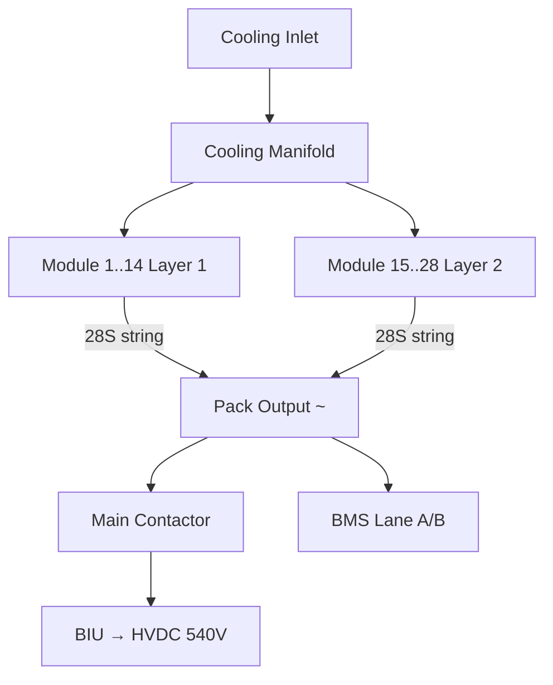
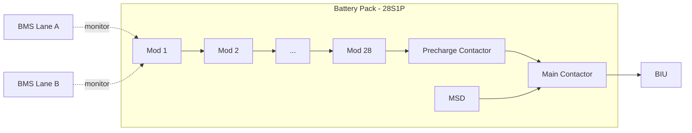

# Battery Pack Architecture

---

## §0 Hyperlink Policy
All hyperlinks in this document are **relative**. Absolute URLs are forbidden.

## §1 Purpose

This document defines the agnostic ATLAS standard-level architecture context for `Battery Pack Architecture`.

It describes the controlled scope, functions, interfaces, safety considerations, lifecycle traceability, and S1000D/CSDB mapping logic that programme implementations shall instantiate when this node is applicable.

This document is not a programme design baseline. Programme-specific capacities, locations, part numbers, effectivity, operating limits, maintenance references, and data module codes shall be defined only inside the applicable programme implementation branch.
## §2 Applicability

| Applicability Level | Rule |
|---|---|
| Standard taxonomy | Applies to the ATLAS node `072` |
| Programme implementation | Conditional; determined by programme architecture, trade studies, certification basis, and applicability model |
| Product configuration | Defined in the programme-specific configuration baseline |
| Effectivity | Defined in the programme CSDB / applicability layer |
| Non-applicability | Must be explicitly stated in the programme impact-study branch when excluded |
## §3 Functional Description 
Each of the two [PROGRAMME-AIRCRAFT] battery packs contains 28 modules arranged in a 28S1P string configuration, yielding a pack nominal voltage of approximately 1243 V. However, the BIU buck-boosts this to the HVDC 540 V propulsion bus; the pack itself is treated as an ~<NOMINAL-VOLTAGE> source. The 28 modules are stacked in two layers of 14 within a structural composite tray that fits into the [programme-defined installation location] between ribs 15 and 23.

Inter-module busbars are laser-welded copper ribbon assemblies rated at 500 A continuous. The series string is protected at the pack output by two main contactors (precharge and main) and a manual service disconnect (MSD) accessible via a panel on the lower wing skin. Pack output voltage is monitored by the BMS lane A and B at the main contactor output terminals.

The pack enclosure is constructed from fire-resistant CFRP panels with aluminium structural ribs providing the primary load path to the wing spar attachment. The enclosure incorporates pressure-relief venting channels routed outboard along the wing lower surface to direct any outgassing away from the fuselage. Each pack has a dedicated glycol-water cooling inlet and outlet port, connected to the aircraft thermal management system via quick-disconnect couplings.

## §4 Functional Breakdown
| ID | Function | Description | Owner | DAL |
|---|---|---|---|---|
| F-072-020-01 | Series String Assembly | 28 modules in series to achieve ~<NOMINAL-VOLTAGE> | Q-GREENTECH | DAL C |
| F-072-020-02 | Structural Integration | Mount pack tray to wing structure, carry flight loads | Q-MECHANICS | DAL C |
| F-072-020-03 | Pack Output Protection | Main and precharge contactors, MSD | Q-GREENTECH | DAL B |
| F-072-020-04 | Thermal Path | Glycol cooling inlet/outlet, distribute to modules | Q-MECHANICS | DAL C |
| F-072-020-05 | Venting Channel Management | Route outgassing outboard safely | Q-MECHANICS | DAL B |

## §5 System Context

## §6 Internal Architecture

## §7 Components and LRUs
| LRU ID | Name | P/N | Qty | Location |
|---|---|---|---|---|
| LRU-072-020-01 | Battery Pack Structural Tray | TRAY-BAT-072-001 | 2 | Port/Stbd [programme-defined installation location] |
| LRU-072-020-02 | Inter-Module Busbar Assembly | BUS-MOD-28S-001 | 54 | Within each pack |
| LRU-072-020-03 | Pack Main Contactor | CONT-HV-<NOMINAL-VOLTAGE>-001 | 4 | Pack output (2 per pack) |
| LRU-072-020-04 | Manual Service Disconnect (MSD) | MSD-<NOMINAL-VOLTAGE>-001 | 2 | Lower wing skin panel |
| LRU-072-020-05 | Cooling QD Coupling Set | QDC-GLY-072-001 | 4 | Pack cooling ports |

## §8 Interfaces
| Interface | Source | Destination | Protocol | Notes |
|---|---|---|---|---|
| IF-072-020-01 | Pack Output (~<NOMINAL-VOLTAGE>) | BIU | DC Power | Via main contactor |
| IF-072-020-02 | BMS Lane A | Pack Monitoring | CAN FD | Voltage/temp/current |
| IF-072-020-03 | BMS Lane B | Pack Monitoring | CAN FD | Redundant lane |
| IF-072-020-04 | Cooling Manifold | Aircraft TMS | Liquid | Glycol-water loop |
| IF-072-020-05 | Pack Tray | Wing Structure | Mechanical | Attachment via titanium fittings |

## §9 Operating Modes
| Mode | Trigger | Description | Power State | Notes |
|---|---|---|---|---|
| Off / Isolated | Ground service | MSD open, no HV present | None | Safe-to-work state |
| Precharge | Power-on sequence | BMS closes precharge contactor | Low current | Limits inrush to BIU |
| Normal Operation | Precharge complete | Main contactor closed, BIU active | Full | Discharge or regen |
| Fault Isolation | BMS fault detected | Contactors open, CAS alert | Isolated | Logged by BMS |
| Ground Charge | External charger | Charge current via BIU path | Controlled | SoC target-based |

## §10 Performance and Budgets 
| Parameter | Requirement | Current Estimate | Unit | Status |
|---|---|---|---|---|
| Pack nominal voltage | ~800 | 1243×(avg cell V/cell) | V |  |
| Pack capacity | <ENERGY-CAPACITY-PER-UNIT> | 250 | kWh |  |
| Max discharge current | 600 | 600 | A |  |
| Pack mass | ≤550 | TBD | kg |  |
| Pack envelope (LWH) | Within bay | TBD | mm |  |

## §11 Safety, Redundancy and Fault Tolerance
- Dual contactors (precharge + main) ensure controlled energisation to prevent BIU capacitor inrush damage.
- MSD provides a single-point safe-to-work isolation, visible and lockout/tagout capable.
- Venting channels sized for maximum credible single-cell TR event outgassing per ARP5765.
- Both BMS lanes independently command contactor open on any fault; either lane alone can isolate the pack.
- Pack tray includes fire-resistant intumescent liner to contain any escaped electrolyte or thermal products.

## §12 Maintenance and Diagnostics
| Task | Interval | Tool | Reference |
|---|---|---|---|
| Contactor contact resistance measurement | 1000 FH | DLRO micro-ohmmeter | AMM [NODE]-[TASK] |
| MSD inspection and torque check | A-Check | Torque wrench | AMM [NODE]-[TASK] |
| Cooling QD coupling leak check | B-Check | Pressure test kit | AMM [NODE]-[TASK] |
| Pack tray structural inspection | C-Check | Visual/NDT | AMM [NODE]-[TASK] |

## §13 Footprint
| Metric | Value |
|---|---|
| Modules per pack | 28 |
| Pack configuration | 28S1P |
| Pack nominal voltage | ~<NOMINAL-VOLTAGE> (depends on SoC) |
| Pack capacity | <ENERGY-CAPACITY-PER-UNIT> |
| Estimated pack mass | TBD kg |
| Bay location | Underwing, ribs 15–23 |

## §14 Safety and Certification References
| Standard | Requirement | Applicability | Status | Notes |
|---|---|---|---|---|
| DO-178C | BMS firmware | Contactor control software DAL B | Planned | — |
| DO-254 | BMS hardware | Contactor drive circuits | Planned | — |
| ARP4754A | System safety | Pack-level safety analysis | Planned | FHA |
| CS-25 | Structural | Pack tray load cases | Planned | CS-25.561 crash loads |
| UN 38.3 | Transport | Pack transport qualification | Planned | Supplier compliance |

## §15 V&V Approach
| Phase | Method | Tool/Facility | Status |
|---|---|---|---|
| Pack assembly | Capacity/rate test | Pack test rig |  |
| Structural | Static load test | MTS frame |  |
| Venting | TR outgassing test | Environmental chamber |  |
| Integration | Iron-bird pack install | [PROGRAMME-AIRCRAFT] rig |  |

## §16 Glossary
| Term | Definition |
|---|---|
| 28S1P | 28 modules in series, 1 parallel — pack configuration |
| BIU | Battery Interface Unit |
| CAS | Crew Alerting System |
| CFRP | Carbon Fibre Reinforced Polymer |
| DLRO | Digital Low Resistance Ohmmeter |
| MSD | Manual Service Disconnect |
| QDC | Quick-Disconnect Coupling |
| TR | Thermal Runaway |
| TMS | Thermal Management System |
| SoC | State of Charge |

## §17 Open Issues
| ID | Description | Owner | Priority | Status |
|---|---|---|---|---|
| OI-072-020-001 | Finalise pack mass and volumetric envelope with structures team | @copilot | High | Open |
| OI-072-020-002 | Confirm contactor part number and qualification status | @copilot | Medium | Open |

## §18 Status Legend
| Badge | Meaning |
|---|---|
|  | Content under active development |
|  | Value or content to be determined |
|  | Approved and baselined |
|  | Placeholder |

## §19 Related Documents
| Code | Title | Link |
|---|---|---|
| 072-000 | Battery Energy Storage — General | [072-000](072-000-Battery-Energy-Storage-General.md) |
| 072-010 | Battery Cell and Module Design | [072-010](072-010-Battery-Cell-and-Module-Design.md) |
| 072-030 | Battery Management System (BMS) | [072-030](072-030-Battery-Management-System-BMS.md) |
| 072-040 | Battery Thermal Management | [072-040](072-040-Battery-Thermal-Management.md) |
| 072-050 | HV Contactors and Protection | [072-050](072-050-HV-Contactors-and-Protection.md) |
| 072-060 | Battery State Estimation | [072-060](072-060-Battery-State-Estimation.md) |
| 072-070 | Battery Safety and Thermal Runaway Protection | [072-070](072-070-Battery-Safety-and-Thermal-Runaway-Protection.md) |
| 072-080 | Battery Charging and Ground Support | [072-080](072-080-Battery-Charging-and-Ground-Support.md) |
| 072-090 | S1000D CSDB Mapping and Traceability | [072-090](072-090-S1000D-CSDB-Mapping-and-Traceability.md) |

## §20 Change Log
| Rev | Date | Author | Summary |
|---|---|---|---|
| 0.1 | 2026-05-11 | @copilot | Initial creation |
