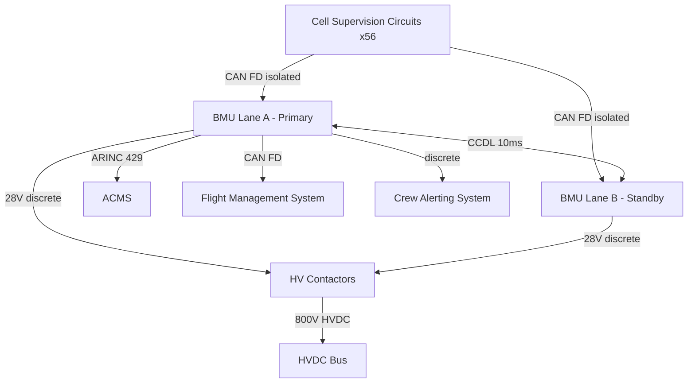
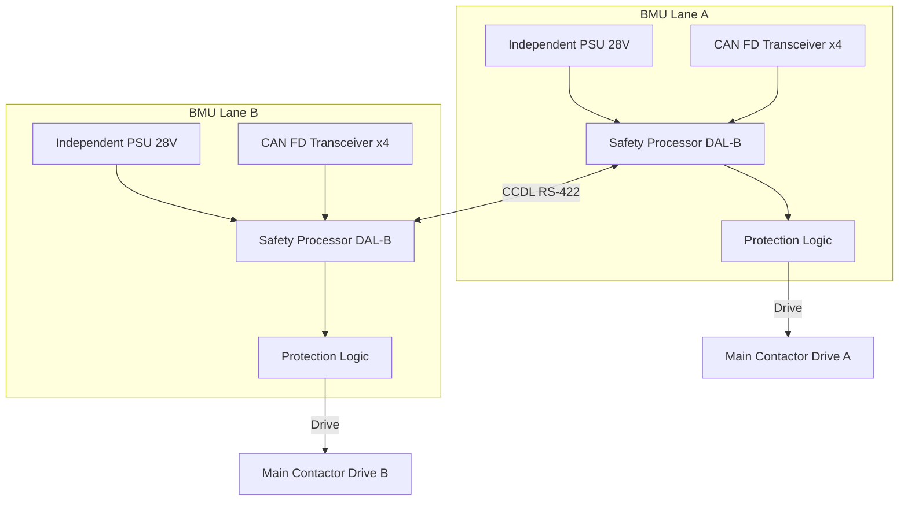

# Battery Management System (BMS)

---

## §0 Hyperlink Policy
All hyperlinks in this document are **relative**. Absolute URLs are forbidden.

## §1 Purpose
This document defines the architecture, functions, and certification requirements of the Battery Management System (BMS) for the AMPEL360E eWTW. The BMS is a DAL B dual-lane system responsible for all cell-level monitoring, pack protection, SoC/SoH estimation, contactor control, and communication with aircraft systems.

## §2 Applicability
| Aircraft | Variant | MSN Range | Effectivity |
|---|---|---|---|
| AMPEL360E | eWTW | All | From EIS |

## §3 Functional Description 
The AMPEL360E BMS is a dual-lane (Lane A / Lane B) system, each lane implemented on a dedicated Battery Management Unit (BMU) located in the avionics bay. Each BMU hosts a quad-core safety processor running BMS application software certified to DO-178C DAL B, with independent power supply, independent CAN FD communication buses to the cell supervision circuits (CSCs), and independent contactor drive outputs. Either lane can independently open the main HV contactors on detection of a fault condition.

Lane A is the primary commanding lane under normal operation; Lane B operates as a hot-standby monitor. A cross-channel data link (CCDL) between the two BMUs at 10 ms cycle rate enables continuous comparison of measured quantities. Any discrepancy exceeding defined thresholds triggers a CCDL monitor fault and transfers authority to Lane B or initiates safe isolation. The BMS also interfaces with the Aircraft Condition Monitoring System (ACMS) via ARINC 429 and with the Flight Management System (FMS) via CAN FD for energy prediction and mission planning data.

Protection functions executed by the BMS include: over-voltage protection (OVP) at cell and pack level, under-voltage protection (UVP), over-current protection (OCP), over-temperature protection (OTP), under-temperature inhibit (UTI) for charging, insulation resistance monitoring (IRM), and thermal runaway detection (TRD) based on abnormal dT/dt rate. The BMS drives the main and precharge contactors and provides the crew alerting system (CAS) with fault codes and severity levels.

## §4 Functional Breakdown
| ID | Function | Description | Owner | DAL |
|---|---|---|---|---|
| F-072-030-01 | Cell Monitoring | Acquire all cell V and T from CSCs at 100 ms | Q-HPC | DAL B |
| F-072-030-02 | SoC/SoH Estimation | Compute State of Charge and State of Health using EKF | Q-HPC | DAL B |
| F-072-030-03 | Protection Function | Execute OVP, UVP, OCP, OTP, IRM and TRD | Q-GREENTECH | DAL B |
| F-072-030-04 | Contactor Control | Command main, precharge and precharge bypass contactors | Q-GREENTECH | DAL B |
| F-072-030-05 | ACMS Reporting | Transmit SoC, SoH, fault codes and thermal data via ARINC 429 | Q-HPC | DAL C |
| F-072-030-06 | Cross-Channel Monitor | Compare Lane A/B data at 10 ms; arbitrate authority | Q-HPC | DAL B |

## §5 System Context

## §6 Internal Architecture

## §7 Components and LRUs
| LRU ID | Name | P/N | Qty | Location |
|---|---|---|---|---|
| LRU-072-030-01 | Battery Management Unit Lane A (BMU-A) | BMU-DALB-LANE-A | 1 | Avionics bay |
| LRU-072-030-02 | Battery Management Unit Lane B (BMU-B) | BMU-DALB-LANE-B | 1 | Avionics bay |
| LRU-072-030-03 | CCDL Harness Assembly | CCDL-RS422-072 | 1 | Avionics bay |
| LRU-072-030-04 | BMS ARINC 429 Coupler | COUPLER-A429-072 | 2 | Avionics bay |
| LRU-072-030-05 | BMS CAN FD Harness (per pack) | CAN-FD-072-PKG | 4 | Wing root to avionics |

## §8 Interfaces
| Interface | Source | Destination | Protocol | Notes |
|---|---|---|---|---|
| IF-072-030-01 | CSCs (56×) | BMU Lane A | CAN FD isolated | Cell V/T at 100 ms |
| IF-072-030-02 | CSCs (56×) | BMU Lane B | CAN FD isolated | Redundant path |
| IF-072-030-03 | BMU Lane A | BMU Lane B | RS-422 CCDL | 10 ms comparison cycle |
| IF-072-030-04 | BMU Lane A | HV Contactors | 28V discrete | Main + precharge drive |
| IF-072-030-05 | BMU Lane A | ACMS | ARINC 429 Rx/Tx | SoC, SoH, fault data |
| IF-072-030-06 | BMU Lane A | FMS | CAN FD | Energy prediction |
| IF-072-030-07 | BMU Lane A/B | CAS | Discrete 28V | CAUTION/WARNING |

## §9 Operating Modes
| Mode | Trigger | Description | Power State | Notes |
|---|---|---|---|---|
| Boot/BITE | Power-on | BMS self-test, sensor init, CCDL handshake | Low | ~3 s max |
| Standby | BITE pass | Monitoring active, contactors open | Low (~15 W) | Pre-flight checks |
| Pre-charge | Pilot/EMS command | Close precharge contactor, ramp bus voltage | Medium | <5 s |
| Normal Operation | Pre-charge complete | Close main contactor, full power available | Nominal | Flight mode |
| Regeneration | Braking event | Accept regen current, monitor SoC ceiling | Variable | Limited by SoC |
| Fault Isolation | Protection trigger | Open contactors, log fault, alert CAS | Zero | Latchable |
| Ground Charge | GSE/EVSE connect | Manage charge current, balancing | Controlled | SoC target |

## §10 Performance and Budgets 
| Parameter | Requirement | Current Estimate | Unit | Status |
|---|---|---|---|---|
| SoC estimation accuracy | ±3 | ±2 | % |  |
| SoH estimation accuracy | ±5 | ±4 | % |  |
| Protection response time (OVP/UVP) | ≤50 | 20 | ms |  |
| Thermal runaway detection time | ≤500 | 300 | ms |  |
| BMS power consumption | ≤30 | 25 | W (both lanes) |  |
| CCDL comparison cycle | 10 | 10 | ms |  |

## §11 Safety, Redundancy and Fault Tolerance
- Dual-lane architecture (BMU-A / BMU-B) with fully independent hardware, power and communication; either lane alone can protect and isolate the battery.
- CCDL cross-monitoring detects sensor or processing discrepancies within one comparison cycle (10 ms).
- Watchdog timers on each lane trigger safe contactor-open within 20 ms if software execution is lost.
- Protection functions implemented in hardware-enforced logic (FPGA gate layer) independent of application software; active even during software exception.
- BMS certified to DO-178C DAL B (software) and DO-254 DAL B (hardware complex electronics).

## §12 Maintenance and Diagnostics
| Task | Interval | Tool | Reference |
|---|---|---|---|
| BMS BITE self-test (automatic) | Pre-flight | Onboard automatic | AMM 072-30-01 |
| CCDL functional test | 500 FH | GSE-BMS-DIAG-01 | AMM 072-30-02 |
| Contactor drive output test | 1000 FH | GSE-BMS-DIAG-01 | AMM 072-30-03 |
| BMU software version check | A-Check | MCDU / laptop | AMM 072-30-04 |
| BMU replacement and re-qualification | On condition | Calibration rig | CMM 072-30-05 |

## §13 Footprint
| Metric | Value |
|---|---|
| BMU form factor | 3/4 ATR short |
| BMU mass | ~2.5 kg each |
| BMU power | ~15 W each lane (30 W total) |
| CAN FD buses | 4 per lane (2 per pack) |
| ARINC 429 channels | 2 Rx + 2 Tx |
| CCDL | RS-422, full duplex |

## §14 Safety and Certification References
| Standard | Requirement | Applicability | Status | Notes |
|---|---|---|---|---|
| DO-178C | Software — DAL B | BMS application software | Planned | Full MC/DC coverage |
| DO-254 | Hardware — DAL B | BMU FPGA and analog front-end | Planned | Complex electronics |
| ARP4754A | System development assurance | BMS system | Planned | FHA/PSSA/SSA |
| ARP4761 | Safety assessment | BMS FTA/FMEA | Planned | Dual-lane independence |
| CS-25 | Airworthiness | Battery system protection | Planned | CS-25.1353 |

## §15 V&V Approach
| Phase | Method | Tool/Facility | Status |
|---|---|---|---|
| Software unit test | Requirements-based, MC/DC | Static analyser + LDRA |  |
| Integration test | BMS HIL with cell simulator | HIL bench |  |
| Protection function test | Inject fault conditions | Battery simulator + GSE |  |
| Dual-lane failover test | Inhibit Lane A, verify Lane B | HIL bench |  |

## §16 Glossary
| Term | Definition |
|---|---|
| BITE | Built-In Test Equipment |
| BMU | Battery Management Unit — one lane of the dual-lane BMS |
| CAS | Crew Alerting System |
| CCDL | Cross-Channel Data Link |
| CSC | Cell Supervision Circuit |
| EKF | Extended Kalman Filter — SoC/SoH estimation algorithm |
| IRM | Insulation Resistance Monitor |
| OCP | Over-Current Protection |
| OTP | Over-Temperature Protection |
| OVP | Over-Voltage Protection |
| SoC | State of Charge |
| SoH | State of Health |
| TRD | Thermal Runaway Detection |
| UVP | Under-Voltage Protection |
| UTI | Under-Temperature Inhibit |

## §17 Open Issues
| ID | Description | Owner | Priority | Status |
|---|---|---|---|---|
| OI-072-030-001 | Select and qualify BMS supplier; confirm DAL B certification plan | @copilot | High | Open |
| OI-072-030-002 | Finalise EKF SoC algorithm with propulsion team | @copilot | Medium | Open |

## §18 Status Legend
| Badge | Meaning |
|---|---|
|  | Content under active development |
|  | Value or content to be determined |
|  | Approved and baselined |
|  | Placeholder |

## §19 Related Documents
| Code | Title | Link |
|---|---|---|
| 072-000 | Battery Energy Storage — General | [072-000-Battery-Energy-Storage-General.md](072-000-Battery-Energy-Storage-General.md) |
| 072-010 | Battery Cell and Module Design | [072-010-Battery-Cell-and-Module-Design.md](072-010-Battery-Cell-and-Module-Design.md) |
| 072-020 | Battery Pack Architecture | [072-020-Battery-Pack-Architecture.md](072-020-Battery-Pack-Architecture.md) |
| 072-040 | Battery Thermal Management | [072-040-Battery-Thermal-Management.md](072-040-Battery-Thermal-Management.md) |
| 072-050 | HV Contactors and Protection | [072-050-HV-Contactors-and-Protection.md](072-050-HV-Contactors-and-Protection.md) |
| 072-060 | Battery State Estimation | [072-060-Battery-State-Estimation.md](072-060-Battery-State-Estimation.md) |
| 072-070 | Battery Safety and Thermal Runaway Protection | [072-070-Battery-Safety-and-Thermal-Runaway-Protection.md](072-070-Battery-Safety-and-Thermal-Runaway-Protection.md) |
| 072-080 | Battery Charging and Ground Support | [072-080-Battery-Charging-and-Ground-Support.md](072-080-Battery-Charging-and-Ground-Support.md) |
| 072-090 | S1000D CSDB Mapping and Traceability | [072-090-S1000D-CSDB-Mapping-and-Traceability.md](072-090-S1000D-CSDB-Mapping-and-Traceability.md) |

## §20 Change Log
| Rev | Date | Author | Summary |
|---|---|---|---|
| 0.1 | 2026-05-12 | @copilot | Initial creation |
