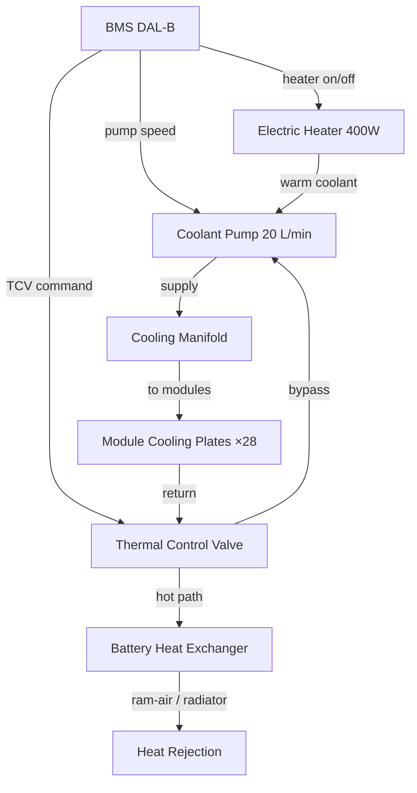
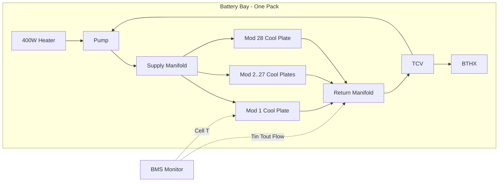

# Battery Thermal Management

---

## §0 Hyperlink Policy
All hyperlinks in this document are **relative**. Absolute URLs are forbidden.

## §1 Purpose
This document defines the thermal management architecture for the AMPEL360E eWTW battery system, covering the glycol-water cooling loop design, heating provisions, thermal control valve logic, and interfaces with the aircraft thermal management system (TMS).

## §2 Applicability
| Aircraft | Variant | MSN Range | Effectivity |
|---|---|---|---|
| AMPEL360E | eWTW | All | From EIS |

## §3 Functional Description 
The AMPEL360E battery thermal management system maintains each cell within the target operating temperature range of 20–30°C during discharge and 10–35°C during ground charging. A dedicated glycol-water (50/50 EG/water) coolant loop serves each battery pack, with coolant supplied by an electrically driven pump at a flow rate of up to 20 L/min per bay. The coolant circulates through the base cooling plates of each module, extracting up to 30 kW of heat per bay under peak discharge conditions.

Hot coolant from the battery loop is routed to a battery heat exchanger (BTHX) where heat is rejected to the aircraft ram-air circuit or to a dedicated radiator depending on ground/flight mode. Coolant temperature is regulated by a three-way thermal control valve (TCV) that blends bypass flow to maintain the target battery inlet temperature of 22°C ±3°C. An electric heater element (400 W per bay) provides pre-conditioning capability for cold-soak scenarios, activated by the BMS when cell temperature falls below 10°C before charging or high-rate discharge.

The BMS monitors inlet and outlet coolant temperatures (±0.5°C), flow rate (via flow meter), and individual cell temperatures from the CSCs. If coolant outlet temperature exceeds 40°C or cell temperature exceeds 45°C (Alarm T2), the BMS derate threshold is activated, reducing maximum discharge current. Above 55°C (Alarm T3) the BMS commands contactors open and alerts the crew.

## §4 Functional Breakdown
| ID | Function | Description | Owner | DAL |
|---|---|---|---|---|
| F-072-040-01 | Coolant Circulation | Pump glycol-water through battery module cooling plates | Q-MECHANICS | DAL C |
| F-072-040-02 | Heat Rejection | Transfer heat from battery loop to ram-air/radiator via BTHX | Q-MECHANICS | DAL C |
| F-072-040-03 | Temperature Regulation | TCV blend control to maintain 22°C ±3°C inlet | Q-MECHANICS | DAL C |
| F-072-040-04 | Cold-Soak Pre-conditioning | Electric heater activation below 10°C | Q-MECHANICS | DAL C |
| F-072-040-05 | Thermal Alarm Monitoring | BMS monitors cell T, inlet/outlet T; derate at T2, isolate at T3 | Q-HPC | DAL B |

## §5 System Context

## §6 Internal Architecture

## §7 Components and LRUs
| LRU ID | Name | P/N | Qty | Location |
|---|---|---|---|---|
| LRU-072-040-01 | Coolant Pump Assembly | PUMP-GLY-20LPM | 2 | Wing root (1 per bay) |
| LRU-072-040-02 | Battery Heat Exchanger (BTHX) | BTHX-BAT-30KW | 2 | Wing-to-fuselage junction |
| LRU-072-040-03 | Thermal Control Valve (TCV) | TCV-3WAY-072 | 2 | Wing root |
| LRU-072-040-04 | Cooling Manifold Assembly | MAN-COOL-072 | 4 | Supply + return per bay |
| LRU-072-040-05 | Electric Pre-heater Element | HTR-400W-GLY | 2 | Coolant inlet line |
| LRU-072-040-06 | Coolant Flow Meter | FLOW-GLY-20LPM | 2 | Return manifold |

## §8 Interfaces
| Interface | Source | Destination | Protocol | Notes |
|---|---|---|---|---|
| IF-072-040-01 | Coolant Pump | Module Cooling Plates | Liquid (glycol-water) | 20 L/min, 2 bar max |
| IF-072-040-02 | BTHX | Ram-Air/Radiator | Liquid/Air HX | 30 kW heat rejection |
| IF-072-040-03 | TCV | BMS | 0–10V analogue + PWM | Valve position command |
| IF-072-040-04 | Flow Meter | BMS | 4–20 mA analogue | Flow rate monitoring |
| IF-072-040-05 | Coolant Pump | BMS | PWM speed control | Variable speed drive |
| IF-072-040-06 | Pre-heater | BMS | 28V discrete | On/off command |

## §9 Operating Modes
| Mode | Trigger | Description | Coolant Temp Target | Notes |
|---|---|---|---|---|
| Cold Pre-conditioning | Cell T < 10°C | Heater active, pump low speed | Ramp to 20°C | Pre-flight |
| Normal Cooling | Discharge active | Pump full speed, TCV regulated | 22°C ±3°C inlet | Flight |
| Regen Accept | Braking event | Pump full speed, monitor dT/dt | 22°C ±3°C inlet | Short duration |
| Ground Charge | GSE/EVSE | Pump moderate speed, TCV controlled | 20–30°C | Charging |
| Thermal Derate (T2) | T_cell > 45°C | BMS derate + alarm; pump max | Active cooling max | CAS CAUTION |
| Emergency Isolation (T3) | T_cell > 55°C | BMS opens contactors | No limit — system off | CAS WARNING |

## §10 Performance and Budgets 
| Parameter | Requirement | Current Estimate | Unit | Status |
|---|---|---|---|---|
| Max heat rejection per bay | ≥30 | 30 | kW |  |
| Coolant inlet temperature (normal) | 22 ±5 | 22 ±3 | °C |  |
| Cell-to-coolant ΔT (worst case) | ≤10 | 8 | °C |  |
| Max pump flow rate | ≥18 | 20 | L/min |  |
| Pre-heater warm-up time (−20°C ambient) | ≤30 | 25 | min |  |

## §11 Safety, Redundancy and Fault Tolerance
- T2 alarm (45°C) activates current derating before approaching cell thermal limits, providing graduated response.
- T3 alarm (55°C) commands immediate contactor open; contactors rated for 800V interruption under full current.
- Coolant loss detection via flow meter; loss of flow triggers T2-equivalent derate within one BMS monitoring cycle (100 ms).
- Heater element has over-temperature fuse to prevent runaway heating if coolant flow is lost.
- Glycol-water coolant is non-flammable and compatible with battery bay materials; leak containment tray provided.

## §12 Maintenance and Diagnostics
| Task | Interval | Tool | Reference |
|---|---|---|---|
| Coolant concentration and pH check | 1000 FH / Annual | Coolant refractometer | AMM 072-40-01 |
| Coolant level check and top-up | A-Check | Visual gauge | AMM 072-40-02 |
| Pump flow rate test | 500 FH | GSE flow bench | AMM 072-40-03 |
| TCV functional check | B-Check | GSE-BMS-DIAG-01 | AMM 072-40-04 |
| BTHX external fin inspection and cleaning | C-Check | Foam cleaner kit | AMM 072-40-05 |
| Pre-heater element resistance check | Annual | DMM | AMM 072-40-06 |

## §13 Footprint
| Metric | Value |
|---|---|
| Coolant type | 50/50 EG/water (aviation grade) |
| Coolant volume (per bay) | ~8 L |
| Pump power | ~600 W per bay (max) |
| Heat rejection capacity | 30 kW per bay |
| Heater power | 400 W per bay |
| Cell target temperature range | 20–30°C (operation), 10–35°C (charge) |

## §14 Safety and Certification References
| Standard | Requirement | Applicability | Status | Notes |
|---|---|---|---|---|
| CS-25 | Flammability — coolant fluids | Glycol-water compatibility | Planned | CS-25.853 |
| ARP4754A | Safety analysis — thermal system | TMS system | Planned | FHA/PSSA |
| DO-178C | BMS firmware — thermal control DAL B | TCV/pump control software | Planned | Included in BMS |
| ARP5765 | LIB installation — thermal management | Battery thermal architecture | Planned | Guidance material |
| CS-25 | Liquid systems — leak containment | Coolant loop containment | Planned | CS-25.1183 |

## §15 V&V Approach
| Phase | Method | Tool/Facility | Status |
|---|---|---|---|
| Coolant loop flow test | Flow bench pressure drop measurement | GSE flow bench |  |
| BTHX thermal performance | Hot-flow HX calorimetry | Thermal test rig |  |
| Cold-soak pre-conditioning test | −20°C ambient soak, measure warm-up time | Environmental chamber |  |
| Thermal runaway detection test | Heater injection into single cell | Battery abuse chamber |  |

## §16 Glossary
| Term | Definition |
|---|---|
| BTHX | Battery Thermal Heat Exchanger |
| EG | Ethylene Glycol |
| T2 | Thermal Alarm Level 2 — derate threshold (45°C cell) |
| T3 | Thermal Alarm Level 3 — isolation threshold (55°C cell) |
| TCV | Thermal Control Valve — three-way blending valve |
| TMS | Aircraft Thermal Management System |
| dT/dt | Rate of temperature change — thermal runaway indicator |

## §17 Open Issues
| ID | Description | Owner | Priority | Status |
|---|---|---|---|---|
| OI-072-040-001 | Confirm BTHX size and ram-air duct integration with aerodynamics | @copilot | High | Open |
| OI-072-040-002 | Validate cold-soak pre-conditioning time at −40°C design point | @copilot | Medium | Open |

## §18 Status Legend
| Badge | Meaning |
|---|---|
|  | Content under active development |
|  | Value or content to be determined |
|  | Approved and baselined |
|  | Placeholder |

## §19 Related Documents
| Code | Title | Link |
|---|---|---|
| 072-000 | Battery Energy Storage — General | [072-000-Battery-Energy-Storage-General.md](072-000-Battery-Energy-Storage-General.md) |
| 072-020 | Battery Pack Architecture | [072-020-Battery-Pack-Architecture.md](072-020-Battery-Pack-Architecture.md) |
| 072-030 | Battery Management System (BMS) | [072-030-Battery-Management-System-BMS.md](072-030-Battery-Management-System-BMS.md) |
| 072-050 | HV Contactors and Protection | [072-050-HV-Contactors-and-Protection.md](072-050-HV-Contactors-and-Protection.md) |
| 072-070 | Battery Safety and Thermal Runaway Protection | [072-070-Battery-Safety-and-Thermal-Runaway-Protection.md](072-070-Battery-Safety-and-Thermal-Runaway-Protection.md) |
| 072-090 | S1000D CSDB Mapping and Traceability | [072-090-S1000D-CSDB-Mapping-and-Traceability.md](072-090-S1000D-CSDB-Mapping-and-Traceability.md) |

## §20 Change Log
| Rev | Date | Author | Summary |
|---|---|---|---|
| 0.1 | 2026-05-12 | @copilot | Initial creation |
