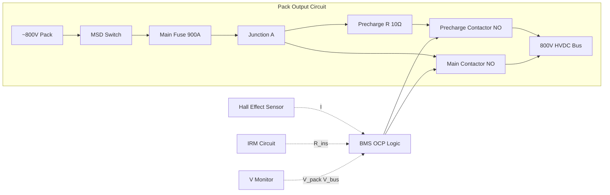

# HV Contactors and Protection


---

## §0 Hyperlink Policy
All hyperlinks in this document are **relative**. Absolute URLs are forbidden.

## §1 Purpose
This document defines the high-voltage contactor and protection architecture for the AMPEL360E eWTW battery system, covering the main contactor, precharge contactor, Manual Service Disconnect (MSD), current sensing, insulation resistance monitoring (IRM), and over-current protection (OCP) logic.

## §2 Applicability
| Aircraft | Variant | MSN Range | Effectivity |
|---|---|---|---|
| AMPEL360E | eWTW | All | From EIS |

## §3 Functional Description 
Each battery pack is interfaced to the HVDC 800 V propulsion bus through a three-stage contactor assembly: a precharge contactor in series with a current-limiting resistor, a main bypass contactor, and a manual service disconnect (MSD). The precharge sequence ramps bus voltage from near-zero to pack voltage in less than 5 seconds, preventing capacitor inrush current damage to the Battery Interface Unit (BIU) and downstream inverters. Once precharge is complete (bus voltage within 20 V of pack voltage), the BMS closes the main contactor and opens the precharge contactor.

The main contactor is a hermetically sealed vacuum interrupter rated at 800 V DC and 800 A continuous (1600 A interrupt). Coil energisation is provided by the BMS at 28 V DC; a normally-open contact configuration ensures that loss of BMS power de-energises the contactor (fail-safe open). Contact welding detection uses a voltage-across-contacts monitor; if voltage is present across a supposedly open contactor, the BMS triggers a welding fault and inhibits the opposite pack from closing.

Insulation resistance monitoring (IRM) measures the resistance between the HV bus and aircraft ground (chassis). The IRM threshold is ≥500 Ω/V (400 kΩ for the 800 V system). A reading below threshold triggers a CAS CAUTION and inhibits ground charging. At <100 Ω/V (80 kΩ) the BMS commands contactor open and alerts CAS WARNING. A Hall-effect current sensor on each pack output (±0.5% accuracy at full scale) feeds the BMS over-current protection: instantaneous OCP at 1800 A and sustained OCP at 900 A for >2 s both command contactor open.

## §4 Functional Breakdown
| ID | Function | Description | Owner | DAL |
|---|---|---|---|---|
| F-072-050-01 | Pre-charge Sequence | Ramp bus voltage via precharge R; protect BIU from inrush | Q-GREENTECH | DAL B |
| F-072-050-02 | Main Contactor Control | Open/close main HV path on BMS command | Q-GREENTECH | DAL B |
| F-072-050-03 | Contact Weld Detection | Monitor voltage across contacts; detect welding | Q-HPC | DAL B |
| F-072-050-04 | Insulation Resistance Monitor | Measure HV-to-chassis resistance; alert and isolate on fault | Q-GREENTECH | DAL B |
| F-072-050-05 | Over-Current Protection | Detect instantaneous/sustained OCP; command contactor open | Q-GREENTECH | DAL B |
| F-072-050-06 | Manual Service Disconnect | Mechanic-actuated HV isolation; LOTO capable | Q-MECHANICS | DAL C |

## §5 System Context
```mermaid
graph TD
    PACK[Battery Pack ~800V] --> MSD[Manual Service Disconnect]
    MSD --> PRECHARGE_R[Precharge Resistor 10Ω]
    PRECHARGE_R --> PRECHARGE_C[Precharge Contactor]
    MSD --> MAIN_C[Main Contactor]
    PRECHARGE_C --> BUS[HVDC Bus 800V]
    MAIN_C --> BUS
    ISENS[Hall Effect Current Sensor] -->|±0.5%| BMS[BMS DAL-B]
    IRM[Insulation Monitor] -->|HV-chassis R| BMS
    VMON[Voltage Monitor| BMS
    BMS -->|28V coil| PRECHARGE_C
    BMS -->|28V coil| MAIN_C
    BMS -->|discrete| CAS[CAS]
```

## §6 Internal Architecture


## §7 Components and LRUs
| LRU ID | Name | P/N | Qty | Location |
|---|---|---|---|---|
| LRU-072-050-01 | Main HV Contactor (800V/800A) | CONT-VAC-800V-800A | 2 | Pack output box |
| LRU-072-050-02 | Precharge Contactor (800V/50A) | CONT-PC-800V-50A | 2 | Pack output box |
| LRU-072-050-03 | Precharge Resistor 10Ω/5kW | RES-PC-10R-5KW | 2 | Pack output box |
| LRU-072-050-04 | Manual Service Disconnect | MSD-800V-LOTO | 2 | Lower wing panel |
| LRU-072-050-05 | Hall-Effect Current Sensor | ISENS-800V-1800A | 2 | Pack output cable |
| LRU-072-050-06 | Insulation Resistance Monitor | IRM-800V-DAL-B | 2 | Pack output box |
| LRU-072-050-07 | Pack Voltage Monitor Board | VMON-800V-072 | 2 | Pack output box |

## §8 Interfaces
| Interface | Source | Destination | Protocol | Notes |
|---|---|---|---|---|
| IF-072-050-01 | BMS Lane A | Main Contactor coil | 28V discrete | Fail-safe open |
| IF-072-050-02 | BMS Lane B | Main Contactor coil | 28V discrete | Redundant drive |
| IF-072-050-03 | BMS Lane A | Precharge Contactor coil | 28V discrete | Precharge sequence |
| IF-072-050-04 | Current Sensor | BMS Lane A/B | Analogue 0–5V | ±0.5% full-scale |
| IF-072-050-05 | IRM | BMS Lane A | Analogue 4–20 mA | Insulation resistance |
| IF-072-050-06 | Voltage Monitor | BMS Lane A/B | Analogue 0–5V | Pack and bus voltage |
| IF-072-050-07 | MSD | Maintenance personnel | Mechanical | LOTO padlock hasp |

## §9 Operating Modes
| Mode | Trigger | Description | Contactor State | Notes |
|---|---|---|---|---|
| Isolated (Safe-to-work) | MSD open | No HV present anywhere downstream | All open | Ground maintenance |
| Standby | BMS powered, MSD closed | IRM and voltage monitoring active | Main + PC open | Pre-flight |
| Pre-charge | Power-on command | PC closes, bus ramps via precharge R | PC closed, main open | <5 s |
| Normal Operation | Pre-charge complete | Main closes, PC opens | Main closed | Flight and ground charge |
| Fault Isolation | OCP / IRM / TR event | BMS opens main contactor | Main open | Logged, CAS alert |
| Weld Fault | Weld detected | Inhibit opposite pack | N/A | CAS WARNING |

## §10 Performance and Budgets 
| Parameter | Requirement | Current Estimate | Unit | Status |
|---|---|---|---|---|
| Main contactor interrupt rating | ≥800 | 800 | V DC |  |
| Main contactor continuous current | ≥600 | 800 | A |  |
| Pre-charge time (0 to ~800V) | ≤5 | 3–5 | s |  |
| OCP response (instantaneous, 1800A) | ≤20 | 10 | ms |  |
| IRM lower threshold (warning) | 500 Ω/V | 500 Ω/V (400 kΩ) | — |  |
| IRM isolation threshold | 100 Ω/V | 100 Ω/V (80 kΩ) | — |  |

## §11 Safety, Redundancy and Fault Tolerance
- Fail-safe open contactor design: loss of BMS power or coil supply de-energises contactor to open state.
- Dual-lane BMS provides independent coil drive; either lane alone can open the contactor.
- Contact weld detection prevents a welded contactor from being ignored; affected pack inhibited until rectified.
- MSD provides a tool-free, LOTO-capable mechanic isolation point independent of BMS.
- IRM provides graduated warning (CAUTION) before hard isolation (WARNING), allowing planned landing.

## §12 Maintenance and Diagnostics
| Task | Interval | Tool | Reference |
|---|---|---|---|
| Contactor contact resistance (DLRO) | 1000 FH | DLRO micro-ohmmeter | AMM 072-50-01 |
| Precharge resistor value check | 500 FH | DMM | AMM 072-50-02 |
| IRM functional test | A-Check | GSE-IRM-TEST-072 | AMM 072-50-03 |
| MSD torque and continuity check | Annual / C-Check | Torque wrench + DMM | AMM 072-50-04 |
| Current sensor calibration | 2000 FH | Current calibrator | CMM 072-50-05 |

## §13 Footprint
| Metric | Value |
|---|---|
| Main contactor form factor | Hermetic vacuum interrupter |
| Main contactor mass | ~0.9 kg each |
| Precharge resistor rating | 10 Ω, 5 kW peak |
| MSD type | Plug-pull with padlock hasp |
| IRM cycle rate | 1 Hz continuous |
| Current sensor bandwidth | 10 kHz |

## §14 Safety and Certification References
| Standard | Requirement | Applicability | Status | Notes |
|---|---|---|---|---|
| DO-178C | BMS firmware — OCP/IRM logic DAL B | Contactor control software | Planned | Included in BMS SW |
| DO-254 | BMS hardware — contactor drive DAL B | Coil drive circuitry | Planned | Included in BMU HW |
| ARP4754A | Safety analysis — isolation function | Contactor system | Planned | FHA/PSSA |
| CS-25 | Electrical — HV installation | HV wiring and protection | Planned | CS-25.1353 |
| IEC 60947 | Low/HV contactor ratings | Contactor qualification | Planned | Supplier compliance |

## §15 V&V Approach
| Phase | Method | Tool/Facility | Status |
|---|---|---|---|
| Pre-charge sequence test | Timed bus ramp with capacitive load | HV bench |  |
| OCP response time test | Inject overcurrent pulse, measure trip time | Current injector + scope |  |
| IRM calibration verification | Inject known R_insulation, verify BMS reading | IRM calibrator |  |
| Weld detection test | Mechanically weld contact, verify BMS fault | HV test rig |  |

## §16 Glossary
| Term | Definition |
|---|---|
| BIU | Battery Interface Unit |
| CAS | Crew Alerting System |
| DLRO | Digital Low Resistance Ohmmeter |
| IRM | Insulation Resistance Monitor |
| LOTO | Lock-Out / Tag-Out — safety isolation procedure |
| MSD | Manual Service Disconnect |
| NO | Normally Open — contact state when coil is de-energised |
| OCP | Over-Current Protection |
| PC | Precharge Contactor |

## §17 Open Issues
| ID | Description | Owner | Priority | Status |
|---|---|---|---|---|
| OI-072-050-001 | Confirm main contactor supplier and qualification status | @copilot | High | Open |
| OI-072-050-002 | Validate precharge resistor sizing for worst-case bus capacitance | @copilot | Medium | Open |

## §18 Status Legend
| Badge | Meaning |
|---|---|
|  | Content under active development |
|  | Value or content to be determined |
|  | Approved and baselined |
|  | Placeholder |

## §19 Related Documents
| Code | Title | Link |
|---|---|---|
| 072-000 | Battery Energy Storage — General | [072-000-Battery-Energy-Storage-General.md](072-000-Battery-Energy-Storage-General.md) |
| 072-020 | Battery Pack Architecture | [072-020-Battery-Pack-Architecture.md](072-020-Battery-Pack-Architecture.md) |
| 072-030 | Battery Management System (BMS) | [072-030-Battery-Management-System-BMS.md](072-030-Battery-Management-System-BMS.md) |
| 072-060 | Battery State Estimation | [072-060-Battery-State-Estimation.md](072-060-Battery-State-Estimation.md) |
| 072-070 | Battery Safety and Thermal Runaway Protection | [072-070-Battery-Safety-and-Thermal-Runaway-Protection.md](072-070-Battery-Safety-and-Thermal-Runaway-Protection.md) |
| 072-090 | S1000D CSDB Mapping and Traceability | [072-090-S1000D-CSDB-Mapping-and-Traceability.md](072-090-S1000D-CSDB-Mapping-and-Traceability.md) |

## §20 Change Log
| Rev | Date | Author | Summary |
|---|---|---|---|
| 0.1 | 2026-05-12 | @copilot | Initial creation |
