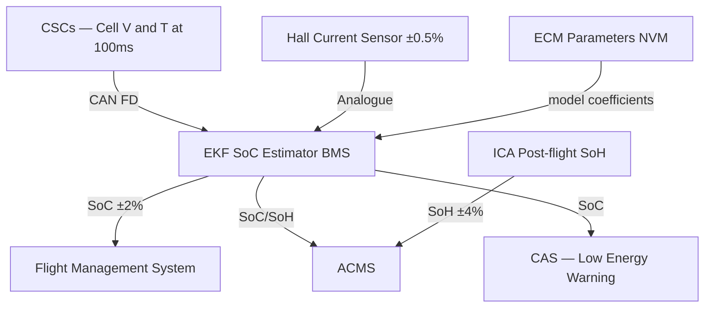

# Battery State Estimation


---

## §0 Hyperlink Policy
All hyperlinks in this document are **relative**. Absolute URLs are forbidden.

## §1 Purpose
This document defines the State of Charge (SoC) and State of Health (SoH) estimation algorithms and architectures used by the AMPEL360E eWTW Battery Management System. It covers the Extended Kalman Filter (EKF) algorithm design, input data sources, output accuracy requirements, and integration with flight and energy management systems.

## §2 Applicability
| Aircraft | Variant | MSN Range | Effectivity |
|---|---|---|---|
| AMPEL360E | eWTW | All | From EIS |

## §3 Functional Description 
The AMPEL360E BMS implements a dual Extended Kalman Filter (EKF) for real-time SoC estimation — one instance per BMS lane — operating on a combined equivalent circuit model (ECM) of the NMC 811 cell. The ECM is parameterised using electrochemical impedance spectroscopy (EIS) data collected during factory characterisation across the full temperature (−20°C to +50°C) and SoC (0–100%) range, with model coefficients stored in non-volatile memory on each BMU.

The EKF fuses three measurement streams at a 100 ms cycle rate: cell terminal voltage (from CSC, ±2 mV), pack current (from Hall-effect sensor, ±0.5%), and cell temperature (from CSC NTC thermistor, ±1°C). The observer corrects the coulomb-counting integrator for Coulombic efficiency variation, temperature-dependent capacity fade, and sensor drift. SoC estimation accuracy is targeted at ±2% RMS over the full operating envelope from EIS to aircraft EIS date.

State of Health is computed at a slower timescale (post-flight, and during extended ground periods) using an incremental capacity analysis (ICA) algorithm applied to slow-rate charge data, complemented by internal resistance tracking from the EKF noise covariance matrices. SoH is defined as the ratio of measured capacity to nameplate capacity, reported as a percentage with ±4% accuracy. When SoH falls below 80%, the BMS generates a maintenance alert via ACMS to schedule module replacement.

SoC and SoH values, along with confidence intervals and data quality flags, are transmitted to the Flight Management System (FMS) at 1 Hz via CAN FD to support energy-optimised routing and to the ACMS for trend monitoring and maintenance planning.

## §4 Functional Breakdown
| ID | Function | Description | Owner | DAL |
|---|---|---|---|---|
| F-072-060-01 | SoC Estimation (EKF) | Real-time SoC via dual EKF on ECM | Q-HPC | DAL B |
| F-072-060-02 | SoH Estimation (ICA) | Post-flight SoH via incremental capacity analysis | Q-HPC | DAL C |
| F-072-060-03 | Model Parameter Management | Store and update ECM coefficients in NVM | Q-HPC | DAL C |
| F-072-060-04 | Data Fusion | Fuse voltage, current, temperature at 100 ms | Q-HPC | DAL B |
| F-072-060-05 | FMS / ACMS Reporting | Output SoC, SoH, confidence, flags via CAN FD / ARINC 429 | Q-HPC | DAL C |

## §5 System Context


## §6 Internal Architecture
```mermaid
graph TD
    subgraph EKF_ENGINE[EKF Engine — per lane]
        COULOMB[Coulomb Counter] -->|integrated Q| STATE_EST[State Estimator]
        ECM_PRED[ECM Predictor] -->|V_model| INNOV[Innovation Term]
        CELL_V[Cell Voltage Meas] -->|V_meas| INNOV
        INNOV -->|correction| STATE_EST
        TEMP_COMP[Temperature Compensation] -->|Q(T)| STATE_EST
        STATE_EST -->|SoC, variance| OUTPUT[SoC Output]
    end
    NVM_PARAMS[ECM NVM Params] --> ECM_PRED
    TEMP_COMP <-- TEMP_MEAS[Cell Temperature CSC]
```

## §7 Components and LRUs
| LRU ID | Name | P/N | Qty | Location |
|---|---|---|---|---|
| LRU-072-060-01 | BMU Lane A (EKF host) | BMU-DALB-LANE-A | 1 | Avionics bay |
| LRU-072-060-02 | BMU Lane B (EKF host) | BMU-DALB-LANE-B | 1 | Avionics bay |
| LRU-072-060-03 | EIS Analyser Kit (GSE) | GSE-EIS-ANALYSER | 1 | Line maintenance kit |

## §8 Interfaces
| Interface | Source | Destination | Protocol | Notes |
|---|---|---|---|---|
| IF-072-060-01 | CSC (56×) | BMU EKF | CAN FD | Cell V/T at 100 ms |
| IF-072-060-02 | Current Sensor | BMU EKF | Analogue 0–5V | Pack current |
| IF-072-060-03 | ECM NVM | BMU EKF | Internal | Model coefficients |
| IF-072-060-04 | BMU EKF | FMS | CAN FD 1 Hz | SoC, confidence, flags |
| IF-072-060-05 | BMU EKF | ACMS | ARINC 429 | SoC, SoH, maintenance alerts |

## §9 Operating Modes
| Mode | Trigger | Description | SoC Update Rate | Notes |
|---|---|---|---|---|
| Normal Estimation | In-flight / on-ground | EKF running at 100 ms cycle | 100 ms | Primary mode |
| SoH Computation | Post-flight / slow charge | ICA analysis on buffered data | On-demand | Requires slow charge profile |
| Model Update | Maintenance action | EIS scan, update ECM NVM | On-demand (maintenance) | Requires GSE |
| Degraded | CSC fault | EKF on remaining healthy cells | 100 ms (reduced accuracy) | CAS CAUTION |

## §10 Performance and Budgets 
| Parameter | Requirement | Current Estimate | Unit | Status |
|---|---|---|---|---|
| SoC accuracy (RMS, full envelope) | ±3 | ±2 | % |  |
| SoC accuracy (worst case, −20°C) | ±5 | ±4 | % |  |
| SoH accuracy | ±5 | ±4 | % |  |
| EKF cycle time | ≤100 | 100 | ms |  |
| SoC update to FMS | 1 Hz | 1 Hz | — |  |

## §11 Safety, Redundancy and Fault Tolerance
- Dual EKF instances (one per BMS lane) provide independent SoC estimates; cross-lane discrepancy > ±5% triggers a data quality flag.
- Coulomb counting backup operates continuously as a fallback; EKF correction is suspended if sensor data quality is flagged as unreliable.
- ECM parameter NVM is write-protected in flight; updates only permitted during maintenance mode with GSE authorisation.
- Low SoC warning issued at 15% SoC; low SoC protection threshold at 5% SoC forces minimum power derate.

## §12 Maintenance and Diagnostics
| Task | Interval | Tool | Reference |
|---|---|---|---|
| SoC accuracy validation (GSE charge/discharge cycle) | 2000 FH | GSE charge rig | CMM 072-60-01 |
| ECM parameter update (EIS scan) | 5000 FH / on-condition | GSE-EIS-ANALYSER | CMM 072-60-02 |
| SoH trend review via ACMS | Per-flight (automatic) | ACMS ground station | AMM 072-60-03 |
| BMU NVM integrity check | A-Check | MCDU / laptop | AMM 072-60-04 |

## §13 Footprint
| Metric | Value |
|---|---|
| EKF algorithm | Dual-lane ECM-based EKF |
| ECM model | 2RC equivalent circuit (temperature-parameterised) |
| SoC update rate | 100 ms |
| SoH method | Incremental Capacity Analysis (ICA) |
| NVM storage | 512 kB per BMU (ECM parameters) |
| FMS output rate | 1 Hz |

## §14 Safety and Certification References
| Standard | Requirement | Applicability | Status | Notes |
|---|---|---|---|---|
| DO-178C | SoC algorithm software — DAL B | EKF and protection logic | Planned | MC/DC coverage |
| ARP4754A | System safety — estimation function | SoC/SoH function | Planned | FHA contribution |
| ED-79A | System development | Avionics integration | Planned | EASA compliance |
| CS-25 | Energy management | Battery state reporting to FMS | Planned | CS-25.1353 |

## §15 V&V Approach
| Phase | Method | Tool/Facility | Status |
|---|---|---|---|
| SoC algorithm unit test | Known-profile charge/discharge versus reference | Cell test lab |  |
| SoC accuracy at temperature | −20°C, 0°C, 25°C, 50°C profiles | Environmental chamber |  |
| SoH ICA validation | Cycle-aged cells; compare ICA output vs. capacity test | Cell ageing lab |  |
| Integration test | BMS HIL with simulated cell V/T/I | HIL bench |  |

## §16 Glossary
| Term | Definition |
|---|---|
| ACMS | Aircraft Condition Monitoring System |
| ECM | Equivalent Circuit Model of battery cell |
| EIS | Electrochemical Impedance Spectroscopy |
| EKF | Extended Kalman Filter |
| ICA | Incremental Capacity Analysis |
| NVM | Non-Volatile Memory |
| SoC | State of Charge |
| SoH | State of Health |
| 2RC | Two RC-branch equivalent circuit model |

## §17 Open Issues
| ID | Description | Owner | Priority | Status |
|---|---|---|---|---|
| OI-072-060-001 | Complete ECM parameterisation from cell supplier data | @copilot | High | Open |
| OI-072-060-002 | Define SoC accuracy degradation criteria at end-of-life | @copilot | Medium | Open |

## §18 Status Legend
| Badge | Meaning |
|---|---|
|  | Content under active development |
|  | Value or content to be determined |
|  | Approved and baselined |
|  | Placeholder |

## §19 Related Documents
| Code | Title | Link |
|---|---|---|
| 072-000 | Battery Energy Storage — General | [072-000-Battery-Energy-Storage-General.md](072-000-Battery-Energy-Storage-General.md) |
| 072-010 | Battery Cell and Module Design | [072-010-Battery-Cell-and-Module-Design.md](072-010-Battery-Cell-and-Module-Design.md) |
| 072-030 | Battery Management System (BMS) | [072-030-Battery-Management-System-BMS.md](072-030-Battery-Management-System-BMS.md) |
| 072-050 | HV Contactors and Protection | [072-050-HV-Contactors-and-Protection.md](072-050-HV-Contactors-and-Protection.md) |
| 072-080 | Battery Charging and Ground Support | [072-080-Battery-Charging-and-Ground-Support.md](072-080-Battery-Charging-and-Ground-Support.md) |
| 072-090 | S1000D CSDB Mapping and Traceability | [072-090-S1000D-CSDB-Mapping-and-Traceability.md](072-090-S1000D-CSDB-Mapping-and-Traceability.md) |

## §20 Change Log
| Rev | Date | Author | Summary |
|---|---|---|---|
| 0.1 | 2026-05-12 | @copilot | Initial creation |
