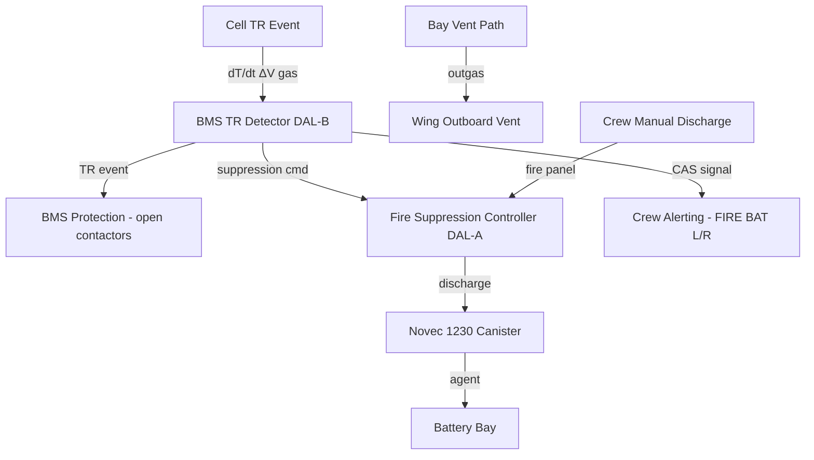
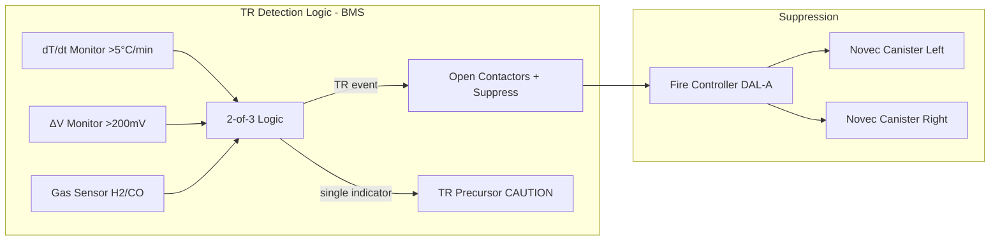

# Battery Safety and Thermal Runaway Protection

---

## §0 Hyperlink Policy
All hyperlinks in this document are **relative**. Absolute URLs are forbidden.

## §1 Purpose

This document defines the agnostic ATLAS standard-level architecture context for `Battery Safety and Thermal Runaway Protection`.

It describes the controlled scope, functions, interfaces, safety considerations, lifecycle traceability, and S1000D/CSDB mapping logic that programme implementations shall instantiate when this node is applicable.

This document is not a programme design baseline. Programme-specific capacities, locations, part numbers, effectivity, operating limits, maintenance references, and data module codes shall be defined only inside the applicable programme implementation branch.
## §2 Applicability

| Applicability Level | Rule |
|---|---|
| Standard taxonomy | Applies to the ATLAS node `072` |
| Programme implementation | Conditional; determined by programme architecture, trade studies, certification basis, and applicability model |
| Product configuration | Defined in the programme-specific configuration baseline |
| Effectivity | Defined in the programme CSDB / applicability layer |
| Non-applicability | Must be explicitly stated in the programme impact-study branch when excluded |
## §3 Functional Description 
Thermal runaway (TR) is the primary catastrophic hazard for lithium-ion battery systems. The [PROGRAMME-AIRCRAFT] battery safety architecture applies a three-barrier defence-in-depth strategy: prevention, detection and suppression, and containment.

**Prevention** is achieved through the BMS protection functions (OVP, UVP, OCP, OTP) that maintain each cell within its safe operating area (SOA), and through the thermal management system that maintains cell temperature within the 20–30°C target range. Additionally, cell-to-cell mechanical compression and module-level containment housings rated to prevent single-cell TR propagation per IEC 62619 are applied.

**Detection** uses a multi-modal approach executed by the BMS within a 100 ms monitoring cycle: (1) abnormal cell temperature rate (dT/dt > 5°C/min on any single cell), (2) abnormal voltage drop on a single cell (ΔV > 200 mV from pack mean), and (3) optional electrolyte gas sensing (H₂/CO) via a gas sensor in each bay enclosure. Any two independent indicators trigger a TR event response; a single indicator triggers a TR precursor alert.

**Suppression** uses a dedicated Halon 1301 replacement agent (Novec 1230 or equivalent) stored in a compressed canister in each battery bay. Automatic discharge is triggered by the BMS on TR event detection. A manual discharge capability is provided at the fire panel on the flight deck. The suppression system is sized for a 30-second hold time in the battery bay volume.

**Containment** is provided by the module housing (aluminium with fire-resistant intumescent liner) and the bay enclosure (CFRP with fireproof sealing). Outgassing from any TR event is channelled through dedicated vent paths (see 072-020) to the wing lower surface outboard vent, away from the fuselage and engine intakes.

## §4 Functional Breakdown
| ID | Function | Description | Owner | DAL |
|---|---|---|---|---|
| F-072-070-01 | TR Prevention | BMS SOA enforcement (OVP, UVP, OCP, OTP) | Q-GREENTECH | DAL B |
| F-072-070-02 | TR Detection | Multi-modal dT/dt, ΔV and gas sensing; 100 ms | Q-HPC | DAL B |
| F-072-070-03 | TR Suppression Actuation | Auto / manual Novec 1230 discharge | Q-AIR | DAL A |
| F-072-070-04 | TR Propagation Containment | Module housing TR containment per IEC 62619 | Q-MECHANICS | DAL C |
| F-072-070-05 | Outgas Venting | Channel TR gases to outboard vent, away from fuselage | Q-MECHANICS | DAL C |
| F-072-070-06 | Crew Alerting and Procedures | CAS FIRE warning; QRH actions | Q-AIR | DAL A |

## §5 System Context

## §6 Internal Architecture

## §7 Components and LRUs
| LRU ID | Name | P/N | Qty | Location |
|---|---|---|---|---|
| LRU-072-070-01 | Novec 1230 Suppression Canister | CANSTR-NOV1230-072 | 2 | Battery bay (1 per bay) |
| LRU-072-070-02 | Fire Suppression Controller | FSC-DAL-A-072 | 1 | Avionics bay |
| LRU-072-070-03 | Gas Sensor (H₂/CO) | GAS-SENS-H2CO-072 | 2 | Bay enclosure (1 per bay) |
| LRU-072-070-04 | Manual Discharge Switch | FIRE-SW-BAT-072 | 1 | Fire panel, flight deck |
| LRU-072-070-05 | Bay Vent Duct Assembly | VENT-DUCT-BAT-072 | 2 | Wing lower surface |

## §8 Interfaces
| Interface | Source | Destination | Protocol | Notes |
|---|---|---|---|---|
| IF-072-070-01 | BMS TR Detector | Fire Suppression Controller | 28V discrete | TR event command |
| IF-072-070-02 | Gas Sensor | BMS | 4–20 mA analogue | H₂/CO concentration |
| IF-072-070-03 | Fire Suppression Controller | Novec Canister | Squib / solenoid | Auto discharge |
| IF-072-070-04 | Manual Discharge Switch | Fire Suppression Controller | 28V discrete | Flight deck |
| IF-072-070-05 | BMS TR Detector | CAS | 28V discrete | FIRE BAT L/R warning |

## §9 Operating Modes
| Mode | Trigger | Description | Crew Action | Notes |
|---|---|---|---|---|
| Normal | All parameters in SOA | BMS monitoring, no alerts | None | Baseline |
| TR Precursor | Single indicator exceeded | CAS CAUTION BAT TEMP / BAT VOLT | Monitor; follow QRH | Inhibit max discharge |
| TR Event | 2-of-3 indicators | Auto contactor open + auto suppression | QRH BAT FIRE; manual discharge if needed | CAS FIRE BAT L/R |
| Post-Suppression | Discharge complete | Agent hold time 30 s; bay isolated | QRH continuation | Land ASAP |

## §10 Performance and Budgets 
| Parameter | Requirement | Current Estimate | Unit | Status |
|---|---|---|---|---|
| TR detection time (from onset) | ≤500 | 300 | ms |  |
| Suppression agent hold time | ≥30 | 30 | s |  |
| Cell-to-cell TR propagation | No propagation | Per IEC 62619 | — |  |
| dT/dt detection threshold | 5 | 5 | °C/min |  |
| ΔV detection threshold | 200 | 200 | mV |  |

## §11 Safety, Redundancy and Fault Tolerance
- 2-of-3 detection logic reduces false positive rate while maintaining rapid response to genuine TR events.
- Fire Suppression Controller (FSC) is certified DAL A, independent of BMS; can be commanded by either flight crew manually if BMS auto-command fails.
- Module housing TR containment validated per IEC 62619 to prevent cell-to-cell propagation; limits event to single module.
- All bay materials (enclosure, wiring, insulation) are fire-resistant per CS-25.853 Class C minimum.
- Vent path designed and CFD-validated to prevent flammable gas accumulation inside aircraft fuselage or re-ingestion by engines.

## §12 Maintenance and Diagnostics
| Task | Interval | Tool | Reference |
|---|---|---|---|
| Gas sensor calibration | 1000 FH / Annual | Gas calibration kit | AMM [NODE]-[TASK] |
| Suppression canister pressure check | A-Check | Pressure gauge | AMM [NODE]-[TASK] |
| Suppression canister replacement | Per manufacturer life / on actuation | None (LRU swap) | AMM [NODE]-[TASK] |
| Fire panel switch functional test | A-Check | GSE-FIRE-TEST-072 | AMM [NODE]-[TASK] |
| Bay vent path inspection | C-Check | Visual / borescope | AMM [NODE]-[TASK] |
| LOTO procedure training | Per personnel certification | — | OMM 072-70-06 |

## §13 Footprint
| Metric | Value |
|---|---|
| Suppression agent | Novec 1230 (or equivalent Halon 1301 replacement) |
| Canister quantity | 1 per bay (2 total) |
| Hold time | 30 s |
| Gas sensors | H₂ and CO (1 dual-gas unit per bay) |
| Detection threshold dT/dt | 5°C/min |
| Detection threshold ΔV | 200 mV |

## §14 Safety and Certification References
| Standard | Requirement | Applicability | Status | Notes |
|---|---|---|---|---|
| CS-25 | Fire protection — battery | Bay fire suppression | Planned | CS-25.863 |
| CS-25 | Flammability — materials | Bay structure and wiring | Planned | CS-25.853 |
| IEC 62619 | LIB safety — TR propagation | Module TR containment | Planned | Cell/module level |
| ARP5765 | LIB installation guidance | Battery bay design | Planned | Guidance material |
| DO-178C | FSC software — DAL A | Fire suppression logic | Planned | Highest criticality |
| ARP4761 | Safety assessment | TR event FTA/FMEA | Planned | Catastrophic hazard |

## §15 V&V Approach
| Phase | Method | Tool/Facility | Status |
|---|---|---|---|
| Cell-level TR abuse test | Nail penetration, overcharge per IEC 62619 | Abuse test chamber |  |
| Module TR propagation test | Single-cell TR induced; observe propagation | Battery abuse chamber |  |
| Detection latency test | Inject TR signature, measure BMS response time | HIL bench |  |
| Suppression system actuation test | Full system discharge, measure hold time | Bay mock-up |  |

## §16 Glossary
| Term | Definition |
|---|---|
| CAS | Crew Alerting System |
| CFRP | Carbon Fibre Reinforced Polymer |
| FSC | Fire Suppression Controller |
| LOTO | Lock-Out / Tag-Out |
| QRH | Quick Reference Handbook |
| SOA | Safe Operating Area |
| TR | Thermal Runaway |
| dT/dt | Rate of temperature change — primary TR detection metric |

## §17 Open Issues
| ID | Description | Owner | Priority | Status |
|---|---|---|---|---|
| OI-072-070-001 | Confirm Novec 1230 supply chain availability; evaluate alternatives | @copilot | High | Open |
| OI-072-070-002 | Complete CFD analysis of vent path to verify no gas re-ingestion | @copilot | High | Open |

## §18 Status Legend
| Badge | Meaning |
|---|---|
|  | Content under active development |
|  | Value or content to be determined |
|  | Approved and baselined |
|  | Placeholder |

## §19 Related Documents
| Code | Title | Link |
|---|---|---|
| 072-000 | Battery Energy Storage — General | [072-000-Battery-Energy-Storage-General.md](072-000-Battery-Energy-Storage-General.md) |
| 072-030 | Battery Management System (BMS) | [072-030-Battery-Management-System-BMS.md](072-030-Battery-Management-System-BMS.md) |
| 072-040 | Battery Thermal Management | [072-040-Battery-Thermal-Management.md](072-040-Battery-Thermal-Management.md) |
| 072-050 | HV Contactors and Protection | [072-050-HV-Contactors-and-Protection.md](072-050-HV-Contactors-and-Protection.md) |
| 072-080 | Battery Charging and Ground Support | [072-080-Battery-Charging-and-Ground-Support.md](072-080-Battery-Charging-and-Ground-Support.md) |
| 072-090 | S1000D CSDB Mapping and Traceability | [072-090-S1000D-CSDB-Mapping-and-Traceability.md](072-090-S1000D-CSDB-Mapping-and-Traceability.md) |

## §20 Change Log
| Rev | Date | Author | Summary |
|---|---|---|---|
| 0.1 | 2026-05-12 | @copilot | Initial creation |
