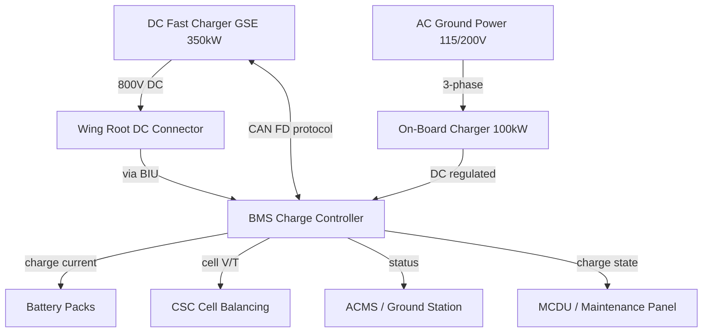
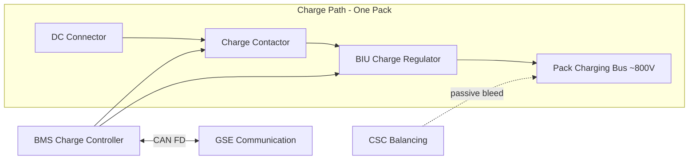

# Battery Charging and Ground Support

---

## §0 Hyperlink Policy
All hyperlinks in this document are **relative**. Absolute URLs are forbidden.

## §1 Purpose
This document defines the ground charging architecture, procedures, and ground support equipment (GSE) requirements for the AMPEL360E eWTW battery system, covering DC fast charging, AC charging, regenerative energy acceptance, cell balancing, and turnaround time requirements.

## §2 Applicability
| Aircraft | Variant | MSN Range | Effectivity |
|---|---|---|---|
| AMPEL360E | eWTW | All | From EIS |

## §3 Functional Description 
The AMPEL360E supports two ground charging modes: DC fast charging via a dedicated Ground Support Equipment (GSE) DC charger, and AC charging via an on-board charger (OBC) connected to standard airport AC ground power. In both cases, charge power flows through the Battery Interface Unit (BIU) which performs voltage conversion and current regulation under BMS supervision.

**DC Fast Charging** uses a GSE-provided DC source at up to 800 V / 350 kW (per pack, 700 kW total aircraft), connected to the aircraft via a high-power DC connector on each wing root. The BMS negotiates charge parameters with the GSE via a CAN FD communication link (CCS2 / CHAdeMO-equivalent protocol adapted for aviation). Charge current is regulated to maintain cell temperature within the 10–35°C target range; above 35°C, charge current is derated. The BMS controls the charging contactors and terminates charge when target SoC (default 95%) or cell balance threshold is reached.

**AC Charging** uses standard 400 Hz or 50/60 Hz AC ground power (115/200V 3-phase) fed into the on-board charger which converts to DC at up to 100 kW total. This mode is used for overnight top-up or maintenance charging. The OBC includes active power factor correction (PFC) and galvanic isolation.

**Cell Balancing** is performed during the constant-voltage (CV) tail phase of charging, using passive balancing (resistive bleed) on the CSC to equalize cell voltages to within ±10 mV across the pack. Active balancing is reserved for a future upgrade path.

**Turnaround Time** target is ≤45 minutes to charge from minimum operational reserve (15% SoC) to 95% SoC at full DC fast charge power.

## §4 Functional Breakdown
| ID | Function | Description | Owner | DAL |
|---|---|---|---|---|
| F-072-080-01 | DC Fast Charging | Negotiate and control up to 350 kW DC per pack | Q-GREENTECH | DAL B |
| F-072-080-02 | AC Charging (OBC) | Convert AC ground power to controlled DC charge | Q-INDUSTRY | DAL C |
| F-072-080-03 | Charge Contactor Control | Manage charge path contactors under BMS supervision | Q-GREENTECH | DAL B |
| F-072-080-04 | Cell Balancing | Passive balance via CSC resistive bleed during CV phase | Q-HPC | DAL C |
| F-072-080-05 | Charge Termination | Terminate at target SoC, temperature limit or fault | Q-GREENTECH | DAL B |
| F-072-080-06 | GSE Communication | CAN FD charge negotiation protocol | Q-HPC | DAL C |

## §5 System Context

## §6 Internal Architecture

## §7 Components and LRUs
| LRU ID | Name | P/N | Qty | Location |
|---|---|---|---|---|
| LRU-072-080-01 | Wing Root DC Charge Connector | CONN-DC-800V-072 | 2 | Wing root (1 per bay) |
| LRU-072-080-02 | On-Board Charger (OBC) | OBC-AC-100KW-072 | 1 | Avionics/equipment bay |
| LRU-072-080-03 | Charge Path Contactor | CONT-CHG-800V | 2 | Pack charge path |
| LRU-072-080-04 | BIU Charge Regulator Module | BIU-CHG-350KW | 2 | Wing root |
| LRU-072-080-05 | CSC Balancing Resistor Array | BAL-RES-CSC-072 | 56 | One per module (within CSC) |

## §8 Interfaces
| Interface | Source | Destination | Protocol | Notes |
|---|---|---|---|---|
| IF-072-080-01 | GSE DC Charger | Wing Root DC Connector | 800V DC power | Up to 350 kW per bay |
| IF-072-080-02 | GSE DC Charger | BMS | CAN FD | Charge negotiation (current, voltage, SoC target) |
| IF-072-080-03 | OBC | BIU | DC regulated | AC-to-DC conversion |
| IF-072-080-04 | BMS | Charge Contactor | 28V discrete | Open/close control |
| IF-072-080-05 | BMS | BIU Charge Regulator | CAN FD | Current setpoint |
| IF-072-080-06 | BMS | ACMS | ARINC 429 | Charge status, SoC progress |
| IF-072-080-07 | BMS | MCDU | ARINC 429 | Charge status display |

## §9 Operating Modes
| Mode | Trigger | Description | Max Power | Notes |
|---|---|---|---|---|
| DC Fast Charge | GSE DC connected | BMS negotiates, BIU regulates | 350 kW/pack | CCS2-aviation protocol |
| AC Trickle Charge | AC ground connected | OBC converts, BMS controls | 100 kW total | Overnight / maintenance |
| Balancing (CV Phase) | End of CC phase | CSC passive bleed; ΔV ≤10 mV | <1 kW | End of charge |
| Charge Inhibit | Cell T <10°C or >35°C | Charge suspended; heater activated | 0 | Temperature limit |
| Charge Complete | Target SoC or balance | BMS opens charge contactor | 0 | GSE can disconnect |
| Fault Termination | OVP / OTP / comms loss | BMS terminates charge, logs fault | 0 | CAS alert |

## §10 Performance and Budgets 
| Parameter | Requirement | Current Estimate | Unit | Status |
|---|---|---|---|---|
| DC fast charge power (per pack) | ≥350 | 350 | kW |  |
| Turnaround charge time (15→95% SoC) | ≤45 | 42 | min |  |
| AC charge power | ≥80 | 100 | kW |  |
| Cell balancing accuracy | ±10 | ±10 | mV |  |
| Charge efficiency (DC fast) | ≥95 | 96 | % |  |

## §11 Safety, Redundancy and Fault Tolerance
- BMS terminates charging immediately on loss of GSE communication (timeout 5 s) to prevent uncontrolled charging.
- Charge path contactor is fail-safe open; loss of BMS power terminates charging.
- Temperature-based charge inhibit prevents lithium plating during low-temperature charging and cell damage during high-temperature charging.
- Ground fault monitoring on the AC charge path; GFCI in OBC trips on ground fault.
- Galvanic isolation in OBC prevents GSE ground faults from propagating into the aircraft HV system.

## §12 Maintenance and Diagnostics
| Task | Interval | Tool | Reference |
|---|---|---|---|
| DC connector inspection (contacts, seals) | A-Check | Visual; contact gauge | AMM 072-80-01 |
| OBC output voltage and current calibration | 2000 FH | DC calibration bench | CMM 072-80-02 |
| Charge contactor contact resistance | 1000 FH | DLRO | AMM 072-80-03 |
| Cell balance verification (post-charge ΔV log) | Per-flight (automatic ACMS) | ACMS ground station | AMM 072-80-04 |
| GSE communication protocol test | B-Check | GSE emulator + laptop | AMM 072-80-05 |

## §13 Footprint
| Metric | Value |
|---|---|
| DC charge connector | Wing root, 2× (one per pack) |
| DC charge protocol | CCS2-aviation adapted |
| Max DC charge power | 700 kW total (2 × 350 kW) |
| AC charge source | 115/200V 3-phase, 400 Hz or 50/60 Hz |
| Balancing method | Passive (CSC resistive bleed) |
| Turnaround target | 42 min (15→95% SoC) |

## §14 Safety and Certification References
| Standard | Requirement | Applicability | Status | Notes |
|---|---|---|---|---|
| CS-25 | Electrical — charging system | HV charge installation | Planned | CS-25.1353 |
| DO-178C | BMS charge control software DAL B | Charge logic | Planned | Included in BMS SW |
| IEC 61851 | EV conductive charging | DC charge connector / protocol | Planned | Aviation adaptation |
| ARP4754A | Safety analysis — charging | Charge function | Planned | FHA |
| CS-25 | AC power sources | OBC AC input | Planned | CS-25.1353 |

## §15 V&V Approach
| Phase | Method | Tool/Facility | Status |
|---|---|---|---|
| Charge power acceptance test | Full 350 kW charge; measure pack thermal and electrical | Battery integration rig |  |
| Turnaround time test | 15→95% SoC under DC fast charge | Integration rig |  |
| Balancing accuracy test | Measure ΔV across all cells at end of CV phase | GSE-BMS-DIAG-01 |  |
| Charge fault termination | Inject OVP/comms loss; verify termination | HIL bench |  |

## §16 Glossary
| Term | Definition |
|---|---|
| BIU | Battery Interface Unit |
| CC / CV | Constant Current / Constant Voltage — charge phases |
| CCS2 | Combined Charging System 2 — DC fast charge standard |
| GFCI | Ground Fault Circuit Interrupter |
| GSE | Ground Support Equipment |
| OBC | On-Board Charger |
| PFC | Power Factor Correction |

## §17 Open Issues
| ID | Description | Owner | Priority | Status |
|---|---|---|---|---|
| OI-072-080-001 | Define aviation DC charge connector standard with ATA/IATA working group | @copilot | High | Open |
| OI-072-080-002 | Validate 42-minute turnaround target against airport GSE power availability | @copilot | Medium | Open |

## §18 Status Legend
| Badge | Meaning |
|---|---|
|  | Content under active development |
|  | Value or content to be determined |
|  | Approved and baselined |
|  | Placeholder |

## §19 Related Documents
| Code | Title | Link |
|---|---|---|
| 072-000 | Battery Energy Storage — General | [072-000-Battery-Energy-Storage-General.md](072-000-Battery-Energy-Storage-General.md) |
| 072-030 | Battery Management System (BMS) | [072-030-Battery-Management-System-BMS.md](072-030-Battery-Management-System-BMS.md) |
| 072-040 | Battery Thermal Management | [072-040-Battery-Thermal-Management.md](072-040-Battery-Thermal-Management.md) |
| 072-050 | HV Contactors and Protection | [072-050-HV-Contactors-and-Protection.md](072-050-HV-Contactors-and-Protection.md) |
| 072-060 | Battery State Estimation | [072-060-Battery-State-Estimation.md](072-060-Battery-State-Estimation.md) |
| 072-090 | S1000D CSDB Mapping and Traceability | [072-090-S1000D-CSDB-Mapping-and-Traceability.md](072-090-S1000D-CSDB-Mapping-and-Traceability.md) |

## §20 Change Log
| Rev | Date | Author | Summary |
|---|---|---|---|
| 0.1 | 2026-05-12 | @copilot | Initial creation |
