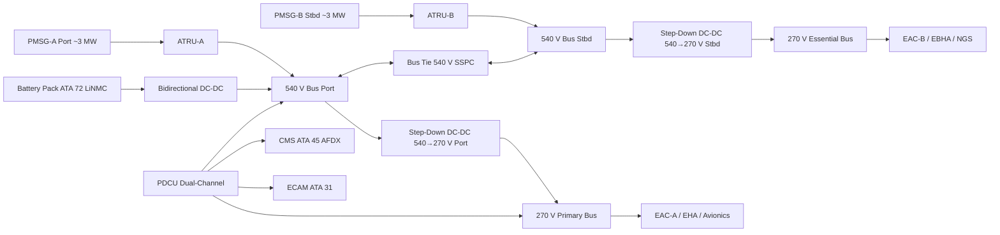
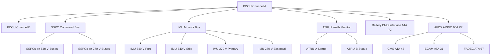

<!-- ──────────────────────────────────────────────────────────────────────────
     QATL-ATLAS-1000-ATLAS-070-079-07-073-000-POWER-DISTRIBUTION-MV-HV-GENERAL
     ATA 73 · Power Distribution MV/HV General
     AMPEL360E eWTW — ATLAS Register 1000
────────────────────────────────────────────────────────────────────────────── -->

# Power Distribution MV/HV General

---

## §0 Hyperlink Policy

> All hyperlinks in this document are **relative** (five directory levels: `../../../../../`).
> Absolute URLs are forbidden. Every linked document must exist in the Q+ATLANTIDE repository
> before the link is activated. Broken links are treated as open issues and must be resolved
> before the document is promoted from `DRAFT` to `APPROVED`.

---

## §1 Purpose

ATA Chapter 73 covers the Medium-Voltage and High-Voltage (MV/HV) Power Distribution system of the AMPEL360E eWTW. This aircraft adopts a **bleed-less all-electric architecture**: all propulsive augmentation and secondary power demands are met entirely from electrical energy, with no pneumatic bleed extraction from the turbofan cores.

The MV/HV distribution system encompasses two primary HVDC voltage levels:

- **HVDC 540 V** — main propulsion power bus feeding the Electric Propulsion Motors (EPMs) and high-power secondary converters.
- **HVDC 270 V** — secondary distribution bus supplying Electric Air Compressors (EACs, ATA 66), Electro-Hydrostatic Actuators (EHAs/EBHAs, ATA 27), avionics ATRUs, and the Nitrogen Generation System (NGS, ATA 47).

The entire MV/HV network is supervised by the **Power Distribution Control Unit (PDCU)**, a dual-channel digital controller qualified to DO-178C DAL B and DO-254 DAL B. This document establishes the general scope, top-level architecture, and governing standards for the ATA 73 MV/HV Power Distribution system. All subsubject documents (073-010 through 073-090) are subordinate to this general baseline.

---

## §2 Applicability

| Parameter | Value |
|---|---|
| Aircraft Program | AMPEL360E eWTW |
| ATA reference | ATA 73-000 — Power Distribution MV/HV General |
| Certification basis | EASA CS-25 Amdt 27+ |
| S1000D SNS | 073-000-00 |

---

## §3 Functional Description ![DRAFT]

The ATA 73 system on the AMPEL360E eWTW is built around two electrically independent HVDC 540 V buses (port and starboard), each fed by a Permanent Magnet Synchronous Generator (PMSG) rated ~3 MW driven by the corresponding turbofan engine. The PMSGs deliver three-phase AC output which is rectified to 540 V DC by Auto-Transformer Rectifier Units (ATRUs) employing an 18-pulse rectifier topology to minimise harmonic distortion (THD ≤ 5 % per IEEE 519).

From the 540 V buses, Isolated DC-DC converters (200 kW each, LLC resonant topology) step the voltage down to HVDC 270 V for the secondary distribution network. LiNMC battery packs (ATA 72) interface with the 540 V bus via a bidirectional DC-DC converter, providing peak power shaving and kinetic energy recovery.

Solid State Power Controllers (SSPCs) replace all legacy thermal breakers on both bus levels, providing arc-flash-free switching with over-current response times below 100 μs. The PDCU manages bus load balancing, SSPC commanding, insulation monitoring, and ECAM synoptic page "ELEC 73" reporting.

---

## §4 Functional Breakdown

| ID | Name | Description | Lead Division |
|---|---|---|---|
| F-001 | 540 V bus management | Dual HVDC 540 V propulsion buses; fed by PMSG-A/B via ATRUs; managed by PDCU | Q-GREENTECH |
| F-002 | 270 V bus management | Dual HVDC 270 V secondary buses; fed from 540 V step-down converters; managed by PDCU | Q-GREENTECH |
| F-003 | Bus tie and interconnect logic | SSPC-based bus ties allowing cross-bus feeding under single-source failure; PDCU-commanded | Q-MECHANICS |
| F-004 | Ground fault / insulation monitoring | Insulation Monitoring Units (IMUs) on both voltage networks; AC injection at 2 kHz; PDCU-integrated | Q-INDUSTRY |
| F-005 | Health monitoring and ECAM interface | PDCU predictive analytics; ECAM synoptic "ELEC 73"; AFDX to CMS ATA 45 | Q-HPC |

---

## §5 System Context — Mermaid Diagram

---

## §6 Internal Architecture — Mermaid Diagram

---

## §7 Components and LRUs

| Component | Part Number | Qty | Location | Maintenance Interval | Notes |
|---|---|---|---|---|---|
| ATRU-A Auto-Transformer Rectifier Unit | ATRU-A-PN-TBD | 1 | Port pylon / nacelle interface | On condition; C-check THD test | 18-pulse; ~3.2 MW rated; oil-cooled |
| ATRU-B Auto-Transformer Rectifier Unit | ATRU-B-PN-TBD | 1 | Stbd pylon / nacelle interface | On condition; C-check THD test | Identical to ATRU-A |
| PDCU Power Distribution Control Unit | PDCU-PN-TBD | 1 | EE bay rack | Software update per SB; C-check BITE | Dual-channel; DO-178C DAL B; DO-254 DAL B |
| 540 V Step-Down DC-DC Converter (port) | DCDC-540-270-P-TBD | 1 | EE bay rack | C-check efficiency test (η ≥ 96 %) | LLC resonant; 200 kW; galvanic isolation |
| 540 V Step-Down DC-DC Converter (stbd) | DCDC-540-270-S-TBD | 1 | EE bay rack | C-check efficiency test (η ≥ 96 %) | Identical to port unit |
| Bidirectional Battery DC-DC Converter | DCDC-BAT-PN-TBD | 1 | EE bay rack | C-check; battery cycle verify | 540 V ↔ 350 V; interfaces ATA 72 BMS |
| IMU Insulation Monitoring Unit (×4) | IMU-PN-TBD | 4 | EE bay / busbar zone | Calibration ≤ 24 months | AC injection 2 kHz; one per bus segment |

---

## §8 Interfaces

| Interface Type | Connected System | Protocol / Medium | Data / Function |
|---|---|---|---|
| ATA 24 Electrical Power | HVDC upstream generation (PMSGs) | HVDC cable 540 V | Generation feed to ATRU input |
| ATA 72 Electric Propulsion | EPM drives and LiNMC battery packs | HVDC cable 540 V + AFDX | Traction power delivery; BMS integration |
| ATA 66 Air Compressor | EAC-A / EAC-B motor drives | HVDC cable 270 V | ~90 kW per EAC unit |
| ATA 27 Flight Controls | EHA / EBHA electro-hydraulic actuators | HVDC cable 270 V | Actuator power supply |
| ATA 45 CMS | Central Maintenance System | AFDX ARINC 664 P7 | BITE faults; health parameters; predictive maintenance |
| ATA 31 ECAM | Cockpit electronic centralized display | AFDX | ELEC 73 synoptic; bus voltages and currents; SSPC status |
| ATA 47 NGS | Nitrogen Generation System | HVDC cable 270 V | Power to NGS blower |
| ATA 67 / FADEC | Full Authority Digital Engine Control | AFDX | Engine torque/speed coordination with PDCU load management |

---

## §9 Operating Modes

| Mode | Trigger | System State | Actions / Consequences |
|---|---|---|---|
| Normal dual-engine | Both PMSGs generating; all buses healthy | ATRU-A feeds 540 V port; ATRU-B feeds 540 V stbd; step-down feeds 270 V buses | Full load capacity; PDCU monitors all buses; ECAM "ELEC 73" normal |
| Single-engine (degraded) | One PMSG failure or ATRU fault | Healthy ATRU feeds both 540 V buses via bus tie SSPC | PDCU activates bus tie; ECAM amber caution; load shed of non-essential 270 V loads |
| Battery-only (ground or emergency) | Both PMSGs offline | Battery DC-DC maintains 540 V essential feed; 270 V essential bus maintained | Priority loads only; time-limited by battery state of charge |
| Ground power | External ground power unit (GPU) | GPU feeds 270 V essential bus via dedicated SSPC | ATRU offline; PDCU routes GPU power to essential loads |
| Maintenance / LOTO | Aircraft grounded; HVDC isolation commanded | All SSPCs open; residual capacitor charge ≤ 50 V within 5 min | HVDC LOTO procedure per AMM; capacitor discharge confirmed before busbar access |

---

## §10 Performance and Budgets ![DRAFT]

| Parameter | Requirement | Target / Design Value | Status |
|---|---|---|---|
| 540 V bus voltage regulation | 540 V ± 2 % at rated load | ±1.5 % | ![TBD] |
| 270 V bus voltage regulation | 270 V ± 3 % at rated load | ±2 % | ![TBD] |
| ATRU THD (each) | ≤ 5 % (IEEE 519) | ≤ 4 % target | ![TBD] |
| SSPC trip response time | ≤ 100 μs over-current | ≤ 80 μs target | ![TBD] |
| DC-DC efficiency (540→270 V) | η ≥ 96 % at 50 % load | η ≥ 97 % target | ![TBD] |
| IMU insulation alarm threshold | ≤ 100 kΩ warning; ≤ 50 kΩ caution | Calibrated per IEC 61557-8 | ![TBD] |
| PDCU availability | ≥ 99.99 % dispatch | Dual-channel architecture | ![TBD] |

---

## §11 Safety, Redundancy and Fault Tolerance

- Dual HVDC 540 V buses (port/stbd) provide single-point-of-failure tolerance for propulsion power; bus tie SSPC enables cross-bus feeding.
- Dual HVDC 270 V buses (primary/essential) ensure continued ECS, flight control actuator, and avionics power after single-bus loss.
- Battery pack (ATA 72) provides emergency 540 V and 270 V essential bus support; autonomy sized per CS-25 §25.1351 emergency requirements.
- SSPCs provide arc-flash-free switching and short-circuit protection without nuisance tripping; trip logs enable predictive maintenance.
- IMUs on all four bus segments detect insulation degradation before ground fault occurs; alarm relayed to ECAM and CMS.
- Loss of PDCU dual-channel constitutes a catastrophic hazard; demonstrated Extremely Improbable per FHA (DO-178C DAL B software, DO-254 DAL B hardware).
- All busbar access requires HVDC LOTO procedure; capacitor residual charge ≤ 50 V within 5 min of isolation confirmed by IMU.

---

## §12 Maintenance and Diagnostics

| Task | Interval | Access | Special Tools |
|---|---|---|---|
| PDCU BITE log download and IMU trend review | A-check | CMS terminal or ACARS | CMS GSE terminal |
| SSPC functional check (one per bus per A-check) | A-check | PDCU GSE ground command | SSPC test console |
| ATRU THD measurement (both units) | C-check | Pylon panel — 4 h access | ATRU harmonic analyser |
| DC-DC converter efficiency test (all units) | C-check | EE bay rack | Precision load bank; power analyser |
| IMU calibration verification | ≤ 24 months | EE bay | IMU calibration kit; IEC 61557-8 compliant |
| Busbar torque inspection (all joints) | C-check | Lower fuselage / EE bay | Calibrated torque wrench set |
| HVDC LOTO — capacitor discharge verify | Any busbar access | HVDC isolation switchgear | HVDC voltmeter; discharge probe |

---

## §13 Footprint

| Footprint Type | Parameter | Value | Notes |
|---|---|---|---|
| Physical | Total MV/HV system mass (estimated) | ![TBD] | Pending detailed design |
| Physical | PDCU envelope | ![TBD] | EE bay rack — 2U estimated |
| Electrical | Peak 540 V bus load (each bus) | ~3.2 MW | PMSG rated output |
| Electrical | Peak 270 V bus load (combined) | ~400 kW | EACs + actuators + avionics |
| Maintenance | HVDC isolation time | ≤ 5 min to ≤ 50 V | Capacitor discharge per AMM |
| Data | AFDX bandwidth (PDCU to CMS) | ![TBD] | Per AFDX bus load analysis |

---

## §14 Safety and Certification References ![DRAFT]

| Standard / Document | Title | Issuing Body | Applicability |
|---|---|---|---|
| EASA CS-25 §25.1353 | Electrical equipment and installations | EASA | Wiring and protection requirements for HVDC |
| MIL-STD-704F | Aircraft Electrical Power Characteristics | US DoD | HVDC 270 V / 540 V bus quality standards |
| DO-160G | Environmental Conditions and Test Procedures | RTCA | Environmental qualification for PDCU, ATRU, converters |
| DO-178C | Software Considerations in Airborne Systems | RTCA | PDCU software DAL B |
| DO-254 | Design Assurance Guidance for Airborne Electronic Hardware | RTCA | PDCU hardware DAL B |
| IEEE 519 | Harmonic Control in Electric Power Systems | IEEE | ATRU THD ≤ 5 % limit |
| IEC 60364-1 | Low-voltage electrical installations — fundamental principles | IEC | General wiring and protection principles |
| IEC 61557-8 | Insulation monitoring devices | IEC | IMU performance specification |
| SAE AS50881 | Wiring Aerospace Vehicle | SAE | Cable and connector standards |

---

## §15 V&V Approach ![TBD]

| Phase | Method | Acceptance Criterion | Status |
|---|---|---|---|
| Design | Analysis and simulation (SPICE / power flow models) | Bus regulation ±2 %; ATRU THD ≤ 5 % | ![TBD] |
| Unit test | ATRU harmonic test; DC-DC efficiency bench test | THD ≤ 5 %; η ≥ 96 % | ![TBD] |
| Integration | Ground functional test — full HVDC network activation | All SSPCs, IMUs, PDCU BITE test pass | ![TBD] |
| Qualification | DO-160G environmental qualification (PDCU, ATRU, converters) | All categories pass | ![TBD] |
| Certification | EASA CS-25 §25.1353 compliance — flight test HVDC monitoring | Bus voltage/current within limits across flight envelope | ![TBD] |

---

## §16 Glossary

| Term | Definition |
|---|---|
| **HVDC** | High-Voltage Direct Current — DC power at 270 V or 540 V as defined by MIL-STD-704F. |
| **PDCU** | Power Distribution Control Unit — dual-channel digital controller managing ATA 73 MV/HV buses. |
| **PMSG** | Permanent Magnet Synchronous Generator — engine-driven generator rated ~3 MW. |
| **ATRU** | Auto-Transformer Rectifier Unit — 18-pulse AC/DC converter producing 540 V DC from PMSG output. |
| **SSPC** | Solid State Power Controller — semiconductor-based power switch replacing legacy thermal breakers. |
| **IMU** | Insulation Monitoring Unit — device monitoring insulation resistance to airframe on isolated HVDC networks. |
| **EPM** | Electric Propulsion Motor — hybrid thrust motor powered from 540 V bus. |
| **EAC** | Electric Air Compressor — HVDC 270 V powered compressor for ECS (ATA 66). |
| **LLC resonant** | Inductor-Inductor-Capacitor resonant converter topology used for 540→270 V DC-DC conversion. |
| **LOTO** | Lockout/Tagout — energy isolation procedure mandated before busbar maintenance access. |
| **THD** | Total Harmonic Distortion — measure of waveform quality; ≤ 5 % per IEEE 519 for ATRU output. |
| **DAL** | Design Assurance Level — DO-178C/DO-254 classification; PDCU is DAL B. |

---

## §17 Open Issues

| ID | Description | Owner | Target |
|---|---|---|---|
| OI-073-000-001 | Finalise 540 V and 270 V bus load analysis with all systems OEMs (PMSG, EPM, EAC, actuators) | Q-GREENTECH | 2026-Q4 |
| OI-073-000-002 | Complete FHA for dual-PDCU-channel failure (DAL B rationale documentation) | Q-AIR / Safety | 2027-Q1 |
| OI-073-000-003 | Confirm ATRU OEM selection and THD compliance test plan | Q-MECHANICS | 2026-Q4 |

---

## §18 Status Legend

| Badge | Meaning |
|---|---|
| `![DRAFT]` | Section is drafted but not yet reviewed |
| `![TBD]` | Content not yet started — to be defined |
| `![To Be Completed]` | Partially complete — needs additional content |
| `![APPROVED]` | Reviewed and formally approved |

---

## §19 Related Documents (Siblings in this Subsection)

- [073-010](./073-010-High-Voltage-Distribution-Architecture.md)
- [073-020](./073-020-Medium-Voltage-Distribution-Architecture.md)
- [073-030](./073-030-Power-Electronics-Converters-and-Rectifiers.md)
- [073-040](./073-040-SSPC-Contactors-Breakers-and-Protection.md)
- [073-050](./073-050-HVDC-Busbars-Cables-and-Connectors.md)
- [073-060](./073-060-Insulation-Monitoring-and-Ground-Fault-Detection.md)
- [073-070](./073-070-Power-Distribution-Test-and-Maintenance.md)
- [073-080](./073-080-Power-Distribution-Monitoring-Diagnostics-and-Control-Interfaces.md)
- [073-090](./073-090-S1000D-CSDB-Mapping-and-Traceability.md)

---

## §20 Change Log

| Rev | Date | Author | Description |
|---|---|---|---|
| 0.1 | 2026-05-11 | @copilot | Initial DRAFT — contextualized content per AMPEL360E eWTW bleed-less HVDC architecture |
