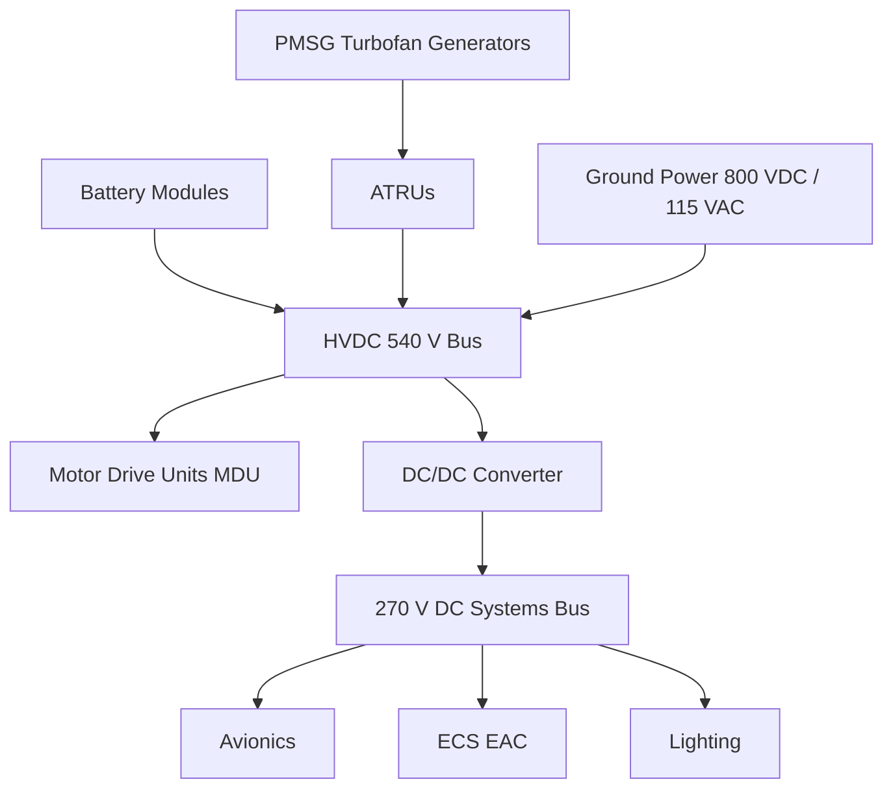
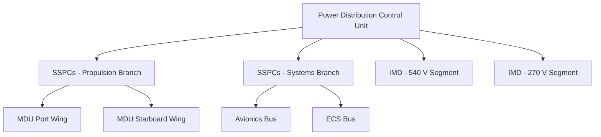

# Power Distribution MV/HV — System Overview

---

## §0 Hyperlink Policy
All hyperlinks in this document are **relative**. Absolute URLs are forbidden.

## §1 Purpose
This document provides the top-level system overview for the AMPEL360E eWTW medium/high-voltage power distribution subsystem (ATA 073). It defines the architecture, key components, and governing requirements for HVDC 540 V propulsion and 270 V DC aircraft-systems buses. It serves as the entry point for all ATA 073 subsubject documentation.

## §2 Applicability
| Aircraft | Variant | MSN Range | Effectivity |
|---|---|---|---|
| AMPEL360E | eWTW | All | From EIS |

## §3 Functional Description 
The AMPEL360E eWTW employs a dual-bus MV/HV DC architecture derived from the aircraft's hybrid-electric propulsion philosophy. The primary HVDC 540 V propulsion bus supplies power to motor drive units (MDUs) that spin the distributed electric fans; this bus is sourced from lithium-based battery modules and permanent-magnet synchronous generators (PMSGs) driven by the turbofan cores via auto-transformer rectifier units (ATRUs).

A secondary 270 V DC aircraft-systems bus provides power to avionics, environmental control system actuators (EAC), reduced-galley loads, and cabin lighting. The two buses are coupled through a bidirectional DC/DC converter managed by the Power Distribution Control Unit (PDCU), allowing energy transfer during peak demand or battery charging phases.

The power architecture employs a split-bus topology with the centralised PDCU located in the fuselage centre section. Solid-State Power Controllers (SSPCs) provide arc-fault and overcurrent protection across all distribution branches. Insulation Monitoring Devices (IMDs) continuously supervise isolation integrity on each bus segment, meeting CS-25 and MIL-STD-704F requirements.

## §4 Functional Breakdown
| ID | Function | Description | Owner | DAL |
|---|---|---|---|---|
| F-073-000-01 | HVDC 540 V Distribution | Route power from PMSGs and batteries to MDUs | Q-GREENTECH | DAL B |
| F-073-000-02 | 270 V DC Distribution | Supply aircraft systems bus from ATRU or DC/DC | Q-GREENTECH | DAL B |
| F-073-000-03 | Bus Protection | SSPC overcurrent/arc-fault isolation | Q-MECHANICS | DAL B |
| F-073-000-04 | Insulation Monitoring | Continuous ground-fault detection on all buses | Q-GREENTECH | DAL C |
| F-073-000-05 | Load Management | PDCU priority shedding and load balancing | Q-HPC | DAL C |

## §5 System Context

## §6 Internal Architecture

## §7 Components and LRUs
| LRU ID | Name | P/N | Qty | Location |
|---|---|---|---|---|
| LRU-073-000-01 | Power Distribution Control Unit (PDCU) | PDCU-360E-001 | 1 | Fuselage centre, Frame 25 |
| LRU-073-000-02 | ATRU Assembly | ATRU-360E-003 | 2 | Pylon nacelles |
| LRU-073-000-03 | SSPC Module (Propulsion) | SSPC-HV-540-010 | 4 | PDCU bay |
| LRU-073-000-04 | SSPC Module (Systems) | SSPC-MV-270-010 | 4 | PDCU bay |
| LRU-073-000-05 | Insulation Monitoring Device | IMD-073-001 | 4 | Per bus segment |

## §8 Interfaces
| Interface | Source | Destination | Protocol | Notes |
|---|---|---|---|---|
| IF-073-000-01 | PDCU | ECAM/CDS | AFDX ARINC 664 | Health and status |
| IF-073-000-02 | ATRU | HVDC 540 V Bus | Power | Rated 2×150 kW |
| IF-073-000-03 | Battery BMS | PDCU | CAN FD | SOC, fault signals |
| IF-073-000-04 | Ground Power Receptacle | HVDC Bus | 800 VDC connector | Pre-flight charging |
| IF-073-000-05 | IMD | PDCU | RS-422 | Isolation fault data |

## §9 Operating Modes
| Mode | Trigger | Description | Power State | Notes |
|---|---|---|---|---|
| Normal | Power-on | Dual-bus active, PMSGs supplying | Full | Standard operation |
| Battery-only | PMSG failure | Batteries supply HVDC, systems shed | Reduced | 30 min endurance |
| Ground Power | Pre-flight | External 800 VDC or 115 VAC connected | Partial | Charging + avionics |
| Emergency | Dual-gen loss | Emergency battery feeds critical 270 V | Minimum | CS-25.1351 |
| Maintenance | GND/MAINTsw | All buses de-energised, PDCU in BITE | Off | Safety interlock active |

## §10 Performance and Budgets 
| Parameter | Requirement | Current Estimate | Unit | Status |
|---|---|---|---|---|
| HVDC Bus Voltage | 540 ±27 | 540 | VDC |  |
| Systems Bus Voltage | 270 ±13.5 | 270 | VDC |  |
| Total Propulsion Power | ≤800 | 720 | kW |  |
| Systems Bus Load | ≤50 | 38 | kW |  |
| Bus Ripple (HVDC) | ≤1% | TBD | % |  |

## §11 Safety, Redundancy and Fault Tolerance
- Dual ATRU feeds for HVDC bus with automatic changeover on failure.
- SSPC arc-fault detection isolates faulted branches within 2 ms.
- IMD on every bus segment; isolation fault triggers ECAM warning and PDCU automatic shedding.
- Emergency battery maintains 270 V critical bus for minimum 30 minutes per CS-25.1351.
- Physical segregation of HVDC cables from 270 V wiring per EWIS DO-326A zoning requirements.

## §12 Maintenance and Diagnostics
| Task | Interval | Tool | Reference |
|---|---|---|---|
| SSPC BITE self-test | Pre-flight | PDCU built-in | 073-070 §3 |
| IMD calibration check | 600 FH | IMD test set IMD-TS-001 | 073-060 §4 |
| ATRU insulation resistance | 3000 FH | Megger MIT1025 | 073-030 §5 |
| HVDC cable visual inspection | C-check | Borescope kit | 073-050 §3 |

## §13 Footprint
| Dimension | Value |
|---|---|
| Physical (PDCU bay) | 600 × 400 × 300 mm |
| System mass (total) | ≈ 48 kg (est.) |
| Power dissipation | ≈ 2.4 kW (losses) |
| Data interfaces | AFDX, CAN FD, RS-422 |

## §14 Safety and Certification References
| Standard | Requirement | Applicability | Status | Notes |
|---|---|---|---|---|
| DO-178C | Software levels | PDCU firmware DAL B | Planned | — |
| DO-254 | Hardware design | SSPC logic DAL B | Planned | — |
| ARP4754A | System development | Full system | Planned | — |
| CS-25 | Airworthiness | Electrical systems | Planned | Amdt 27 |
| MIL-STD-704F | Power quality | Both buses | Planned | Steady-state + transient |

## §15 V&V Approach
| Phase | Method | Tool/Facility | Status |
|---|---|---|---|
| Requirements | Model-based review | DOORS Next |  |
| Design | FTA/FMEA | Medusa/Isograph |  |
| Integration | Iron-bird rig test | AMPEL360E HIL rig |  |
| Certification | Ground + flight test | Aircraft test fleet |  |

## §16 Glossary
| Term | Definition |
|---|---|
| ATRU | Auto-Transformer Rectifier Unit — AC→DC conversion device |
| ECS | Environmental Control System |
| HVDC | High-Voltage Direct Current |
| IMD | Insulation Monitoring Device |
| MDU | Motor Drive Unit |
| PDCU | Power Distribution Control Unit |
| PMSG | Permanent-Magnet Synchronous Generator |
| SSPC | Solid-State Power Controller |
| BMS | Battery Management System |
| EWIS | Electrical Wiring Interconnection System |

## §17 Open Issues
| ID | Description | Owner | Priority | Status |
|---|---|---|---|---|
| OI-073-000-001 | Confirm 540 V ripple budget with MDU supplier | @copilot | High | Open |
| OI-073-000-002 | Define emergency bus topology for single-aisle variant | @copilot | Medium | Open |

## §18 Status Legend
| Badge | Meaning |
|---|---|
|  | Content under active development |
|  | Value or content to be determined |
|  | Approved and baselined |
|  | Placeholder |

## §19 Related Documents
| Code | Title | Link |
|---|---|---|
| 073-010 | HVDC 540 V Propulsion Bus Architecture | [073-010](073-010-HVDC-540V-Propulsion-Bus-Architecture.md) |
| 073-020 | 270 V DC Aircraft Systems Bus | [073-020](073-020-270V-DC-Aircraft-Systems-Bus.md) |
| 073-030 | Power Electronics and ATRUs | [073-030](073-030-Power-Electronics-and-ATRUs.md) |
| 073-040 | SSPCs and Protection Coordination | [073-040](073-040-SSPCs-and-Protection-Coordination.md) |
| 073-050 | Busbars, Cables and Connectors | [073-050](073-050-Busbars-Cables-and-Connectors.md) |
| 073-060 | Insulation Monitoring and Ground Fault Detection | [073-060](073-060-Insulation-Monitoring-and-Ground-Fault-Detection.md) |
| 073-070 | Power Distribution Test and Maintenance | [073-070](073-070-Power-Distribution-Test-and-Maintenance.md) |
| 073-080 | PDCU Monitoring | [073-080](073-080-Power-Distribution-Control-Unit-PDCU-Monitoring.md) |
| 073-090 | S1000D CSDB Mapping and Traceability | [073-090](073-090-S1000D-CSDB-Mapping-and-Traceability.md) |

## §20 Change Log
| Rev | Date | Author | Summary |
|---|---|---|---|
| 0.1 | 2026-05-11 | @copilot | Initial creation |
