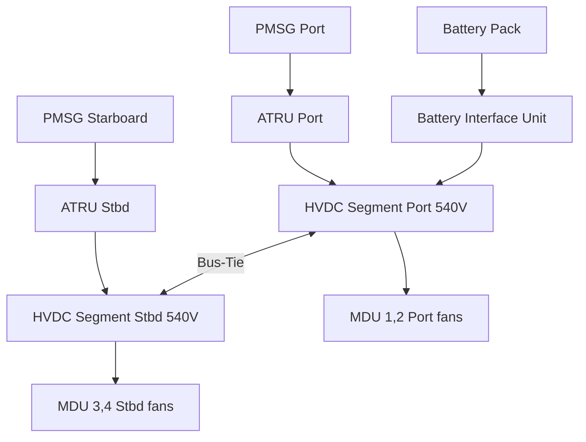
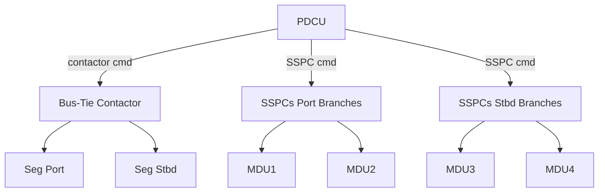

# HVDC 540 V Propulsion Bus Architecture

---

## §0 Hyperlink Policy
All hyperlinks in this document are **relative**. Absolute URLs are forbidden.

## §1 Purpose
This document defines the topology, power sources, and load connections of the HVDC 540 V propulsion bus on the AMPEL360E eWTW. It covers bus segmentation, isolation logic, and split-bus operating scenarios. It is the primary reference for propulsion-power routing design and certification evidence.

## §2 Applicability
| Aircraft | Variant | MSN Range | Effectivity |
|---|---|---|---|
| AMPEL360E | eWTW | All | From EIS |

## §3 Functional Description 
The 540 V HVDC propulsion bus is the highest-voltage rail in the AMPEL360E architecture. It is rated at 540 VDC nominal (±5%) and carries up to 800 kW peak during takeoff and climb. The bus is fed by two ATRUs connected to the port and starboard turbofan PMSGs, and by the main lithium-ion battery pack via a bidirectional battery interface unit (BIU).

The bus is divided into two galvanic segments — port and starboard — separated by a normally-closed bus-tie contactor managed by the PDCU. Each segment feeds four Motor Drive Units (MDUs) for distributed electric fan propulsion. During normal operation both segments share load via the bus-tie; on a single ATRU failure the tie opens and the healthy segment continues operation at reduced thrust.

Bus-voltage control is achieved by the ATRU output voltage regulators, which maintain 540 V ±2% in steady state. The BIU provides peak-power boost during takeoff and recovers energy during descent and approach via regenerative braking of the MDUs. Overvoltage, undervoltage, and overcurrent thresholds are enforced by dedicated SSPCs on each branch.

## §4 Functional Breakdown
| ID | Function | Description | Owner | DAL |
|---|---|---|---|---|
| F-073-010-01 | Bus Segmentation | Split port/stbd with bus-tie contactor | Q-GREENTECH | DAL B |
| F-073-010-02 | ATRU Feed | Rectified PMSG power to HVDC rail | Q-MECHANICS | DAL B |
| F-073-010-03 | Battery BIU Interface | Bidirectional charge/discharge control | Q-HPC | DAL B |
| F-073-010-04 | MDU Branch Protection | SSPC per MDU branch, OC+AFD | Q-GREENTECH | DAL B |
| F-073-010-05 | Voltage Regulation | ATRU AVR maintains 540 V ±2% | Q-MECHANICS | DAL C |

## §5 System Context

## §6 Internal Architecture

## §7 Components and LRUs
| LRU ID | Name | P/N | Qty | Location |
|---|---|---|---|---|
| LRU-073-010-01 | ATRU Port | ATRU-360E-003-P | 1 | Port pylon nacelle |
| LRU-073-010-02 | ATRU Starboard | ATRU-360E-003-S | 1 | Stbd pylon nacelle |
| LRU-073-010-03 | Battery Interface Unit | BIU-360E-001 | 1 | Fuselage centre |
| LRU-073-010-04 | Bus-Tie Contactor | BTC-HV-540-001 | 1 | PDCU bay |
| LRU-073-010-05 | HVDC Busbar Segment | BB-540-PORT/STBD | 2 | PDCU bay |

## §8 Interfaces
| Interface | Source | Destination | Protocol | Notes |
|---|---|---|---|---|
| IF-073-010-01 | ATRU Port | HVDC Seg Port | Power | 540 V, 150 kW rated |
| IF-073-010-02 | ATRU Stbd | HVDC Seg Stbd | Power | 540 V, 150 kW rated |
| IF-073-010-03 | BIU | HVDC Seg Port | Power | ±200 kW bidirectional |
| IF-073-010-04 | PDCU | Bus-Tie Contactor | Discrete | Open/close command |
| IF-073-010-05 | MDU (all) | HVDC Segments | Power | 4×100 kW peak |

## §9 Operating Modes
| Mode | Trigger | Description | Power State | Notes |
|---|---|---|---|---|
| Normal | Both ATRUs OK | Segments tied, shared load | Full 800 kW | Nominal |
| Single-ATRU | One ATRU fail | Bus-tie opens, each seg independent | 50% thrust | Auto-reconfiguration |
| Battery Boost | Takeoff demand | BIU discharges into HVDC | +200 kW | ≤5 min |
| Regen | Descent | MDUs regenerate into battery via BIU | Recovery | Energy harvest |
| Emergency | Both ATRUs fail | Battery alone; minimum fans | Degraded | RTB/divert |

## §10 Performance and Budgets 
| Parameter | Requirement | Current Estimate | Unit | Status |
|---|---|---|---|---|
| Nominal Voltage | 540 ±27 | 540 | VDC |  |
| Peak Power | ≤800 | 800 | kW |  |
| Continuous Power | ≤600 | 580 | kW |  |
| Voltage Ripple | ≤1% pk-pk | TBD | % |  |
| Bus-Tie Switching Time | ≤20 | TBD | ms |  |

## §11 Safety, Redundancy and Fault Tolerance
- Split-bus with bus-tie allows continued operation on single ATRU loss.
- SSPCs on each MDU branch provide overcurrent and arc-fault protection within 2 ms.
- BIU incorporates internal precharge circuit to prevent inrush at bus energisation.
- IMD continuously monitors bus isolation; fault triggers automatic bus isolation and ECAM CAS.
- Bus-tie contactor has independent mechanical and electrical trip coils (fail-safe open on loss of power).

## §12 Maintenance and Diagnostics
| Task | Interval | Tool | Reference |
|---|---|---|---|
| Bus-tie contactor contact resistance | 1000 FH | DLRO micro-ohmmeter | AMM 073-10-01 |
| ATRU output voltage check | 600 FH | Calibrated DVOM | AMM 073-10-02 |
| HVDC cable insulation test | C-check | 1 kV megger | 073-050 §4 |
| SSPC trip test (MDU branches) | 1000 FH | PDCU BITE | 073-070 §3 |

## §13 Footprint
| Dimension | Value |
|---|---|
| ATRU mass (each) | ≈ 8 kg |
| BIU mass | ≈ 5 kg |
| Bus-tie contactor mass | ≈ 1.2 kg |
| HVDC busbar length (each seg) | ≈ 2.2 m |
| Power dissipation (ATRU) | ≈ 600 W each at full load |

## §14 Safety and Certification References
| Standard | Requirement | Applicability | Status | Notes |
|---|---|---|---|---|
| DO-178C | Software levels | PDCU/BIU firmware DAL B | Planned | — |
| DO-254 | Hardware design | BIU power electronics DAL B | Planned | — |
| ARP4754A | System development | Propulsion bus | Planned | — |
| CS-25 | Electrical systems | 540 V bus | Planned | CS-25.1351/1353 |
| MIL-STD-704F | Power quality | 540 V DC | Planned | Transients and steady-state |

## §15 V&V Approach
| Phase | Method | Tool/Facility | Status |
|---|---|---|---|
| Requirements | Peer review DOORS | DOORS Next |  |
| Component | ATRU + BIU bench test | Power lab |  |
| Integration | Iron-bird propulsion rig | AMPEL360E HIL |  |
| Certification | Ground power and flight | Aircraft test fleet |  |

## §16 Glossary
| Term | Definition |
|---|---|
| ATRU | Auto-Transformer Rectifier Unit |
| AVR | Automatic Voltage Regulator |
| BIU | Battery Interface Unit |
| BTC | Bus-Tie Contactor |
| DAL | Development Assurance Level |
| HVDC | High-Voltage Direct Current |
| MDU | Motor Drive Unit |
| PDCU | Power Distribution Control Unit |
| PMSG | Permanent-Magnet Synchronous Generator |
| SSPC | Solid-State Power Controller |

## §17 Open Issues
| ID | Description | Owner | Priority | Status |
|---|---|---|---|---|
| OI-073-010-001 | Confirm bus-tie switching time with contactor supplier | @copilot | High | Open |
| OI-073-010-002 | Define ATRU derating curve at altitude | @copilot | Medium | Open |

## §18 Status Legend
| Badge | Meaning |
|---|---|
|  | Content under active development |
|  | Value or content to be determined |
|  | Approved and baselined |
|  | Placeholder |

## §19 Related Documents
| Code | Title | Link |
|---|---|---|
| 073-000 | System Overview | [073-000](073-000-Power-Distribution-MV-HV-General.md) |
| 073-020 | 270 V DC Aircraft Systems Bus | [073-020](073-020-270V-DC-Aircraft-Systems-Bus.md) |
| 073-030 | Power Electronics and ATRUs | [073-030](073-030-Power-Electronics-and-ATRUs.md) |
| 073-040 | SSPCs and Protection Coordination | [073-040](073-040-SSPCs-and-Protection-Coordination.md) |
| 073-050 | Busbars, Cables and Connectors | [073-050](073-050-Busbars-Cables-and-Connectors.md) |
| 073-060 | Insulation Monitoring and Ground Fault Detection | [073-060](073-060-Insulation-Monitoring-and-Ground-Fault-Detection.md) |
| 073-070 | Power Distribution Test and Maintenance | [073-070](073-070-Power-Distribution-Test-and-Maintenance.md) |
| 073-080 | PDCU Monitoring | [073-080](073-080-Power-Distribution-Control-Unit-PDCU-Monitoring.md) |
| 073-090 | S1000D CSDB Mapping and Traceability | [073-090](073-090-S1000D-CSDB-Mapping-and-Traceability.md) |

## §20 Change Log
| Rev | Date | Author | Summary |
|---|---|---|---|
| 0.1 | 2026-05-11 | @copilot | Initial creation |
