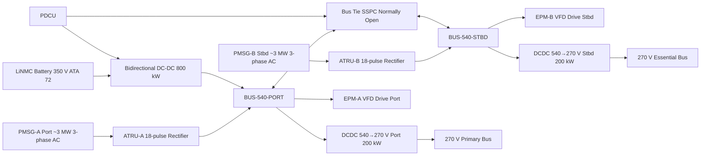
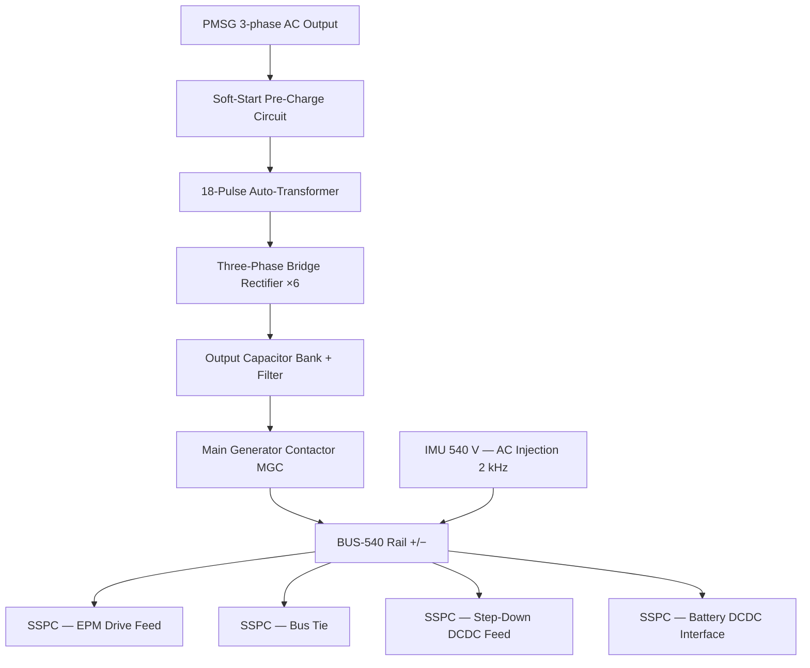

<!-- ──────────────────────────────────────────────────────────────────────────
     QATL-ATLAS-1000-ATLAS-070-079-07-073-010-HIGH-VOLTAGE-DISTRIBUTION-ARCHITECTURE
     ATA 73 · High Voltage Distribution Architecture
     AMPEL360E eWTW — ATLAS Register 1000
────────────────────────────────────────────────────────────────────────────── -->

# High Voltage Distribution Architecture

---

## §0 Hyperlink Policy

> All hyperlinks in this document are **relative** (five directory levels: `../../../../../`).
> Absolute URLs are forbidden. Every linked document must exist in the Q+ATLANTIDE repository
> before the link is activated. Broken links are treated as open issues and must be resolved
> before the document is promoted from `DRAFT` to `APPROVED`.

---

## §1 Purpose

This document defines the HVDC 540 V propulsion bus architecture of the AMPEL360E eWTW. The 540 V network is the primary power tier, directly fed by the two Permanent Magnet Synchronous Generators (PMSGs), and is the sole power source for Electric Propulsion Motor (EPM) drives providing hybrid thrust augmentation to each nacelle. It also serves as the upstream source for the 270 V secondary bus via isolated DC-DC converters, and interfaces with the LiNMC battery packs (ATA 72) for peak power and energy recovery.

This document details the two independent 540 V bus topologies (port and starboard), bus-tie architecture, battery interfacing strategy, and the step-down path to the 270 V network, establishing the physical and functional basis for power flow management under all operating and failure scenarios.

---

## §2 Applicability

| Parameter | Value |
|---|---|
| Aircraft Program | AMPEL360E eWTW |
| ATA reference | ATA 73-010 — High Voltage Distribution Architecture |
| Certification basis | EASA CS-25 Amdt 27+ |
| S1000D SNS | 073-010-00 |

---

## §3 Functional Description ![DRAFT]

The HVDC 540 V architecture comprises two fully independent bus segments, **BUS-540-PORT** and **BUS-540-STBD**, each fed by one PMSG via a dedicated ATRU. Each ATRU employs an 18-pulse auto-transformer rectifier design, achieving a THD ≤ 4 % at the 540 V bus to comply with IEEE 519 harmonic limits. ATRU output capacitor banks pre-charged via soft-start circuits prevent inrush current during bus energisation.

A **Bus Tie Contactor / SSPC** installed between BUS-540-PORT and BUS-540-STBD enables cross-bus feeding under single-PMSG or single-ATRU failure. The bus tie is normally open during dual-engine operation and closed only on PDCU command following a validated source failure.

The **LiNMC battery pack** (ATA 72, 350 V nominal) is connected to BUS-540-PORT via a **bidirectional DC-DC converter** (DCDC-BAT), which boosts the battery voltage to 540 V for injection and bucks 540 V to 350 V for charging. Peak power injection capacity is ~800 kW for up to 60 seconds (take-off augmentation duty cycle).

Two **isolated DC-DC converters** (DCDC-540-270-PORT and DCDC-540-270-STBD), each rated 200 kW, step down 540 V to 270 V for the secondary distribution network, providing galvanic isolation between propulsion and secondary power tiers.

---

## §4 Functional Breakdown

| ID | Name | Description | Lead Division |
|---|---|---|---|
| F-001 | PMSG-A/B 540 V feed | ATRU-A rectifies PMSG-A output to BUS-540-PORT; ATRU-B to BUS-540-STBD | Q-GREENTECH |
| F-002 | 540 V bus tie | Normally-open SSPC between port and stbd 540 V buses; PDCU-commanded on source failure | Q-MECHANICS |
| F-003 | 540 V to 270 V step-down | Isolated DC-DC converters (200 kW each) from each 540 V bus to 270 V distribution | Q-GREENTECH |
| F-004 | Battery 540 V interface | Bidirectional DCDC-BAT converter linking LiNMC pack to BUS-540-PORT; peak power ±800 kW | Q-INDUSTRY |
| F-005 | EPM drive power feed | 540 V traction power delivered to EPM variable frequency drives via dedicated SSPCs | Q-MECHANICS |

---

## §5 System Context — Mermaid Diagram

---

## §6 Internal Architecture — Mermaid Diagram

---

## §7 Components and LRUs

| Component | Part Number | Qty | Location | Maintenance Interval | Notes |
|---|---|---|---|---|---|
| ATRU-A (port) | ATRU-A-PN-TBD | 1 | Port pylon nacelle junction | On condition; C-check THD test | 18-pulse; 3.2 MW continuous; oil-cooled |
| ATRU-B (stbd) | ATRU-B-PN-TBD | 1 | Stbd pylon nacelle junction | On condition; C-check THD test | Identical to ATRU-A |
| Main Generator Contactor A (MGC-A) | MGC-A-PN-TBD | 1 | Port nacelle junction box | On condition | Mechanical contactor; 3.2 MW rated |
| Main Generator Contactor B (MGC-B) | MGC-B-PN-TBD | 1 | Stbd nacelle junction box | On condition | Identical to MGC-A |
| Bus Tie SSPC (540 V) | BT-SSPC-540-PN-TBD | 1 | EE bay power panel | A-check functional test | Normally open; PDCU commanded |
| DCDC-BAT Bidirectional Converter | DCDC-BAT-PN-TBD | 1 | EE bay rack | C-check efficiency verify | 540 V ↔ 350 V; ±800 kW peak |
| DCDC-540-270-PORT | DCDC-540-270-P-PN-TBD | 1 | EE bay rack | C-check efficiency test η ≥ 96 % | LLC resonant; 200 kW; galvanic isolation |
| DCDC-540-270-STBD | DCDC-540-270-S-PN-TBD | 1 | EE bay rack | C-check efficiency test η ≥ 96 % | Identical to port unit |

---

## §8 Interfaces

| Interface Type | Connected System | Protocol / Medium | Data / Function |
|---|---|---|---|
| ATA 24 Electrical Power | PMSG-A / PMSG-B generators | 3-phase AC cable, ATRU input | ~3 MW AC generation per engine |
| ATA 72 Propulsion / Battery | LiNMC battery pack and BMS | HVDC cable 540 V + AFDX | Peak power injection and energy recovery |
| ATA 72 EPM Drives | Electric Propulsion Motor VFD | HVDC cable 540 V | Traction power for hybrid thrust |
| ATA 73-020 | 270 V secondary bus | Isolated DC-DC output | 400 kW combined 270 V feed |
| ATA 45 CMS | Central Maintenance System | AFDX ARINC 664 P7 | ATRU health, SSPC status, bus voltage/current |
| ATA 31 ECAM | ECAM display | AFDX | BUS-540 voltage, current, SSPC state |

---

## §9 Operating Modes

| Mode | Trigger | System State | Actions / Consequences |
|---|---|---|---|
| Normal dual-source | Both ATRU-A and ATRU-B healthy | BUS-540-PORT and BUS-540-STBD independent; bus tie open | Each bus at 540 V ± 1.5 %; PDCU monitors |
| Single-source (bus tie closed) | PMSG-A or ATRU-A fault | Bus tie SSPC commanded closed by PDCU | ATRU-B feeds both 540 V buses; EPM-A de-rated or shed |
| Battery augmentation | Take-off or emergency | DCDC-BAT injects up to 800 kW into BUS-540-PORT | Battery SoC reduced; time-limited to 60 s per cycle |
| Battery charging | Cruise / descent | DCDC-BAT draws up to 200 kW from BUS-540-PORT to charge battery | PDCU manages charge rate per BMS (ATA 72) |
| Bus de-energisation | Maintenance LOTO | MGC-A/B open; all SSPCs open | Capacitor residual ≤ 50 V within 5 min; IMU confirms |

---

## §10 Performance and Budgets ![DRAFT]

| Parameter | Requirement | Target / Design Value | Status |
|---|---|---|---|
| 540 V bus voltage (steady state) | 540 V ± 2 % | 540 V ± 1.5 % | ![TBD] |
| ATRU THD at full load | ≤ 5 % (IEEE 519) | ≤ 4 % | ![TBD] |
| Bus tie closure time | ≤ 200 ms from fault detect | ≤ 100 ms target | ![TBD] |
| Battery DC-DC peak power | 800 kW for ≤ 60 s | 800 kW | ![TBD] |
| DCDC-540-270 efficiency | η ≥ 96 % at 50 % load | η ≥ 97 % | ![TBD] |
| ATRU soft-start inrush limit | ≤ 150 % nominal current | ≤ 120 % | ![TBD] |

---

## §11 Safety, Redundancy and Fault Tolerance

- Two fully independent 540 V buses prevent single-generator failure from de-powering EPM and secondary loads simultaneously.
- Bus tie SSPC is normally open — closure only on validated PDCU command, preventing paralleling of two healthy sources (circulating currents avoided).
- MGC-A/B mechanical contactors rated 3.2 MW provide ultimate isolation of PMSG from bus; semiconductor SSPCs upstream for dynamic fault clearing.
- Battery bidirectional DC-DC provides emergency bus sustain; fault in DCDC-BAT isolated by dedicated input/output SSPCs, protecting the battery and the 540 V bus.
- Capacitor pre-charge circuits limit inrush at bus energisation to ≤ 120 % rated current, protecting ATRU diode bridges.
- ATRU thermal management (oil cooling) monitored by PDCU; over-temperature → ATRU current de-rating before thermal shutdown.

---

## §12 Maintenance and Diagnostics

| Task | Interval | Access | Special Tools |
|---|---|---|---|
| ATRU THD test at rated load | C-check | Pylon panel — 4 h | ATRU harmonic analyser |
| MGC-A/B contact resistance check | C-check | Nacelle junction box | Contact resistance test set (≤ 50 μΩ) |
| Bus tie SSPC functional test | A-check | PDCU GSE command | SSPC test console |
| DCDC-BAT efficiency verification | C-check | EE bay rack | Precision load bank + power analyser |
| Capacitor discharge time verification | Any LOTO procedure | Bus-side voltmeter probe | HVDC voltmeter (600 V rated) |

---

## §13 Footprint

| Footprint Type | Parameter | Value | Notes |
|---|---|---|---|
| Physical | ATRU mass (each) | ![TBD] | OEM final design pending |
| Physical | DCDC-BAT converter mass | ![TBD] | Pending OEM |
| Electrical | Peak 540 V bus load | ~3.2 MW per bus | PMSG rated output |
| Electrical | Bus tie SSPC current rating | ![TBD] | Must handle full 3.2 MW cross-feed |
| Maintenance | ATRU access time | ~4 h | Pylon panel removal |
| Data | AFDX ATRU health data rate | ![TBD] | Per AFDX load analysis |

---

## §14 Safety and Certification References ![DRAFT]

| Standard / Document | Title | Issuing Body | Applicability |
|---|---|---|---|
| MIL-STD-704F §5.3 | Aircraft Electrical Power — HVDC 270/540 V | US DoD | 540 V bus quality and transient limits |
| DO-160G | Environmental Conditions and Test Procedures | RTCA | ATRU, DCDC qualification |
| IEEE 519 | Harmonic Control in Electric Power Systems | IEEE | ATRU THD ≤ 5 % |
| EASA CS-25 §25.1351 | General — Electrical systems and equipment | EASA | Redundancy and emergency power requirements |
| SAE AS50881 | Wiring Aerospace Vehicle | SAE | Cable and connector for 540 V power distribution |

---

## §15 V&V Approach ![TBD]

| Phase | Method | Acceptance Criterion | Status |
|---|---|---|---|
| Design | Power flow simulation (EMTP/PSCAD) | Bus voltage ± 2 %; THD ≤ 5 % across load range | ![TBD] |
| Unit | ATRU bench test — full load harmonic measurement | THD ≤ 4 % at 100 % load | ![TBD] |
| Integration | Ground rig — dual PMSG simulation; bus tie functional test | Bus tie ≤ 100 ms; voltage stable after transfer | ![TBD] |
| Qualification | DO-160G — vibration, thermal, EMI | All categories pass | ![TBD] |
| Certification | Flight test HVDC monitoring across flight envelope | 540 V bus within MIL-STD-704F limits throughout | ![TBD] |

---

## §16 Glossary

| Term | Definition |
|---|---|
| **BUS-540-PORT** | Port-side HVDC 540 V propulsion bus, fed by ATRU-A. |
| **BUS-540-STBD** | Starboard-side HVDC 540 V propulsion bus, fed by ATRU-B. |
| **ATRU** | Auto-Transformer Rectifier Unit — 18-pulse AC/DC converter. |
| **MGC** | Main Generator Contactor — mechanical contactor isolating PMSG from ATRU output. |
| **Bus tie SSPC** | Normally-open solid-state switch linking port and stbd 540 V buses. |
| **DCDC-BAT** | Bidirectional battery DC-DC converter; 540 V ↔ 350 V battery pack voltage. |
| **EPM** | Electric Propulsion Motor — hybrid thrust motor, driven from 540 V. |
| **VFD** | Variable Frequency Drive — power electronics controlling EPM speed. |
| **THD** | Total Harmonic Distortion — harmonic content; must be ≤ 5 % per IEEE 519. |
| **Inrush current** | Transient current spike at bus energisation; limited by soft-start pre-charge circuit. |

---

## §17 Open Issues

| ID | Description | Owner | Target |
|---|---|---|---|
| OI-073-010-001 | Confirm ATRU OEM capable of ≤ 4 % THD at full PMSG speed range | Q-MECHANICS | 2026-Q4 |
| OI-073-010-002 | Define bus tie SSPC current rating for full 3.2 MW cross-bus feeding scenario | Q-GREENTECH | 2026-Q4 |
| OI-073-010-003 | Validate DCDC-BAT 800 kW peak power / 60 s duty cycle with ATA 72 battery OEM | Q-INDUSTRY | 2027-Q1 |

---

## §18 Status Legend

| Badge | Meaning |
|---|---|
| `![DRAFT]` | Section is drafted but not yet reviewed |
| `![TBD]` | Content not yet started — to be defined |
| `![To Be Completed]` | Partially complete — needs additional content |
| `![APPROVED]` | Reviewed and formally approved |

---

## §19 Related Documents (Siblings in this Subsection)

- [073-000](./073-000-Power-Distribution-MV-HV-General.md)
- [073-020](./073-020-Medium-Voltage-Distribution-Architecture.md)
- [073-030](./073-030-Power-Electronics-Converters-and-Rectifiers.md)
- [073-040](./073-040-SSPC-Contactors-Breakers-and-Protection.md)
- [073-050](./073-050-HVDC-Busbars-Cables-and-Connectors.md)
- [073-060](./073-060-Insulation-Monitoring-and-Ground-Fault-Detection.md)
- [073-070](./073-070-Power-Distribution-Test-and-Maintenance.md)
- [073-080](./073-080-Power-Distribution-Monitoring-Diagnostics-and-Control-Interfaces.md)
- [073-090](./073-090-S1000D-CSDB-Mapping-and-Traceability.md)

---

## §20 Change Log

| Rev | Date | Author | Description |
|---|---|---|---|
| 0.1 | 2026-05-11 | @copilot | Initial DRAFT — HVDC 540 V dual-bus architecture for AMPEL360E eWTW |
